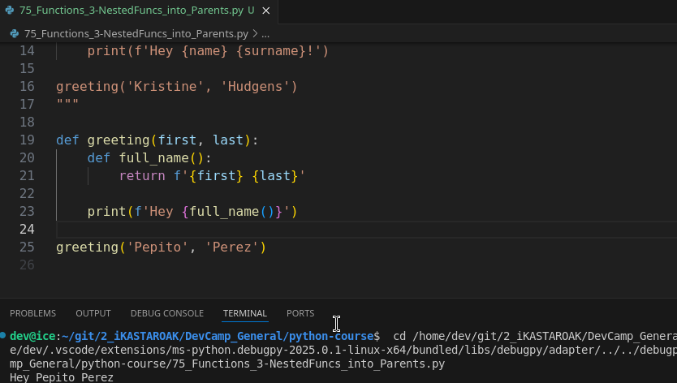

# 03-099\_Python\_Nest-Funcs\_in\_Parent-Funcs

### # MODULE 03-099: Python - Nesting Functions in Parent Functions

##

In the previous guide, we explored the key difference between **returning a value** from a function and simply **printing a value**. Now, we will extend that knowledge by discussing **nested functions**—functions defined within other functions.

Python allows this behavior, unlike some other programming languages, and when implemented properly, **it can improve code organization and efficiency**. 🚀

🔗 **Reference:** [Python Nested Functions](https://docs.python.org/3/tutorial/controlflow.html#nested-functions)

***

### 🔹 What Are Nested Functions?

A **nested function** is a function **defined inside another function**. The outer function is often called the **parent function**, while the inner function is referred to as the **child function**.

#### ✅ Example: Refactoring a Greeting System

Consider a program where we generate a full name and greet the user:

```
def full_name(first, last):
    return f"{first} {last}"

name = full_name("Kristine", "Hudgens")

def greeting(name):
    print(f"Hi {name}!")

greeting(name)
```

📌 **What Happens?**

* `full_name()` generates a **formatted full name**.
* `greeting()` prints a personalized greeting.

This works well, but what if **full\_name** is only ever used inside `greeting()`? We can **nest** it inside `greeting()`.

***

### 🔹 Converting to a Nested Function

Instead of defining `full_name()` separately, we can \*\*nest it inside \*\*\`\`:

```
def greeting(first, last):
    def full_name():
        return f"{first} {last}"

    print(f"Hi {full_name()}!")
```

Calling the function:

```
greeting("Kristine", "Hudgens")
```

📌 **What Changes?**

* `full_name()` is now **inside** `greeting()`.
* `full_name()` **inherits** variables (`first`, `last`) from `greeting()`.
* The call to `full_name()` happens **within** `greeting()`.

🔹 **Key Concept:** The inner function (`full_name()`) has access to variables from its enclosing function (`greeting()`), making it useful when a function is **only relevant inside its parent function**.

🔗 **Reference:** [Python Scopes and Namespaces](https://docs.python.org/3/tutorial/classes.html#python-scopes-and-namespaces)

***

### 🔹 When Should You Use Nested Functions?

Nested functions **should be used** when:

✅ The inner function **does not need to be called separately** from the parent function.

✅ The inner function is a **helper function** used only inside the outer function.

✅ You want to **organize your code** and limit function scope.

However, avoid nesting when:

❌ The inner function needs to be used **in multiple places** in your program.

❌ Nesting makes the code **harder to read and maintain**.

📌 **Rule of Thumb:** If a function is **only used inside another function**, it’s a good candidate for nesting.

***

### 📌 Summary

* **Nested functions** are functions **inside** other functions.
* They help keep **related logic together**, improving readability and organization.
* The inner function **inherits** variables from the parent function.
* Use nested functions when they are **only relevant** inside the parent function.

### Video lesson Speech

In the last guide, we walked through the key differences between returning a value from a function versus simply printing a value out, and we walked through the full name and greeting example.

***

In this guide, we are going to extend that knowledge and we're going to talk about nested functions.

And so Python is different than many other programming languages where it allows you to place one function inside of another function that is not something that all programming languages allow for.

But python does, and it can lead to some very interesting looking code but it can also be very helpful when implemented properly.

I've kept our two functions of full\_name and greeting here in our code file.

```python
def full_name(first, last):
 return f'{first} {last}'

Kristine = full_name('Kristine', 'Hudgens')

def greeting(name):
 print(f'Hi {name}!')
greeting('Kristine', 'Hudgens')
```

The reason is that we're going to use this identical code to be able\
to refactor it and place our full name function inside of our greeting\
function. And so we're not going to have to recreate a lot instead we're\
going to reorganize it so that it can be used the way that we need it\
to be. So we're no longer going to be calling full\_name the way we did\
right here.

```python
Kristine = full_name('Kristine', 'Hudgens')
```

So, we can delete that code and I'm going to take this full\_name function here and I'm going to cut it and place it inside of this greeting function.

Now you have to be very careful to make sure that you nest inside and that you have the correct indentation for both functions.

So, this will throw an error because even though our full name function is nested properly our return statement isn't.

So, if you indent that then that is going to properly work now or at least it's\
going to work for this one function.

```python
def greeting(name):
 def full_name(first, last):
 return f'{first} {last}'
```

So we've taken our greeting function and now we've nested full name inside of this.

Now, what do we have to do?

Well, we have this function but we don't need everything inside of it anymore.

And the reason is that full\_name, because it's nested inside of greeting does not need to have these arguments we can just call full\_name with no arguments and we're going\
to treat greeting as the parent function here.

And so it needs to have different function arguments so we're going to say first and last and so now we're going to pass in two arguments whenever we call greeting and this full\_name function is going to have access to first and last and so this is going to actually make for more efficient code and I think more readable in this sense.

So, if we have full\_name here and then we have first and last and these values are returned so this formatted string is going to get returned inside of our print statement here.

We no longer call name, now we call our full name function so we're going to call it make sure that you include the parentheses at the end. I'm going to add one more line\
here just so it's easier to read and it's very clear that full\_name is its own function it simply nested inside of greeting and everything else looks right. This is all we need to do to have the entire system work.

```python
def greeting(first, last):
 def full_name():
 return f'{first} {last}'
```

Now, when we come down to greeting we're no longer going to be just passing in a variable as we did before.

Now, we're going to pass in a first name and a last name so I'm going to pass in these values and if I run this you can see that everything functions just like before.



Now, the most common question that is asked whenever you're working with nested function is when should you choose to nest versus keep them separate.

And one of my rules of thumb for it is whenever I have a function that does not need to exist outside of a parent function then that is a good time to perform nesting.

So, for example, if you never need to call this full\_name function except in the context of greeting so greeting is the only function that calls the values here. Then there is no reason for this full\_name function to be in a different part of the application you can nested inside and then call it whenever you need to.

However, if some other part of the program does need access to the full name function then you may want to keep it separate and call them independent of each other. That's my personal rule of thumb when it comes to choosing when and when not to nest functions in Python.

***

### Code

```python
# 03-099: Nested Functions into Parents functions

"""
We came from here:


def full_name(first, last):
    return f'{first} {last}'

data = full_name('TheName', 'TheSurname')


def greeting(name, surname):
    print(f'Hey {name} {surname}!')

greeting('Kristine', 'Hudgens')
"""

def greeting(first, last):
    def full_name():
        return f'{first} {last}'

    print(f'Hey {full_name()}')

greeting('Pepito', 'Perez')
```

***

### CodingExercise

```python
# CodingExercise
"""
Create a function called greeting that accepts a persons name as an argument. Your function should return "Hello, {persons name}".

Example: Passing in 'Jordan' should return 'Hello, Jordan'
"""


def greeting(name):
    return f'Hello, {name}'


greeting('Pepito')
```
