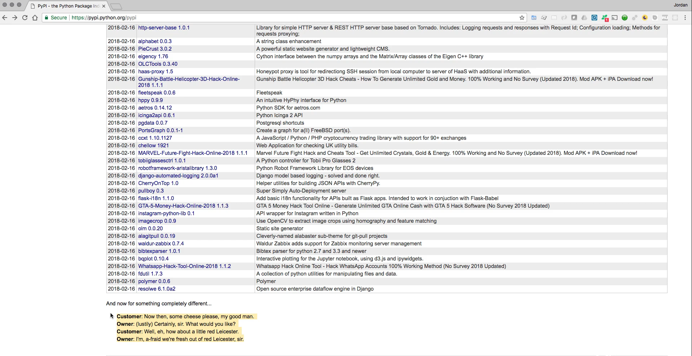
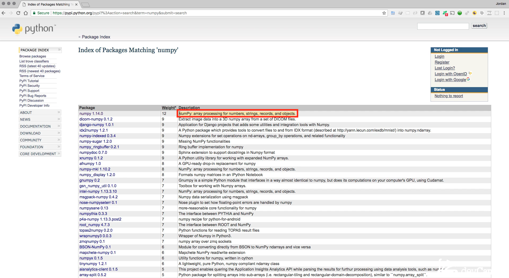
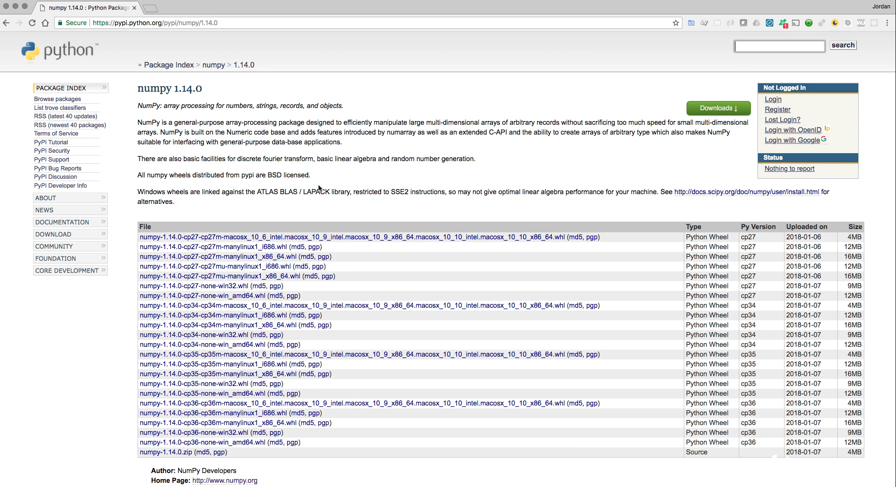
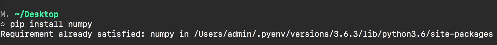
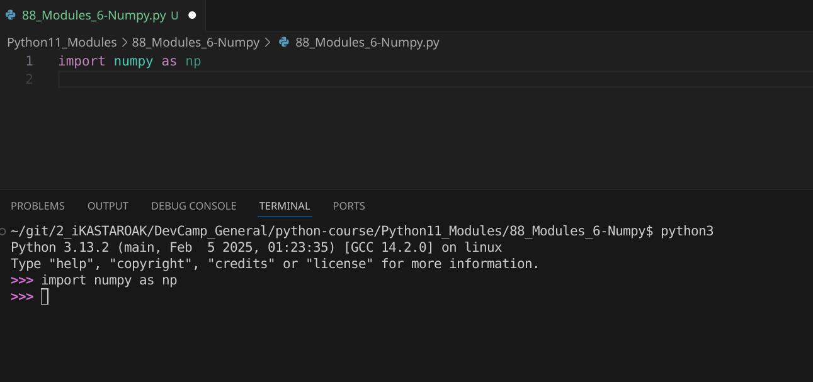
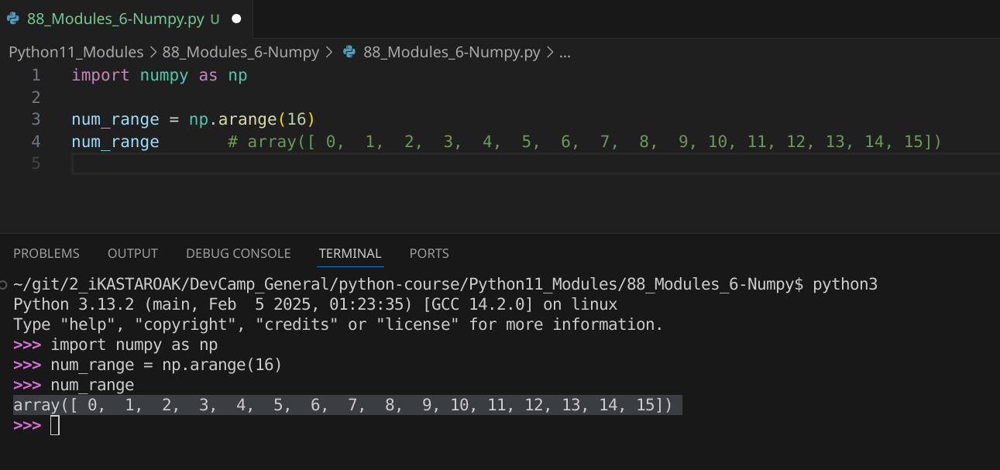
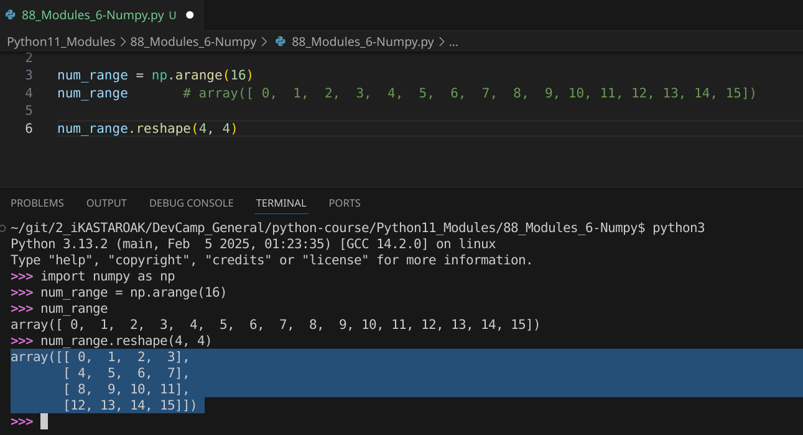
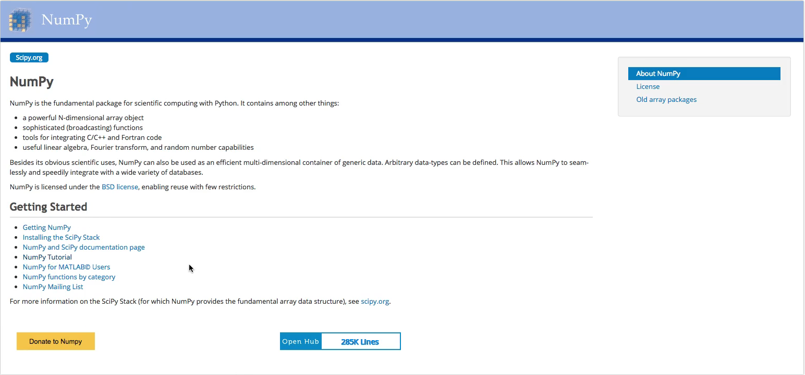

# 03-114\_Python\_Numpy\_module

### MODULE 03 - 114: Python - NumPy Module

In this lesson, we will install our first **Python package** and explore the **NumPy** library. NumPy is a powerful package that allows efficient processing of **numbers, records, and objects**.

It is one of the most widely used libraries in the Python ecosystem, especially in fields such as **data science, machine learning, and scientific computing**. 🚀

🔗 **Reference:** [NumPy Documentation](https://numpy.org/doc/stable/)

***

### 🔹 The Python Package Index (PyPI)

NumPy can be found on the **Python Package Index (PyPI)**, commonly known as **The Cheese Shop**—a reference to a classic **Monty Python** sketch. PyPI is the official repository for Python packages, where developers can publish and distribute their libraries.

To explore PyPI, visit:\
🔗 [**Python Package Index (PyPI)**](https://pypi.org/)

***

### 🔹 Installing NumPy

The easiest way to install NumPy is via **Pip**, Python’s package manager.

#### ✅ Installation Command

```
pip install numpy
```

📌 **What Happens?**

* If NumPy is not installed, Pip will download and install it.
* If NumPy is already installed, Pip will display **"Requirement already satisfied"**.

🔗 **Reference:** [Python Pip Documentation](https://pip.pypa.io/en/stable/)

***

### 🔹 Importing and Using NumPy

Once installed, we can import NumPy and start working with it.

#### ✅ Example: Importing NumPy with an Alias

```
import numpy as np
```

📌 **Why Use `as np`?**

* The alias `np` is a common convention that makes code **shorter and more readable**.

🔗 **Reference:** [NumPy Quickstart Guide](https://numpy.org/doc/stable/user/quickstart.html)

***

### 🔹 Working with NumPy Arrays

NumPy introduces **arrays**, which are similar to Python lists but offer **better performance** and **more functionalities**.

#### ✅ Creating a NumPy Array with `arange()`

```
num_range = np.arange(16)
print(num_range)
```

📌 **What Happens?**

* `np.arange(16)` creates an array with numbers from **0 to 15**.
* This is more memory-efficient than a Python list.

🔗 **Reference:** [NumPy `arange()` Function](https://numpy.org/doc/stable/reference/generated/numpy.arange.html)

***

### 🔹 Reshaping Arrays with `reshape()`

NumPy allows restructuring of arrays into different shapes.

#### ✅ Example: Reshaping a 1D Array into a 4×4 Matrix

```
num_range.reshape(4, 4)
```

📌 **What Happens?**

* The `reshape(4, 4)` function converts the **1D array** into a **4×4 matrix**.
* This technique is **widely used in machine learning** and **data analysis**.

🔗 **Reference:** [NumPy `reshape()` Function](https://numpy.org/doc/stable/reference/generated/numpy.reshape.html)

***

### 🔹 Why Use NumPy Instead of Lists?

Although Python lists are powerful, NumPy arrays offer several advantages:

✅ **Performance** → NumPy is implemented in C, making operations **faster** than native Python lists.\
✅ **Memory Efficiency** → NumPy stores elements in **contiguous memory blocks**, reducing overhead.\
✅ **Advanced Operations** → Functions like `reshape()`, `mean()`, and `dot()` simplify complex calculations.

🔗 **Reference:** [NumPy Performance Benefits](https://numpy.org/doc/stable/user/whatisnumpy.html#why-use-numpy)

***

### 📌 Summary

* **NumPy** is a powerful Python library for numerical computations.
* It can be installed via **Pip** using `pip install numpy`.
* **Arrays** are more efficient than Python lists for handling large datasets.
* Functions like `arange()` and `reshape()` help **manipulate data structures easily**.
* NumPy is widely used in **machine learning, data science, and scientific computing**.

***

### Video Lesson Speech

In this lesson, we're going to install our very first Python package, and we're going to use the **NumPy** library.

***

Right here, I have opened in the browser the **Python Package Index**, which is also called the **Cheese Shop**. If you scroll all the way down, you can see that there is a little reference right down here to an old Monty Python sketch related to a cheese shop.



That is how the Python Package Index got its name. If you're curious about it and want to know more, just Google **Python Package Index Cheese Shop**, and you'll be able to see the entire Monty Python sketch.

Now, with all that being said, let's actually get into the code.

What I want to do is show you how you can find and then learn more about different packages that are available on this index.

The very first one that we're going to go with is called **NumPy**. NumPy is a very powerful package that allows you to process numbers, records, and objects, as you can see right here.



This is a basic description. It also gives an associated weight, which has to do with a number of criteria. Usually, the popularity of it has quite a bit to do with it.

So, if you click on this, you'll see that this is one of the most popular libraries in the entire Python community. It is definitely a good one to become familiar with.

Here on the show page, you can see that there is a much longer description.



Essentially, I'll give you a summary: **NumPy** allows you to process large collections of data in a very efficient manner.

Usually, things that would take you many lines of code to write, NumPy has those processes built directly into the library, and you can simply call them and use them in your own programs.

This is something that you're going to find incredibly helpful when you start implementing machine learning algorithms or when you start building out complex APIs that deal with large collections of complex data.

**NumPy is going to be a very good friend for you.**

So, the way that we can install it is with **pip**. If you did not install pip or do not want to, you can also download NumPy directly to your system and use it directly, the same way that we have used our own custom modules that we've worked with up until this time. I personally will highly recommend that you use **pip** for this. The way you can do it is if you come to your terminal, type `pip install` and then the name of the library. So, in this case, it's going to be `numpy`. Now, if you already have a library installed on your system, then it's going to skip the installation process. So, if I hit return, because I already have this on my system, it says **requirement already satisfied: numpy**, and then it shows the path in the system where my version of NumPy is installed.



So, if you have that installed, now we can start up the Python REPL. I'm going to start Python up, and let's create a cool little process here where we leverage arrays. Let's imagine that you've been tasked with building out a system that takes a number and then from that number, it builds a variable number of list items. If that isn't clear at all, let me write up a little visual right here. Say, if I wanted to have a few items in a list, like `1, 2, 3, 4, 5, 6, 7, 8`, and then I asked you to build out a function that would return this and say, have one list that contained a nested list of `[1, 2]`, and then another nested list of `[3, 4]`, and so on. It needed to be variable, so you couldn't hard-code any of these elements in. That would be a little bit of a time-consuming process to build.

But what I'm going to show you is how we can leverage NumPy to make this possible. I'm going to import NumPy and alias it, so `import numpy as np`. That works. As long as after you hit return right there, you did not get an error, that means that we have successfully imported the NumPy library and aliased it as `np`.



Now, I can say I'm going to create a variable here. I'm going to say `num_range` and then say `np.arange`. What this is going to do is allow me to pass in a number. So, I'm going to say `16`, and this is going to generate a range with an array.

So, it's going to say, "OK, there are going to be 16 elements," and I'm going to generate an array of 16 elements. It takes in a range where it's going to start at zero and go all the way up to 15, so it's going to have 16 elements. If you run this and then type `num_range`, you can see that we now have an array that is `0` to `15`.



If you're wondering what an array is, an array is very similar to a list.

The NumPy library created the concept of an array, which is present in many other programming languages. So, if you came from JavaScript or Ruby, then you're already very familiar with what arrays are. If Python is your very first programming language and you've never heard of an array, just know that a list is very similar to an array. NumPy has created a second level of abstraction where it's created this concept of an array so that you can perform even more advanced tasks, and that's what we're going to do here.

So, remember at the very beginning of this guide, I showed you what I wanted?

I wanted the ability to take in any kind of arbitrary set of numbers and have a breakdown of nested arrays inside of that.

So, if I call `num_range` and then call the function `reshape`, I can pass in two different numbers here. If I pass in `4` and `4`, what this is going to give me, as you can see right here, is a nested set of four nested arrays inside of that master array, and inside each one of those arrays are four elements.



This gives us the ability to create an entire matrix of values.

This is going to be incredibly necessary when it comes to implementing some of the popular machine learning algorithms. They will require you to perform steps like this, where you are going to have to create an entire collection of data and then, from that point, slice that data up into usable components, such as small nested array elements, exactly like how we have right here.

Imagine if I asked you to do that without using a library like this.

It's absolutely possible. Obviously, it is because NumPy is simply a Python library, so it's obviously possible to perform everything that we just did right here in pure Python code without a library.

But see how much easier it is when you leverage outside tools. What you're able to do whenever you bring in libraries like NumPy and some of the others that we're going to walk through is, instead of having to start from scratch, you're actually able to stand on the entire Python community and thousands upon thousands of developers who put in countless hours of time building out these kinds of tools.

This allows you to focus on reaching your end goal and implementing the behavior that you want to build, as opposed to writing small little boilerplate code elements that would take you to this point instead of having to build every single feature completely from scratch.

As you go through your development journey, whether you are going into the machine learning industry side of things or if you're learning Python to build out complex web or mobile APIs, you're going to see that it's going to be very rare that you're not going to be using packages like this in some form or another. So, that is our introduction to the NumPy library in Python.

I highly recommend that you go and look at the documentation and explore other functions. What we went through does not even touch the tip of the iceberg with how many different functions and packages are available in NumPy.

If you go back to that Cheese Shop page and scroll down, you can see that there is a home page. If you click on this, it has everything from getting to know it all the way through having an entire NumPy tutorial.



This has a number of the popular functions, and I highly recommend that you go through that and try them out in the REPL. Imagine the kinds of different levels of functionality that you can build into your program by leveraging what is included in this package.

***

### Code

```python
import numpy as np

num_range = np.arange(16)

num_range

# Output: array([ 0,  1,  2,  3,  4,  5,  6,  7,  8,  9, 10, 11, 12, 13, 14, 15])

num_range.reshape(4, 4)

# Output: array([[ 0,  1,  2,  3],
#                [ 4,  5,  6,  7],
#                [ 8,  9, 10, 11],
#                [12, 13, 14, 15]])
```

***

### Video lesson Speech

n this lesson, we're going to install our very first Python package and we're going to use the Numpy library.

***

Right here I have opened in the browser the\
python package index and this is also called the Cheese Shop. If you\
scroll all the way down you can see that there is a little reference\
right down here to an old Monty Python sketch related to a cheese shop.


And that is how the python package index got its name. If you're\
curious about it and you want to know more just google Python package\
index Cheese Shop and you'll be able to see the entire Monty Python\
sketch.

Now with all that being said let's actually get into the code. So\
what I want to do is I want to show you how you can find and then learn\
more about different packages that are available on this index. The very\
first one that we're going to go with is called NumPy. And so what\
NumPy is, is its a very powerful package that allows you to process\
numbers, records, and objects like you can see right here.


This is a basic description. It also gives an associated weight and\
the weight has to deal with a number of criteria. Usually, the\
popularity of it has quite a bit to do with it, so if you click on this.\
This is one of the most popular libraries in the entire python\
community. So it is definitely a good one to become familiar with and\
here on the show page, you can see that there is a much longer\
description.


Essentially, I'll give you a summary NumPy allows you to process\
large collections of data in a very efficient manner. So usually things\
that would take you many lines of code to write numPy has those\
processes built directly in the library and you can simply call them and\
then use them in your own programs. This is something that you're going\
to find incredibly helpful when you start implementing machine learning\
algorithms or when you start building out complex APIs that deal with\
large collections of complex data NumPy is going to be a very good\
friend for you.

So the way that we can install it is with pip if you did not install\
pip or you do not want to you can also download NumPy directly to your\
system and use it directly the same way that we have used our own custom\
modules that we've worked with up until this time. I personally will\
highly recommend that you use PIP for this and the way you can do it is\
if you come to your terminal type pip install and then the name of the\
library. So, in this case, it's going to be NumPy. Now, if you already\
have a library installed on your system then it's going to skip the\
installation process. So if I hit return because I already have this on\
my system it says requirement already satisfied. Numpy in and then it\
shows the path in the system where my version of NumPy is installed.


So if you have that installed, now we can start up the python repl so\
I'm going to start Python up and let's create a cool little process\
here where we leverage arrays and let's imagine that you've been tasked\
with building out a system that takes a number and then from that number\
it builds a variable number of list items and if that isn't clear at\
all let me write up a little visual right here. So say if I wanted to\
have a few items in a list so I wanted something like 1, 2, 3, 4, 5, 6,\
7, and 8 and then I asked you to build out a function that would return\
this and it would say have the one list that contained a nested list of\
1, 2 and then another nested list of 3, 4 and etc. etc. And it needed to\
be variables so you couldn't hard code any of these elements in that\
would be a little bit of a time-consuming process to build.

But what I'm gonna show you is how we can leverage NumPy in order to\
make this possible. I'm going to import NumPy and I'm going to alias it,\
so import NumPy as np and that works so as long as after you hit return\
right there, as long as you did not get an error that means that we\
have successfully imported the NumPy library and we've aliased it as np.


Now I can say I'm going to create a variable here so I'm gonna say\
num\_range and then say np.arange which is what this is going to do is\
it's going to allow me to pass in a number, so I'm going to say 16 and\
then this is going to generate a range with an array.

So it's going to say OK there are going to be 16 elements and I'm\
going to generate an array of 16 elements and so it takes in a range\
where it's going to start at zero and go all the way up to 15 so it's\
going to have 16 elements. And if you run this and then type num\_range\
you can see that we now have an array that is zero to 15.


If you're wondering what an array is, an array is very similar to a\
list. The NumPy library created the concept of an array which is in many\
other programming languages. So if you came from JavaScript or Ruby\
then you're already very familiar with what arrays are. If Python is\
your very first programming language and you've never heard of an array\
just know that a list is very similar to an array and NumPy has created\
the second level of abstraction where it's created this concept of an\
array so that you can perform even more advanced tasks and that's what\
we're going to do here.

So remember at the very beginning of this guide I showed you what I\
wanted? I wanted the ability to take in any kind of arbitrary set of\
numbers and to have a breakdown of nested arrays inside of that. And so\
if I call num\_range and then call the function reshape I can pass in two\
different numbers here so if I pass in four in four. What this is going\
to give me as you can see right here is a nested set of four nested\
arrays inside of that master array and inside each one of those arrays\
are four elements.


This gives us the ability to create an entire matrix of values. And\
this is going to be incredibly necessary when you when it comes to\
implementing some of the popular machine learning algorithms they will\
require you to perform steps like this where you are going to have to\
create an entire collection of data and then from that point, you're\
going to have to slice that data up into usable components such as small\
nested array elements exactly like how we have right here.

Imagine if I asked you to do that without using a library like this,\
it's absolutely possible. Obviously, it is because NumPy is simply a\
python library so it's obviously possible to perform everything that we\
just did right here in pure python code without a library but see how\
much easier it is when you leverage outside tools. And so what you're\
able to do whenever you bring in libraries like NumPy and like some of\
the others that were going to walk through instead of you having to\
start from scratch.

You're actually able to stand on the entire python community and\
thousands upon thousands of developers who put in countless hours of\
time building out these kinds of tools so that you can focus on reaching\
your end goal in implementing the behavior that you want to build as\
opposed to writing small little boilerplate code elements that would\
take you to this point instead of having to build every single feature\
completely from scratch.

And as you go through your development journey whether you are going\
on the machine learning industry side of things or if you're learning\
Python to build out complex web or mobile API's you're going to see that\
it's going to be very rare that you're not going to be using packages\
like this in some form or another. And so that is our introduction to\
the NumPy library in Python. I highly recommend for you to go and look\
at the documentation and explore other functions and what we went\
through does not even touch the tip of the iceberg with how many\
different functions and packages are available in NumPy.

If you go back to that cheese shop page and you go down you can see\
that there is a home page. So if you click on this it has everything\
from getting to know it all the way through having an entire NumPy\
tutorial.


so this has a number of the popular functions and I highly recommend that you go through that, try them out in the repl.

Imagine the kinds of is and different levels of functionality that\
you can build into your program by leveraging what is included in this\
package.

***

### Code

```python
# 03-114: Numpy introduction

"""
Debug this on Terminal
"""
import numpy as np

num_range = np.arange(16)
num_range       # array([ 0,  1,  2,  3,  4,  5,  6,  7,  8,  9, 10, 11, 12, 13, 14, 15])

num_range.reshape(4, 4)
```
