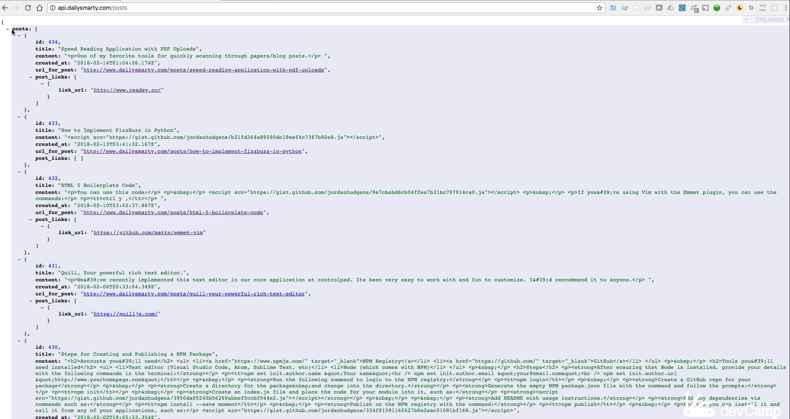
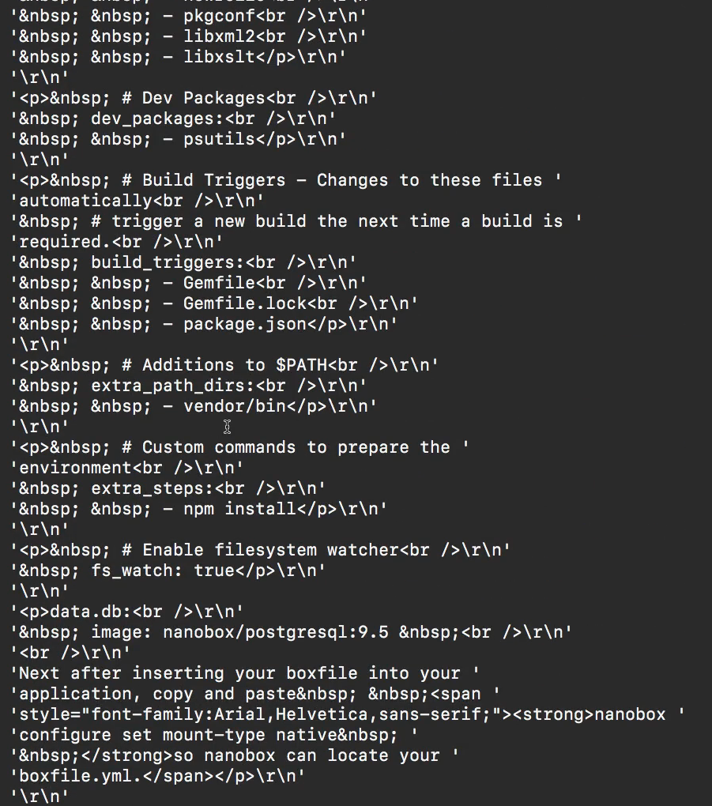

# 03-115\_Python\_REQUEST\_package\_API\_comms

### MODULE 03 - 115: Python - `requests` Module, API Communication

In this lesson, we will explore how to use the **`requests` library** in Python.

This powerful module allows our programs to communicate with **external APIs**, retrieving and sending data over the internet. Understanding how to work with APIs is a fundamental skill in modern software development, whether you're a **data scientist, web developer, or backend engineer**. 🚀

🔗 **Reference:** [Python `requests` Documentation](https://docs.python-requests.org/en/latest/)

***

### 🔹 What Is an API?

API stands for **Application Programming Interface**. It acts as a communication bridge between different software applications.

When we interact with an API, we typically send **requests** to retrieve data, which is returned in a structured format like **JSON**.

#### ✅ Example: JSON Data Structure

APIs often return **JSON (JavaScript Object Notation)**, which consists of **key-value pairs**, similar to Python dictionaries.

Example JSON response:

```json
{
  "posts": [
    {
      "id": 434,
      "title": "Speed Reading Application",
      "url_for_post": "https://example.com/speed-reading-app"
    }
  ]
}
```

🔹 **Key Concept:** JSON data can be **nested**, meaning a key (like `posts`) contains a **list of dictionaries**.

🔗 **Reference:** [Python JSON Module](https://docs.python.org/3/library/json.html)

***

### 🔹 Installing and Importing `requests`

To use `requests`, we need to install it first (if not already installed).

#### ✅ Installation Command

```bash
pip install requests
```

#### ✅ Importing `requests`

```python
import requests
```

🔗 **Reference:** [Python Pip Installation](https://pip.pypa.io/en/stable/)

***

### 🔹 Making an API Request

Once `requests` is installed, we can make a **GET request** to retrieve data from an API.

#### ✅ Example: Fetching Data from an API

```python
r = requests.get('https://jsonplaceholder.typicode.com/posts')
print(r.json())
```

📌 **What Happens?**

* `requests.get(URL)` sends a **GET request** to retrieve data.
* `.json()` converts the response into a **Python dictionary**.

🔗 **Reference:** [Requests `.get()` Method](https://docs.python-requests.org/en/latest/user/quickstart/#make-a-request)

***

### 🔹 Pretty Printing JSON Data

By default, API responses can be difficult to read. The **`pprint` module** helps format JSON data more clearly.

#### ✅ Example: Using `pprint`

```python
import pprint
pprint.pprint(r.json())
```

📌 **Why Use `pprint`?**

* Formats JSON data in a structured way.
* Makes debugging and data exploration easier.

🔗 **Reference:** [Python `pprint` Module](https://docs.python.org/3/library/pprint.html)

***

### 🔹 Accessing Specific Data

Since API responses are often **nested dictionaries**, we can use **bracket syntax** to extract specific values.

#### ✅ Example: Retrieving the First Post Title

```python
first_post = r.json()[0]['title']
print(first_post)
```

📌 **What Happens?**

* `r.json()[0]` accesses the **first post** (index `0`).
* `['title']` extracts the **post title**.

***

### 📌 Summary

* The **`requests` module** allows Python to communicate with APIs.
* APIs return **structured JSON data**, similar to Python dictionaries.
* The **`requests.get()` method** fetches data from an API.
* The **`pprint` module** improves JSON readability.
* Using **bracket notation**, we can extract specific values from API responses.

***

### Video Lesson Speech

This is going to be a really fun guide. In this lesson, we're going to walk through how to implement the **requests library** in Python. What this will allow us to do is to reach out and communicate with **outside APIs**.

***

### Note

#### DailySmarty is not currently functioning. You will need to use `https://jsonplaceholder.typicode.com/` for API requests.

***

If you've never worked with an API before, it stands for **Application Programming Interface**. Essentially, it is a language for our application to use and communicate with another third-party application.

The application we're going to be communicating with is the **DailySmarty** app. This is a platform where you can add posts, links, content, tutorials, and more.

It makes an API available so that we can communicate with it. The API looks much different than the web application. If you go to the API, which is [api.dailysmarty.com/posts](https://api.dailysmarty.com/posts), this is what it's going to look like.

This is called **JSON**, which stands for **JavaScript Object Notation**.

If you are familiar with working with Python dictionaries, this is going to feel rather intuitive because JSON is a set of **key-value pairs**.

Here, we have a key of `posts`, and then we have all of these posts inside of it. Nested inside of those posts is a list that contains a key of `id` with a value of `434`, a key of `title` with a value of `speed reading application`, and so on.



When you're going through this, you're going to have a fully different set of values here because these change as new posts get added.

As you can see, this is just a structured way of organizing the data.


The **requests package** is going to allow us to reach out and communicate with that application. If you want to install this on your own system, you can switch over to the terminal or the command prompt (if you're on Windows) and simply type in:bash

```bash
pip install requests
```

If you do not have it on your system, it'll run and install it. As you can see, I already have it installed, and it says **requirement already satisfied**.


Now that it's installed on your system, let's open up a Python REPL session and import it. So, I'm going to say:

```python
import requests
```

Hit return, and as long as you don't get an error, that means it worked. I'm also going to import another library called **pprint**, which stands for **pretty print**. So, I can say:

```python
import pprint
```

If you do not have that on your system and it didn't come with your version of Python, you can install it manually with `pip`, but it should already be on your system.

Now that we have that, we can actually make a request. I can say:

```python
r = requests.get(https://jsonplaceholder.typicode.com/)
```

Make sure you spell it with the plural because that is the name of the package. After you close the parentheses and hit return, it is going to go out and communicate with that API. If you don't get an error, that means this part of it worked.

If you want to see what the JSON looks like, I can use the variable and then pass a method provided inside of the requests library called **.json()**.

Since I'm working with JSON data here, I can call this, and this will show all of the code that we saw in the browser.


If you switch back to the browser and go to that same endpoint, you can see this is our full set of key-value pairs.


By default, it's not formatted when the requests library brings it back to us, so this is very hard to read.

This is why I installed the **pretty print library** and imported it. We can make this a little bit easier to read by calling:

```python
pprint.pprint
```

Remember, the reason for that is because `pprint` is the package name, and `pprint` is the function inside of it.

Now, if I run this, you can see we get a\
fully formatted response, and this looks a lot closer to what we had in\
the browser.



This is the full list of live posts, and this is incredibly cool.

This is working on your system. This means that you have successfully built a program that goes out on the Internet, communicates with another program, and pulls this data in.

This is something that you're going to be using constantly, regardless of the type of field that you're in.

Imagine that you're a **machine learning data scientist**. You're going to have to go out and grab data from outside sources, and this is a way you can do it.

Or, if you're a **back-end developer** building out APIs, this is going to be what you're doing all day long. This is how you can communicate with outside services.

So, that is helpful. Now, let's see what we can do with the data.

If I want to grab the very first post, I can use the same code here but treat it\
like a dictionary.

I'm going to use bracket syntax. I'll start with brackets and then pass a string of `posts`. Let's see if that works for us. If I run this, you can see that it has brought back the posts.


That may not seem like a big deal because that's what we had before, but I wanted to do that to make sure that we didn't run into any errors.

Remember, making small steps as we build out our programs is critical.

Now, that I have our list of posts, I can actually treat these like a traditional list. I can pass in the bracket syntax and grab the zero-width index. You can see that I have access to the very first post.


I can access its content, the date that it was created, its ID, any links inside of it (which you can see is another nested list), its title, or even the URL. If I want to grab just the URL, I can treat this like a dictionary and chain on one additional bracket:

```python
pprint.pprint(r.json()['posts'][0]['url_for_post'])
```

Run this, and there you go. We have a string with the URL.


Just to make sure that this is working the way we'd expect, I'm going to\
copy this, come into the browser, paste it in (make sure you remove the\
strings there), and as you can see, that worked perfectly.


This was a real live URL passed through the DailySmarty API that we accessed\
on our local machine, and we were able to work with that data.

***

### Code

```python
import requests
import pprint

r = requests.get('https://jsonplaceholder.typicode.com/')
r.json()
pprint.pprint(r.json()['posts'][0])
pprint.pprint(r.json()['posts'][0]['url_for_post'])
```
