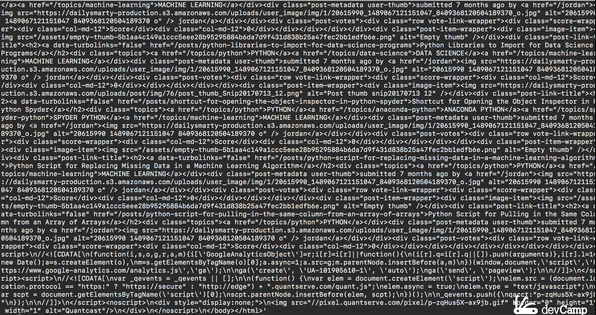
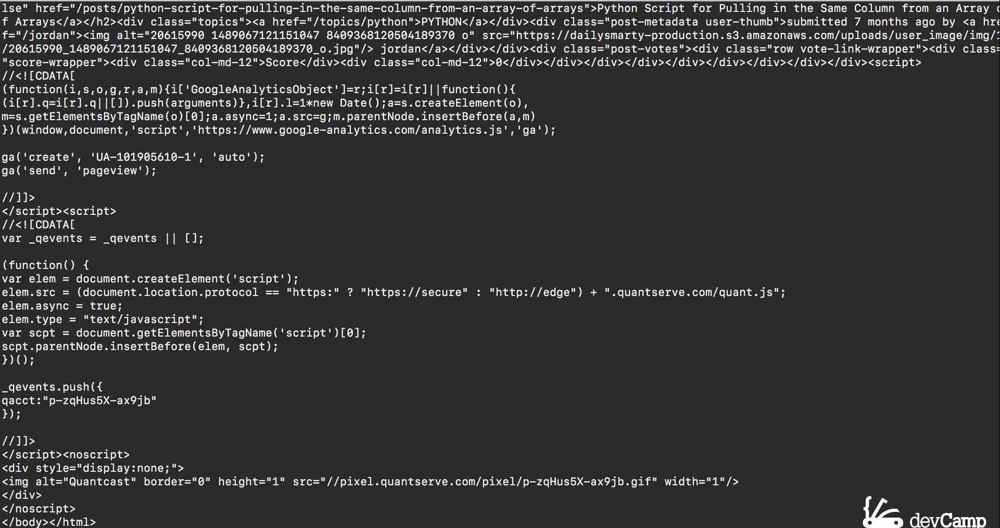
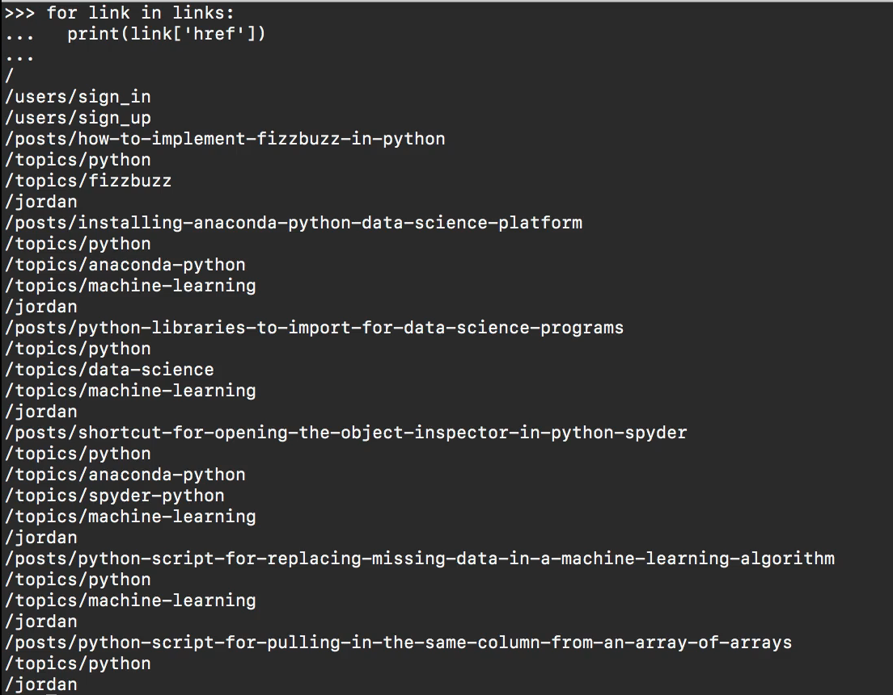
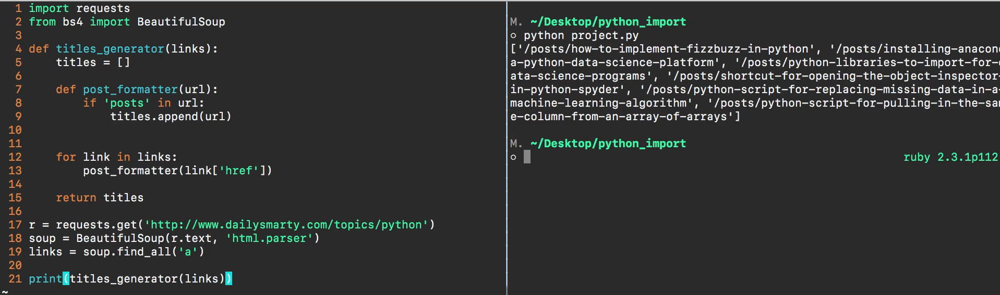
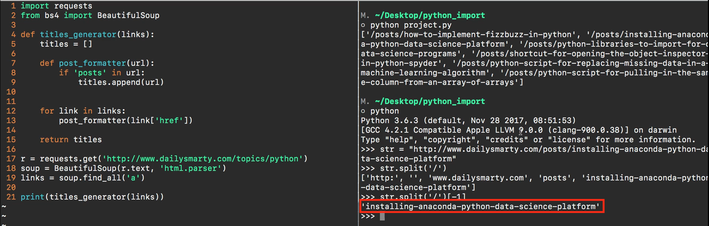
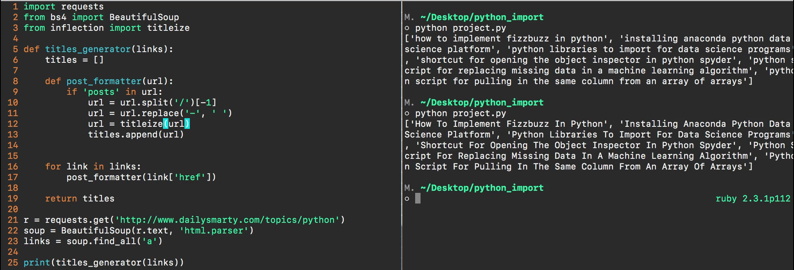

# Module 03 - 117: Python - Exercise, solution

## Web Scraper

Pending to do as the solution tells.

***

## Video lesson Speech

### Updated code at the bottom of the guide

So in review what we need our application to do is to go to a Web site. And in this case specifically this URL https://www.dailysmarty.com/topics/python and it needs to scrape all of the content off of the site and it needs to go filter them down parse through them and only bring back the links that are related to post so on this page that would just be links like "How to Implement FizzBuzz in Python", "Installing Anaconda Python Data Science Platform", and "Python Libraries to Import for Data Science Programs".

Now part of the challenge with this is there are many links on this page


and any time that you build out a web scraper that needs to go and select only a small portion of the content in an Html file this is going to be a challenge. So if I were to view page source this is all of the data that we're going to be working with and we need to in as efficient a manner as possible parse through all of it and only grab the elements that we want.

So I'm going to start with the repl so I'm gonna open up a new Python repl session and the reason why I'm taking this approach is because whenever I start building a program in a file it slows down the process because for each line of code or each component that I add after go and I have to test to see if that worked the way I wanted it to or not. When I'm working with the repl it improves the feedback loop that I have. So in other words, if I type a piece of code in and it doesn't work I know instantly and that will make it much faster to build out certain parts of the program than if I just typed all of it into a file. You can go with whatever your preference is this is just the approach that works best for myself.

Now out of the three libraries that I mentioned and I hinted would help you build out this project in the REPL session I'm only going to bring two of them in. So the first is going to be the `requests package` and this is the same one we used when we were communicating with the daily smarty API and the next is going to be the `BeautifulSoup package` and if you reference and went through the full BeautifulSoup documentation then you would have seen that the way to import this is to say from bs4 because this is the version of BeautifulSoup that we want. So I'm gonna say from bs4 import BeautifulSoup and if you have it installed on your system that will work.

Now the first thing I'm going to do is I'm going to go and perform a get request for the URL so I'm going to create a variable called r and then type requests.get and then I want to paste this URL in.

```python
r = requests.get('http://www.dailysmarty.com/topics/python')
```

Now, this is not the API URL. This is just the website and if I paste this in then that works. So when that went it performed a get request and it pulled all that content back right here and it stored it in the r variable. To test that out I can say r.text and if I run this it's going to bring me back the full HTML document. And so this is what we want to work with.



So if you remember back when we went through the introduction to using the request library we use the JSON function. But now because we're dealing with raw HTML we're just going to work with the text request or the text response. So now that we know that we have successfully called the URL and we've scraped all this HTML content. Now it's time for BeautifulSoup to come in. So I'm going to create a variable called soup set it equal to BeautifulSoup and then pass in as a first argument the raw HTML text so I'm gonna say r.text. As a second argument, you can pass in a string that tells BeautifulSoup what I want it to parse so this is going to be html.parser

```python
soup = BeautifulSoup(r.text, 'html.parser')
```

and if I run that I can take a look to see what is in the soup variable now. And as you can see it is the full HTML response but now it's been formatted a little differently.



We've actually created a BeautifulSoup object that we can work with and we can parse through.

So if I want to do that and what I'm going to show you now is in the BeautifulSoup documentation so I'm not showing you or giving a solution with something that is not there and is not relatively straightforward to research. I'm going to create a variable called links set it equal to our variables soup.find\_all.

```python
links = soup.find_all('a')
```

Find all is a function in BeautifulSoup and it takes in an element on the page. So all of the HTML links have the elements associated with them, so I can pass in a string called a and this is going to bring me back all of the links so if I run this I should now have all of the links on the page and as you can see it is there.


and this is getting us slightly closer to where we want to be but we're still not there, so let's keep moving forward.

Now I'm going to create a for loop, so I'm gonna say for link in links because remember links is the variable that we stored all of those inside of this. I just want to print this out. So I'm gonna say print link and the link will bring us the entire HTML object and we don't want that, we don't want all of the different attributes and values and all of the metadata we just want the actual path which is going to be stored in the href. And so the way that BeautifulSoup lets us do this is to treat it just like a dictionary so I can say a print link use bracket syntax and then say I want all of the href attributes

```python
for link in links:
    print(link['href'])
```

and I want to print these out and there you go.



As you can see we've taken the entire massive list of all of those HTML properties and values and all of those things we didn't need and we've successfully parsed it all the way down. So that is giving us just the path that we want and so I think we're ready to build the full implementation now. So I'm going to open up a project file here and the first thing I'm gonna do is to just replicate what we already did in the repl so I'm going to import request and then I'm going to save from bs4 for import BeautifulSoup. And then let's replicate our request so r equals requests.get and I'll pass in this value for the site we want to pull in and then we'll create our soup object so soup equals BeautifulSoup and then pass in r.text so our response text and then our parsing mechanism which is going to be html.parser

```python
r = requests.get('http://www.dailysmarty.com/topics/pyton')
soup = BeautifulSoup(r.text, 'html.parser')
```

Now that we have that we should have the ability to access our links. So I'm gonna create a variable called links call soup.find\_all and find all of those a elements and then from there we should be able to loop over this so I'm just going to test this out and say for link in links. I want you to print out a link and then pass in the href attribute.

```python
for link in links:
    print(link['href'])
```

Come down here and I'm going to open up another windowpane right here that you can see and I'm gonna keep this open for the rest of the solution. So Python project run that and you can see we have now successfully taken everything that we built out in the REPL and we placed it in the file, so that is looking good.


I think we are on the right track and now the next stage is going to be filtering it down. As you can see we have all of these various links here but we only want the ones that say posts in them so you can see we have ones that say users sign in, users sign up, we have topics. But the way that we're going to be able and narrow this down in filter to what we really want is by only selecting the ones that have that word posts.

So now that we have an idea of what we want. I'm going to get rid of this iterator is just to test this out and now I'm going to create a function. So the function is going to be called titles\_generator and I'm going to take in a set of links.

```python
def titles_generator(links):
```

And now inside of here, I'm going to start off by keeping track of all of the titles that we're going to have. So as we go through and this titles\_generators going to accept this set of links I want to have a list that keeps track of the titles. And so I'm going to create a variable here called titles and set it equal to an empty list and make sure that we return this at the very end.

And since my approach is always to take very small steps when I'm building anything out I'm first just going to take our loop and I'm gonna say for link in links and then I simply want to print out the link href which is what we've already done before but now it's going to be encapsulated inside of this function. And if I come to titles\_generator pass in links

```python
for link in links:
    print(link['href'])

return titles
```

if I run this again we should have the exact same behavior which we do. So everything there is working well and we're well on our way to our solutions.


Let's come up here I'm going keep this for the link, for a second, but it's going to change because what I want to do is implement a secondary function. It's going to be a function nested inside of our titles generator and I'm going to call it post\_formatters. So I'm gonna say def post\_formatter and post\_formatter isn't going to work with a collection. It's only going to work with a single URL.

So what I'm going to do is when I iterate over the links I'm going to instead of just printing it out, instead, I'm going to call our post\_formatter and then I'm going to pass it in this URL. As you can see that's what it takes as an argument is a URL so that's what I'm going to pass into it. Now the first thing we need to do is to filter it down so we're only grabbing the links that say posts in it. So the way we can do that is by implementing a conditional.

So I'm gonna say if posts in URL then we're going to have a code block

```python
def post_formatter(url):
    if 'post' in url:
```

and so what this is going to do is it's going to allow us to filter down this full set of all of these different URLs. And it's going to ignore the ones that don't have the word posts in it. And so what I want to do is to filter that and add that into this titles list. And so the way we can do that is by saying titles.append URL and if I saved this and then come down here this is it right now this is going to return. So let's actually print it out so I'm gonna say print titles and now if I run this we should have a filtered down list and as you can see we do.



It's not printing them out one by one because we're simply looping over and we're adding them to the titles list and then we're printing now that list. And so that's why it has this format. But if you look inside of this each one of these elements is only containing the posts URL, so our filter is working properly. So now if we come back up here we can move on and we can get to the next stage of what we're looking to do which is if you notice as helpful as these URL paths are and having them filtered is great too. We still have this kind of annoying little slash posts slash and then the actual URL contains a title that we're looking for.

So how can we get rid of that? Let's jump back into the python repl. So I'm gonna say python here and I'm going to grab one of these URLs as an example. So if I grab this one you can see it as posts in it and I'm going to grab the whole thing as you saw already it doesn't include the daily smarty part but that's really fine for this example. I can say string paste in that full URL and as you notice what we're wanting to do is we want to ignore everything that happens before this spot.


The way we can do that with the string is by leveraging the split function so I can say str which is my variable dot split and then inside of that I am going to say I want to split this string up every time there is a slash. So every time there's a slash I want you to split it up and this is going to return a list and so if I run this you can see I now have the string split up into a list and it's going to have a number of elements inside of it.


And I only want the last one. So what I can do is using bracket syntax say -1 this will go and grab the very last element inside of this list and there you go, right here we have exactly what we're looking for.



I'm gonna close out of this and come and let's add that inside of our post\_formatter code block. So here I'm going to create another variable. Now remember because strings are immutable in python I can't simply change the string I have to reassign it and I'm going to assign it into a variable with the same name. So I'm gonna say URL and then equals URL.split and use the same code that we used in the REPL so I'm gonna split it every time there is a slash and then I'm going to grab the last element there.

```python
def post_formatter(url):
    if 'posts' in url:
       url = url.split('/')[-1]
        titles.append(url)
```

so that is going to give me the first part of what we need and the next part is as you notice with our output we do not want these dashes. Instead, we want to have a space and the way we can do that is if you remember back to our section on strings. We can have that same behavior. Let me just copy one of these because this is going to be what we're working with right here. So if I copy this and this is going to be our updated string or our updated URL I can call string.replace and replace takes two arguments. The first is the element we want to search for and the second is what we want to replace it with.

So if I run this you can see that what that returns is the same string except it has swapped out all of the dashes for empty spaces which is exactly what we're looking for.


So I'm going to create another line here and reassign url once again and say url.replace pass in a single dash pass in an empty space and then this is getting us much closer. So let's run the entire code again and see where we're at, and there you go we're almost there to the final solution.


Now the last thing that we need to implement is notice how all of our content is lowercase and what we really want to do is to mimic something closer to what we have on the website where we have capital letters and so that is where the inflection package comes in.

So I'm going to switch over here and at the third line I'm gonna say import and in fact we just want one function so I'm gonna say from the inflection library I want to import the titleize function and so when I gave you the hint in the requirements guide when you went and looked at the inflection library this one might have been a little bit tricky. I've worked with titleize before so I knew it was there, so do not feel bad if you did not figure this part out.

But this is something that will be helpful later on if you ever need to mimic this type of functionality so I am bringing in the titleize function and I can say here url = titleizw and say titleize and remember we can call this directly because I'm saying from inflection import and only import a single function and this expects a string. We're going to pass in our url end the parens, hit save, and now let's run this one more time and that is looking perfect.



So that is fantastic!

We will clean up the output by instead of us keeping it in a list we can iterate over here at the end. So let's come down all the way to the bottom and I'm going to create a new variable called titles store the output of our function here and then we can loop over it.

```python
titles - titlesgeneratior(links)
```

I'll say for title in titles, I want you to print the title. Hit save and let's run it one last time and see if our entire solution works running that again and look at that! We have a fully functional web scraper that goes through and pulls out only the links that we specifically wanted and then format's them so that they can be used in any way that we need them.


Great job if you went through that solution, this was a very challenging project but this is going to lead you perfectly into what you're going to be asked to build in the entire course capstone project. Now that you've gone through this you're ready to build out the capstone application.

***

## Code

```python
import requests
from bs4 import BeautifulSoup
from inflection import titleize

def title_generator(links):
    titles = []

    def post_formatter(url):
        if 'posts' in url:
            url = url.split('/')[-1]
            url = url.replace('-', ' ')
            url = titleize(url)
            titles.append(url)

# UPDATED CODE
    for link in links:
        if link.get('href') == None:
            continue
        else:
            post_formatter(link.get("href"))
# UPDATED CODE

    return titles


r = requests.get('http://www.dailysmarty.com/topics/python')
soup = BeautifulSoup(r.text, 'html.parser')
links = soup.find_all('a')
titles = title_generator(links)

for title in titles:
    print(title)
```
