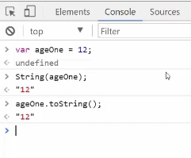
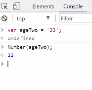
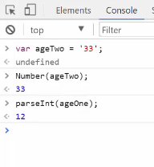

# Module 04-011: JavaScript Type Casting

## Performing Type Casting in JavaScript

***

1. Automatic Type Coercion
2. Manual Type Conversion
3. String to Number Methods
4. Boolean Conversion
5. Practical Use Cases

***

## Automatic Type Coercion

JavaScript performs implicit type conversions in certain operations:

```js
'100' - 42;     // 58 - Directly parses String to Int

100 + null      // 100 - Null is equal to 0

'100' + 42      // 10042 - The plus operator CONVERTS Numbers to Strings
42 + '100'      // 42100 - It concatenates both values as Strings
```

### **NOTICE**

* `-` operator converts strings to numbers
* `+` with strings performs concatenation
* `null` becomes `0` in numeric contexts

***

## Manual Type Conversion

### Number to String - `String()` - `.toString()`

```js
let age = 12;

String(age); // "12"

age.toString(); // "12"
```

### String to Number - `Number()` - `parseInt` - `parseFloat`

```js
let count = "33";

Number(count); // 33

parseInt(count); // 33

parseFloat(count); // 33

+"33"; // 33 (unary operator)
```

Special Cases:

```js
parseInt("33.5"); // 33 (drops decimals)

parseFloat("33.5"); // 33.5

parseInt("555-123"); // 555 (stops at non-digit)

+"abc"; // NaN
```

***

## Boolean Conversion - `Boolean(1 ... or... 0)`

Convert between boolean and numeric values:

```js
Number(true); // 1
Number(false); // 0

Boolean(1); // true
Boolean(0); // false
```

***

## Practical Use Cases

### API Data Handling

```js
// Convert API string to number
const apiResponse = "42.5";
const value = parseFloat(apiResponse);

// Ensure numeric calculation
function calculateTotal(price, tax) {
 return Number(price) + Number(tax);
}
```

### Form Input Processing

```js
// Convert form string to integer

const userAge = parseInt(document.getElementById('age').value);


// Safe default for missing values
const discount = +userInput || 0;
```

### System Integration

```js
// Legacy system requires 1/0 instead of true/false

const isActive = user.status ? 1 : 0;
```

***

## Remember

1. **Explicit Conversion** :\
   Always prefer manual conversion over relying on coercion
2. **Edge Cases**\
   Test with `NaN`, `null`, and empty strings
3. **Performance**\
   Unary `+` is fastest for string-to-number conversion
4. **Readability**\
   Use `Number()`/`String()` for clear intent

***

## Resources

* [Type conversion - MDN Web Docs Glossary: Definitions of Web-related terms | MDN](https://developer.mozilla.org/en-US/docs/Glossary/Type_Conversion)
* https://javascript.info/type-conversions
* [JavaScript Type Conversions](https://www.w3schools.com/Js/js_type_conversion.asp)

***

## Video lesson Speech

This lesson examines how to convert data from various data types into\
different data types in JavaScript. Additionally, we'll discuss the\
issues related to automatic type casting and when this type of feature\
is required in real world development.

***

In this guide we're going to talk about typecasting. Now that you have a good idea on what variables are how they have prospective data types, which are categories that each one of the data points fall into. A very common pattern is to have the requirement where you may need to change from one datatype into another one and that's what this guide is going to be about. To start off I'm going to go through how javascript is very forgiving and it actually tries to perform automatic type casting for you. That may seem like a good idea, until you see what that can accidentally lead to.

I'm going to start off in the console, by saying a string of 100 and I'm going to subtract 42 from that.

```javascript
'100' - 42;
```

Now this is going to return an integer of 58. So everything worked perfectly right there. It was able to take a string, it realize that it's a string that actually a had a number inside of it. So it performed the correct computation.

Now if I did something like this where I say

```javascript
100 + null
```

If I run this, it is `100`.

The reason for this is because javascript was able to see null, and instead of throwing an error it converted null to be zero, because it just assume that we are trying to perform some type of computation, obviously we don't want to try to take null as a value. We want to have zero in this case because it's empty.

All of that makes sense, but it starts to get a little bit tricky when we do something like this.

```javascript
100 + 42
```

Remember up top we did `100 - 42` with 100 being a string and it all worked fine.

What do you think's going to happen now? Well if I run this you can see this returns something very different. It returns a string of `10042`.

Probably not what we were looking to do, the reason for this is because javascript doesn't know, are we just trying to append the number 42 onto the string of 100 or are we trying to perform some type of computation on it. That's something that it simply doesn't know about.

Just in case you're curious, this doesn't have anything to do with order. If I were to do

```javascript
42 + '100'
```

It returns `42100`.

So any time that you have a string and a number and you try to add them together that is not going to work. Later on I'm going to show you how we can make it work by doing manual type casting.\
So, that is the automatic side of it.

Now let's talk about how we can do manual type casting. I'm going to say

```javascript
var ageOne = 12;
```

Now, if I wanted to convert this number into a string there are two ways to do it. The first is by calling the string function here and just passing in ageOne. And this is going to return 12 but it's going to return 12 as a string.


This is where I can pass ageOne in as a function argument, which we'll talk about in a later module. But it has another syntax option. I can say `ageOne.toString` and also because this is a function I need to end it with these parentheses. If I run this you can see it performs exactly the same way.



There's really not a big difference in how this is functioning. It really comes down to a matter of what the implementation is and if it works better to have a function argument or the second one. Typically I use the two string method because typically when I'm trying to convert something, it's easier to just use that dot syntax. But I definitely recommend that you try both out. That is how you can convert numbers into strings.

Let's talk about how we can convert strings into numbers. Because there are many different ways that we can do this. I'm going to say `var ageTwo = '33';`.

The first way is very similar to how we did it with the function argument. Now if I say `number(ageTwo);` it prints out `33`.



What it's going to return is 33, but it returns it as a number. Now we do not have a `.toNumber` method.

If I tried to do something like `ageTwo.toNumber` you can see we don't get any more type of auto complete and it's because there is no such thing as a .toNumber function, but there are many other ways that we can do this.

The first that I'm going to go into after number is one called `parseInt`. Here we can pass in `ageOne` again, and that works.



I'm going to go into in a little bit exactly what parseInt does and how else we can use it.

Another option is `parseFloat`.

What this is going to do in this case is return the exact same thing.

Where this would get different is if we passed in something like this

```javascript
parseFloat('33.5');
// 33.5
```

This will return `33.5` as a float which means a decimal point. Where as if I did something like:

```javascript
parseInt('33.5');
// 33
```

It returns just `33`.

That's what the difference is, if you need a decimal returned then `parseFloat` works. It also works on regular integers. If you just need a regular integer and you don't care about decimals. Then you can use `parseInt` to your heart's content.

Now another spot where this comes in really handy, is with something like this. Say you have a big string not just a nice and easy number.

Let's say you have something like this

```javascript
parseInt('5555555555555 is my phone number');
```

If I run this you can see it returns the phone number as an integer.

One thing to keep in mind is it has to start with something that can be converted to a number. If I started off with foo, just a random set of strings here and run this it's going to return NaN. Now NaN is short in javascript for not a number.

What it's telling us is it can't perform this action, it can't parse this into an integer, because the value that we pass to it is not a number. It's not something that can be converted.

The next one we're going to go into, and this is going to be the last type of conversion. This is one of my favorite ones. This is called a `unary operator` and I can say + and then just ageTwo and this converts it just like that.

```javascript
+ ageTwo;
// 33
```

This is a very handy way of being able to do it. And I wanted to include it because in many professional javascript applications you will see this `unary operator` and it's a way of converting a string into a number. Usually you'll see it in this type of syntax, where it's:

```javascript
var foo = + ageTwo;
// undefined
```

Then if I return this now, foo is 33.

```javascript
foo;
// 33
```

That's the traditional syntaxes where you'll receive some type of value. You know that it's going to be a string, but it's a string that is a number and then inside of that you just use the + right in front of it, and it converts it for you. A great question to ask right now, is why in the world is this important? Because it seems like when you want to work with numbers you would simply work with a number, and when you want to work with strings you would work with the string. There are few different reasons.

One is many javascript applications are API based applications. Which means that they are communicating with the outside world and the outside world usually is going to be sending even numbers as strings because it uses a framework or a language called javascript object notation. Which we'll talk about a little bit later.

Essentially what that means is there are going to be plenty of times where you may be getting things that should be numbers back, they should be numbers they shouldn't be decimals but they're wrapped as strings and so you need to be able to parse those into strings or float. So it's something that's very common.

Another time you're going to do this (let's go back to our '100' + 42 example). Now let's imagine that we have a scenario where we received input, say from an outside application and it passed this value in. And so what we can actually do, is we can say number pass '100' in and now we have 142.

```javascript
Number ('100') + 42;
// 142
```

Now it works! That is how you can pass those in and say you're unsure about both of them. It's perfectly fine for you to run this:

```javascript
Number('100') + Number(42);
// 142
```

you get the same exact output.

If you're not sure what kind of data you're going to get maybe sometimes for some reason you're getting it as a string, sometimes you're getting it as an integer, then you want to be able to be confident about it. And if you put a number around it or use one of the other types of systems like the unary operator or parseInt or parseFloat then you can be confident that your computation is going to work.

The very last thing we're going to cover in this guide, is we're going to see how we can convert booleans. If I have a boy then I can use the number function here. Pass in true, and this is going to return one. If I do the same thing to false, this is returning 0.

```javascript
Number(true);
// 1
```

```javascript
Number(false);
// 0
```

This is something that's very handy because in the very low level programming universe which is at the end of the day what all of our computers every server every system in the whole world uses the actual ones and zeros, it uses binary code.

All of this programming that we do has to at some point get all the way parsed down to where it's using ones and zeros. We just happen to be writing in languages we can use words and symbols in, but eventually it all has to come down to 1 or 0. This is a very handy thing, for whenever you are having to check something.

Say that you are working with a system that doesn't really have the concept of true or false and you need to be able to use a 1 or 0. Or that's what you have to return, this is how you can very quickly and easily do it.

Say that you have a function and it communicates with some other API and that API doesn't know what true or false is they can't interpret that. But it can interpret 1 and 0 and that's how it should be represented. You can wrap. True or False into it. Return it and everything works. That is how you can use typecasting in javascript.

```javascript
"100" + 42; // "10042"
42 + "100"; // "42100"
"100" - 42; // 58
100 + null; // 100

var ageOne = 12;
String(ageOne); // '12'
ageOne.toString(); // '12'

var ageTwo = '33';
Number(ageTwo); // 33
parseInt(ageTwo); // 33
parseFloat(ageTwo); // 33
+ ageTwo; // 33
parseInt('5555555555 is my phone number'); // 5555555555
parseInt('foo 5555555555 is my phone number'); // NaN
Number("100") + 42; // 142

Number(true); // 1
Number(false); // 0
```

## Resources

* [Source code](https://github.com/rails-camp/javascript-programming/blob/master/section_b_12_type_casting.js)

***

## Coding Exercise

Give `myNumber` a value of 12 as an integer.\
Then, change it to a string, saving it to `myNewString`.

```js
let myNumber = //assign the integer;

let myNewString = //now change my number to a string;
```
