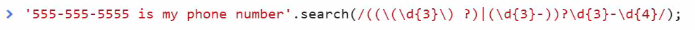

# Module 04-013: JavaScript - Strings (2)

## Working with String Functions - Part 2

***

1. String Repetition
2. Pattern Matching with Regular Expressions
3. String Replacement
4. Search Methods
5. Index Location Methods

***

## String Repetition - `.repeat()`

Creates a new string by repeating the original:

```js
let phrase = 'Hello! ';

phrase.repeat(3); // "Hello! Hello! Hello! "
```

* Returns new string (original remains unchanged)
* Accepts only positive integers (0+)
* Useful for generating placeholder text

***

## Pattern Matching - `.match()`

Searches for patterns using regular expressions:

```js
// Pattern Matchings - .match()
// Using REGEX

const phonePattern =/(\d{2}-\d{3}-\d{2}-\d{2})/;

'Call 93-125-55-27'.match(phonePattern)     // // [object Array] (2) ["93-125-55-27","93-125-55-27"]
```

Common Use Cases:

* Form validation (emails, phone numbers)
* Data extraction from text
* Input sanitization

***

## String Replacement - `.replace()`

Substitutes text patterns:

```js
// String Replacement - .replace()

let str = 'The fox jumps';

str.replace('dog', 'cat');

str.replace(/DOG/i, 'cat');  // the case insensitive claulse /*/i
```

Advanced Features:

* Global replacement with `/g` flag
* Capture groups in replacements
* Function-based replacements

***

## Search Methods - `.search()`

Finds pattern matches and returns index:

```js
// Searchs - .search()

let str2 = 'The cat flies over our head. So cute cat'

str2.search('dog')      // -1   No findings
str2.search('cat')      // 4 - The character (non-zero index) where the finding starts    
```

### `.indexOf()` vs `.lastIndexOf()`

Locate substring positions:

```js
// ,indexOf() - .lastIndexOf()

let str3 = 'The beat goes on, the beat goes down';

str3.indexOf('beat');       // 4 - The fist appareance at non-zero character level
str3.lastIndexof('beat');   // 22 - The last appareance at non-zero char. level
```

Differences:

* `indexOf` stops at first match
* `lastIndexOf` scans entire string
* Both return `-1` for no match

***

## Practical Applications

1. **Data Cleaning**

```js
function cleanPhone(input) {

    return input.replace(/[^\d]/g, '');

}
```

2. **Template Generation**

```js
function generateDivider(character) {

    return character.repeat(80);

}
```

3. **Content Analysis**

```js
function countOccurrences(text, term) {

    let count = 0;
    let pos = text.indexOf(term);

    while (pos !== -1) {

         count++;
         pos = text.indexOf(term, pos + 1);

     }

     return count;
}
```

***

## Best Practices

1. **Regular Expressions**
   * Start simple with literal matches
   * Use online testers for complex patterns
   * Consider pre-compiling often-used patterns
2. **Performance**
   * `indexOf` is faster than `match` for simple searches
   * Avoid unnecessary string operations in loops
3. **Immutability**
   * All methods return new strings
   * Chain operations when multiple transformations needed

***

## Resources

About REGEX:

* https://regexr.com/
* [Regular Expressions 101 (An Interactive REGEX Tester)](https://regex101.com/)

About String methods.

* [# Methods of RegExp and String](https://javascript.info/regexp-methods)

***

## Video lesson Speech

In this second part of our module on String functions in JavaScript,\
we'll examine how to integrate Regular Expressions in order to find\
patterns in string based data.

***

Hi, and welcome back! As we go through the full list of string functions in Javascript. Let's bring back our variable.

```javascript
var str = 'The quick brown fox jumped over the lazy dog';
```

With that in place let's keep going.

The next one on the list is repeat. If I do str.repeat then as an argument in the parens I can pass in however many times I want to repeat that line.

```javascript
str.repeat(5);     // "The quick brown fox jumped over the lazy dogThe quick brown fox jumped over the lazy dogThe quick brown fox jumped over the lazy dogThe quick brown fox jumped over the lazy dogThe quick brown fox jumped over the lazy dog"
```

Now you can see that this is printed out. The quick brown fox jumped over the lazy dog five times and it put it all in one string. Now once again just to reinforce it, this did not alter the original string. This simply returned a value. And this really goes to the heart of how functions work in javascript. It's pretty rare that you want to actually alter the variable. And in fact, the with the way that variables work in this gets into a little bit more of an advanced topic that we'll get into later. The variables in javascript when they get passed to functions they simply pass the value. They don't pass in a reference to the variable. In other words, when something changes that or alters it, it doesn't go back and change the original variable. It simply returns an updated set of values. So in this case when we ran repeat five times it only gave us that value back.

We could use that we could store it in another variable we could wire that up into another function. Anything like that and that would all work. But we still can be confident that our variable string didn't get changed.

Next on the list is a little bit of a different one. If you've never heard of regular expressions, this is going to look very weird. A regular expression is a pattern matching system. This is pretty much available to every programming language at least all of the popular general-purpose programming languages. Javascript, Ruby, Perl, Java, any of these languages they have a reference to what is called a regular expression and the nice thing is, it's actually pretty much the same across all those languages. Now because of that regular expressions look very weird. The next function we're going to do is called `match`. This is going to take in a regular expression and then it's going to tell you if it was a match. I want to build a regular expression matcher for phone numbers.

I want to know if a string contains a phone number. I'm going to go off-screen because you do not want to watch me type this out and I'm going to grab this regular expression and paste it in.

```javascript
str.match(/((\(\d{3}\) ?)|(\d{3}-))?\d{3}-\d{4}/);
```

You can see why you wouldn't want to watch me type this one, I would probably type one little thing off and then it wouldn't work, and it would take a while. But essentially what this says is this is a pattern matching system. Now don't let this intimidate you, and don't think that you're going to have to be able to write these from scratch.

That definitely falls into the vein of very advanced so much so that I'd say half the regular expressions that I use. Usually, I just Google it exactly like I did this one. I googled regular expression for a phone number and I was greeted with hundreds of people who had put in their own patterns. So essentially through what this is going to do is this is going to be compared with javascript or javascript's going to use this to compare it with our string and it's going to say does this pattern match what's contained in the string. Now there is no phone number here, so this should just return null. If I run it, it does, it doesn't error out. all this essentially means is that there is no phone number and there's nothing that is recognized as a phone number.

Now if I change this and I'm not going to use a variable I can just use a regular string and I change this to be (5 5 5) 5 5 5 - 5 5 5 5 just like a phone number pattern if I hit return. Now, look at that. That gives us a full object back.


Now don't worry about knowing every one of these items, because some of these we haven't gone over yet such as arrays and nested objects inside of arrays. But if you click on this you can see that it did in fact find this pattern. If you really want to spend some time understanding regular expressions a little bit more if you come in, you can see that right here it has things like the parens. It's looking for the parens right here.

Then this little `d{3}` inside of curly brackets means it's looking for three numbers inside of those curly brackets and then it's going to do the same thing here with a dash followed by it and then another one right here where it's going to be four numbers. That's what it is. But there are entire courses dedicated to regular expressions. You definitely don't have to worry about that right now. But what I want to get across is that you have the ability to use the match function in order to see if something that you're wanting to check against actually is a match or not. This works very well and is required for things such as web form validations.

Imagine that you're building out a web application and you have an email field which is a pretty common thing to have. Say that you want to make sure that someone can't just type in any random set of characters and expect that to be able to be submitted in the form for an e-mail filled. You want to be able to make sure that what they type in matches what an e-mail is. What you could do is build in a match or find an email regular expression pattern and then say does what they typed in does that match? If so let it go on, If not tell them that they have to enter in a valid email. That's a very common reason why you'd want to use the match function.

Next on the list is `replace`. Say that you want to replace something. this takes into arguments. The first is what you're searching for. So here you can say Fox and the second argument separated by a comma is what you want to replace it with. So if I want to replace Fox with Wolf, I would run this. Now you can see it says the quick brown Wolf jumped over the lazy dog.

```javascript
str.replace('fox', 'wolf');    // "the quick brown wolf jumped over the lazy dog"
```

And you can also if you wanted to you could pass in a regular expression as that first argument because there are many times where you don't know what you're looking for. So in other words you're not looking for a specific word. You may be looking for a pattern and then you want to replace it with some other value. So that's also a very helpful thing to know, that is string replace.

The next one is going to be search. This one I'm going to copy again because I thought the example that worked best was a phone number one again. I'm going to paste this in then we'll talk about it.



Here we have a valid phone number. And also notice this pattern right here doesn't require the parentheses that also allows for this kind of dash notation right here. Here it's saying this is my phone number search and then we're passing in a regular expression. And if I run this it says zero. So what exactly is search doing? Well, what search does is, it looks and when it finds a pattern that it matches with, then it will actually return the index. So zero does not mean that it didn't find it. It means that it did find it and it found it at the zeroth index. Now if I run this again with just `foo`. I run this and it returns negative one.

Now a negative one means it didn't find anything. So if you're running a search and you're going to be checking to see is this inside of it? If it is, it's going to give you an index starting at zero going all the way through the length of it. And if it's not then it will give you a negative one. I'll also note that it's very similar among other programming languages. Ruby does a very similar kind of implementation for regular expression searching and matching as well.

Now instead of that let's just check this out just so you know that I'm not lying about this zero. I say foo here and run it, now it returns 4. That's because if we count, remember this is the 0 index. So, zero, one, two, three, and then four. So what it found, the pattern that it found starts on index four and that's the way that `search` works.

Now that we're kind of talking about indexes let's go into it in more detail with `indexOf`. If I look at our string again I'm going to pull that up so we can reference it. Now we can pass in a word so I can say jumped and run this.

```javascript
str.indexOf('jumped');    // 20
```

You can see that it is at index 20. And now one thing to keep in mind is that this is index 20 but it is the index of the first word that it finds. Now we only have one jumped word, but let me create a new string here. I'm going to create var string 2 and we'll get to practice our concating here. So you say str.concat and pass in what we did before "again and again".

```javascript
var str2 = str.concat(' again and again');
```

But now we have this new string too that actually has the full string plus what we put at the end of it. So now what we can do which is pretty cool is, if we say

```javascript
str2.indexOf('again');   // 45
```

and run that you can see it's 45. But now we can also do another function that's pretty close to it which is `lastIndexOf`. And now you can see it's 55.

```javascript
str2.lastIndexOf('again');    //  55
```

What the difference there is, `indexOf` looks through the whole string, once it finds the very first instance of what it's searching for it just turns that index, last index will go through and it goes through every one it finds every one of the patterns or the words we're looking for. And then it returns the last one that it found.

That is something that's very helpful. And if you ever need to find all of them that's what going back to the match function, that's what the match function does. So that is quite a bit on how to use regular expressions. I know this is another guide that took a while and so I'm going to stop it right now and then we're going to finish off with a part 3. That is going to finish off the rest of the string functions.

```javascript
str.repeat(5); // "The quick brown fox jumped over the lazy dogThe quick brown fox jumped over the lazy dogThe quick brown fox jumped over the lazy dogThe quick brown fox jumped over the lazy dogThe quick brown fox jumped over the lazy dog"

str.match(/((\(\d{3}\) ?)|(\d{3}-))?\d{3}-\d{4}/) // null

'555-555-5555'.match(/((\(\d{3}\) ?)|(\d{3}-))?\d{3}-\d{4}/) // (4) ["555-555-5555", "555-", undefined, "555-", index: 0, input: "555-555-5555"]0: "555-555-5555"1: "555-"2: undefined3: "555-"index: 0input: "555-555-5555"length: 4__proto__: Array(0)

str.replace('fox', 'wolf'); // "The quick brown wolf jumped over the lazy dog"

'555-555-5555 is my phone number'.search(/((\(\d{3}\) ?)|(\d{3}-))?\d{3}-\d{4}/) // 0

'Hi, 555-555-5555 is my phone number'.search(/((\(\d{3}\) ?)|(\d{3}-))?\d{3}-\d{4}/) // 4

str.indexOf('jumped'); // 20

str.lastIndexOf('jumped'); // 20

var str2 = str.concat('again and again');

str2.indexOf('again'); // 44
str2.lastIndexOf('again'); // 54
```

## Resources

* [Source code](https://github.com/rails-camp/javascript-programming/blob/master/section_b_13_string_functions.js)

***

## Coding Exercise

For this submission, replace dog with cat, find the index of over, and find the last index of never.

```js
stringOne = "The dog meows"

replacedString =  // replace the word dog with cat

stringTwo = "The cow jumped over the moon"

indexOfOver =  // get the index of over

stringThree = "Never gonna give you up never gonna let you down"

lastIndex = // get the last index of never 
```
