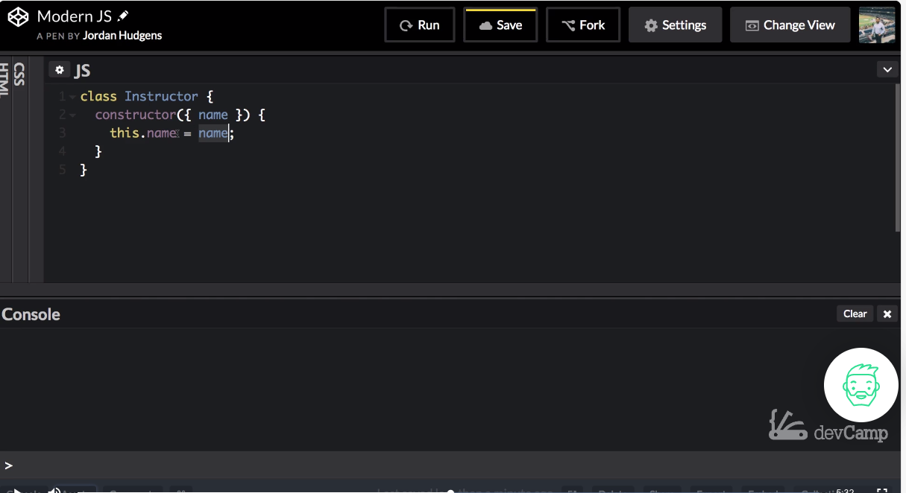

# MODULE 04-063:     JavaScript

## OOP programming (1):    Instance Methods

***

1. Class Definition
2. Constructor Method
3. Instantiation Process
4. Instance Properties

***

## 1. Class Definition

Classes in JavaScript serve as blueprints for creating objects. They encapsulate:

* **Properties** (data/state)
* **Methods** (behavior/functionality)

```js
class Instructor {
  // Class body goes here
}
```

**Historical Context:**\
Prior to ES6, JavaScript used prototype-based inheritance.

Modern class syntax provides clearer structure while maintaining prototype-based inheritance under the hood.

***

## 2. Constructor Method

The `constructor` is a special method that:

* Runs automatically when creating new instances
* Initializes instance properties
* Receives arguments passed during instantiation

```js
constructor({ name }) {
  this.name = name;
}
```

**Visual Representation:**

```
new Instructor()
      ↓
Constructor runs
      ↓
Properties initialized
      ↓
Instance created
```

***

## 3. Instantiation Process

Creating an instance from a class:

```js
const jon = new Instructor({ name: 'Jon Snow' });
```

**Key Terms:**

| Term     | Description                        |
| -------- | ---------------------------------- |
| `new`    | Operator that creates new instance |
| `this`   | Refers to the current instance     |
| Instance | Concrete object created from class |

***

## 4. Instance Properties

Properties are added to instances using `this`:

```js
class Instructor {
  constructor({ name, role = 'teacher' }) {
    this.name = name;
    this.role = role;
    this.createdAt = new Date();
  }
}
```

**Property Characteristics:**

* Can have default values
* Can be dynamically calculated
* Are instance-specific

***

## 5. Practical Implementation

### Complete Class Example

```js
class Instructor {
  constructor({ name, specialty }) {
    this.name = name;
    this.specialty = specialty;
    this.students = [];
  }

  addStudent(student) {
    this.students.push(student);
    return `${student} added to ${this.name}'s class`;
  }
}
```

### Creating and Using Instances

```js
const jsExpert = new Instructor({
  name: 'Sarah',
  specialty: 'JavaScript'
});

jsExpert.addStudent('Alice');
jsExpert.addStudent('Bob');
```

**Instance Visualization:**

```js
jsExpert Instance:
{
  name: "Sarah",
  specialty: "JavaScript",
  students: ["Alice", "Bob"],
  __proto__: Instructor.prototype
}
```

***

## Common Pitfalls & Best Practices

### Pitfall 1: Forgetting `new` Keyword

```js
const badInstance = Instructor(); // TypeError
```

**Solution:** Always use `new` with class constructors

### Pitfall 2: Modifying Shared Prototype

```js
Instructor.prototype.school = 'DevCamp'; // Affects ALL instances
```

**Solution:** Prefer instance properties for instance-specific data

### Best Practice: Clear Property Initialization

Initialize all relevant properties in constructor for better code organization and predictability.

***

***

## Resources

* [MDN Classes](https://developer.mozilla.org/en-US/docs/Web/JavaScript/Reference/Classes)
* [JavaScript.info Class Basics](https://javascript.info/class)
* [ES6 Class Features](https://exploringjs.com/es6/ch_classes.html)

***

***

## Video lesson Speech

In this section we're going to walk through how to build object-oriented\
programming techniques into a javascript program.

For years and years\
javascript did not have a option for building object oriented or OOP.\
types of procedures into the application. So people have built all kinds\
of workarounds.

***

One of the most common being to utilize functions like classes and that went for a number of years and it wasn't until recent more modern versions of javascript that classes came into being.

So what we're going to do in this entire section is take it very nice and slow, because if you are not familiar with object-oriented programming then some of these things may seem a little bit odd to you. So these guides are going to be set up to give you a really nice glimpse into what you can do in a very short interval kind of way.

In this very first guide what we're going to do is just create a class and then we're going to what's called instantiate that class and that is all we are going to do in this guide. Then in the next one and then the ones after that we're going to continue to add more features and we're going to be working on the same code case study for the entire section. And so what we're going to do is build an instructor class.

So imagine a situation where you are building an application similar to say devcamp a learning management system and you need to have the ability to have instructors in there. That is a great time to be able to use an instructor class.

Now classes are made up of all kinds of different things and it's a reason object-oriented programming gives a really nice interface for building programs because they can contain attributes they can contain multiple types of functions, and then you can call them in a very similar way that you would call objects or call functions

Now in javascript, there is a lot of overlap so there's going to be many times where you see a situation, where you see me doing something and it looks like the exact same thing I would do on a function and it's because essentially, in javascript, everything is a function.

Everything is an object so you can call those types of items in a very similar manner. So that's part of the reason why I wanted to take a little bit step back and go a little bit slower than usual because some of these things might look a little confusing if you've never seen them before.

We are making this class called Instructor and the first thing that we're going to do is we're going to build in what is called a constructor function. So a constructor function is just spelled exactly like it's called constructor. And what is this role, its role, it is to run all the processes you want. Every time that a new instructor is created.

So if you build a new instructor. Then you every time you do that so you say I want a new instructor. Everything inside of this constructor function is going to get run.\
In this case for our basic example what I want for this is to just pass in a name. So we're going to make this nice and easy. And if you remember back to our deconstruction videos we're going to pass in a name as an object, so anytime that we want to create a new instructor we simply are going to pass in all the attributes in as an object.

Here I'm just going to say name and that's all I'm going to put inside of it. And then inside the curly braces, so this is a normal function, now constructor is a reserved keyword inside of classes so this is something that you are typically going to build for most classes. Not all it's not required but it is something that you will be doing quite a bit because it's pretty rare that you will create a class and not want to immediately do something with it.

Whether it's setting values calling certain other builder functions inside of it. That's what a constructor does is if you imagine that a class is like a blueprint for a house. When you build that house there are certain things that you want to be done to it such as laying the foundation or setting up the framing.

That is what the constructor function does is it performs all of those basic tasks that you want to be done, for every time a new class is instantiated. So now inside of this, I'm going to

```
class Instructor {
  constructor({ name }) {
    this.name = name;
  }
}
```

Now, what is going on right here?

What we have here is our name which is what's to be passed into when we ever we create a new instructor and we want to actually do something with this name. And so the way that we can do it is we can add this in so it is a part of the class. It's a part of the class whenever a new one gets created.\
The way we can do it is, by saying this name and set it equal to that. So if you want to think in the highlighting here does a very nice job of showing that these are different things. Name and name here. These are going to be referencing the same element inside of the object.



Now, this right here when we say this name what that is referencing is the instance of instructor. So when we create an instructor like we're going to, here in a second, what we're going to do is we're going to create a new instance and then we're going to with this say, for this specific instance, I want you to store whatever name got passed in with this object.

If you're wondering why I'm taking a little bit longer in explaining this and going into more detail it's because this is one of the most foundational types of concepts in object-oriented programming. And if you skip over this part or if this is a little bit fuzzy then it's going to make a number of the other things that we try to learn later on, much more confusing.

I definitely think that right here it's important for you to be able to take a step back and see exactly the process that is occurring, because if you can understand this part, if you can understand that we're adding an attribute into this name item, then it's going to make life much easier for you later on.

Now with all that in place let's create a new instructor remember that in object-oriented programming, a class by itself is nothing more than a blueprint. It does nothing in regards to any you know we can't do anything with a class by itself. It simply gives us a set of rules and guidelines for building objects and so that's what we're going to do now, and a very important keyword to remember when it comes to this process is this is called instantiation.

What we need to do since a class by itself does nothing is we need to tell the class that hey I want to go and I want to create something that matches your blueprints. So going back to the house example, instantiation is like building the house. The Blueprints are nothing more than saying that each room should be this the number of feet by a wide by this many feet long and performing those kinds of measurements and setting those rules in place.

The house itself is completely separate and that's the same thing here we have a class which is a blueprint, and then we have the object which is the real world kind of element that we're going to be able to use in our program.

So here is say const.

## Code

```
class Instructor {
  constructor({ name }) {
    this.name = name;
  }
}

const jon = new Instructor({ name: 'Jon Snow' });
console.log(jon.name);
```

Then inside of this, remember we're passing an object so whatever you have in your constructor function in your list of arguments whenever you instantiate a new version of instructor then you need to pass in that object.

So what I need to do is pass a name and I can say. Jon Snow right here. We have instantiated a new instructor and it is John and it has this attribute name. Now if we want to see what this looks like we can console log Jon and now save and I run this it's going to print out as you can see an object it doesn't print out anything that says instructor because what we've done is we've taken all of this blueprint right here, and we've said I want to take all of these different rules and these types of elements you have inside of here, and I want you to wrap it all into an object and right now it's very basic but it still is a javascript object.


Now to get back to some of the industry types of nomenclature and how you would say some of these words. So right here we have Jon. This Jon is considered an instance of the instructor class. So Jon's an object and the proper term that you'd want to call it is you'd say that John is an instance of instructor.

That's a reason why when we console logged it said the name. But it also wrapped all of it inside of an object. Now the cool thing is if you understand the way that objects work in javascript then you know that right here you just say `jon.name` and if I hit clear here save and then run it then you can see it prints out the name just like this right here.

Now if you think that we went into a lot of detail for something with a very limited amount of functionality you're 100 percent right. The whole point of this was not to build out a giant feature. Instead, it was to understand and have a foundation of how object-oriented programming works in javascript. Because even if you're coming from other languages if you're coming from Java or C++ or even Ruby, the way that javascript is implemented object-oriented programming is much different than any language that I've really ever seen.

So it is important to understand these kinds of core concepts because it's going to help you make much better strides and understand the more advanced techniques later on. So now that you have all of this knowledge in place in the next guide we're going to get into a little bit more of the fun stuff which is to add behavior to classes by adding an instance methods to a class.

## Code

```
class Instructor {
  constructor({ name }) {
    this.name = name;
  }
}

const jon = new Instructor({ name: 'Jon Snow' });
console.log(jon.name);
```

***

## Coding Exercise

Create a class, named _Account_, that has properties for a `username` and `password`. Then instantiate a new object called `user` and set the username and password to whatever strings you like.
