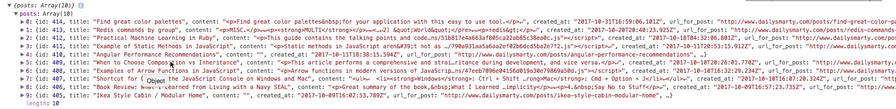

# MODULE 04 - 069:    JavaScript

## Promises (2), Using a fetch Promise to Communicate with APIs

***

1. Introduction to the Fetch API
2. Basic Fetch Request Structure
3. Processing Responses: Converting to JSON
4. Handling Data and Errors

***

### 1. Introduction to the Fetch API

The **Fetch API** is a modern JavaScript interface for making HTTP requests. It returns a `Promise`, enabling asynchronous communication with external APIs. Key features:

* Replaces older `XMLHttpRequest`.
* Simplifies API calls with `.then()` and `.catch()`.
* Supports modern features like streaming and CORS.

**Why Use Fetch?**

* Built-in `Promise` integration.
* Clean syntax for handling HTTP requests/responses.
* Standard for interacting with RESTful APIs.

***

### 2. Basic Fetch Request Structure

A `fetch` request takes a URL and returns a `Promise` that resolves to a `Response` object.

**Syntax**:

```js
fetch('https://api.example.com/data')  
  .then(response => /* process response */)  
  .catch(error => /* handle error */);  
```

**Example**: Fetching posts from an API:

```js
console.log('Starting fetch call');

const postsPromise = fetch('https://api.dailysmarty.com/posts');  


console.log('After fetch call');  
```

* The `fetch` call is non-blocking.
* The `Promise` (`postsPromise`) is pending until the server responds.

***

### 3. Processing Responses: Converting to JSON

The `Response` object from `fetch` doesn’t contain the actual data. Use `.json()` to parse the response body as JSON.

**Example**:

```js
postsPromise  
  .then(response => response.json()) // Convert to JSON  
  .then(data => {  
    console.log(data); // Process parsed data  
  });  
```

**How It Works**:

1. `response.json()` returns a `Promise` resolving to the parsed JSON.
2. The second `.then()` receives the parsed data (e.g., `data.posts`).

***

### 4. Handling Data and Errors

#### Iterating Through Data

Use array methods (e.g., `forEach`) to process API results:

```js
postsPromise  
  .then(response => response.json())  
  .then(data => {  
    data.posts.forEach(post => {  
      console.log(post.title); // Log each post's title  
    });  
  })  
  .catch(err => {  
    console.error('Fetch failed:', err); // Handle errors  
  });  
```

#### Error Handling

* **Network Errors**: Triggered if the request fails (e.g., no internet).
*   **HTTP Errors**: `fetch` only rejects on network errors, not HTTP 4xx/5xx. Check `response.ok`:

    ```js
    .then(response => {  
      if (!response.ok) throw Error(response.statusText);  
      return response.json();  
    })  
    ```

***

### 5. Real-World Use Cases

1.  **Dynamic Content Loading**:

    ```js
    fetch('https://api.example.com/news')  
      .then(response => response.json())  
      .then(news => renderNewsFeed(news));  
    ```
2.  **User Authentication**:

    ```js
    fetch('https://api.example.com/login', {  
      method: 'POST',  
      body: JSON.stringify({ username, password })  
    });  
    ```
3.  **Data Submission**:

    ```js
    fetch('https://api.example.com/comments', {  
      method: 'POST',  
      headers: { 'Content-Type': 'application/json' },  
      body: JSON.stringify(commentData)  
    });  
    ```

***

### 6. Best Practices

* Use `fetch` for clean, promise-based API communication.
* Always parse responses with `.json()` for JSON data.
* Handle both network and application-level errors.
* Follow security best practices (HTTPS, CORS).

1. **Always Use HTTPS**: Avoid mixed content errors (HTTP vs. HTTPS).
2. **Validate Responses**: Check `response.ok` for HTTP errors.
3.  **Structure Code Readably**:

    ```js
    // Avoid nested .then()  
    fetch(url)  
      .then(validateResponse)  
      .then(parseJSON)  
      .then(processData)  
      .catch(handleError);  
    ```
4. **Handle Edge Cases**:
   * Timeouts.
   * Empty responses.
   * Invalid JSON.

***

## References

* [Fetch API - Web APIs | MDN](https://developer.mozilla.org/en-US/docs/Web/API/Fetch_API)
* https://javascript.info/fetch
* [HTTP response status codes - HTTP | MDN](https://developer.mozilla.org/en-US/docs/Web/HTTP/Reference/Status)
* [Cross-Origin Resource Sharing (CORS) - HTTP | MDN](https://developer.mozilla.org/en-US/docs/Web/HTTP/Guides/CORS)

## Video lesson Speech

Now that you have a basic understanding of how to build promises in\
Javascript. In this guide we're going to extend that knowledge and we're\
actually going to see how the javascript developers integrated promises\
to be able to communicate with outside API's when they built the fetch\
function.

***

One of the most common reasons why you're ever going to use `promises` is to communicate with outside services. In this guide, we're going to see how we can communicate with an outside API. I'm very excited about this guide because this is a process that you're going to be implementing in many different applications and so here you're going to see the full process on what you need to do in order to communicate with outside services.

I've created an API for the daily smarty application that brings back all of the posts. So it brings back an ID, title, the content of the post, when it was created, what the URL was, along with any post links. You're going to have access to be able to get all of this content. This is a very common pattern where you're communicating with a custom backend for your application or communicating with services such as Twitter or Facebook or Instagram and being able to get that information to be able to show it in your own application.

We are going to have all of this available to us and I'm going to copy this URL and coming back to CodePen. We're going to start building now our call. I'm going to store our promise inside of a const variable.

I'm just going to call it postsPromise and instead of setting it equal to a new promise like we did before. We don't have to do that we can specifically just call `fetch`. The reason why this is possible is that the javascript development team built `fetch` and implemented a `promise` inside of `fetch`. So when we're calling `fetch` we are going to be getting a `promise` back and that's part of the reason why whenever I'm implementing some type of function that I know returns a `promise` I like to put the promise extension here in the variable name.

Now, this is not required but what it is going to help you to be able to do is, say that you build this type of system and you come back to it six months later. You want to know what that variable represents. And so by putting promise at the end of this variable name you're going to understand that `fetch` is going to bring back a promise and that's going to define how you work with that. `Fetch` for the sake of what we're going to be doing right now is simply going to take one argument and that is going to be a call to the API now in more advanced applications and implementations. You can also pass a number of different options to `fetch` as well such as the authentication headers and all those kinds of elements. But for our use case, we don't need to do that we're simply calling this API.

Now I want to set up a number of console log statements here so that you can see the order that these promises are called in. I'm going to say console log and here I'll just say `starting fetch call` and I'm going to now put another one right here. In the middle of this I'll say `after fetch call` and here I'm going to put the promise itself so I'll do `postspromise` and then here I'll just say `After program has run` and so let me save this.

```js
console.log('Starting fetch call');
const postsPromise = fetch('https://api.dailysmarty.com/posts')
console.log('After fetch call');
console.log(postsPromise);
console.log('After program has run');
```

and let's see what happens when this gets run. So I'm going to hit run and you're going to see that each one of the console log statements printed out


Let's compare what they have. And also as a quick aside you may notice here that I'm using the javascript console instead of the CodePen one and the reason for that is codepen limits the amount of data that it will show inside of its console where the javascript one does not. If you're following along using CodePen then I recommend that you use the javascript console when you're working with APIs so that you won't run into any issues with your content being limited or capped.

Let's see this order we have `starting fetch call` that happened first so everything there makes sense. Now the next one we get is `after fetch call`. So far so good because we weren't console.logging anything here. Then we get our `postPromise`. So everything here is still in order. Then after the program has run is the final one, everything there works just like we would expect. What we've done so far is simply make sure that the order is sequential. So far so good.

Now, remember the reason why I'm stressing this is because when it comes to working with `promises` the whole point of it is being able to implement `asynchronous behavior` which means that you want the ability to call this API without stopping the entire communication pattern in the data flow for the rest of your application. Imagine a situation where you have this call to this daily smarty API and you want to show that on a widget of the page you don't want that one widget to be held up. If the daily smart application is taking a while to load its posts. So instead what you do is you do exactly what we did right here which is to store it in a `promise`. Then whenever that data comes back then you can show that on the screen, now we know that that's working.

Now let's take a look at what we get back in our promise. So if I click the drop-down arrow in the console you might be a little bit confused because if I click on say the promise here.


And I keep looking through the data. Nothing here is really telling us what our posts are.


If you remember back we would kind of expect that our full set of posts would be exactly like this like we'd be able to see these titles and all of these elements.


But what we've done and what `fetch` brings back to us is a `promise` and this is one of the most critical parts to understand when it comes to working with `promises`. Is the `promise` by itself really doesn't do a lot for you, you are not going to output a `promise` on the screen you're going to get back this `promise` object, but then you have to do something with it. You have to say what I want to do with a successful response is X Y Z.

And what I want to do when it fails is A B C and so you need to be able to define that in a very clear way and that is what we're going to do now.

Now that we have our `postsPromise` we can work with it so we can say `postsPromise` and then I'm going to come down to a new line here and I'm going to give the very first `.then` if you remember back to the last guide where we walk through what a `promise` expects. You need to have at least one `.then` and one `.catch` to be able to manage it. And in this case, we're actually going to go with multiple `.then`'s so that you can see that you can apply multiple processes on the same objects.

Now if you remember back to the last guide you remember that then has some type of data element that is passed to it. So the post-process takes everything that it gets back whether it's something good like a successful set of posts or it's bad like an error. And so we have that to work with and that's the very first thing that we need to pass `.then`. So here I can just say .then(data) and if I'm using an arrow function then here I can say data and we're using our process where we can use implicit returns. So instead of doing something like this where I say `.then(data => { return data})`. I'm simply going to be putting this on one line and I'm not going to have to wrap it in curly braces. And so the data that we're going to get back is going to look a little bit different. So if I say console.log(data) just like this.

```js
postsPromise
  .then(data => console.log(data));
```

Let's see what this brings back to us. Remember to clear the console, hit save, and hit run and see what gets brought back.


So right here you can see that it is starting the `fetch` call all the way to where we were before. Now it brings back this response, what the `promise` returns to us is this data which is the response of that `fetch` call. So you can see that we have this object and this is not our set of posts.

Let's click on it and see what we have.


Here we have our headers. We have a status of 200.

If you are unfamiliar with HTTP status codes what this means is that everything worked and you also get status text which is OK. And then the URL we did that is not our set of posts.

If I click on proto and you see we have all kinds of different elements in here and I can keep on going down but as you can see this is not really what we want yet. The reason for that is because `fetch` can be used with any type of data. If you're working with XML or anything like that then fetch can still do that and so what we have to do is define it and say that this data is JSON. So I'm going to clear this out and instead of console.logging just data by itself which is really just the response. What I'm going to do is say data.json and this is going to convert all of that data that we get back into JSON.

```js
.then(data => data.json());
```

it's something that we can work with. And then from there what we can do is then we can add another `.then` on top of it so I can say `.then` and now I can say what we want to do with the data.

```js
.then(data => data.json());
.then(data)
```

Now, this is going to be to just follow the data flow. Remember the promise returns a response. That's what we have right here. Now what we're doing is we're converting that response to JSON. And then this, in turn, gets passed to the second .then and so the second data is not the same as what we have in the first data.

The second .then(data) is going to be referring to what got returned with the data.json which is the JSON formatted version.

Now what we can do is do another arrow function and we can now start getting to our posts. So I'm going to have all our indention updated and now I can say data and if you want to see what this looks like I will say console.log(data). The reason why I'm taking this one step at a time and maybe going a little bit slower than normal is because this is very critical in understanding how to work with API's is it's very important to realize you can't just call an API and get all the data that you want back. There are a number of processes that have to take place. So returning from a promise converting to json and now we're going to see how we can work with that object.

I'm going to hit save, run this.

```js
postPromise
  .then(data => data.json())
  .then(data => {
    console.log(data);
  })
```

And now let's see what we have back.


OK. So now we're getting a little bit closer. If you look and let me also take and comment all the extra console.log's out. I'll leave them in the show notes but for right now I'm going to comment them out just so we don't have all of this data confusing us.

So what got returned is what we have here which is this object called posts by click on this. You can see we have 10 posts and if I click on that look at what we have here we have all of that data returned to us.



So after we've converted it to JSON and that tells javascript that we are expecting JSON data and I want you to format it and return the data like that. Now we have access to it, so let's see how we can parse through it. Because everything we got here is really just an object called post so that doesn't do a lot of good for us if we want to render this on the screen or anything like that. What I'm going to do is call data and I can say .posts `data.posts;` and so what that's going to do and how I can call posts, there's not a special reserved keyword or anything like that.

This is how you can parse JSON data in javascript. Because if you remember back to what we had here we had that post object. So all I'm doing is I'm calling the key called posts. If this returned a set of guides I would call .guides. So it really is simply dependent on what the API returns and that's part of the reason why I'm taking a step by step process because if you tried to go right from the beginning all the way to calling all of those post titles for example then you're going to not realize the way the data flow changes. So we now have posts and what I can do now is start iterating over and I'm just going to use a forEach loop here. And forEach takes an argument of item.

So this is the item that we're iterating over and I'm going to then use another arrow function. And now we have clear the semicolon. And now we have a block so I can say a console log item.title.

```js
data.posts.forEach((item) => {
  console.log(item.title);
})
```

And the reason why I am able to do this. And let me just close all my brackets out and then I'm going to go into the details. The reason I'm able to do this is because this data and when I call posts what this is doing is this is going to grab the array called post and then were iterating over it. Each item in that array we'll have access to and that is its own object. And so I can then call `item.title` and if you go and look at the API you can see right here we have posts.


This is what the objects are named. And then you have this set of arrays. So you have right here. This first one of ID 414. Then you have the next one of 413. So all I'm doing is inside of these nested objects I'm just going to be calling title and I have access to it because we're iterating over that. And so I'll console.log(item.title). And then this should work, I believe. If I hit run now this is going to go and look at that. We have printed out each one of the titles inside of the API


and I don't know about you but I think that's pretty cool.

So we've in just a few lines of code

```js
postsPromise
  .then(data => data.json())
  .then(data => {
    data.posts.forEach((item) => {
      console.log(item.title);
    });
  })
```

and working with promises we've been able to communicate with a completely different server and we've been able to bring all of those titles for that other application right into our own programs so we'd be able to do this if we're working in some kind of front-end application. We'd be able to communicate with this outside API and pull in say the title and then we could also pull in some of the other elements so if you wanted to link to it then we can click on url\_for\_posts.

Paste that in instead of title in the console.log statement. Now clear the console out let's not get confused. If I click run you can see we have all of the links right here.


So if you wanted to place this inside of a page, grab the title, and then create a bunch of links you can pass in the URL, and then in your application you could show all of this same thing for working with Instagram or Twitter or any other outside API. And we did that all with just a few lines of code so that I think that is pretty awesome.

Now we've implemented the majority of what we need. However, if you notice we are still missing one thing, we're missing what happens if this promise does not resolve properly so if it gets rejected and we have an error we need to be able to catch that error. So here I'm going to say `.catch` and just pass in an error and then let's do another arrow function. And now I can just say console.log whatever the error is and that is our entire program.

```js
.catch((err) => {
  console.log(err);
});
```

That is our full workflow for working with promises in an outside API. Now there are obviously many other things that you could do if you need to pass in a helper function to format these different items as they come in. There are all kinds of different application-specific requirements. However, this is the core functionality that you need.

Now if I hit run again everything's going to work exactly like normal because this catch is never initiated because there are no errors. But now let's imagine that we come up to the top and change our`const postsPromise = fetch('https://api.dailysmarty.com/posts')`\
and this is a very common issue. If I change this https to HTTP then this is not going to work properly because if you're working on CodePen we have https and you cannot call an HTTP API from an application that is using just a fully secure system.

That's what we'd run into with our postsPromise if we tried to pull these in and the reason for that is that deal specifically with cybersecurity if you are fetching this type of API endpoint and it's not secure there's a chance you might be bringing in different elements that are not secure into your own application and so javascript is going to block that.

Now if I hit save and I hit run now this is going to now hit our catch blocks. Everything here is working and it even shows you the error it says mixed content. The page here was loaded over https but requested an insecure resource. And so that's what I mentioned earlier and so that's the reason why it was blocked. Then if you notice on line 15 here I said console log the error. And this is the error, it was a type error and it failed to fetch and in a normal application what you could do is render something on the screen and say there is an error in communicating with the outside API or you could log it into your application's logging system.

Right now we're just putting it right into the console. But this is the full workflow that you'll need in order to communicate with outside API. And we're leveraging promises to do it.
