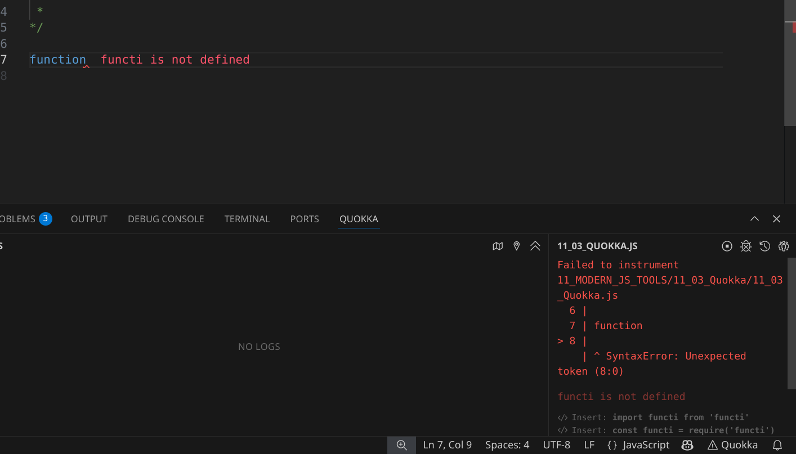

# MODULE 05 - 082:   ModernJS Tools (5)

## Quokka.js extension

***

1. Introduction to Quokka.js
2. Quoakka Features
3. Setup and Installation
4. Basic Usage
   * Free vs Pro Version
   * Inline Output
5. Practical Examples
6. When to Use Quokka

***

## 1. Introduction to Quokka.js

Quokka.js is a **real-time JavaScript/TypeScript playground** that displays execution results directly in your code editor (VS Code, JetBrains, or Atom).

It eliminates the need to switch between editor and browser/console for debugging simple code snippets.

### Why Use It?

* Immediate feedback without running the entire application.
* Perfect for **prototyping functions**, **testing algorithms**, or **debugging snippets**.

**Pro Tip**: Combine with **ES6+ features** (e.g., arrow functions, destructuring) for efficient testing.**Pro Tip**: Combine with **ES6+ features** (e.g., arrow functions, destructuring) for efficient testing.

***

## 2. Quokka Features

| Feature               | Free Version          | Pro Version ($)                    |
| --------------------- | --------------------- | ---------------------------------- |
| Inline results        | ✅ (via `console.log`) | ✅ (via `//?` syntax)               |
| Value exploration     | Limited               | Advanced (e.g., object inspection) |
| Custom configurations | ❌                     | ✅                                  |

***

## 3. Setup and Installation

1. **Install the Extension**:
   * https://marketplace.visualstudio.com/items?itemName=WallabyJs.quokka-vscode
   * JetBrains/Atom: Search for "Quokka.js" in plugins.
2. **Start Quokka**:
   * Open a `.js` file.
   * Run command palette (`Cmd/Ctrl + Shift + P` → "Quokka: Start on Current File").

***

## 4. Basic Usage

### Free Version: `console.log`

#### Scratch mode

Press `Cmd/Ctrl + K, L` to open a scratch file and start typing code. Quokka will evaluate your code in real-time and display the results in your editor.

You can paste or import any code from your project into the file,and import modules.

The mode is perfect for quick prototyping, testing, and experimenting with code snippets in isolation.

#### Run your project files

Press `Cmd/Ctrl + K, Q` to run Quokka on the current file. Quokka will execute your code file as a **standalone self-contained program**, as if the file was the entry point of your application.


You can invoke functions declared in the file, use imported project files and modules.

The mode is perfect for debugging, testing, and validating your code within the context of your project files.




```js
function sum(a, b) { return a + b; }


console.log(sum(2, 5)); // 7 (appears inline)
```

### Pro Version: `//?` Syntax

```js
sum(2, 5); //?  (Output: 7)
```

#### Run context aware code snippets in your project

The [Quokka Snaps](https://quokkajs.com/docs/features/snaps) feature allows you to run code snippets in any file in your\
project, with access to some context of the file where the snippet is located. Simply type `{{` in VS Code, the editor\
will automatically add the closing `}}` for you. Quokka then runs your code within these blocks, providing instant\
feedback.

The mode is perfect for testing and debugging code snippets in the context of your project’s file when you don’t want to\
run a separate scratch file and don’t want to run the full file as a self-contained program.

For example, you may start Quokka Snap right inside a React component hook and quickly validate the behavior of some\
imported function or a piece of logic:

```js
import { validateEmail } from './validators';
function Component() {  useEffect(() => {    ...
    {{      // Quokka will execute the code below      // and display the results in your editor.      // Once you finish, you may remove the      // {{ }} snap markers and the code inside.      validateEmail('test@test.abc');    }}
    ...
  });
  ...
  return (
    <div>
      ...
    </div>  
);
}
```

***

## 5. Practical Examples

### Example 1:     Debugging a Function

```js
const square = n => n * n;

square(4); //?  (Output: 16)
```

### Example 2:     Array Operations

```js
const numbers = [1, 2, 3];


numbers.map(x => x * 2); //?  (Output: [2, 4, 6])
```

### Example 3:     Object Inspection (Pro Feature)

```js
const user = { name: 'Alice', age: 25 };

user; //?  (Output: { name: 'Alice', age: 25 })
```

***

## When to Use Quokka

* **Learning/Teaching**: Visualize how code executes line-by-line.
* **Quick Prototyping**: Test small logic blocks without setting up a full environment.
* **Debugging**: Isolate problematic functions with instant feedback.

> **Limitation**: Not a replacement for full debugging tools (e.g., Chrome DevTools) for complex applications.

***

## Resources

* https://quokkajs.com/
* https://marketplace.visualstudio.com/items?itemName=WallabyJs.quokka-vscode
* [Quick Start | Quokka](https://quokkajs.com/docs/intro/quick-start/)

***

## Video Lesson Speech

The last few guides we've walked through have been pretty challenging,\
especially if you've never used some of the tools and the concepts that\
we've walked through. So in this guide we're going to have some fun and\
we're going to change gears a little bit and look at a tool that I used\
quite a bit and I'm going to be using quite a bit throughout the rest of\
this course called Quokka.

***

It's called [Quokka.js](https://quokkajs.com/) and it is free to use they also have a paid version that I have. And so you're going to be seeing me using this quite a bit because it allows you to actually render javascript output inside of the code editor itself. And the free version is slightly different than the pro version and I'll explain the differences but you don't have to use it at all. Or you can use it or you can use a pro version is completely up to you.

But I will show you what it does so that you can kind of make up your own mind. They have a nice little visual here and we'll walk through a full demo of it. It will work with either [Visual Studio Code](https://code.visualstudio.com/), [JetBrains](https://www.jetbrains.com/), or [Atom](https://atom.io/). And as you can see what it does is it allows you to output and actually view dynamically the output of your programs right in the code editor.

./05-081\_IMG1.pngSo if I open up Visual Studio code here where it's installe


I already have it installed but you can install yours and then you'll have access to it and so let me start it up I'll hit command shift P and a couple of ways you can do is you can start in a new JavaScript file or if you have one open then you can say start on current file. I'll start a new JavaScript file and it gives you an output panel here and I'm going to keep it open but it's optional and I personally prefer to see it all in line.

But let's create a function, say function sum and it takes in numOne and numTwo choose a very basic function that is simply going to add two numbers together something, say add numOne and numTwo. So far there we've seen all of that but now so far in this course whenever we're using code pen or when we're working with lodash or anything like that we have had to write our code right here and then check in the browser or check in the javascript console to see the output.

What a tool like Quokka allows you to do is I can say sum and then simply pass in numbers I can say 2 and 5

```js
sum(2, 5);//?
```

and then what it does is it'll actually output the total. You see how it shows 7 right here.


It also shows it in the output down here but I love that it puts the output dynamically right on the same line which means I don't have to go back and check in the browser when I'm building

Now I told you I was going to tell you the difference between the pro and the free version and the key difference is in the paid version I have that cool little syntax where I can do slash, s./05-082\_IMG3.pnglash, question mark, and that will allow the output to be shown. If you have the free version then you can just type console logs so I can say console log and then it will automatically show that on the right-hand side.


If you don't feel like spending any money on it that's fine. I personally I use it so much that it was worth it for me but for you, if you are just used to placing console log statements in your code you can do that and now you don't even have to go and check in the browser if all you were using it for was to print something out.

That is very helpful and it's something that I personally love doing and so I wanted to show it to you because I thought it was something cool you might enjoy. But then I'm also as we are starting to get into more advanced topics. I'm going to be moving away from showing all of the examples in code pen and now I'm going to start doing it here in a visual studio code and you're going to see me using this quite a bit.

And I didn't want you to be confused on exactly how that was happening and so I wanted you to see it's just a tool just an extension and if you use one of those 3 code editors then you can integrate it as well. So that is just a very brief introduction to the Quokka.js. extension.

## Resources

* [Quokka.js](https://quokkajs.com/)
