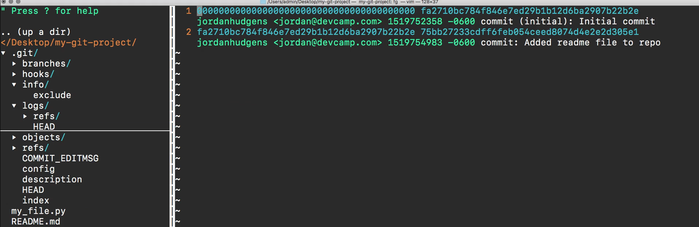
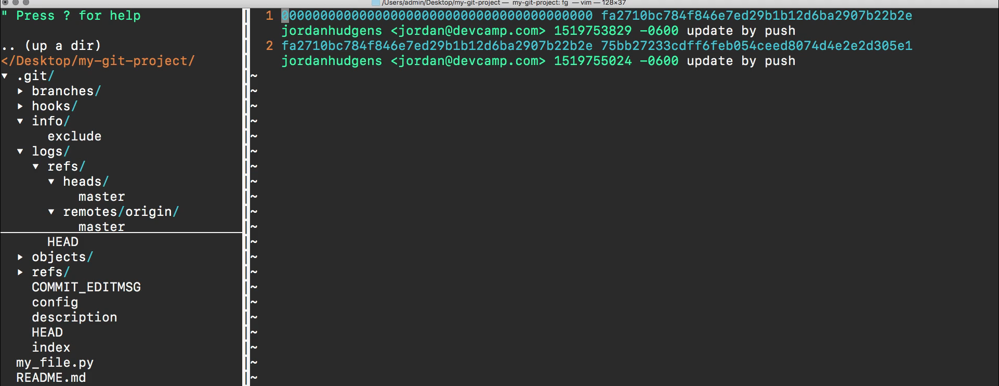
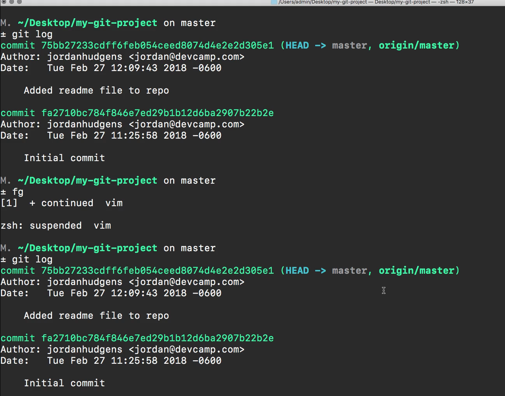

# 05-004\_Git-2\_dotGit\_Directory

## MODULE 05-004:    Git (2)

### The .git directory

***

1. **`./.git/` is Hidden by Default**
   * View with `ls -la` or enable hidden files in your editor
   * Contains all Git metadata for your repository
2. **Key Files/Directories**
   * `HEAD`: Points to current branch reference
   * `config`: Repository configuration (remotes, merge settings)
   * `hooks/`: Scripts that run at Git events (pre-commit, pre-push)
   * `objects/`: Stores all repository content (commits, trees, blobs)
   * `refs/`: References to commits (branches, tags)
3. **Commit Tracking**
   * `logs/`: Stores commit history (`git log` data)
   * `COMMIT_EDITMSG`: Last commit message

### How Git Uses This Directory

* All Git commands interact with these files
* `git status` checks the `index` file
* `git log` reads from `logs/` directory
* Branch pointers are in `refs/heads/`

> **Note**: You rarely need to modify these files directly - **use Git commands instead.**

##

* **Hooks**: Custom scripts in `.git/hooks/` can automate workflows
* **Config**: Edit `.git/config` for repository-specific settings
* **Recovery**: The directory contains all data needed to restore repository state

***

### Video lesson Speech

In this guide, we're going to walk through the git directory also called the .git directory

***

I have the text editor open right here and as you can see on the left-hand side I have a directory here that is called .git

if you do not see it in your own file system that means that you need to turn your hidden files on so whether you're going through this in Visual Studio code or in a tool like Sublime Text each one of those has the ability for you to show or hide hidden files any time that you have a dot right in front of a directory or in front of a file. The way that the file systems work is they think that you want to hide those. Usually, they're files that you won't work with quite often and so they just can't take up space, but in our case, we actually want to look for those.

So if you do not see that in your system, then pause the video, and then go find out whatever setting you need to change regarding whichever editor you're using so that you can see the hidden files and then come back and we're going to walk through this git directory.

Now that you can see those files I want you to open it up and we're going to go one by one down the line and see what each one of these elements represents.

Now we're not going to go into a lot of detail because some of them such as branches right here. This is going to be covered in a later section. But right now the goal of this guide is to give you a high-level overview on what this directory does so here we have branches and as you can see we don't have anything inside of it if I try to open it up it's empty. Later on, when we get into actually adding branches right now we just have our master branch. We don't have any featured branches but when we do this is where you could add some additional configuration items.

Going down the line next is hooks we have an entire section dedicated to hooks. But for right now you can think of a hook as a tool and a process that can be run at a specific time. So for example, if I come down here and each one of these are just samples none of these are actually live but let's say that I have a pre-push type of hook. What I can do here is and you can read all of the comments here to see other different use cases.

But what I can do is I could actually add any type of custom logic inside of here and we're going to go through this and add some code in this later on in the course. Imagine that your company has a strict set of rules on when you can push code up and so there could be all kinds of different checks like running a linting system or just all kinds of different things that you want to occur prior to actually allowing that individual to push something to the remote repository. This is something that happens quite a bit on larger projects or whenever you're working with a remote team.

And so what you can do with a pre-push hook is you can just establish all of these rules and all these processes that you want to occur. And then before the individual is allowed to push up to that remote repo all of those processes are going to occur. And if none of that makes any sense to you don't worry. Right now I just want to give you a preview of what hooks are where they are located inside the directory and then, later on, we're going to walk through some examples on how we can use them in a real-world scenario.

So I'm going to close this directory and a few of these other ones don't have a lot of items so if I click on info and exclude this is going to show all of the items that are excluded from the version control system and later on we're gonna see how we can add to that list for secure security purposes. Moving down next we have an interesting one so if you remember back when I typed git log before and I can do it right here. So if I type git log this shows all of the commit messages that we've made so far to version control.

Now if I come here you may notice that if I click on HEAD this is actually the log. As you can see right here

we have the initial comment which is this first one and then we have our next one where we added the ReadMe file to the repo. So if you're curious on where all of that information is stored like where you're able to see the full git log and everything that has occurred in the application you can always come right here and check that out and you can go into refs and see where we're at which is the current head location and then remote to be able to see the remote master

and some of this is getting into much more advanced topics inside of using git and combining it with tools like GitHub so don't worry if some of this is fuzzy. The goal of this is I want to show you that there's not black magic that is occurring with all of the things we're doing. So when I type git log all it's doing is it's going into this git log directory here and it's just pulling in all of the data that is all that's happening.

And part of the reason why I'm wanting to walk through this is because when it comes to how I personally learn I've discovered that the more I can pull back and increase the transparency on advanced topics especially something that I don't understand yet. So if I were learning git I would want to understand all of the inner workings of it. So when it comes to git log I want to go see where that's actually being pulled from. And because once you have that understanding it's going to make it a lot easier for you to use it as a tool. So I'm going to close that logs directory and the info one and a few of these are going to be directories that you'll never use so objects are just going to be the objects in memory. You're never going to really have to worry that I've never had to touch that in all the years I've used git.

Then with refs, this is kind of similar to what we had with logs except these are the actual references. So we have our reference to the head this means that this is the very latest version in our program.

And this set of numbers and letters.

This is the commit ID of where we're currently at.

Then we also have access to see our origin master right here. And then if you ever add any tags to your repository then they would be right here.

Moving down the line the next item is the commit message

and this is helpful so if you want to just quickly come and see what the last comment was and if you want to edit that message then you have access to it right here. Now, this is going to be rare it usually isn't something that you really need to do unless you made a mistake with what you were describing with your commit message. Then you usually are not going to have to do this but it's a good idea to know where it is stored.

I definitely recommend for you to keep on going down the list here and see a few of the other items so we have our configuration file. This shows a few things that you usually are not going to have to deal with like the repository format version, logging all of the updates, and different things like that.

But if you move down to that line 8 and line 11 this is very helpful.

So right here you can see where your remote is that points to origin so you can see that this is our GitHub reference and then you can move down and see our origin is remote and then also right here you have what are merge variables. So it's going to be pointing to refs/heads/master which if you look down and let's open this up at the same time. So if I change into the directory and then let's go into `.git/refs/heads/master` you can see that that is just pulling that git commit right there.

So all that merge is doing is it's pulling that git comment Id so that master knows the ID that it is on. And a few of these other ones like description, this is if you wanted to add a description to your repo, then head is once again the reference to where we're currently at it's the same reference ID right here.

And then lastly index this as you may notice is our status message where it gives us our details on saying what branch we're on, it checks to see if it's up to date, and also checks to see if there's anything to commit.

Now one thing that you may have noticed as you went through this is pretty much all of the important key elements that we just walk through in that directory are things that we have access to at the command line. So this is anything from git log all the way through to being able to see what the commit messages are like this and where the head the latest version is pointing to.

What that means is usually you don't have to come into this directory and it's a reason why it is hidden. But with that being said I think whenever you're learning something new especially something like this where git can be very intimidating if you've never used it before. I really think it helps when you can pull back the curtain a little bit and see what those commands are actually doing.

Hopefully that has helped to help you understand git a little bit more because you're able to see that really at the end of the day all of those commands what they're doing is they're simply going into files they're pulling information like the commit messages and the references in the remotes all of those things are managed controlled and stored inside of this git directory.

Usually, you're not going to have to deal with it very much later on in the course when we go into more advanced concepts such as Hooks we will come in here and we will add some custom code. But for right now just know that you can treat this kind of like a reference for information in case you forget some of the commands you can always open up the directory go inside and see what you need.
