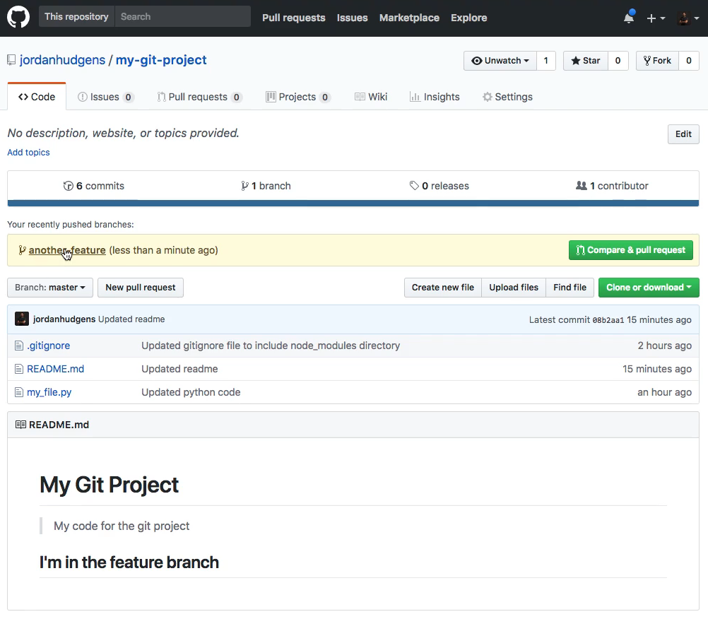
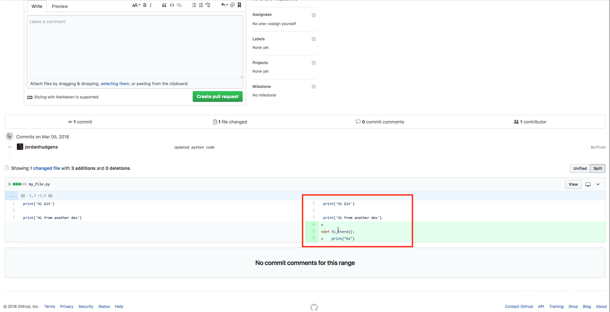
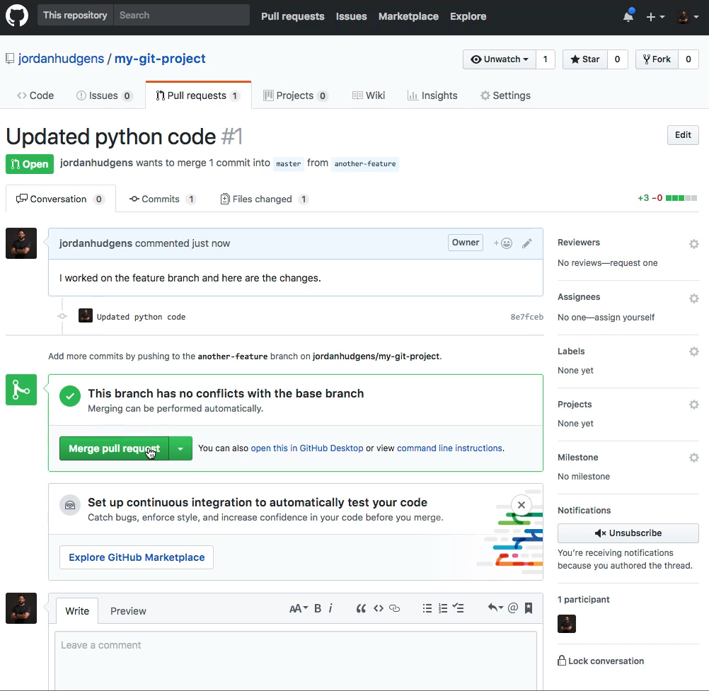
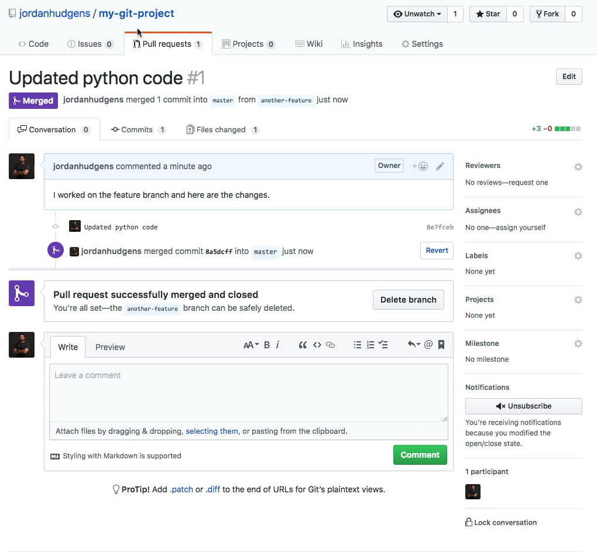

# MODULE 06-011:    Git (3)

### Push - Merge

***

## Why Push?

When you create a branch locally (e.g., `feature-branch`), it only exists, locally, on your machine. To collaborate or sinchronize your work, you need to **push** it to the remote.

```bash
git checkout -b feature-branch
```

#### Creates a new branch locally

```bash
git push -u origin feature-branch
```

Pushes the branch to the remote repository (`origin`) and sets upstream tracking.

* `-u` (or `--set-upstream`) links your local branch to the remote one, so future pushes/pulls don’t need the branch name.

After pushing, the branch will appear in GitHub under the branch dropdown.

***

## Making Changes

Let’s simulate a code change:

```python
def hi_there():
    print('Hello World')
```

```bash
git status
git add myfile.py
git commit -m "Add hi_there function"
git push
```

This pushes the commit to the `feature-branch`.

***

## Merging via GitHub (Pull Request)

Once pushed, GitHub allows you to **create a Pull Request (PR)** to merge your branch into `main` or `master`.

1. Navigate to your repo on GitHub.
2. Click **"Compare & pull request"** next to your branch.
3. Review the diff (changes).
4. Add a PR title and description.
5. Click **"Create pull request"**.

If no conflicts, GitHub will show:

> “This branch has no conflicts with the base branch.”

6. Click **"Merge pull request"** → **"Confirm merge"**.

Your branch is now merged into `main`.

***

## Merging Locally (Alternative)

You can also merge branches locally:

```bash
git checkout main
git pull origin main   # make sure main is up to date
git merge feature-branch
git push

```

This merges `feature-branch` into `main` and pushes the updated `main` to GitHub.

***

## Viewing Branches

List local branches:

```bash
git branch
```

List remore branches:

```bash
git brach -r
```

View all:

```bash
git brach -a
```

You can switch to any branch:

```bash
git checkout branch-name
```

Or, with Git 2.23+:

```bash
git switch branch-name
```

***

## Quick Recap

| Action             | Command                                        |
| ------------------ | ---------------------------------------------- |
| Create branch      | `git checkout -b feature-branch`               |
| Push branch        | `git push -u origin feature-branch`            |
| Create PR (GitHub) | GitHub UI → "Compare & pull request"           |
| Merge PR (GitHub)  | GitHub UI → "Merge pull request"               |
| Merge locally      | `git checkout main → git merge feature-branch` |

## Best Practices

* Use **Pull Requests (PRs)** for code reviews and collaboration.
* **You can delete branches on GitHub after merging** to keep things clean.
* If working solo, merging locally or via GitHub are both valid.

***

## Video Lesson Speech

So far we've seen how we can use branches to work on features while not disturbing the master branch.

***

But one thing you may notice is even if you type git branch here and you can see that it lists out the two branches in our project. If you switch over to the actual repo here and if you hit refresh if you come down to click on where it says branch master nothing else is here.


And even if I come and type git push and I'm on the master branch if I push this up it is only going to push up the changes that I did on the master.


And so you can test this out by coming and hitting refresh. And this does have the changes you can see the changes we made to the read me. But if you click on branch master and see that it doesn't list out our other branch.


And the reason for that is because GitHub tries to be as efficient as possible. And so unless you are actually and actively pushing up that branch it assumes that you only want to keep it on your local machine. And so the way that you can do it is let's create another branch here just so we get in the practice of it so I'll say `git checkout -b` and we'll say `another-feature`. Obviously, you should be a little bit more explicit when you're doing your own branching but for this one case study, this will work. So let's switch now into any of the files so open up my file and create a function called Hi there and it's not going to do very much except say print hi and that's it.

```python
def hi_there():
    print("hi")
```

And so now if I type git status you can see it's modified that one file. I will add it, commit it with the message and say updated python code. And now the way that I can push this is by typing the code out `git push` and then we need to type `-u`. This is going to set what's called the upstream and we're going to cover what the upstream represents later on but for right now just know that it deals with how we can track our code changes so I'm gonna say `git push -u` followed by `origin` because remember that is the remotes name. So the structure of this is git push those are the first two commands -u sets the upstream tracking, origin is the name.

So if you had a different remote then you'd give a different remote name and then from there just type in the name of the branch so another-feature. And now if I type return it's going to ask me for my passphrase and then it's going to push up the specific branch and you can see it even give some helpful output here where it says new branch another-feature has been pushed up.


so we can come back here and you can see that if you're using it have it's very helpful and it even shows the branches that you have pushed up. So right here you can see it says another feature.



And if you click on this you can also say compare and pull requests.


So I'm going to click on that and if you want to look at the files and the changes you can scroll down on this page and you can see right here this is the exact set of changes that we put into place.



And so if you remember back into the last guide where we walked through how to merge locally and how we were able to take our feature branch and then merge it into the master branch here what we're going to be able to do is merge on Github. And so if you do not like the terminal and you're not really a big fan of having to type and then memorize all of the command line instructions this can be a really nice option for you.

So you can come right here and perform the exact same merge process so where it says updated python code you can add some more details and say I work on the feature branch and here are the changes. And now what you can do is click on Create pull requests so this is going to compare the master branch and then it's going to compare all of the changes that we just did and it's going to check and see if it is possible to merge it in.


So as you can see right here it gives some feedback and it says this branch has no conflicts with the base branch which is master. Which means that we can perform the pull request. So this gives us a little intermediate step to make sure that if there were any conflicts say we and another developer worked on the exact same line of the same file that we could resolve before we tried to merge it into master and we created a problem.



And in a later guide, we're going to walk through what you can do in order to fix a merge conflict because that's something that does happen whenever you're working with git and so in this case, though we're perfectly fine we can merge it in. So I'm going to click on Merge Pull request confirm it and so it has been merged into master.



So if I go back here you can see we are on branch master and if I click on my file this now has our function.


So this is really just a visual form of what we did before. Before we just did it locally but now we pushed up that remote branch and then we merged it in with the master branch. And if you ever want to go back and look at any of your whatever your branches are that you pushed up remotely you can click here where it says branch master and now you can see that we have an another-feature branch right here


so you can click on that and look through the code and everything that I added as I was working on that specific branch. So in review what we walked through was the visual and remote version for performing a merge request directly inside of git.
