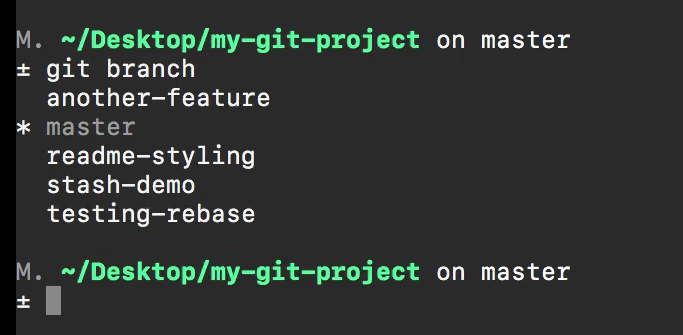
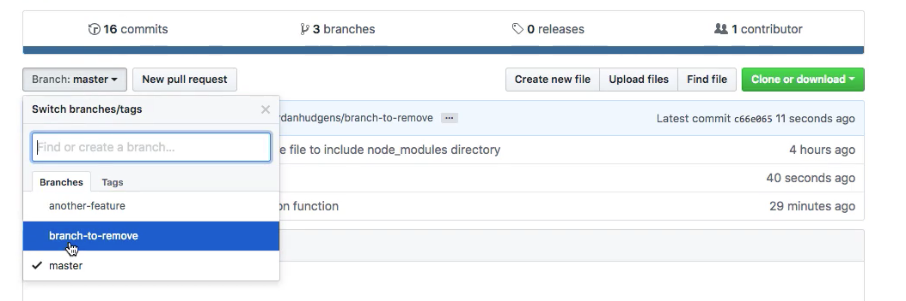

# MODULE 06-015:    Git (3)

### Deleting Local and Remote Branchs

***

***

## Video Lesson Speech

In this section of the course we've walked through how to work with git\
branches and we've seen how we can create branches on our local machines\
how we can push them up how we can merge them in.

***

So in this guide, we're going to extend that knowledge and we're going to see how we can delete branches and we're going to see how we can delete the local branches on the machine as well as remote ones. Now it is considered a best practice that after you are 100 percent done and completed fully merged and with a feature branch that you remove it. The reason for that is because you don't want to run into any future issues where you have conflict. So imagine a scenario where you come down into your local repository and you accidentally check into one of the wrong branches.



Because if you work on an application for years then you're going to have a large number of branches here on your local machine and if you change in the wrong one then that could cause a pretty serious problem especially if you try to merge it into master then you definitely are going to not be having a good day at work. So the way that we can remove this is let's create a new one both locally and then remotely so that we can remove it. So I am gonna say

```bash
git checkout -b branch-to-remove
```


and here I can just make some small change so I'll come down to the bottom duplicate this line and then we'll add it so I'll say

```bash
git add .
git commit -m "updated readme"
git push -u origin branch-to-remove
```

So this is going to push up this branch and we're going to be able to see it on our remote repositories. If I come here you can see that it has the branch to remove.


So I can compare and then simply perform the pull request as we've done before.


Merge it into the master branch and all of our work is done. So imagine that you built out some feature on that branch and it's been merged into master. So we no longer need that at all. But if I come here we have our branch to remove the listed.



We have all of our branches right here and as frustrating as it would be to have a large number of branches on your local machine. Imagine if you had hundreds of branches right here. It made it very difficult for the entire team. So let's see how we can remove this. I am going to start off by removing the local version so I will say

```bash
git checkout master
```

and the way you can remove the local one is simply by saying

```bash
git branch -d branch-to-remove
```

and if I run this it's going to give me a warning. It says deleting the branch, branch-to-remove that has been merged to and it shows where it got merged but not merge to head. All that means is we've not pulled it down but it still did delete it. So if I type get branch you can see is no longer there in our list.


I will run a git pull and this is going to bring it down. So the change we made that we merged in remotely it will bring it down to our local machine.


So everything is now synched up. Our head is linked up right here with our remote. And now if I come here and I refresh the repo everything will be updated and so if I look though I still have that branch to remove and that's because when we delete a local branch it does not go and delete the remote version of that branch. So in order to do that we can run the command 'git push origin' which is an origin is going to just be whatever name of your remote that you're working with. In this case, it's origin and then dash dash delete and then whatever the name of the branch is.


So in this case just to verify, I have `branch-to-remove`. So say `branch-to-remove` run this is going to run through ask for my passphrase and then it's going to go and delete that. So it shows that it deleted `branch-to-remove` if I switch back here and hit refresh. You can see that has now been removed from our list so that is how you can delete a local and remote branch git.
