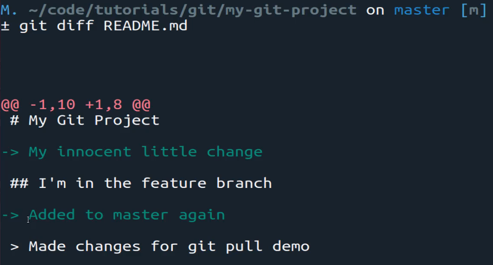
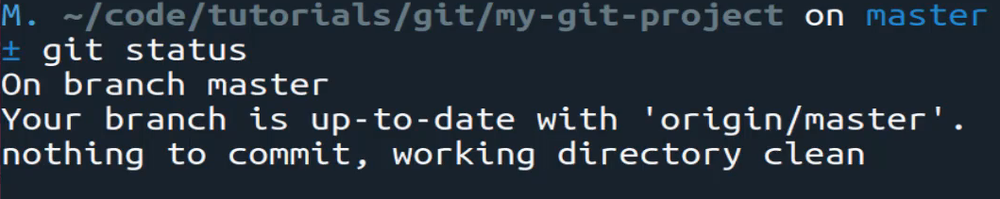
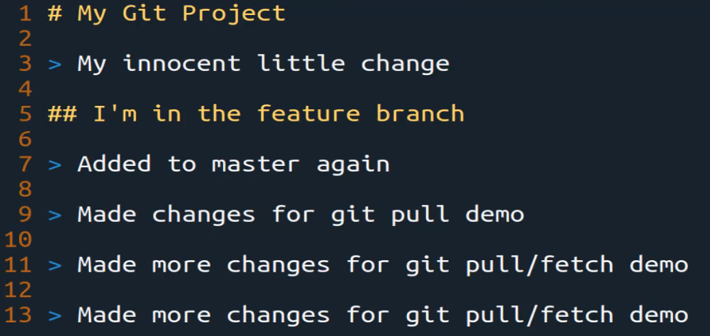
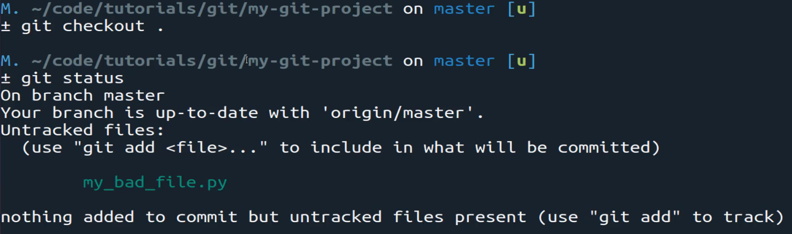

# MODULE 06-017:    Git (3)

### Reverting to the latest commit

***

***

## Video Lesson Speech

In this section of the course I've switched over to using windows and\
then Linux inside a virtual box and I'm doing this mainly just so you\
can see that you can use git and git commands across any kind of\
operating system and platform.

***

It does not matter what language you're working with or anything like that. So we are going to in this section walk through how we can revert code because so far we've talked about the basics such as adding and committing and we've walked through branching. But one of the biggest reasons why you're going to use git is so that you can feel confident that if you make a mistake or you need to revert back that you can do that. That's a whole point of having versions so we're going to walk through that in this section.

So just to confirm that I don't have any pending changes type git status it says I am up to the branch master everything is up to date.

So clear this off and now let's imagine that I've made a few changes so I'm going to go to the readme and I'll delete a few lines and then also open up the python file and I could do the same thing here. It doesn't really matter what changes that you make and so I've made now two changes so if I type git status you can see that two files have been altered.

Now if you want to see exactly what has been altered you can type git diff and you can also pass the name of the file if you only want to see the changes with the one single file. So if I type enter here you can see that what we've done is we've removed these lines and so the way you can tell your colors are going to look different on your system depending on the color scheme of your terminal. But these little minus signs show that we have removed those lines from the file and that is what is different between what code we have now and our latest commit.

Now if we do the same thing and say git diff on the readme you can see that it shows that it has removed this line and this line right here.

So if you're working on a project and you want to see exactly what the key differences are between the latest commit and your new changes using git diff allows you to do that.

Now if I want to revert back. So if I say you know with these changes here. I don't like what's going on with the code base I just want to start over. You can type git check out and we've walked through this before but you can say `git checkout .` and that is going to remove those files or those changes and if you type git status you can see everything is back up to date

If you wanted to confirm it you can open up the readme and see that it reverted back perfectly to the last commit.

Now if you have another situation so imagine that you're working on a feature and you've added a new file. I'm going to create a new file here called `my_bad_file.py` and if I come inside and add something inside of it and then save it and close it. If I type git status now you can see it's added that file

but it is an untracked file so if you tried to perform the same task. So if you said git and then checkout . nothing's going to happen and if you type git status again you can see it still shows my bad file there.

and it's because git keeps track of a few different things in different ways.

It'll keep track of changes to existing files and that's what we did earlier where we added those two changes to the existing files and if you type git checkout . it is simply going to alter and remove those changes and revert back to where you started it to the last commit. But technically this new file we added is not even tracked it is an untracked file.

So if you are in a situation like this where you have other changes you've check those out you're wanting to revert all the way back. All you have to do is remove the file so you can type rm my\_bad\_file.py and now if you type git status it's removed and so the key difference I want you to be able to take away from this is that you can use git checkout to remove the changes and revert the changes.

Then if you have Untracked files so you have new files you've added. You don't have to check anything out because there's nothing to revert. All you have to do is delete those files and git status gives you an idea of how to do that.

So that is how you can revert back to a previous commit and throughout the rest of the section, we'll work through different ways that you can do with this kind of work even if you already have committed and you need to revert back to a previous point in the version history.
