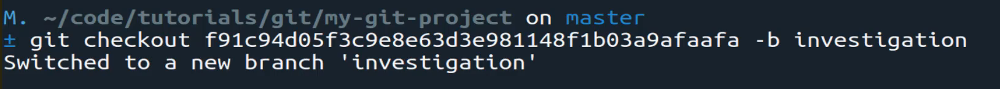
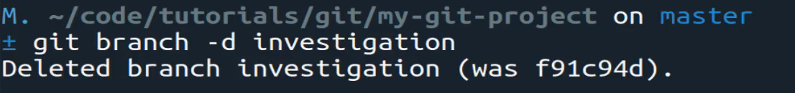
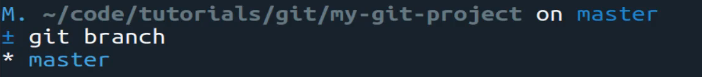

# MODULE 06-019:    Git (3)

### Reviewing a Version commit

***

***

## Video Lesson Speech

So far in this section of the course, we have learned how we can revert\
back to a previous comment and we've also walked through how we can\
revert a file entirely back to a previous version.

***

In this guide, we're going to extend that knowledge and we are going to see how we can go and look at our code in a previous version so not just a single file. So in the last guide, we saw how we were able to go and cherry-pick a specific file and bring it back into our current time and see how we can work with it and then add it to the master branch and push it up.

Imagine a scenario where you don't really know the way the entire project looks, you may not know the specific file that you want to go back in time and change and instead you want to look at the entire project at a different point in time and so we can do that as well. So I can first verify that I don't have anything committed right now that I was working on so no we have no changes. And so I believe I still in my clipboard I still have the commit hash so yes I do.

So what you can do is type git check out so everything for the first three commands is the same. So we're going to type that command `git checkout` and then the commit hash that commit ID for where we're wanting to go look into and I'm not and purposefully not saying revert.

Because what we're about to do will not revert the entire project. This is more, simply like the word says, checking something out. So imagine that you have a project and it was working perfectly last week and you have had three commits since then. And so what you want to do is go back and see exactly what the entire project looked like at that point in time. So you are checking it out you're not reverting yet we aren't to that spot yet and going to show you later how you can revert the entire project automatically but for right now this is more of the investigation phase.

So I'm going to come to the end here and I'm going to place all of this code in its own branch and this is considered the best practice for doing this process because we don't simply want to pull everything into the current master branch because the whole reason usually why you follow this process is for investigation purposes. So I'm going to say -b and then I'm just going to call this investigation because that's what we're doing.

So now you can see we've switched to a new branch called investigation and if I open this up you can see that in my\_file.py it is showing the code that we already knew was going to be there because this is what we reverted our one file to. But if we come to the read.me you can see that we only have these 3 lines of code. So this is what the entire project looked like at this point in time.

Now if I quit out of that and type git checkout master and switch to the master branch if we go and look at these files you can see that this is the current stage of the application.

So this is not back at the point in time where our version id was sending us back to. Instead, right now we're looking at the project in the latest comment form and so this is exactly what we are looking to do. The way that you would typically do this is because you don't usually want to simply wipe away all of the previous changes and go back to a previous comment. We'll see how we can do that for when you need to force that.

But usually what you'll do is you'll go through your investigation branch and simply find each one of the changes you make. And then from there, you can follow the process we did in the last guide where you come and you go and cherrypick and revert only specific files from that previous version. And that allows you to avoid a number of pitfalls. For example, making a change in a file that you forgot that you didn't want to make a change in and going back too far in time with your revision.

So whenever you're working with reverting you need to be very careful just because you want to make sure that you're only changing the select files that you really want to and so after you perform that investigation you've brought back your changes from that version to the current project.

Then you can simply go and type get branch -d. This will delete it because you don't want to have all of these investigation branches hanging around and so type that.

And now if you type git branch you can see we only have master back on our local system.

The flow with that just as a review is we found the version of the application that we wanted to go lookout. We checked it out into an investigation branch and then we were able to go through there and cherry-pick the files that we wanted to bring back and then all you'd have to do from that point is go follow the same flow of saying git check out and then you could do my path to each one of those files and then you'd have exactly what you were looking for which is the revision back to the version for any number of files in the project.
