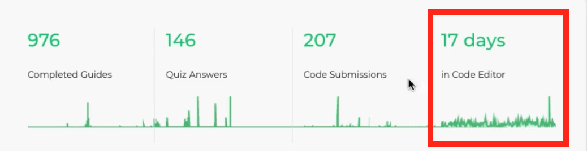
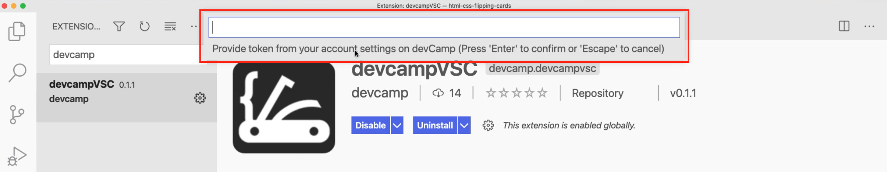

# MODULE 06-021:    Git (3)

### DevCamp VSCode extension

***

***

## Video Lesson Speech

Since logging into your account you may have noticed a empty section\
here an empty chart saying in code editor the time spent in code editor\
and yours right now assuming you haven't already gone through this video\
is at a flat line. It doesn't have any days in the code editor.

***

> Important Note: It's recommended to not install a large number of VS Code extensions at this stage, since they can have some side effects that could interfere with your projects.

Over the next two guides I'm gonna show you how you can actually trigger this, and we're also gonna build a pretty cool little application. It's actually a pretty advanced application, so I'm not gonna have you worry about learning every little piece of it. I'm gonna give you the code, we're gonna walk through what it's doing but then as you go through the course it's gonna start to make more sense. I don't want you to worry or get intimidated about it right now.

Instead, what I wanna do is first give you the ability to have all of this data and this charting data populated. But then also what I'm gonna do is give you an application where you can have your own visualization that shows you your activity level inside of your code editor.

Because it's one thing as and this is something that I've noticed through the years in working with students is it's one thing to go through the material. But the students that really succeed, the students that get the great jobs and that go on to become great developers really spend a lot of time in their code editor.

So I wanted to build a tool that would allow you to visualize that and to track it because everything that you tra

So let's get started. We're gonna start off inside of visual studio code here. Now I want you to go down into the extensions panel, click on that. And then in the extensions marketplace type

So this is gonna install it. And as you can see you have this little check mark that says devCamp down below here,

yours may or may not show up quite yet. You may have to do the next step first. So what the next step is and I have the instructions here in the setup and it says copy your visual studio code token from your account page.

Well, where is that? Well, you can click on this link, click open and it's gonna pop open your account, your personal info.

So right here, you can see you have a API token your visual studio code token, click copy to clipboard and that's gonna place it in your clipboard and then open visual studio code again and then follow these commands. It says open the command palette, and you can do that on Mac typing command and then a P and then a shift. So command shift P and then on windows, shift control P.

So depending on your operating system type those commands. So I'm on a Mac. So I'm gonna type command shift P it's gonna pop this open and then start typing devCamp provide token then hit return. And then up top there, you can see it gives you instructions it says provide the token from your account settings.

So if you copied that to clipboard, just paste that in and then hit return. And then assuming you have this little devCamp check mark here, that means that this is all working.

So the way it works is as you are working on code projects and they don't even just have to be devCamp projects it can be any code project that you are working on. And as long as it has this little devCamp check mark here then as you are on your profile page. So when you go to your account page, you're gonna start to see little bumps in your code editor.

So you can see exactly when you are working and how much you were working. You can start to see patterns on when you're working the most versus when you're working the least, and this little chart is nice, it's very tiny. So it's hard to really get any details in it.

So I wanted to give you something much more detailed. And so in the next guide, I'm gonna show you a full build out where you're gonna build your own charting application. You're really get to code that I wrote because you know, you haven't learned some of the things that you'd need to build this out quite yet but you're gonna get a preview of a lot of the cool things you're gonna learn as you go through the program.

And then right from day one, you're gonna have your own visualization library and your own visualization tool for all of the work that you're doing in your code editor.
