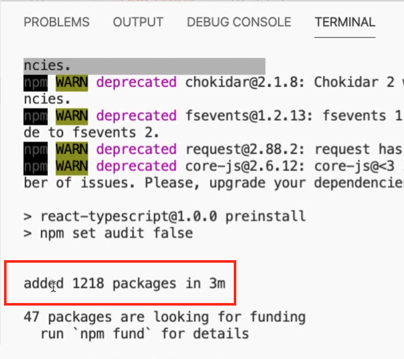
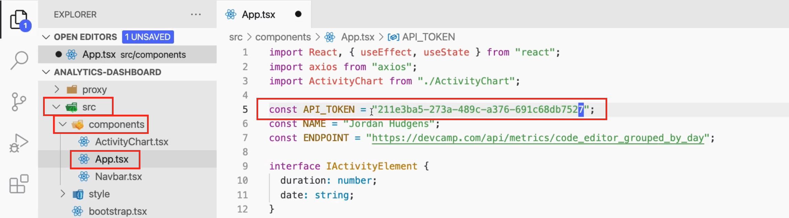
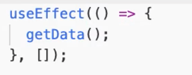
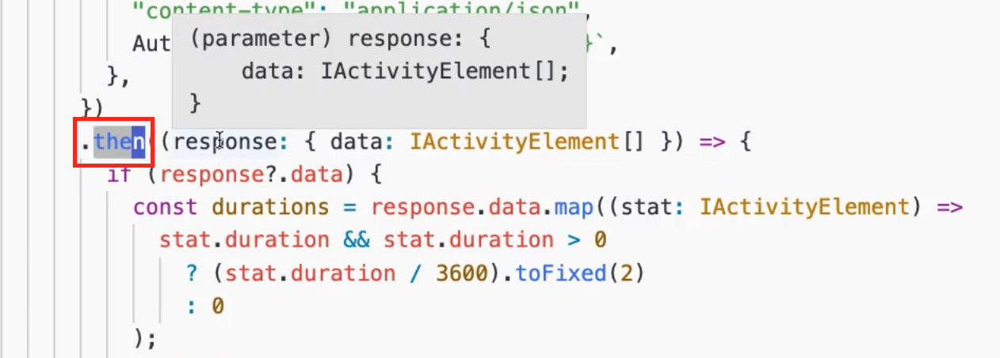
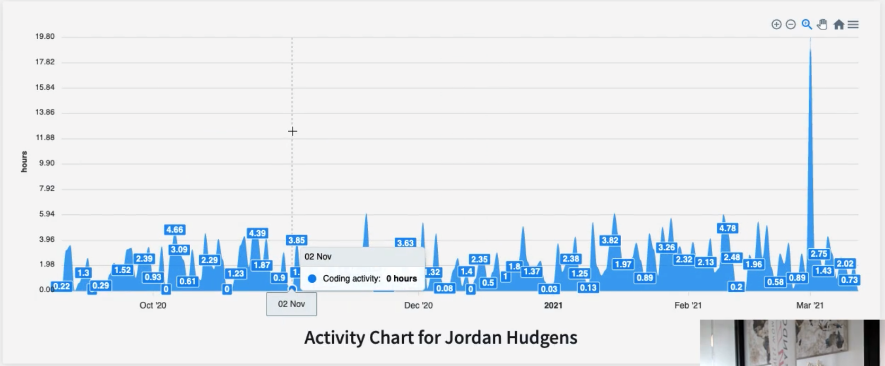
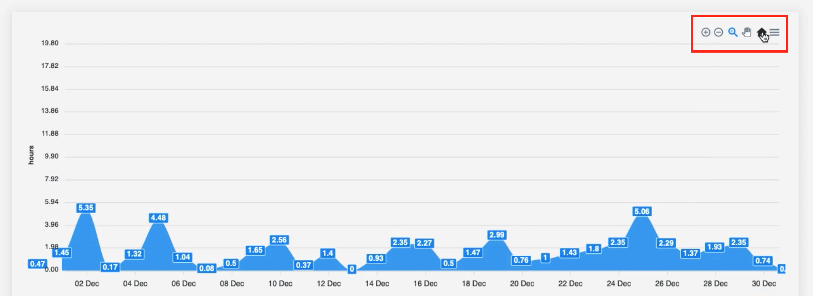
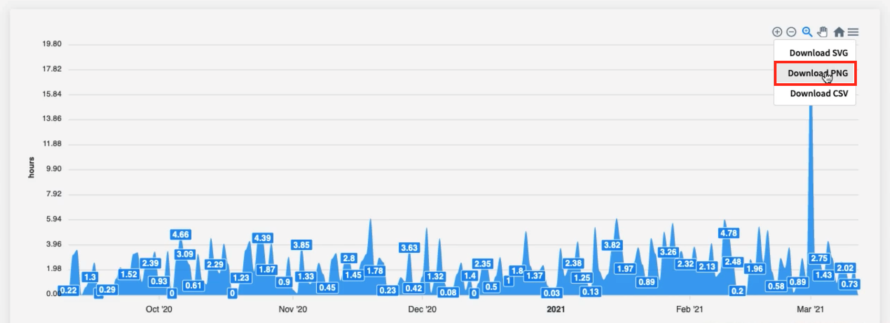

# MODULE 06 - 022:

## Building the Code Editor Activity Visualization Dashboard

***

## Prerequisites

* A DevCamp account with an API token (found in Account Settings).
* Node.js and npm installed.
* Git (optional, for cloning the repository).

## 1: Clone or Download the Starter Code

You can get the project in two ways:

1. **Git Clone**:\
   Run the following command in your terminal:

## 2: Install Dependencies

Navigate to the project folder and run:

This installs all required libraries (e.g., React, Axios) listed in `package.json`.

## 3: Configure Your API Token

1. Open `src/components/App.tsx`.
2. Replace the placeholder `API_TOKEN` with your DevCamp API token (from Account Settings).
3. Optionally, update the `name` field to display your name on the dashboard.

## 4: Run the Application

Start the development server:

The dashboard will open at `http://localhost:3000`.

## 5: Explore the Dashboard

* **View Activity**: The chart displays daily coding hours. Hover over bars to see details.
* **Zoom**: Click and drag to focus on specific date ranges.
* **Download Data**: Use the menu to export the chart as a PNG (e.g., for resumes).

***

## How It Works

* **API Call**: The app fetches data from `https://devcamp.com/api/activity` using your token.
* **Data Processing**: Milliseconds are converted to hours for the chart.
* **Technologies**:
  * React for the UI.
  * Axios for API requests.
  * ApexCharts for visualization.

***

## Troubleshooting

* **Errors**: Ensure no `npm ERR` messages during installation.
* **Empty Chart**: If no data appears, verify your API token and VS Code activity.

***

## Next Steps

* Monitor the dashboard regularly to track coding trends.
* Customize the code (e.g., styling, additional metrics).

***

## Resources

* [GitHub Repository](https://github.com/jordanhudgens/analytics-dashboard)

***

In the last guide, we walked through how we could install the Visual\
Studio Code extension that allows you to start tracking all of the\
activity that you're doing in your code editor and that's gonna populate\
this whole graph here.

***

But I wanna show you how you can actually get much more granular tracking with your own analytics dashboard. And so in this guide, you're actually going to create your very first React application, if you've never created a react application before. And you're going to communicate with an API. So we are going to communicate with the DevCamp server, I'm going to show you how to do that. And we're going to receive data back and we are going to visualize that.

And don't worry, you're not going to build all of that out if you are new to development, that would be quite the task to do it. So I'm going to give you the pretty much all of the code that you need. You're simply going to need to install your own API token and then I'm going to show you how you can run it, and how you can see it in your browser. So let's get started.

We're going to start by going to the analytics dashboard and you can find the link here to the GitHub link and you can get this in the show notes. So there are a few ways that you can pull down this starter code. So if you go to code download here if you have the GitHub CLI set up, then you can copy that.


You can use SSH and you can copy that link or HTTPS. So depending on what your setup is like, you can clone this. And so if you're going to use say SSH, you're going to copy this link and then you'll switch into the terminal. So let me do that right now, I'll set a terminal session up, zoom in so you can see it.

And you would type git clone and then paste the link in there.


And the same thing would be true if you're using the HTTPS version. I'm going to be using the GitHub CLI version. And in that case, you don't have to type git clone, I'm just going to copy this.

Now, if you are still not very familiar with GitHub or you're not comfortable doing that, click on download zip and it will download this entire directory right here. And just like I did, so you can click show in finder, and then inside of your downloads directory, just double click that, and then it's going to open up that entire project for you. So you have quite a few ways of getting access to that.

I'm going to show how to use the GitHub CLI. So I'm just going to copy that. I'm going to switch into my terminal session, paste that in and it's going to clone this repo.


And this is just going to put it at the root of my entire system. You could change into any directory that you want. And so this is where it placed it, and you can see it here analytics dashboard. Let me type LS just so you can see that.


Yeah, so this is the project. So this is what we're going to open up in Visual Studio Code. And this is at the root of my entire system. So I'm going to open up Visual Studio Code, hit command O, or go up to file and open. And then from there, I'm going to go to the root of my system. It's going to be wherever you have yours placed. And I'm going to click on analytics dashboard. And this is going to open up that entire project for us.


Now here, you're going to want to open up your terminal because we're not quite ready to go yet. We first have to install all of the dependencies and we're going to get into this as we go through the course. We're going to learn exactly everything that's happening. So I'm not going to go into detail now. Simply follow along and you'll kind of start to get a feel at a high level for what we're going to be doing in the future.

I'm going to type NPM install. And then what this is going to do is it's going to go out. And these projects, all of these React projects have all kinds of different libraries and third-party dependencies. In fact React itself is a third party library. It's going to be pulling in all of those from external registry. And if that sounds weird, or you've never heard of that thing before, don't worry.

What essentially it means is that, other developers, open source developers wrote code libraries. Really, they just wrote JavaScript files. And they're very helpful JavaScript files that help us automate the types of things that we're doing. So kind of take a very base case example.

Say that some developer out there, he created a function that allowed you to quickly get the average of two numbers. That's pretty basic function. And he was like, Oh you know what? This is a really helpful function. I want everyone to be able to use that.

So he wrapped that up as a external library, he published it on registry and he said, anybody that wants to use this special function that allows you to get an average of two numbers, you can use it. And then what we do is we add that to a list of dependencies and you can see it if you click on the package JSON file here. If you go down to dependencies, each one of these is referencing one of those external libraries. Like you can even see right here, react is one of those libraries.


So all of the power and all of the tooling we get from working with React, it's just really some JavaScript code that other developers wrote and that we're pulling in. And so when we run that NPM install command, that is what we're doing. Is we're bringing all of that code into our project. And we are going to be talking about that quite a bit over the next several months as you go through the program.

So don't worry if that's fuzzy now. I just wanted to give you a high level introduction to what's happening when you run that NPM install command. So this could take a few minutes, so I'm going to fast forward until it's done and then we will see the project.

Okay, if you got a message that looks like this, where it says that a certain number of packages were installed, it took three minutes, gives the full set of packages. And it's perfectly fine if you have some warnings. The only issue is if you have any that say NPM error.



If all of this is working, then we are good to go. I'll close out the terminal and you only have to make one change to get this working. So you're going to go into the SRC directory and then you have your bootstrap file here. You're not going to have to make any changes, this is just the kind of starter file.

And then click on components. And you have your app component here. And you have some things like your name and then your API token. These are the only things that you're going to have to change here. So obviously I'm not going to have to change mine, but as a refresher where you can get this API token is if you go into your DevCamp account and then click on account settings here and then go down. It's the same number you use for Visual Studio Code.

So you can click, copy to clipboard, and then up here at the top, simply select everything that's here and then paste yours in. Mine's exactly the same, so that is my API token.



And then you can put in your name you don't have to make any changes here to the end point. That is the API that we're calling. So if you've never worked or even heard of an API before, what it is is it stands for `Application Programming Interface` which sounds fancy, all it is is a URL.

It's a website URL but it's a website URL that was made specifically for applications to communicate with each other. So this is something that wouldn't work if you went to this URL. This is not for humans, this is for computers. It's for servers and applications, they have their own kind of communication protocol. And in this case what it's doing is we're passing in some security elements. So we're passing in the API token, this is how DevCamp is knowing that I am the one who wants this data.

Now this isn't secure 'cause if it was I wouldn't be showing it to you. This is something if for some reason you just wanted to see my data, then you could use this API token. I don't really care. So this is not something secure. You can't access any other data with this, that's very important, that we're not, when you call this, we're not sending in your personal information.

So this is perfectly fine to be publicly available. I'm even going to show you all of the data that this sends back. It's just a set of numbers really. And then we're going to have this API URL that we're calling. And then down here, this is where the business logic is, this is where everything's happening.

Don't worry if this doesn't make a lot of sense right now. It shouldn't, unless you're already familiar with React but I'll walk through what's happening. We're setting up some variables. These are called state setters and getters. So we're setting up some things that allow us to store and set data here.

In this case, we're setting what's called a series. This is how we're going to be storing the data that's going to be rendered in the chart. Then we're going to set some dates and then we're going to see if it is loading. If the data's loading or if it's done loading. And that's all we're going to do.

Then here, this use effect, this is just a fancy name for setting a automatic trigger. So whenever the site loads up, we want to go get the data.



So here we're calling a API library called Axios. We're saying, I want you to get this end point. Remember this end point is what we set up here. And so I want to get that end point and we're passing in some header data. This is how, remember when I said that API, is the whole point of an API was giving the ability for applications to talk with each other. So in this case, our application here is communicating with DevCamp, which is pretty cool. We don't have to do it, the computers will do it manually for us.

Then what's going to happen is it's going to call DevCamp, it's going to pass in that API token. This is how it knows who we are. And then after that happens, and we even used the keyword then, then what's going to happen is we're going to get an API response back. And this is how we're going to set the data. And then we're going to do some data polishing things that allow us to set the data and store it in the chart.



Don't worry if your eyes gloss over when you look at some of this code. By the end of this entire program you're actually going to be able to write code exactly like this, which if you don't believe me, just give it a little bit of time and it will happen I promise.

So let's do a console log statement here. Inside of here, I'm just going to say API response, and let's just look at the data that we're going to be getting. So I just want to show you exactly what the API is sending back to us.

So I'm going to put the console log statement right after then and right above the if.

#### App.tsx

```tsx
.then((response: { data: IActivityElement[] }) => {
  console.log("API Response", response.data);

  if (response?.data) {
```

Now to get this running because this is a React application, so we're actually going to create this and we're going to have a server running. To do that, open up the terminal, make sure you're in the project and type `NPM run start`. And then this is going to new take all of those dependencies that's going to take our application, and it is going to start the server. And then we're going to be able to go access this in our browser.

So let's open up Google Chrome, go to local host 3000, just like that. And there we are, there is the chart.



So all of this, I already prebuilt for you. So you don't have to worry about styling it. You can do that if you want. You can definitely, all of this code is yours. You can change it however you want. But now what you can see is the comparison between this chart and what you have on your profile. And this is a reason why I wanted to give you your own application. Because here this is a cool little chart to get an idea of how much work you're doing in the code editor.

But right here, this has a lot more data. Here, you're able to see on a very granular basis all of the work that you're doing in the code editor. So say I want to go to Christmas, apparently I was working on Christmas this year. So December 25th, I spent five hours working. And so say that you want to look at a specific date range. Well, this chart gives you the ability to do it.

Say I want to go and look at December of this year. I can go to that area and then click and drag this. And then it zooms in for us, which is pretty cool.


So it gives us the ability to see all the way from December 1st, all the way through the end of the month. And you can see those patterns, see those date ranges on when you were working in the code editor. And this is really helpful. You can click home and it'll return you back.



And this has all of your data that you are going to have. So your chart is going to be really empty because if you just installed the visual code extension, then you might just have one little bump, you might not even have anything.

So what this chart does, is this is something where you can use this for months and even years down the line to start to see trends and analysis you can see, Oh this is a time where I was really working really hard. And then you can think back to that time or maybe even journal and see all of the projects and the progress you were making. And this gives you the ability to have a visualization on all of the work you're doing.

This chart also has some other cool features that you can play with, like say that you wanted to put in your resume. So after all of this is done and you're applying for a job, say you want to put in your resume, all of the work you're doing, and you want to have real data to back it up. Well, if you come up here to the top right hand side, click on menu and click on download PNG.



This is pretty cool it actually gives you an image. It generates an image for you, and you could show this like on your resume or maybe on your portfolio all of the work that you're doing.


So here on the left-hand side you can see the number of hours. So you can see one day I did pull like a 24 hour marathon coding session. That was actually about two weeks ago. But you can see all of that data here and you can get an idea for when you were working and just hopefully it's something that's fun for you, that helps you progress.

Also this project that you have, this gives you a great example to reference. One, for if you ever need to build a chart in your future in any future projects, right here you can actually reference this activity chart right here. So this is something that you can use copy and paste it, put it right in one of your future applications, and you have a really nice chart for you.

Now let's take a look before we end and continue on with the course. Let's take a look at the data. So let's see what you actually have access to and what data is generating this chart. So I'm going to open up the console here.

On a Mac, you can do that with just the keyboard command, `command + option + J` and I'll also let me pop this out just to make it a little bit easier to see. And I'll zoom in. So right here, this console log statement this is what I placed here. So when I put console log I grabbed the data and this is what got rendered out.


So I can click on array. And then here you can see it's just an array of elements ranging from zero to 183.


And you can see it's pretty basic. It's a set of objects. So it is a hundred.


Don't let this get you confused. This isn't sending to arrays, this is simply the way that the browser limits how many items can be shown in a single array. So we're actually only getting one array item and they're just breaking it up so we can see it a little bit better.

So you can see, we have all of the dates from the day that I installed the VS Code extension on my system, which was 9-10 of 2020. And so here we have the date of when I installed it and then the duration. So this is a number of milliseconds, that's a duration.

So if you look through the code of the project, you'll see that I do a translation where I convert the milliseconds into hours. And that's how you're able to see this in hours. But you don't have to worry about any of that. Literally, all that you have to do is put in your name and your API token, install the dependencies and then you'll have this chart.

Then you can reference this anytime. To get it started back up, simply open up this project, type `NPM run start` and then that will start up the server. Go to local host 3000, and then you can see the data. I definitely recommend check in on this every few days or every few weeks. And so you can start to see the patterns of the work you're doing. And so now that you have that, now you have a way to visualize all of the work in your text editor.

## Resources

* [Project source code](https://github.com/jordanhudgens/analytics-dashboard)
