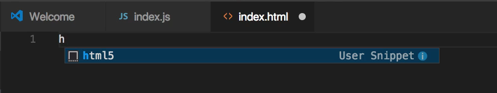
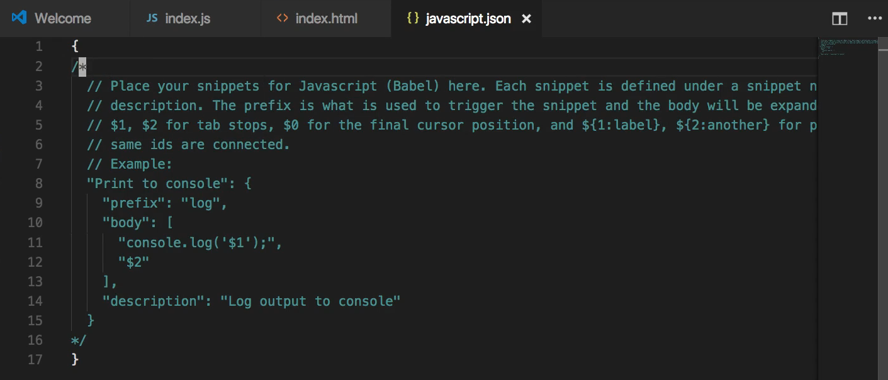
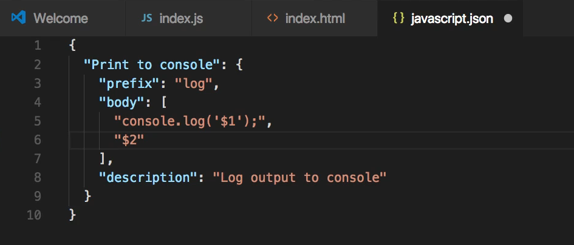
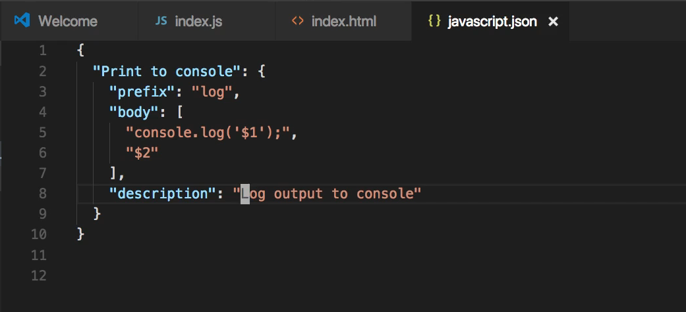
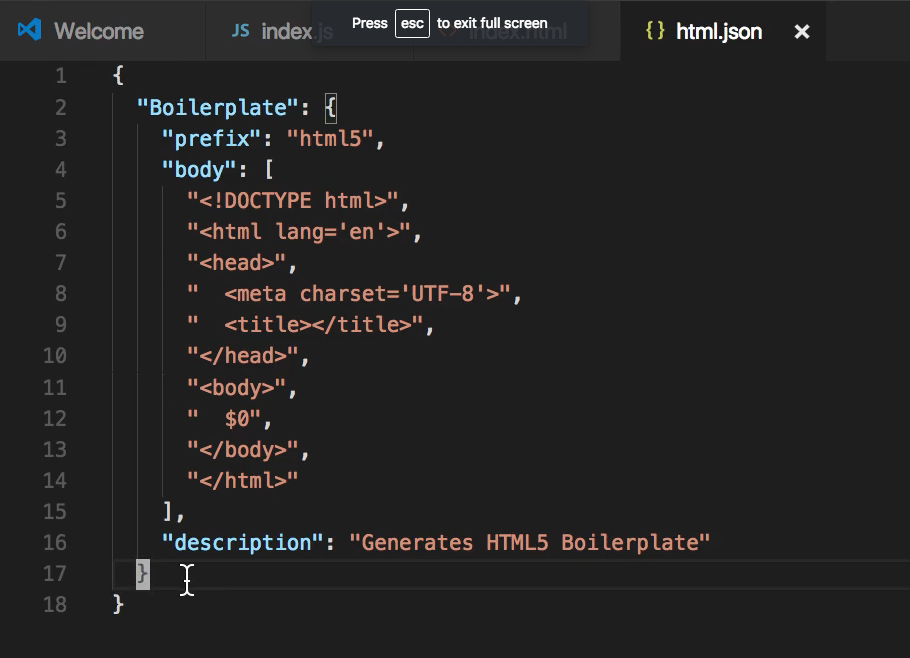

# Module 06 - 109:    Browser Console

## Custom Code Snippets in VSCode

***

1. Code Snippets
2. Creating Your First Snippet
3. Snippet Syntax
4. Language-Specific Snippets
5. More Examples

***

## 1. Code Snippets

Code snippets are reusable code blocks that:

* Save development time
* Reduce repetitive typing
* Maintain consistency
* Can include placeholders and tab stops


***

## 2. Creating Your First Snippet

1. Open VSCode Command Palette (`Ctrl+Shift+P` or `Cmd+Shift+P`)
2. Search for "Preferences: Configure User Snippets"
3. Select language (JavaScript, HTML, etc.)
4. Edit the JSON file that appears

## Snippet Syntax

Basic structure

```js
"Name": {
  "prefix": "trigger-word",
  "body": [
    "Line 1 of code",
    "Line 2 of code $1",
    "Line 3 of code $2"
  ],
  "description": "Detailed explanation"
}
```

### Special syntax

* `$1`, `$2` - Tab stops (cursor positions)
* `$0` - Final cursor position
* `${1:default}` - Placeholder with default value

***

## 3. Language-Specific Snippets

### HTML Example

```html
"HTML5 Boilerplate": {
  "prefix": "html5",
  "body": [
    "<!DOCTYPE html>",
    "<html lang=\"en\">",
    "<head>",
    "  <meta charset=\"UTF-8\">",
    "  <meta name=\"viewport\" content=\"width=device-width, initial-scale=1.0\">",
    "  <title>$1</title>",
    "</head>",
    "<body>",
    "  $0",
    "</body>",
    "</html>"
  ],
  "description": "HTML5 document structure"
}
```

### JavaScript (React) Example

```js
"React Functional Component": {
  "prefix": "rfc",
  "body": [
    "import React from 'react';",
    "",
    "const ${1:ComponentName} = () => {",
    "  return (",
    "    <div>",
    "      ${0}",
    "    </div>",
    "  );",
    "};",
    "",
    "export default ${1:ComponentName};"
  ],
  "description": "Create a React functional component"
}
```

***

## 4. More Examples

### Console Log Variations

```js
"Console Log": {
  "prefix": "clog",
  "body": "console.log('$1:', $1);",
  "description": "Console log with label"
}

"Console Error": {
  "prefix": "cerr",
  "body": "console.error('$1:', $1);",
  "description": "Console error with label"
}
```

### JavaScript Testing

```js
"Describe Block": {
  "prefix": "desc",
  "body": [
    "describe('$1', () => {",
    "  $0",
    "});"
  ],
  "description": "Jest describe block"
}
```

***

## Best Practices

1. **Use Clear Prefixes** - Make them intuitive but not too short
2. **Include Descriptions** - Help remember snippet purpose
3. **Organize by Language** - Keep related snippets together
4. **Use Tab Stops** - Make snippets interactive
5. **Share with Team** - Export snippets for consistency
6. **Regularly Review** - Remove unused snippets
7. **Avoid Conflicts** - Don't use language keywords as prefixes

***

## References

* [Snippets in Visual Studio Code](https://code.visualstudio.com/docs/editing/userdefinedsnippets)
* [Snippet Generator Tool!](https://snippet-generator.app/?description=\&tabtrigger=\&snippet=\&mode=vscode)
* [GitHub - viatsko/awesome-vscode: 🎨 A curated list of delightful VS Code packages and resources.](https://github.com/viatsko/awesome-vscode#snippets)

***

## Video Lesson Speech

In this guide, we're going to walk through how we can create custom code\
snippets in vs code. This is going to be a fun exercise because one of\
my favorite parts of the development process is being able to find fun\
ways of making my work flow even more efficient.

***

If you have never worked with code snippets before I think you're really going to like them. And before we get into how to create a custom code snippet let's first look at how they work inside of the editor itself. So right here I have an HTML5 file open and for me to use a code snippet I simply have to start typing out the keyword and it's called a prefix that I set my custom user snippet up to be.

As you can see I simply started typing H and now it automatically is recommending the HTML5 snippet that I created.



So if I hit return this is going to generate the entire HTML5 boilerplate code.


Now, this is something that is not directly built into the text editor. This is something I added myself and I'm going to show you exactly how to do that and I'm even going to show you how to do it in multiple programming languages so I no longer have to go and type all of this code out from scratch every time I want to use the full HTML5 boilerplate. So I can save this file and now I have access to the full set of HTML5 features.

So now let's walk through and see how you can do this inside of your own system. If you're on a Mac you can come up to the top left-hand side where it says code right here and then go to preferences and then user snippets.


If you are on a Windows or Linux machine then you're going to have a similar but just slightly different looking interface. The key is you want to go to user snippets and from here this is going to pop up a dialog box and it's going to ask you to select a language for this snippet that you want to create.


This is something that I really like about VS Code because it makes it very easy to organize each one of your code snippets specifically by language. So if I start typing in JavaScript it gives me a few different options so it gives me javascript react and then javascript babel. I want to use babel and so if I open that up you can see that it has a full set of instructions already here for me



and the default one is actually pretty cool so I'm going to get rid of this comment here and so get rid of that entire example and the ending comment tag.



And what it does is it actually gives you this default example that you can use as your own personal guide for creating your own snippets and it's called print to console.

I'm going to hit save on this file and because I've uncommented now I can have access to it in my javascript files so if I see right here I have a description of this snippet which is print to console. Then I have prefix, now prefix is the keyword that you want to use that is going to activate the snippet so anytime you want to call this from a file then I'm going to type the word log.

Now you could use anything that you want for your prefixes just be careful in whatever programming language you use to not use some keyword that's already reserved so if you're doing this and say you are are a javascript developer don't use a word function or class. Use something that is not already built into the language so you don't ever have any confusion.

Now from there what you have is a body tag. So this body is the entire body of the snippet and the way that it's structured is the vs code uses what is called JSON. If you've never used it before it is just a javascript object notation file that has a set of key-value pairs. So the very first one is the description then you have prefix it has the value of log and the key is prefix.

Next, you have body. Now this may look a little bit odd if you've never used it before but the way that vs code is structured it is that your body tag can take in a list that takes in this array of items and each one of the items will go on a new line. So their default 1 is going to create a full console log statement so if your javascript developer you're probably very used to typing out console log and then whatever you want to log just like right there. But now what this will allow you to do is to simply type the word log and then it will type the rest of this code for you.

And in addition to pasting the code snippet in it also gives you some more control where you can have some control over where your cursor ends up when the entire snippet has been pasted in.

This `$1` represents where your cursor is going to go. So whenever I type console log my cursors automatically going to be placed right inside of this console log statement.

The `$2` what this represents is that we want to add a new line below. So any time that I type log it's going to paste in console log it's going to place my cursor right here where it says `$1` and then it is going to add a new line right below it you can customize this however you want.

Then right below this is the full description. So the print to console is like the short description and then down here we have this extensive description and it says log output to the console.



So I'm going to save this and I have an index.js file opened right here. So if I come here and simply type log you can see that it by default is looking for that user snippet


And if I hit return you can see that it works perfectly.


I have a console log statement and I can say hi there. Notice how the cursor was placed right inside of the console log statement and that it also added a new line right at the bottom.


So that is working nicely.

So far we've seen one that I premade and then we saw the default one that's used as a tutorial


Now let's create our own custom snippets from scratch. And what I want to do is I want to create a snippet that will create a ul tag so it's going to create a set of bullet points for us. So I'm going to come up to code, go down to preferences user snippets.

.png>)

Let's go to HTML and you can see that here is my boilerplate code



And we're going to replicate this at the very end of the second to last curly brace we'll add a comma because we're going to be adding a new snippet right here at the bottom. And so I'm just going to call the Bullets you can call it whatever you'd like. And then this is going to follow the exact same structure as the snippet above. So I'm giving the short title here of Bullets, then next I'm going to add a prefix. I'll just call it bullets as well for our bullet items and then after that, I need to paste in or I need to add my body.

Now I'm not going to use a string instead I'm going to use an array. Remember that each one of these array items is going to be on a new line. So the very first one is going to be `<ul>` then a comma after that line. And then inside of that, I want to add a couple of spaces, so the way that vs code works with snippets is it respects your spaces so if you put in a couple of spaces here in the string it's going to add those spaces right in so we're automatically going to have the correct indentation.

So here I can say `<li>` and then I'm going to add a `$1` and then I'm going to close off that li statement because I want to place the cursor right there. I could also use `$0` and that would work, as you can see that's exactly what I did here in Boilerplate. And so it's going to look for the first element that it finds with that dollar symbol. And then I want to close this off so I'm going to have a UL closing tag and that should be it. I just now need to add a description right after this body so now I'll say description and say adds bullet point list to HTML file and that should be it so I can hit save.


Now I should just be able to type bullets in and it should create this entire snippet for me so if I come back to the HTML file inside of this body type bullets and as you can see that worked perfectly


I can say hi there on this line and then create another one here, Hi there again, hit save.


And now just to make sure that this is all working. I'm gonna open up the browser and I already have my index HTML file open I can hit refresh and you can see that that is working perfectly.


We have our full bullet points and we've been able to leverage snippets in order to make the entire process efficient inside of vs code.

## Code

```json
{
    "Boilerplate": {
        "prefix": "html5",
        "body": [
            "<!DOCTYPE html>",
            "<html lang='en'>",
            "<head>",
            "  <meta charset='UTF-8'>",
            "  <title></title>",
            "</head>",
            "<body>",
            "  $0",
            "</body>",
            "</html>"
        ],
        "description": "Generates HTML5 Boilerplate"
    },
    "Bullets": {
        "prefix": "bullets",
        "body": [
            "<ul>",
            "  <li>$1</li>",
            "</ul>"
        ],
        "description": "Adds bullet point list to HTML file"
    }
}


{
    "Print to console": {
        "prefix": "log",
        "body": [
            "console.log('$1');",
            "$2"
        ],
        "description": "Log output to console"
    }
}
```
