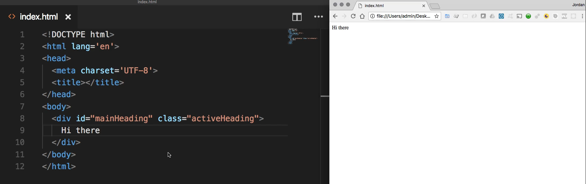
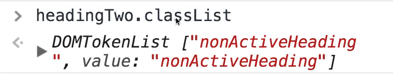
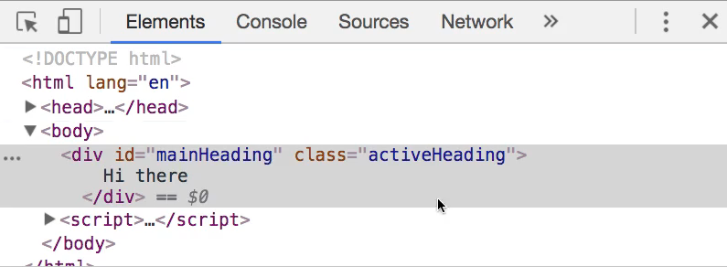
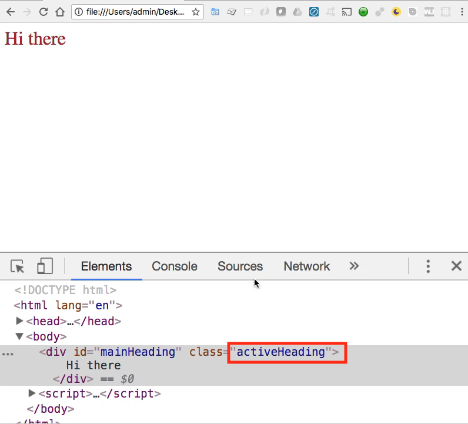
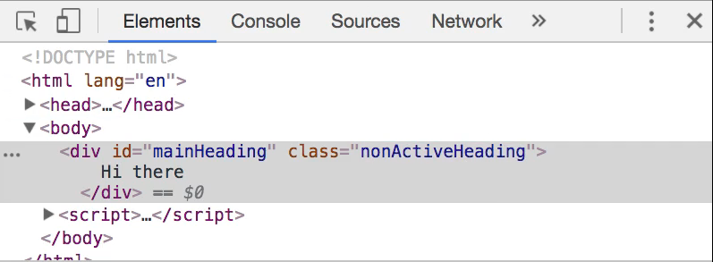
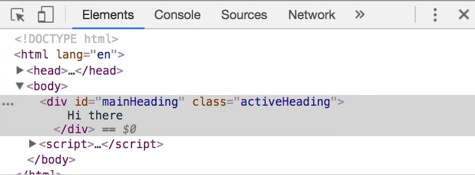

# 06-112\_Adding-Removing\_Classes\_in\_vanillaJS

## Module 06 - 112: DOM Fundamentals

### Adding/Removing Classes in Vanilla JS

***

1. Class Manipulation
2. `Element.classList` API
3. `className` Property
4. More Examples
5. Event Listeners for Class Toggling

***

## 1. Class Manipulation

Class manipulation is fundamental for:

* Dynamic styling changes
* State management in UI components
* Animation triggers
* Responsive design adjustments

***

## 2. Element.classList API

The `classList` property provides methods to work with classes:

Core Methods:

| Method       | Description                     | Example                                   |
| ------------ | ------------------------------- | ----------------------------------------- |
| `add()`      | Adds one or more classes        | `element.classList.add('active')`         |
| `remove()`   | Removes one or more classes     | `element.classList.remove('active')`      |
| `toggle()`   | Toggles a class                 | `element.classList.toggle('active')`      |
| `contains()` | Checks if class exists          | `element.classList.contains('active')`    |
| `replace()`  | Replaces one class with another | `element.classList.replace('old', 'new')` |

#### Features:

* Preserves existing classes
* Multiple classes can be added/removed at once
* Returns a live `DOMTokenList` collection

***

## 3.    `className` Property

The `className` property offers an alternative approach:

#### Characteristics:

* Gets/sets the entire class string
* Overwrites all existing classes
* Simpler syntax for single-class elements

Example:

```js
// Set class (overwrites existing)
element.className = 'new-class';

// Add class (preserving existing)
element.className += ' additional-class';
```

***

### Practical Examples

#### Basic Class Toggle

```js
const button = document.getElementById('myButton');

button.addEventListener('click', () => {

    button.classList.toggle('active');

});
```

#### Conditional Class Change

```js
const heading = document.getElementById('mainHeading');

heading.onclick = () => {

    if (heading.classList.contains('active')) {

        heading.classList.remove('active');
        heading.classList.add('inactive');


    } else {

        heading.classList.remove('inactive');
        heading.classList.add('active');

    }

};
```

#### Multiple Class Operations

```js
const element = document.querySelector('.panel');

element.classList.add('highlight', 'animated', 'fadeIn');
element.classList.remove('hidden', 'disabled');
```

***

### Event Listeners for Class Toggling

Common event types for class manipulation:

* `click` - User clicks an element
* `mouseover`/`mouseout` - Hover effects
* `scroll` - Scroll-based animations
* `focus`/`blur` - Form field interactions

#### Example with Event Delegation

```js
document.addEventListener('click', (event) => {

    if (event.target.matches('.toggle-button')) {

        event.target.classList.toggle('active');
}
});
```

***

### Performance Considerations

1. **Batch DOM operations** - Minimize layout thrashing
2. **Use classList for multiple classes** - More efficient than className
3. **Debounce rapid events** - Like scroll/resize handlers
4. **Cache selectors** - Avoid repeated DOM queries

### Best Practices

1. **Use semantic class names** - `.is-active` vs `.blue-background`
2. **Separate concerns** - Keep JavaScript classes separate from styling classes
3. **Prefer classList over className** - When working with multiple classes
4. **Use CSS transitions** - For smooth visual changes
5. **Consider accessibility** - Ensure UI remains usable after class changes

***

### References

* [Element: classList property - Web APIs | MDN](https://developer.mozilla.org/en-US/docs/Web/API/Element/classList)
* https://javascript.info/dom-attributes-and-properties#property-and-attribute-synchronization
* [8 Ways to Cycle Through Classes on an Element | CSS-Tricks](https://css-tricks.com/cycle-through-classes-html-element/)
* [Inject New CSS Rules | CSS-Tricks](https://css-tricks.com/snippets/javascript/inject-new-css-rules/)
* [Avoid large, complex layouts and layout thrashing  |  Articles  |  web.dev](https://web.dev/articles/avoid-large-complex-layouts-and-layout-thrashing)

***

### Video Lesson Speech

Specifically, we're going to see how we can allow our file to allow our application here to give us the ability to add or remove classes just by clicking on one of the elements. And so I'm going to start off here by creating a basic HTML page and then I'm going to create some divs. So I'm going to have a div here and this is going to have an ID of mainHeading and then it's going to have a class of activeHeading.

And so we're going to inside of this div place some content and it can just be something super basic like Hi there and on the right-hand side here I have the same file open so if I hit refresh you can see it says Hi there.



Not really anything too exciting so let's add a few styles so I'm gonna come up into the head tag here and create a few styles it's not going to be anything too crazy but just enough for us to be able to add and remove styles and to be able to visually see the difference. So I'm going to create a class like we have there in our div of activeHeading and inside of this, I'll add a color, so let's go with firebrick and then font size and for the font size I'm going to go with 2em so it's to be double the normal size which will give us kind of a heading and then after that I just want to have a cursor and make it a pointer. So now if I hit save and come over here and hit refresh you can see we have selected this element and when I hover over it is now a cursor it has the color and the font size.


Now I also want to be able to have a non-active heading and so I'm going to and actually let me just copy everything here because it has got a few similarities and then a few key differences. So this one I'm going to say nonActiveHeading and for the color instead of firebrick let's go with something quite a bit different like cornflowerblue. And then for the font size, we'll make this for 4em so this is going to be quite a bit larger and will keep that pointer. If I come over here and switch this to be nonActiveHeading.

We can see what this class will look like so if I hit refresh you can see that it is working properly.


and so right now we have our two classes and then we have our HTML div which is inside of the document object model but right now if we want to change how this div looks we need to hardcode this value in. So what we're going to walk through is how we can leverage javascript to be able to change this class simply based on clicking the element right there.

And so I'm going to come down below the body tag here and create a script tag and this is where we're going to place all of our Javascript. So here I'll say const heading. And now let's run our query and if you're ever curious on how to run the query you can come to the javascript console and you can say something like document and then go with your query in the last guide we used to get elements by class ID but right now I'm going to for the sake of demonstration. I'm just using a regular ID so I can see a document get ElementById and then pass in the name of the element. So right here that's going to be mainHeading and if I run that you can see that that brings our div.


So this is working properly so I can just take this exact code right here and I can use this and set this inside of the variable. So now I have a const heading so we have a variable called Heading and it is bringing in that values so it's bringing in that entire div. So now what I want to do is I want to set up what is called a click handler and so because we're wanting to handle a click that is the best option right here. So I want to capture every time that this is clicked and I want to perform some action.

There are a number of ways of doing that, we're going to walk through them in subsequent videos. But for right now I'm going to simply call this element that we've selected which is that div element and then I'm gonna say on click and so as you can see there are a number of values whenever you just type on if you have the autocomplete IntelliSense from whatever your text editor is.


You can have onboard, onactivate, on all kinds of things. Right now I just want to have onclick and what onclick does is you pass it a function and so let's give ourselves a little bit more room here so it can be in the center of the page. And so for onclick I'm going to store or pass in a function, so I'm gonna say equals and then I'm gonna use an arrow function here so I don't want to pass in any parameters and then use the arrow syntax and so now we have our onclick.


What this means because this may look a little bit weird too if you've never seen it before but all that we're saying right here is that we've selected the heading and then any time that that heading is clicked. I want you to do everything inside of here so we're passing in a code block and so whatever set of processes we want to take place. We want that to happen whenever something is clicked whenever this heading is clicked. In this case, you start off with the conditional, and even before I get there let's actually test this to make sure that this is working. So let's not get too far ahead of ourselves so I'm going to say console log and say I was clicked. hit save and now if you come and hit refresh here to clear this out and if I click on this you can see that that is working. Every time I click on it says I was clicked.


So our click handler and our query are working properly.

So the other thing that we could do here is we could add a conditional. And so I'm going to say if the heading and then I can get the class list. And so if you are just curious on how I'm doing this all you have to do is run the exact same code that we had right here. So if you remember we typed `document.getElementById('mainHeading')` just like this and that gave us exactly what we wanted. We could store it in a variable called Heading if we want to. So I could say const heading and actually, headings are even declared because we have it right here. So let's just call it headingTwo just to make it easy.

So headingTwo and so now, if you want to see what's available for headingTwo, you can just click it and then you see that it's our div and there are a number of attributes here that we have available to us such as class list so I can type dot class list and that is going to give us a dom token list and so it's showing us that right now the nonActiveHeading is inside of the class list.



And as you may also notice it gets returned in an array actually. So if I clear this out what I could do is I can actually check to see if the class I'm looking for is included inside of those classes that are there. And so I can say in this conditional if heading.classList and I'm going to use just some pure Javascript code here and say contains and from there I can pass in activeHeading. And so what this is going to do is it's going to go through that array that gets returned and it's going to go through that array classes and it's going to say is there a word in there? Is there a string in there called activeHeading?

Because if there is I want to perform one process and if there's not I want to perform a different process so I'm going to say if the heading contains active heading then from there. Then what I want to do is I want to add and then remove a class and let's come up to our div and take it back to our start state which is going to be where it actually starts with active heading and then from here.

There are going to be two processes that we want to take place so I'm gonna say `heading.classList.remove`.

So all we're doing is we're working with an array right here so we can remove items and add items to that array.

So here I'm going to say remove the activeHeading and then I'm going to add the nonActiveHeading so I'm gonna say add nonActiveHeading. And so that is what we want to happen. So if we come here you hit refresh. So right now we have our active heading and if we click "Hi there" now it's working so this is working perfectly. If you notice all I did was check to see if the activeHeading was there if so it removes that class name and then adds this one and you can test this out.

Let's hit refresh get it back to where it was and hit inspect and here you can see that activeHeading is the current class.



Now watch what happens when I click on it when I click on it. It removes that class name and it replaces it with nonActiveHeading




and so that is exactly what we're looking for. But now if I click on it again nothing happens and the reason for that is because our conditional is only checking for activeHeading. We don't have any else statement so let's add that now. So you say else and the process is going to be exactly like what we had here except now it's just going to be reversed. So let's get rid of this and say nonActiveHeading. And we want to, in this case, add activeHeading so hit save and now let's hit refresh once again and now it should be toggling so now when I click it, it should add the class of nonActive remove active and then vice versa. So I click it that works click it again that worked again and you can click this a million times it's going to be doing the exact same thing so that is working perfectly.

So you saw how we were able to work with a class list exactly like how we'd work with an array. Now that is one way of doing it before I end this guide I want to show you one other way that might be a little bit easier. And this is something that you can do in this onclick example say that you have a large number of classes so say instead of just activeHeading you may have something that is also you know myCustomHeading and a bunch of other elements and you don't want to mess with those. And that's perfectly fine in that case what we did here will work.

But if you do have some type of component on the page and you do not care about overriding them what you can do if you do not care about overwriting is you can get rid of all of this and then say Heading.className and so this is going to be a nonActiveHeading copy this down and here it's going to be activeHeading.

```js
heading.onclick = () => {
  if (heading.classList.contains('activeHeading')) {
    heading.className = 'nonActiveHeading';
  } else {
    heading.className = 'activeHeading';
  }
}
```

So if I hit save now if we come back hit refresh I click it and there it's working. So notice how the behavior is completely identical. Where the difference says is if you had other elements so if I come back up here and say some other class name to start off by save here and hit refresh. You can see that I have activeHeading and someOtherClassName set and that's perfectly fine.


There are many times where you need to have multiple classes inside of one component but if I click this notice how it's gone. It only sets nonActiveHeading there.



If I click it again it no longer has that custom one so that is a scenario where that would be a bad idea.



Now if I comment this out and come back here and select all of this I'm going to put it back where we had before. Hit save and now if I come back and hit refresh if I click on it you can see that it didn't get rid of someOtherClassName.


All it did was it looked at the stack of classes so it looked at it like an array because that's how it's treating it here it's just treating it like a traditional array and all it's doing is saying OK I want you to remove that activeHeading and then I want you to add nonActive and completely ignore this other value.

Click it again and we still have our other custom class name there and so that's a reason why I wanted to show you both options. If you have a situation where you do not have any other class names you don't care about overwriting them. This is probably a little bit easier to read and so this is something that I would go with if I had a single class name I just set the entire class name equal to the value I want.

```js
 heading.onclick = () => {
    if (heading.classList.contains('activeHeading')) {
      heading.className = 'nonActiveHeading';
    } else {
      heading.className = 'activeHeading';
    };
  }
```

But if you do have other elements to keep in mind and that you don't want to override then this is how you can do that.

```js
  heading.onclick = () => {
    if (heading.classList.contains('activeHeading')) {
      heading.classList.remove('activeHeading');
      heading.classList.add('nonActiveHeading');
    } else {
      heading.classList.add('activeHeading');
      heading.classList.remove('nonActiveHeading');
    };
  }
```

So in review what we've done in this guide is pretty impressive what you now know how to do. This is a very significant portion of what you need to know in order to work with JavaScript in the browser and that is that we created a full HTML document. From there we were able to select items using getElementbyId we're able to select the heading item there. Then we created a click listener where we were able to toggle different classes on the page just based on the user behavior.

So very nice work if you went through all of that.

### Code

```html
<!DOCTYPE html>
<html lang='en'>
<head>
  <meta charset='UTF-8'>
  <title></title>
</head>

<style>
  .activeHeading {
    color: firebrick;
    font-size: 2em;
    cursor: pointer;
  }
  .nonActiveHeading {
    color: cornflowerblue;
    font-size: 4em;
    cursor: pointer;
  }
</style>
<body>

  <div id="mainHeading" class="activeHeading">
    Hi there
  </div>

</body>

<script>
  const heading = document.getElementById('mainHeading');
  heading.onclick = () => {
    if (heading.classList.contains('activeHeading')) {
      heading.classList.remove('activeHeading');
      heading.classList.add('nonActiveHeading');
    } else {
      heading.classList.add('activeHeading');
      heading.classList.remove('nonActiveHeading');
    };
  }


  heading.onclick = () => {
    if (heading.classList.contains('activeHeading')) {
      heading.className = 'nonActiveHeading';
    } else {
      heading.className = 'activeHeading';
    };
  }
</script>
</html>
```

***

### Coding Exercise

With pure JavaScript, rekmove the class "active" and replace it with "disabled". Hint: _You don't need any if - else statements_

```html
<div id="heading" class="active">
    "Do, or do not. There is no try."
    - A little green Jedi
</div>
```

```js
//Heres some starter code
let heading = document.getElementById('heading');

//Write your code here
```
