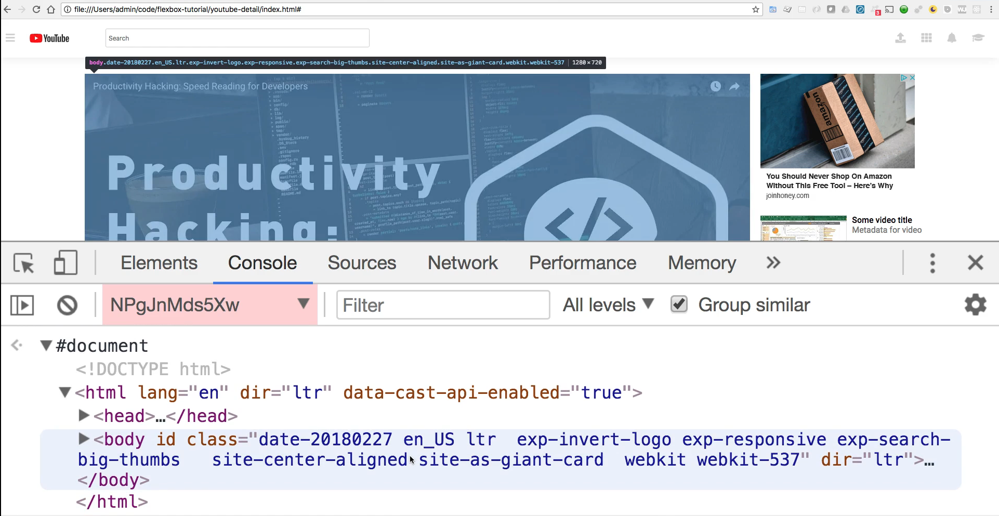

# Module 06 - 113:     DOM Fundamentals

## `window.` VS `document.` diferences

***

1. Core Concepts
2. Hierarchy Relationship
3. Key Properties and Methods
4. Practical Usage Scenarios
5. Working with iframes

***

### 1. Core Concepts

While `window` represents the browser environment, `document` represents the page content.

The window object exists at a higher level and contains the document as one of its\
properties, along with other browser-specific features.

### The Window Object

* Represents the browser window/tab
* Global object in client-side JavaScript
* Contains all other global objects (document, console, etc.)
* Manages browser-level features

### The Document Object

* Represents the loaded webpage (DOM)
* Child object of window
* Provides access to page content and structure
* Entry point for DOM manipulation

***

## 2.    Hierarchy Relationship

**Window (Global Context)**\*\*\
├── document (DOM)\
├── console\
├── location\
├── history\
├── navigator\
└── ...

`window.document` is the same as `document` - the window reference is implicit

***

## 3.     Properties and Methods

### Window-Specific Features:

| Feature               | Description               |
| --------------------- | ------------------------- |
| `window.alert()`      | Displays alert dialog     |
| `window.innerWidth`   | Viewport width            |
| `window.location`     | Browser address bar URL   |
| `window.history`      | Browser session history   |
| `window.setTimeout()` | Executes code after delay |
| `window.localStorage` | Browser storage API       |

### Document-Specific Features:

| Feature                     | Description           |
| --------------------------- | --------------------- |
| `document.getElementById()` | DOM element selection |
| `document.querySelector()`  | CSS selector lookup   |
| `document.createElement()`  | New element creation  |
| `document.title`            | Page title            |
| `document.cookie`           | Page cookies          |
| `document.URL`              | Current page URL      |

***

## 4.     Practical Usage Scenarios

### When to Use Window

```js
// Browser viewport dimensions
const viewportWidth = window.innerWidth;
const viewportHeight = window.innerHeight;


// Navigation
window.location.href = 'https://example.com';


// Timers
window.setTimeout(() => {

    console.log('Delayed execution');

}, 1000);


// Storage
window.localStorage.setItem('key', 'value');
```

### When to Use Document

```js
// DOM Manipulation
const header = document.getElementById('header');
const buttons = document.querySelectorAll('.btn');


// Content Modification
document.title = 'New Page Title';


// Element Creation
const newDiv = document.createElement('div');
document.body.appendChild(newDiv);
```

***

## 5.     Working with iframes

Special considerations for iframes:

* Each iframe has its own `window` and `document`
*   Parent window can access iframe content

    ```js
    const iframeWindow = document.getElementById('myFrame').contentWindow;
    const iframeDoc = iframeWindow.document;
    ```
* Same-origin policy restricts cross-domain access

***

## Performance Considerations

1. **Window Operations** are generally faster than DOM operations
2. **Minimize DOM Access** - Cache references to frequently used elements
3. **Batch DOM Changes** - Reduce reflows and repaints
4. **Debounce Window Events** - Like resize or scroll handlers

## Best Practices

1. **Explicit References** - Use `window.` prefix for clarity in global scope
2. **DOM Ready** - Wait for `DOMContentLoaded` before DOM manipulation
3. **Cleanup Listeners** - Remove window event listeners when unused
4. **iframes Sparingly** - They create separate document environments
5. **Feature Detection** - Check for window properties before use

***

## References

* [Window - Web APIs | MDN](https://developer.mozilla.org/en-US/docs/Web/API/Window)
* [Document - Web APIs | MDN](https://developer.mozilla.org/en-US/docs/Web/API/Document)
* https://javascript.info/document
* [Constructing the Object Model  |  Articles  |  web.dev](https://web.dev/articles/critical-rendering-path/constructing-the-object-model)
* [Same-origin policy - Security on the web | MDN](https://developer.mozilla.org/en-US/docs/Web/Security/Same-origin_policy)

***

## Video Lesson Speech

So far in this course whenever we wanted to select something on the web page we've used something like document and then getElementById and then we were able to find the element. That is perfectly fine and that's going to be something that you're going to be using quite a bit if you're using vanilla javascript.

Now another thing that you may not be aware of if you've never used it before is above the document tier. So above the document hierarchy is something called the window. So if I say window here you'll see that this returns a Window object.


And if you expand and scroll down you'll see this is actually a pretty massive object. There are all kinds of things they will find in here, one very notable one is actually the document. So right here when you're working with the document you're actually working with the document that is nested inside of the window.


And just for Intuitive purposes, javascript gives you the ability to simply call the document, and then it automatically knows that you mean the document that is inside of the window object. And so if you want to test this out just like we ran `document.getElementByClassName` and then we passed in topics like we've done in previous guides and this returned an HTML collection of all of the divs with each one of the topics.


As a quick aside in different parts of this course, I've mentioned how because this has the brackets that it's an array, technically it is not an array, it's what's called an HTML collection it's very similar to an array and you can use it in a very similar manner. But there are a few javascript functions and library methods that you can't use it on such as something like the map methods and filter and some of the reduce items that they need to work with an array. You can always convert this directly to an array and so that's just a quick aside just in case you have heard me call it an array it's mainly because you can pretty much use it the same way you can iterate over it with for each and you can search for elements in it you can get the length but it is a very subtle difference.

Getting back to the main point on the difference between window and document. So you saw how we were able to do this, if I were to call up that same code and say `window.document` and run the same thing you can see that we get the exact same HTML collection back and so the window does nest the document inside of it. And so we're able to use this shorthand where we can call document and it references everything on our webpage. So why are we going through this? Well, there's a couple reasons, one is that if you are working with alerts those are actually found inside of the window object. So if I click the window object and scroll down you can see that if you need to work with alerts that is technically considered inside the window not in the document.


So that's where you'll have an alert pop up on the page such as something like this, so `alert('hi there')` and when it says hi there up here. This actually lives inside of the window and not the documents.


So that's one thing to keep in mind if you're having to manipulate the alert. Another reason and this is a very key reason that I've run into in the past and it can be a little confusing if you've never done it before. Is this page here doesn't have any Iframes. An Iframe is where you can embed another website inside of yours and so if I switch to another page. This isn't YouTube if anyone has gone through the Flexbox course this is the capstone project for the Flexbox course where we recreate YouTube and this is an actual embed and YouTube uses an Iframe embed. So this is an Iframe inside of our HTML site and so if I call window here like normal so if I use a window document and I see what's inside of this document. As you can see when I highlight this is everything we'd expect it's our doctype HTML our body and it's highlighting everything up here.


So this is our document.

But now let's go and inspect our Iframes. If I click on inspect and click on the Iframe and it shows exactly where that resides in the HTML


It happens and what the browser does whenever you bring an Iframe in this frame lives outside of the document. And so even when you come to the console you can see it's no longer saying top. Now has this weird little hash


Let's try to run that same code again. So if I say `window.document` now it acts like it's the same. But look at this, now it's no longer highlighting the entire site. Instead, it is highlighting only the frame and if I click on this it is now bringing me not the head that we had before and the body tag here is just for the Iframe it is just for the embedded video that YouTube is sending us.



And so this gives you the ability to treat an Iframe very similar to how you treat your own documents or if you need to change values on there or anything like that then you need to highlight it you need to, typically the way you would structure is you'd wrap it up in some type of div and then you can traverse through that and then grab this secondary window object. So from a visual perspective, you can see how it work the entire window itself is the window object and this is where you'd be able to perform tasks such as seeing the width of the window object to see if the user is on a smartphone or a tablet or if they're on a full desktop browser like I am here.

And so that that encompasses everything that you see here the document is the actual HTML file they get sent whenever it communicates with the server so when you communicate the server it sends that HTML document that resides within that window object. And then when you're working with an Iframe such as an HTML embedded video.

Now it's sending a window even though it looks like it resides in the document. It actually is outside of it it's outside of the document's scope because technically this is its own website. And so this has its own set of window properties and so here we have a window here and inside of this is its own document and then we have our wrapper window that contains the main document and so they can be treated independent of each other. And so that's the main set of key differences between the window and the document.
