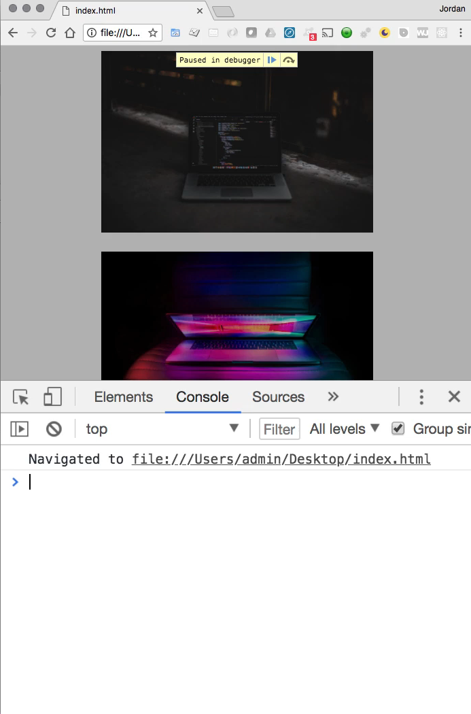
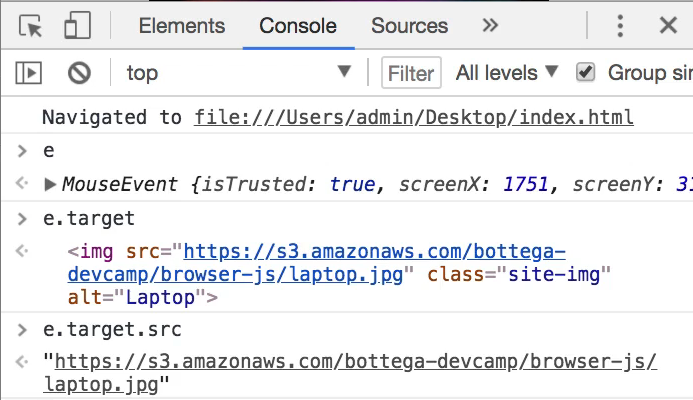

# Module 06 - 115:    DOM Fundamentals

## Event Listeners

***

1. Core Concept
2. Event Types Hierarchy
3. Key methods and Properties
4. Practical Usage Scenarios
5. Advanced Techniques

## 1.    Core Concepts

Event listeners are the foundation of interactive web applications.

They allow JavaScript to "listen" for user interactions and respond accordingly.

* Attachable to any DOM element
* Can respond to various event types (clicks, hovers, keypresses, etc.)
* Enable dynamic, responsive user interfaces
* Execute callback functions when events occur

***

## 2. Event Types Hierarchy

**Common Event Categories:**

1. Mouse Events
   * `click`, `mouseover`, `mouseout`, `mousedown`, `mouseup`
2. Keyboard Events
   * `keydown`, `keyup`, `keypress`
3. Form Events
   * `submit`, `change`, `focus`, `blur`
4. Window Events
   * `load`, `resize`, `scroll`

***

## 3. Key Methods and Properties

### Event Listener Methods:

| Method                  | Description                             |
| ----------------------- | --------------------------------------- |
| `addEventListener()`    | Attaches an event handler to an element |
| `removeEventListener()` | Removes an event handler                |
| `dispatchEvent()`       | Triggers an event programmatically      |

### Event Object Properties:

| Property           | Description                      |
| ------------------ | -------------------------------- |
| `target`           | Element that triggered the event |
| `type`             | Type of event (e.g., "click")    |
| `clientX/clientY`  | Mouse pointer coordinates        |
| `keyCode`          | Which keyboard key was pressed   |
| `preventDefault()` | Stops default browser behavior   |

***

## 4.    Practical Usage Scenarios

### Basic Click Event Example

```js
const button = document.querySelector('#myButton');

button.addEventListener('click', (event) => {
      
    console.log('Button clicked!', event.target);

});
```

### Hover Effects with Mouse Events

```js
const images = document.querySelectorAll('.site-img');

images.forEach(img => {

    img.addEventListener('mouseover', (event) => {
        const caption = event.target.nextElementSibling;
        caption.classList.add('show');
    });

    img.addEventListener('mouseout', (event) => {

        const caption = event.target.nextElementSibling;
        caption.classList.remove('show');

    });
});
```

### Event Delegation Pattern

```js
document.querySelector('#parent').addEventListener('click', (event) => {

    if (event.target.classList.contains('child')) {
        console.log('Child element clicked');

    }
});
```

***

## 5.     Advanced Techniques

### Custom Events

```js
// Create and dispatch custom events
const customEvent = new CustomEvent('build', { detail: { time: Date.now() } });
element.dispatchEvent(customEvent);

// Listen for custom events
element.addEventListener('build', (e) => {

    console.log('Custom event triggered at', e.detail.time);

});
```

### Once Option

```js
// Listener that automatically removes itself after first execution
button.addEventListener('click', () => {

    console.log('This will only run once');

}, { once: true });
```

***

Performance Considerations

1. **Event Delegation**: Use parent elements to handle events for multiple children
2. **Debouncing**: Limit rapid-fire events like scroll/resize
3. **Cleanup**: Remove unused event listeners to prevent memory leaks
4. **Passive Events**: Mark scroll/touch events as passive for better performance

## Best Practices

1. **Use Semantic Event Names**: Choose the most specific event type needed
2. **Separate Concerns**: Keep event logic separate from DOM queries
3. **Early Removal**: Clean up event listeners when elements are removed
4. **Error Handling**: Always account for potential null elements
5. **Accessibility**: Ensure keyboard equivalents for mouse events

### Common Pitfalls

1. **Memory Leaks**: Forgetting to remove event listeners
2. **Too Many Listeners**: Attaching individual listeners to many elements
3. **Event Bubbling**: Not understanding propagation phases
4. **Scope Issues**: Losing `this` context in callbacks

***

## References

* [Event reference | MDN](https://developer.mozilla.org/en-US/docs/Web/Events)
* [EventTarget: addEventListener() method - Web APIs | MDN](https://developer.mozilla.org/en-US/docs/Web/API/EventTarget/addEventListener)
* [Creating and triggering events - Event reference | MDN](https://developer.mozilla.org/en-US/docs/Web/Events/Creating_and_triggering_events)
* https://javascript.info/events
* https://javascript.info/event-delegation

***

## Video Lesson Speech

We're going to see how we can listen to events that occur in the browser and then have those start processes in our code.

And so right here in the browser I have a couple image elements and so these are pretty basic and I have some CSS here one declares that the width of the images should be 400 pixels and then inside of it I have a container class and then some image overlay elements.


So right here what I have and what we're starting off with is an image description so you can imagine the way that this is eventually going to work once we build the feature out is when we hover over the image. This image description is going to appear right here so it's going to be an overlay this will be something you will most likely have to build in some form or another.

And so what we're going to do is we're going to leverage event listeners in JavaScript so that they look for a hover event and then they start a process. In this case, they're going to add the class that is going to show that image overlay but before we get into that let's first take a look at how event listeners work with kind of a hello world example. So what I'm going to do is I'm going to grab this top element right here so I'm going to grab this top image and so I'm going to create a variable called image and then I'm going to query that image so I'm gonna say `document.getElementByClassName` and I'm going to use both of the queries selectors that we've talked about so far in this section just so you can become more familiar using them.

So I'm gonna say getElementByClassName and you can see that class if you hover all the way over to the right here in the code is called site image and you have access to all of this in the show notes. So we're going to grab that site image class and because we're using getElementByClassName I can just say site-image and then remember that this is going to return an HTML object so this is going to give us something very similar to an array so I only want the first one because I don't want to have to, you know, build out a full iterator and for each loop, I just want to show you how an event listener works. So this is going to grab that first element and we can test this out by console logging this. I'm going to just grab that image and now if I come back here and hit refresh you can see that we have queried that image correctly we have the full HTML image tag it has the URL and the class and the alt text so everything there is working properly.


And notice how I was able to treat this very similar to an array if I would not have had that zero here and if I wouldn't have grabbed that element and then hit refresh. You can see it would have brought back that HTML collection where it would have brought both images but for this case, I just want to bring one so that we can work with it. So get rid of that console log statement.

And now let's talk about how we can work with event listeners, so I'm going to call that image object that I brought in. So this is what I queried and say image dot addEventListener and so event listener takes two elements and if you're using vs code you can see that we have a number of different options that we can go for and what we can add.

So the two elements are going to be the event that we want to listen to and then the second argument is going to be the function. So the process that we want to run if the event occurs. And so if you click down here you can see a full set of options. What I want to do for this first example is I want to listen for the click event.

So essentially what I want is I want to see whenever a user clicks on this image and then I want to run a process after that and so I can say click pass it in as a string and let me get rid of that IntelliSense just so it's out of the way so I'm gonna say click and then I can pass in a function and I'm going to use an arrow function here. So you start off with the parenthesis and the way that this works is I can pass in a variable right here I'm going to call it e.

But you can call it anything you want and I'm going to call it something else in a future example. And so as you can see I have my event listener it's listening for a click and then it is going to give us access to this event. And so this event object this is what we're going to be able to work with. So inside of here let's simply first console.log this out so a console.log(e) and let's see what this gives us access to.

```js
img.addEventListener('click', (e) => {
  console.log(e);
});
```

Now let's come and clear this console out, hit refresh, and notice that nothing got printed out because the image listener is listening for a click on the image. So the only way it's going to do something is if I click on this image if I click on this other image nothing happens. But if I click on this one as you can see we have a spelling mistake, but it did capture that.


So that's good save and now if I come back here hit refresh clear the error out and if I click on this you can see that now we have the event.


So the way that we have access to this if you remember back to when we were using the forEach loop remember when we use for each and with each iteration, we had access to the element that we were looping over. Well with the event listener it's very similar we are calling addEventListener on image listening for a click and then when that click happens that triggers an event. So this event we're listening for actually occurs and then automatically it gives us access to this event. So that's how we're able to put this event variable here and so if we want to work with that then we can simply, in this case, we're console logging but usually, we're going to do something a little bit more advanced with it and we will shortly.

But for right now let's take a look at this so if I click on the down arrow I can see that I have this mouse event and then if I scroll down you can see all of the different attributes you have available to you with event.


So imagine that you're building out a game. You have the ability with these X and Y offsets and these page X and y's and layer x y is if you're building out a game this will perform tasks such as tracking where on the image you are clicking, and so that's a very powerful tool.

Now if you scroll down you can see you have access to all kinds of other attributes. The one that we're going to be working with the most in this guide is the target. So if I click on target right here this is essentially the target that was clicked. And so something you're gonna find yourself typing out quite a bit is something like e or event dot target because whenever you are wanting to work with whatever was clicked on that is how you can access it.

But don't take my word for it, if we come down here and drop into the function for addEventListener and type out debugger hit save and clear the console and hit refresh if you come and click the image this is going to start a debugging session. As you can see here and if you click the console now we can step through the exact stage.



So if you remember back to when we talked about debugging and what this allows us to do is to stop the execution of the program and it places us right inside of this location right where the debugger is. So that means that I can actually call e. So e is event and this gives us access to what we just printed out in the console log statement. And so now if we want to traverse this so if I want to say do e dot and then look for that target I can type of that. So we can treat this exactly like a javascript object and traverse it the same way that we would with anything else.

So here we have clicked on target and now notice this gives us the exact element that was clicked and so we can work with this however we want.


So I could say e.target.src and this gives the full URL.



And so we were able to leverage our event listener watch for when a click occurred on this image and then we were able to perform some task with that. Now, this is a pretty basic example we're really just learning about the data. So let's click out of the debugger and now we're going to walk through an even more advanced example.

I'll place this in the show notes so you have access to it then I'm going to get rid of it.

Now let's walk through an example where we're going to build our hover effects. And so what we're going to be doing you can see that by default we have some image description items here that are hidden. And what I want to build is a feature where when we hover over the image this overlay is going to come right over it.

And so we can do that using pretty much all of the same tools that you already know and so feel free if you really want to challenge yourself feel free to pause the video right now and try to implement this. But don't worry if you can't figure this one out because it definitely is a little bit more on the challenging side if you've never done it before. And so let's walk through this so I'm going to create a variable here called images(imgs) and set this equal to document dot. And this time I'm going to use the querySelectorAll just so you can see me using both of them and then inside of this I'm going to grab that class so I'm going to grab the site image class which if you look at the code you can see that that's what the class is.

So that is going to give me all of the site images and we can test this out by console logging out images so if I hit save come back here hit refresh. You can see that we have our node lists as both of our site images.


So now let's create some event listeners. Now there are two event listeners that we are going to work with and we're going to iterate over them because we want the same process to be added to all of the elements on the page. So I'm going to say I am going to say imgs.forEach and we're going to start off with the argument of img because remember when we iterate over forEach takes two arguments. The first is the item that we're iterating over and then the next is a function. I'm gonna say img and then I'm going to place in the arrow function and then inside of here this is where we're going to add our event listener.

So this is going to apply to the element we're iterating over. So the first time that we loop over it it's going to apply to this first image the second time it's going to apply to this second image. So you say `img.addEventListener` and then the first argument is the type of listener we want to add. So I want to do what is called the mouseover listener and then I can pass in an event and I'm specifically using the word event here. It does not have to be used like I already showed you the letter e. Also worked but I want to show you both of them one because you're going to see a number of different items named either e or event but also so you know there's nothing special about the word event it's simply a convention.

So this is our function which is the second item that we pass to the event listener.

```js
img.addEventListerner('mouseover', (event) => {

})
```

So here I'm going to create another variable so you call it const and then let's call this `captionElement` and we're going to set this equal to the `event.target` if you remember that's what we grabbed last time and now we're going to traverse through the DOM. So I'm going to say dot target I'm gonna look for the parent element and then I'm going to look for the children of that parent element and then I'm going to grab the first one.

```js
const captionElement = event.target.parentElement.children[1];

})
```

Now if that looked absolutely insane to you let's pause it right here and let's actually look at what I am trying to do. So if you come down here to the console we have our node list so we can already see what's here. So if I click on this you can see that I have the site image that is the class.


Now once I grab that and once I've grabbed the target if I want to go to the parent element that means I'm going to go and I'm going to traverse to this container. So inside of this container, this container has child elements it has two of them. One is the image and the other is this div with the description so that is simply going to be returned as an HTML collection and I can treat it very similar to an array so I can use bracket syntax and so essentially all that I'm doing here is I'm traversing the DOM and I'm saying you clicked on this image. I want you to go up to the parent and then I want you to find the second child which is this and then I want you to store that inside of this variable and that's all we're doing.

So now that we have that let's use that new caption element variable and I'm just going to set the class name of that and set it equal to show-img-overlay and that is all that we need to do.

```js
captionElement.className = 'show-img-overlay';
```

So let's see if this is working let's come here to the console, clear it, just so you don't have any distractions. Hit refresh and now if I hover over you can see that that is working and if I do it to the second image it works here as well so this is working perfectly. Or I should say it's working halfway perfectly right now when we hover over the description comes here but then it stays.


What we're going to do now is we're going to use very similar code to what we have here. And now we're going to iterate over we're going to add another event listener but this one is going to be called mouseout. And so this is going to go and it's going to use the other class. So this is going to say hide image overlay. Everything else is the same except we're listening for a different type of event. Mouseover is what happens when you mouseover the element that you're trying to work with mouseout is what happens when the mouse leaves that element.

So if I hit refresh mouseover it's there, mouseout and it's gone and if I come down the second element it's there mouseout and it is gone.


And so you have built an entire overlay system for images just with a few lines of code and you're able to tap into a very powerful feature of JavaScript with these event listeners. This is part of the main set of reasons why people use javascript is because there's not a lot of languages and programming tools out there that give you the ability to have this kind of interaction with the user that give you the ability to check and see okay where is the user's mouse right now? And what kind of behavior and what kind of processes do I want to implement whenever they are making some kind or when they're implementing some type of behavior on the page like we're doing right here? like we're mousing over and at mousing out.

So very nice job if you went through that, that is a key fundamental piece of knowledge when it comes to learning Javascript development. If this syntax looks a little confusing to you do not worry this is definitely more on the challenging side. So I highly recommend for you to go through and create some of your own examples play with it play with some of the other event listeners that are out there and build your own programs and that's going to help you understand the entire set of processes that we're building right here.

## Starter Code

```html
<!DOCTYPE html>
<html lang='en'>
<head>
  <meta charset='UTF-8'>
  <title></title>
</head>

<style>
  img {
    width: 400px;
  }
  .container {
    position: relative;
    text-align: center;
    color: white;
  }
  .show-img-overlay {
    position: relative;
    bottom: 60px;
    font-size: 21px;
    font-family: Arial, Helvetica, sans-serif;
  }
  .hide-img-overlay {
    position: relative;
    bottom: 60px;
    font-size: 21px;
    color: transparent;
  }
</style>
<body>

  <div class="container">
    
    <div class="hide-img-overlay">Image Description</div>
  </div>

  <div class="container">
    
    <div class="hide-img-overlay">Some Other Image Description</div>
  </div>

</body>

<script>

</script>
</html>
```

## Code

```html
<!DOCTYPE html>
<html lang='en'>
<head>
  <meta charset='UTF-8'>
  <title></title>
</head>

<style>
  img {
    width: 400px;
  }
  .container {
    position: relative;
    text-align: center;
    color: white;
  }
  .show-img-overlay {
    position: relative;
    bottom: 60px;
    font-size: 21px;
    font-family: Arial, Helvetica, sans-serif;
  }
  .hide-img-overlay {
    position: relative;
    bottom: 60px;
    font-size: 21px;
    color: transparent;
  }
</style>
<body>

  <div class="container">
    
    <div class="hide-img-overlay">Image Description</div>
  </div>

  <div class="container">
    
    <div class="hide-img-overlay">Some Other Image Description</div>
  </div>

</body>

<script>
  const img = document.getElementsByClassName('site-img')[0];
  img.addEventListener('click', (e) => {
    debugger;
  });
  const imgs = document.querySelectorAll('.site-img');
  imgs.forEach(img => {
    img.addEventListener('mouseover', (event) => {
      const captionElement = event.target.parentElement.children[1];
      captionElement.className = 'show-img-overlay';
    });
  });
  imgs.forEach(img => {
    img.addEventListener('mouseout', (event) => {
      const captionElement = event.target.parentElement.children[1];
      captionElement.className = 'hide-img-overlay';
    });
  });
</script>
</html>
```

***

### Coding Exercise

Make a variable called `collection` then using `getElementsByClassName`, select the second `p` tag with its index value.

```html
<p class="items">Not this one</p>
<p class="items">Pick me!</p>
<p class="items">Not quite</p>
```

```js
// Write your code here
```
