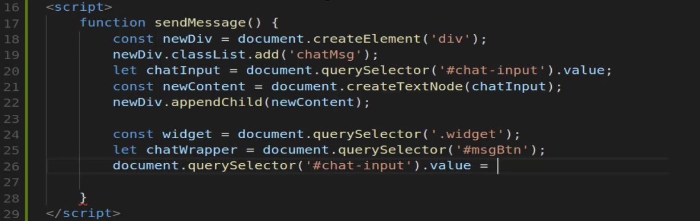

# Module 06 - 122:    JS Applied Exercises

## Creating HTML Elements dinamically

---

1. Core Concepts

2. DOM Manipulation Methods

3. Implementation Strategy

4. Element Creation Process

5. DOM Insertion Techniques

---

## 1.     Core Concepts

Dynamic element creation is fundamental to modern web development, enabling interactive user experiences without page reloads.   

This technique is especially crucial when working with:

- Single Page Applications (SPAs)

- Real-time data displays (chats, notifications)

- Dynamic form builders

- Content management systems

### Advantages

1. **Performance**: Reduces initial page load size

2. **Interactivity**: Enables real-time updates

3. **Flexibility**: Adapts UI based on user actions

4. **State Management**: Maintains application state without refreshes

****

## 2.     DOM Manipulation Methods

### Core Methods for Element Creation

| Method                     | Description                     | Returns          |
| -------------------------- | ------------------------------- | ---------------- |
| `createElement()`          | Creates new DOM element         | Element          |
| `createTextNode()`         | Creates text content node       | TextNode         |
| `createDocumentFragment()` | Creates lightweight DOM subtree | DocumentFragment |

### Element Insertion Methods

| Method                 | Description                   | Position |
| ---------------------- | ----------------------------- | -------- |
| `appendChild()`        | Adds node as last child       | Inside   |
| `insertBefore()`       | Inserts node before reference | Adjacent |
| `replaceChild()`       | Replaces existing child       | In-place |
| `insertAdjacentHTML()` | Parses and inserts HTML       | Flexible |

****

## 3.     Implementation Strategy

### Basic Element Creation Flow

1. **Create Element**: `document.createElement('div')`

2. **Configure Attributes**: `element.classList.add()`

3. **Add Content**: `element.appendChild(textNode)`

4. **Insert into DOM**: `parent.insertBefore(newElement, reference)`

### 

### Chat Message Example

```js
function createMessage(content) {
  // 1. Create container
  const messageDiv = document.createElement('div');
  messageDiv.classList.add('chat-message');

  // 2. Create content
  const textNode = document.createTextNode(content);

  // 3. Assemble structure
  messageDiv.appendChild(textNode);

  // 4. Insert into DOM
  const chatContainer = document.querySelector('.chat-container');
  chatContainer.insertBefore(messageDiv, chatContainer.firstChild);
}
```

****

## 4.     Element Creation Process

### 4.1.     Element Initialization

```js
const newElement = document.createElement('tagName');
```

- Creates a detached DOM element

- Accepts any valid HTML tag name

- Element exists in memory but not in document

### 4.2.     Attribute Configuration

```js
// Class management
newElement.classList.add('className');
newElement.classList.remove('className');

// Attribute setting
newElement.setAttribute('data-id', '123');
newElement.id = 'uniqueId';

// Style manipulation
newElement.style.color = 'red';
```

### 4.3. Content Addition

```js
// Text content (safe against XSS)
const textNode = document.createTextNode('Hello World');
newElement.appendChild(textNode);

// HTML content (use cautiously)
newElement.innerHTML = '<strong>Bold text</strong>';
```

****

## 5.     DOM Insertion Techniques

### 5.1.     Basic Insertion

```js
parentElement.appendChild(newElement);
```

### 5.2.     Positioned Insertion

```js
parentElement.insertBefore(newElement, referenceElement);
```

### 5.3.     Advanced Placement

```js
// Insert adjacent positions
referenceElement.insertAdjacentHTML('beforebegin', htmlString);
referenceElement.insertAdjacentElement('afterend', newElement);
```

### 5.4.     Document Fragments (Performance)

```js
const fragment = document.createDocumentFragment();

// Build complex structure in memory
for (let i = 0; i < 100; i++) {

    const item = document.createElement('div');
    fragment.appendChild(item);

}

// Single DOM operation
container.appendChild(fragment);
```

****

## Performance Considerations

1. **Batch Operations**: Minimize DOM access

2. **Document Fragments**: For multiple additions

3. **Debounce Rapid Updates**: For user-generated content

4. **RequestAnimationFrame**: For visual updates

5. **Detached DOM Trees**: Build complex structures before insertion

## Best Practices

1. **Separation of Concerns**: Keep creation logic separate

2. **Template Literals**: For complex HTML structures

3. **XSS Protection**: Prefer textNode over innerHTML

4. **Accessibility**: Add ARIA attributes dynamically

5. **Memory Management**: Clean up unused references

## Common Pitfalls

1. **Memory Leaks**: Orphaned DOM references

2. **Z-index Issues**: Dynamically positioned elements

3. **Event Listener Buildup**: Forgetting to remove handlers

4. **Layout Thrashing**: Multiple synchronous reads/writes

5. **Selector Performance**: Complex queries in loops

****

## References

* [Document: createElement() method - Web APIs | MDN](https://developer.mozilla.org/en-US/docs/Web/API/Document/createElement)

* [Node: appendChild() method - Web APIs | MDN](https://developer.mozilla.org/en-US/docs/Web/API/Node/appendChild)

* [DocumentFragment - Web APIs | MDN](https://developer.mozilla.org/en-US/docs/Web/API/DocumentFragment)

* [Avoid large, complex layouts and layout thrashing &nbsp;|&nbsp; Articles &nbsp;|&nbsp; web.dev](https://web.dev/articles/avoid-large-complex-layouts-and-layout-thrashing)

* https://javascript.info/modifying-document

****

## Video Lesson Speech

Javascript also gives us the ability to actually add and remove elements directly in the DOM and this may seem like a subtle difference but it's important for a number of different circumstances and if you get into working with frameworks such as Vue or Angular or libraries like React, this becomes a very important topic to understand. 

And so in this guide and actually in the next couple guides, we're going to walk through how we can add and then remove elements or the proper name is to create elements inside of the DOM by using JavaScript and we're going to build out a very basic chat type functionality right here. 

Now obviously it's not going to connect to a back end but what I want to do is I want to create a little form here that a user could come to type a message. Hit submit, and then it would get added but instead of it simply showing itself or being revealed because this is a message that did not exist before.  

What I want to do is actually create the message and we're going to create a new object inside of the DOM and so I think this is a good example for understanding how this works. Let's start off by creating our input so I'm going to create an input here and let's give it an id of, let's say just, chat input. It's just going to be a regular text input and then we're also going to create a button with an id and this button is going to just say msgBtn. 


And then inside of here we'll just say submit and that should be all that we need there. Now later on I'm going to add a click handler here. But for right now let's not worry about it and I'm going to come down into the script tag and create a function here. I'm going to say function and send msg. It's not going to take any arguments and this is going to be the function that we're going to call from within the click handler. So here I'll say on click and then just pass in the send message function.

 

Now lets test this out just to make sure we have everything wired up correctly. So a console log out we'll just say "Hi". Hit save and now let's come back over here and open up the javascript console. 

OK. So now if I click submit you can see it says "Hi". So this is all wired up correctly we have our on click handler it's called lean this and message function. And right now send message is doing nothing more than console logging. So now coming inside of here. Let's actually start building out the structure of our generator.


And so this is going to be an HMTL generator in a sense because we're going to be creating new elements directly inside of the DOM. So let's say I'm going to create a variable here and we'll call it new div and then in order to create a new div the command is, `document.createElement`. So you're going to say create element. This takes in a string and it's whatever element that you want to create.


Now in a later guide, I'm going to show you how you can create other elements. You're not limited just to div's. I'm going to show you how you can create an unordered list and list items and those kinds of things. So now that we have our new div, now we need to add a class to it so I'm going to say `newDiv.classList.add('chatMsg');`. This isn't technically necessary but it's something that I want you to see whenever we're adding in a new item.

I want you to see exactly what's happening at the DOM level and it helps whenever you add a class and because in 99.9% of your circumstances you're going to be wanting to pass in some kind of custom class anyway. So I wanted to show you how you could do that. So this is going to add a class of chat message to our new div and then from here, we need to start putting in some content.

So let's use a "let" variable this say `let chatInput = document.querySelector('#chat-input').value;`.We want to grab the value from that and that's going to get us the value. And if you want to test this out let's just say we want to console.log this and let's make sure we have everything wired up.


So I come over here and say "Hey" and then hit submit and you can see that we now have access to grab that chat input value. So we're in really close here we now have created a new div. We haven't added it to the DOM yet but we've created a new div we've added a class. And then from there, we have grabbed the value from the input. 

So now what I'm going to do is I'm going to create new variable `const newContent = document.createTextNode` Then pass in that value. We are going to pass in the `(chatInput);` value. Then we only have one more step to get this part of it working. So now we call our `newDiv.appendChild` and then paste in that new content value.


Okay so what's going on here? Because if you've never done this before, this may look a little weird but one thing I like about this is this is kind of procedural in nature where you can step through every line of code right here and see exactly what's happening. So we're creating a new div right here online 18 from there we're adding a class to that div.


Then we're grabbing the input value so we're taking it from the form input. Then we are in this line (21) we're creating a text node.  So if you tried to skip this step, if you tried to go 20 line to line 22 what you'd be doing is trying to place just raw text input into the DOM inside of that div and that is not going to work. What you need to do is to create a text node. So now we have converted that plain string into a javascript object with this create text node and then we can use append child. 

And what this is going to do is it's going to slide our new content directly into that new div. Now we actually need to work with the DOM so I'm going to separate this code out just a little bit. Everything right here each one of these lines had to deal with creating that new node but nothing has been added to the DOM directly. So now we need to do that. 

So I'm going to now grab that widget wrapper. So I'll say `const widget = document.querySelector('.widget'); `. Then I'm going to create a chat wrapper. And so what this is going to do is I need to be able to have someplace to put this so I don't want to just put it inside of widget. 

I also need to find in where where exactly in the DOM I'm going to place this and so here I'm going to say `let chatWrapper = document.querySelector('')`.  I'm going to actually reuse the message. So there's a few ways you can do this and in the next guide I'm going to show you what could be an I think a better way of doing it but for right now I just want to focus on the process of generating each HTML nodes. So for this query selector, I'm just going to say msgBtn. 

Now I'm going to say `document.querySelector('#chat-input').value = `



And why am I going to do that?

I'm going to show you here in one second. So what I'm doing here is I want to make sure that whenever I have hit submit that it clears out that button. So if you want to actually see this in action I'm going to save here and nothing's going to happen yet. But just watch what happens if I type something in here and hit submit to CEO. The text is still in place. Well, that is exactly what we're looking to do. 


So I'm going to hit save and then the expected behavior if you've ever typed in a comment box or chat box or anything is when you hit submit. It should clear it out. And so that's all that this line is doing now. One question that you might have and it's a good question is why wouldn't you be able to just use this chat input variable? It's because what this is grabbing is actually the value.

So if you grabbed this chat input down here you said it's chat input and then value equals the empty string then that is not going to work.  And it's because you're just setting that string to empty instead. We want to actually grab the entire input box itself. Now another way of doing this obviously would be to incite a chat input not grab the value and return the entire DOM node but then you'd have to call value from here. 

So I'd rather just say that I want to grab that chat input at this stage and then clear it out. So now let's move down here and I am going to add a little conditional. So lets say `if (document.querySelectorAll('.chatMsg').length > 0)`. So here I'm grabbing all of the elements that have a class of chatMsg So if there are any of these, so I'll check for the length and I'll say if that length is greater than 0 then I want to do something different.


So in that case I want to reassign chatWrapper which is why I made a let variable. I'll say document dot query selector all and then change that to chatMsg and then grab the first one that may look a little weird to you. I'm going to show you in a second why it is necessary. So come down so you can see a little more room and now we're going to actually implement it. So now this is going to be what gets it working.


OK, so long as I don't have any typos I believe this should work here.  So let's type the first message. Now it will not work if you enter because we don't have any listener for a keypress you actually have to click submit. You can see that that worked. Now we have a little bit of issue with where that button is but we can fix that in a second. So a second message and hit submit again.


You can see that second message went and that worked properly. So all of this is being added in now. As you can see insert before it is actually inserting it before this element let's just create an empty div element here that we want this inserted before. So let me just create a div and we'll call this just chat wrapper just like this `<div> class="chat-wrapper"></div>` and it's going to start off as being empty. And now instead of grabbing the button as our initial chat wrapper Now we can just say chat wrapper. 

This should fix our little button issue. So I'm going to come here. First message hit submit. And that worked. Another one and that one's working. So all of this is working which is phenomenal. I love the way you can do this. Now, this used to be so much harder in JavaScript but in the most modern versions, it becomes much more straightforward. And let's go and let me actually stretch this out a little bit so it's easier to see.


Now I want you to notice what's happening here in the DOM because this is probably the most important thing about this entire guide. Notice here how we have classes of chatMsg they're getting added. What happens when I say the third one right here. If I hit submit. You can see a third item has gotten added.  And this did not used to be here. 

We're not doing what we've done before where we had an element there and it was kind of just hidden using CSS and then we toggled the class in order to show it right here actually generating new div elements on the fly. And so this is exactly the kind of thing that you'd want to do if you're building out a full chat application or a commenting application or anything like that where you needed to dynamically add elements onto the page and also notice that we have added that class of chatMsg successfully.


So if you were to do this and the like I mentioned earlier I put this in there not because it was necessary we didn't have to put that in but imagine a scenario where chat message had some kind of style. So it had some theme that you wanted to add to other as a background color a border anything like that you'd be able to do that because here you wouldn't just add empty divs you actually can add them with any kind of attributes just like you had typed them directly into the HTML yourself which is a pretty neat way of doing it. 

So if you look at the structure here you can see that we have our widget. We have our input in our button. Now these ones and then this chatWrapper which I put here at the very end. Now each one of these was there when we started. Then all of these other elements are what got added afterward. Now I'm gonna shrink this down so that we can see everything again.  

And let's talk about this conditional because this might be one of the more confusing parts of the entire program and I'm going to comment it out so you can see what would happen if it was not there. So I'm going to close this out and say this message is first and this one is second now. Notice how our behavior has switched. If you remember back to that first example whenever we added a new message, it popped onto the top and then all of the other messages just simply moved down.


And so in many cases that is the behavior you want. And the reason I did it in this guide is so you could see how you could do it either way because one of the most confusing things (at least for me when I was learning how to do this) is discovering how I could control where an element got added on the page because I don't think that this function insert before is really the best named one because insert before tells me if I say Insert this new div before the chat wrapper that means it should actually go in the DOM before there but that's not the way it works as you notice right here when you click inspect and you can see that at the very top. 

Our chat wrapper here is still on the top and that's the behavior that JavaScript has and our new div's get added there. And so if you want to replicate the behavior of what we had where the newest items stay on the top which I think is a little bit more of the natural way that you'd build out some kind of chat app. Then you need to perform a conditional.  

So what I did here was I check to see if there were any chat messages that were on the page and I did that by running a query selector and saying, "OK check for chat messages and then if the length is greater than 0. Then what I want you to do is override that chatWrapper and set it to the very latest chatMsg". And so what this is doing is if we have multiples here so I have first and then second it what it's doing is. 

Every time this functions running it's going in it's checking. Through each one of the messages if it can't find any messages then it uses that empty placeholder uses that chatWrapper that we created. And then if it does find any at all so as long as that count is greater than 0 it reassigns chatWrapper to the last message and then it inserts that before it. 

So now all the new div's will then be placed on the very top and so that is what I think is probably the most expected behavior. So that is how you can build out an entire function that allows you to generate HTML on the fly with Javascript. 

## Starter Code

```html
<!DOCTYPE html>
<html lang='en'>

<head>
  <meta charset='UTF-8'>
  <title></title>
</head>

<body>
  <div class="widget">
  </div>
</body>

<script>
</script>

</html>
```

## Code

```html
<!DOCTYPE html>
<html lang='en'>

<head>
  <meta charset='UTF-8'>
  <title></title>
</head>

<body>
  <div class="widget">
    <input type="text" id="chat-input">
    <button id="msgBtn" onclick="sendMessage()">Submit</button>
    <div class="chat-wrapper"></div>
  </div>
</body>

<script>
  function sendMessage() {
    const newDiv = document.createElement("div");
    newDiv.classList.add('chatMsg');
    let chatInput = document.querySelector('#chat-input').value;
    const newContent = document.createTextNode(chatInput);
    newDiv.appendChild(newContent);
    const widget = document.querySelector(".widget");
    let chatWrapper = document.querySelector(".chat-wrapper");
    document.querySelector('#chat-input').value = '';
    if (document.querySelectorAll('.chatMsg').length > 0) {
      chatWrapper = document.querySelectorAll('.chatMsg')[0];
    }
    widget.insertBefore(newDiv, chatWrapper);
  }
</script>

</html>
```

****

## Coding Exercise

Add a paragraph tag inside the parent that has the text content: Hello

```html
<div id='parent'></div>
```

```js
// Write your code here
```
