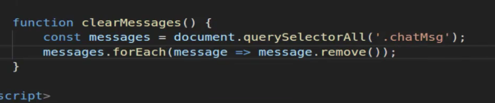

# Module 06 - 124:    JS Applied Exercises

## Removing HTML Elements

***

1. Core Concepts
2. Removal Methods
3. Implementation Strategy
4. Complete Lifecycle Example

***

## 1.     Core Concepts

Element removal is a critical part of dynamic web applications, allowing for:

* Memory management
* UI state changes
* Content updates without page reloads
* Interactive user experiences

### Key Differences

* **Removal** vs **Hiding**:
  * Removal: Completely eliminates from DOM (frees memory)
  * Hiding: Keeps in DOM but not visible (preserves state)

***

## 2.     Removal Methods

### 1. `element.remove()`

```js
// Modern, simplest approach
element.remove();
```

### 2. `parent.removeChild()`

```js
// Legacy approach (still widely supported)
parentElement.removeChild(childElement);
```

### 3. `innerHTML` Reset

```js
// Bulk removal (caution: loses event handlers)
container.innerHTML = '';
```

### 4. `replaceChildren()`

```js
// Modern bulk removal
container.replaceChildren();
```

***

## 3.     Implementation Strategy

### Basic Removal Process

1. Select target elements
2. Iterate through collection
3. Call removal method
4. Handle cleanup (if needed)

### Chat Message Cleanup Example

```js
function clearMessages() {
    document.querySelectorAll('.chatMsg')

        .forEach(msg => msg.remove());

}
```

## Complete Lifecycle Example

### Full CRUD Implementation

```html
<!DOCTYPE html>
<html lang="en">
<head>
  <meta charset="UTF-8">
  <title>Message Board</title>
  <style>
    .message { 
      padding: 10px;
      margin: 5px;
      background: #f0f0f0;
    }
    .controls { margin: 20px 0; }
  </style>
</head>
<body>
  <div class="controls">
    <input type="text" id="messageInput" placeholder="Enter message">
    <button onclick="addMessage()">Add Message</button>
    <button onclick="clearMessages()">Clear All</button>
  </div>
  <div id="messageBoard"></div>

  <script>

    // Create
    function addMessage() {

        const input = document.getElementById('messageInput');
        if (!input.value.trim()) return;

        const message = document.createElement('div');
        message.className = 'message';

        const text = document.createTextNode(input.value);
        message.appendChild(text);


      // Add delete button
        const deleteBtn = document.createElement('button');
        deleteBtn.textContent = 'Delete';
        deleteBtn.onclick = () => message.remove();
        message.appendChild(deleteBtn);

        document.getElementById('messageBoard').appendChild(message);

            input.value = '';

        }

    // Delete All
    function clearMessages() {

        document.getElementById('messageBoard').replaceChildren();

    }

    // Handle Enter key
    document.getElementById('messageInput')

        .addEventListener('keypress', (e) => {

            if (e.key === 'Enter') addMessage();

        });
  </script>
</body>
</html>
```

***

## Performance Considerations

1. **Bulk Operations**: Use `replaceChildren()` for clearing containers
2. **Event Listeners**: Remove handlers before element deletion
3. **Memory Leaks**: Nullify references to deleted elements
4. **Animation Frames**: Use for visual removal effects
5. **Debouncing**: For rapid successive removals

## Best Practices

1. **Confirm Destructive Actions**: For important removals
2. **Accessible Feedback**: Announce changes to screen readers
3. **Undo Functionality**: Consider temporary retention
4. **Batch Operations**: Minimize layout thrashing
5. **Cleanup**: Remove associated data/events

## Common Pitfalls

1. **Zombie References**: Keeping JS references to removed elements
2. **Event Listener Buildup**: Forgetting to remove handlers
3. **Animation Glitches**: Not waiting for transitions to complete
4. **Selector Overload**: Complex queries in removal loops
5. **Focus Traps**: Removing focused elements without managing focus

***

## References

* [Element: remove() method - Web APIs | MDN](https://developer.mozilla.org/en-US/docs/Web/API/Element/remove)
* [Node: removeChild() method - Web APIs | MDN](https://developer.mozilla.org/en-US/docs/Web/API/Node/removeChild)
* [Element: replaceChildren() method - Web APIs | MDN](https://developer.mozilla.org/en-US/docs/Web/API/Element/replaceChildren)
* [Memory management - JavaScript | MDN](https://developer.mozilla.org/en-US/docs/Web/JavaScript/Guide/Memory_management)
* [Chrome DevTools  |  Chrome for Developers](https://developer.chrome.com/docs/devtools/)

***

So I've kept all the same code from the previous guide and this is going to be a pretty short lesson because all we're going to do is we're going to come here and we're going to add a new button. So I'm going to create a new button and I want it inside of this for it just to say `Clear messages` and then I want to give it an `onclick` handler.


So say on click and we can just say `"clearMessages()"` and this is going to be a function that we need to create. Moving down here below the function make sure that you do this after the brackets here. And so when I'm going to do is create a `function` called `clearMessages()`. Once again it's not going to take any arguments and it's going to be a pretty basic one it's actually only going to be two lines of code.

So the first thing we're going to do is we're going to grab the messages so we'll say `messages` equals and then `document.querySelectorAll` because we want to grab all of these elements and then pass in the class. We know that they have a class of `chatMsg` so this is going to return a node list that we can work with.

And so now all we have to do is iterate over them and remove them so I can say `messages.forEach` and then pass in a function. So we have access because we're using for each we have access to that element. Now you don't have to call your's E-L you could call your's element, you could call it anything that you want. You could call it a `message` that would be a very clear description of what it is.

So I'm actually a keep it at `message` and then pass in an arrow function here and then say `message.remove` remove is a function provided to us in the latest version of JavaScript. And now if I hit save you can see that we have this new button here. Now the only reason is on 2 lines is because this is a just a very narrow window. Now let's test it out if I type. Clear message nothing is going to happen. Now let's see if it works with messages there.



So say hi there and submit. And then another one submit that one and the third one just for good measure. And now if I hit clearMessages you can see it goes through and it removes them. Now let's see what's actually going on behind the scenes. If I click on element let's inspect the body and I can shrink this down a little bit and let's go into our widget and I'm going to add another one. As you can see right here it added that div and if I type another one again you can see we keep on adding these divs exactly like how we'd expect.

So what `clearMessages` does is it goes through it selects each one of those elements it iterate over them and then it calls the remove function. So if you look down here. If I type clear messages you can see that it went inside and it popped those completely off of the document object model so they no longer exist.

This is very different than what we've done before where we've simply hidden something where we had some kind of css class and we said okay if you click this button I want you to toggle the visibility on that class. This is very different. Now those elements are completely removed from the DOM and you do not have to worry about them whatsoever and so this is actually a good way of being able to remove any items that you no longer want inside of that document object model.

## Code

```html
<!DOCTYPE html>
<html lang='en'>

<head>
  <meta charset='UTF-8'>
  <title></title>
</head>

<body>
  <div class="widget">
    <input type="text" id="chat-input">
    <button id="msgBtn" onclick="sendMessage()">Submit</button>
    <button onclick="clearMessages()">Clear Messages</button>
    <div class="chat-wrapper"></div>
  </div>
</body>

<script>
  function sendMessage() {
    const newDiv = document.createElement("div");
    newDiv.classList.add('chatMsg');
    let chatInput = document.querySelector('#chat-input').value;
    const newContent = document.createTextNode(chatInput);
    newDiv.appendChild(newContent);
    const widget = document.querySelector(".widget");
    let chatWrapper = document.querySelector("chat-wrapper");
    document.querySelector('#chat-input').value = '';
    if (document.querySelectorAll('.chatMsg').length > 0) {
      chatWrapper = document.querySelectorAll('.chatMsg')[0];
    }
    widget.insertBefore(newDiv, chatWrapper);
  }

  function clearMessages() {
    const messages = document.querySelectorAll('.chatMsg');
    messages.forEach(el => el.remove());
  }
</script>

</html>
```

***

## Coding Exercise

Remove all elements with the class name of `post`. Then inside the wrapper add a `p` tag that has a class name of `flash-message` and says _"Posts coming soon!"_

```html
<div class="post-wrapper">
    <div class="post"></div>
    <div class="post"></div>
    <div class="post"></div>
</div>
```

```js
// write your code here    
```
