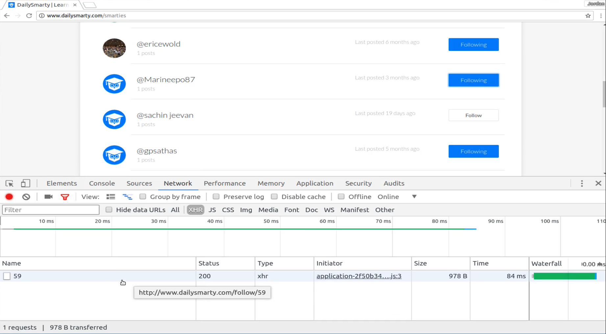
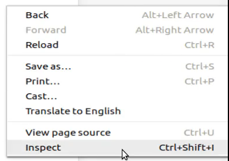
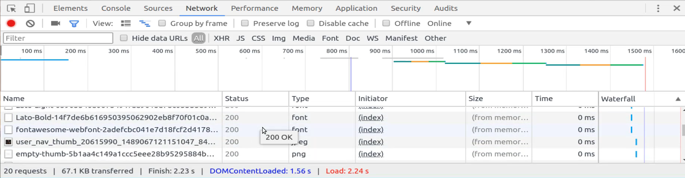
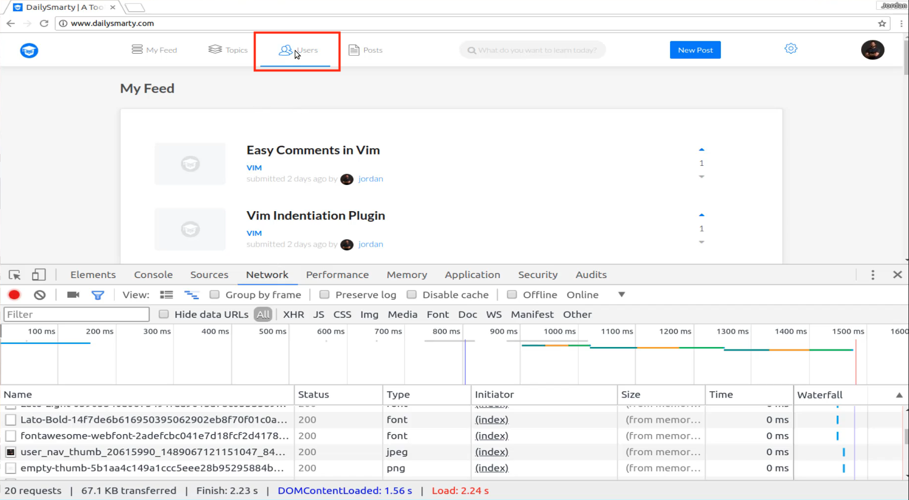
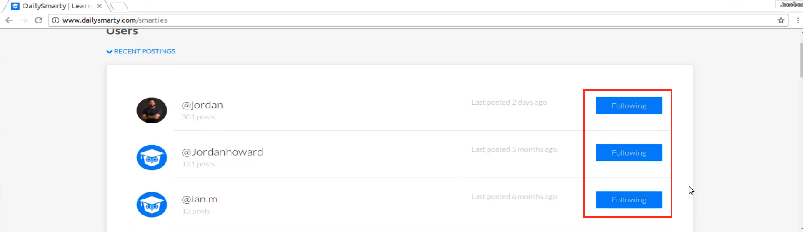

# Module 06 - 127:    Dev Tools

## Overview of Dev Tool's Network tab

***

1. **The Network Tab**
2. **Key Features & Columns**
3. **Analyzing Network Requests**
4. **Filtering & Throttling**
5. **Debugging Common Issues**

***

## **1.     The Network Tab**

The **Network Tab** in browser DevTools (e.g., Chrome) is a powerful tool for monitoring\
all HTTP/HTTPS requests made by a web application. It logs:

* **Document requests** (HTML).
* **Static assets** (JS, CSS, images, fonts).
* **API calls** (XHR/fetch).
* **WebSockets** (WS).

To access it:

1. Right-click → **Inspect** → Navigate to the **Network Tab**.
2. Refresh the page to capture all requests.

***

## **2.     Key Features & Columns**

The Network Tab displays:

* **Request Method** (GET, POST, etc.).
* **Status Codes** (200, 404, 500).
* **File Type** (XHR, JS, CSS, Img).
* **Timing** (load duration).
* **Size** (compressed/uncompressed)

\
&#xNAN;_&#x45;xample: Filtering to view only XHR (AJAX) requests._

***

## **3.     Analyzing Network Requests**

#### **Debugging API Calls**

* Filter by **XHR** to isolate AJAX requests.
* Check the **status code** (e.g., 401 for unauthorized, 500 for server errors).
* Inspect the **request payload** and **response data**.

\
&#xNAN;_&#x45;xample: Analyzing a `/follow/59` API endpoint._

#### **Identifying Slow Loads**

* Sort by **timing** to spot slow resources (e.g., large images, unoptimized queries).
* Hover over URLs to inspect paths and cache status.

\
&#xNAN;_&#x45;xample: A JPEG taking 34ms to load (could be slower if uncompressed)._

***

## **4.     Filtering & Throttling**

* Use the **filter bar** (e.g., `Doc`, `JS`, `Img`) to focus on specific resource types.
* Simulate slow networks with **throttling** (e.g., "Slow 3G") to test performance.

\
&#xNAN;_&#x45;xample: Filtering to view only image requests._

***

## **5.     Debugging Common Issues**

* **Broken API Calls**: Verify endpoints and status codes.
* **Slow Pages**: Identify large assets or blocking requests.
* **Caching Issues**: Check `memory cache` or `disk cache` headers.

***

## **Best Practices**

1. **Clear Logs** before reproducing issues to avoid clutter.
2. **Preserve Log** to maintain requests across page navigations.
3. **Copy as cURL** to replicate API calls for testing.
4. **Throttle CPU/Network** to emulate mobile performance.

> 💡 **Fun Fact**: The Network Tab\*\*\*\* is invaluable for scraping\*\*\*\* (e.g., copying asset URLs) or debugging **RESTful APIs**.

***

## References

* [Chrome DevTools Network Docs](https://developer.chrome.com/docs/devtools/network/)
* https://devtools.glitch.me/network/getstarted.html
* [HTTP Status Codes Glossary - WebFX](https://www.webfx.com/web-development/glossary/http-status-codes/)

***

## Video Lesson Speech

In this guide what we're going to do is we're going to walk through the browser's development tools and specifically walking through how we can work with the Network tab.

So I'm here in the Chrome browser and if I right click and click on inspect

and then navigate to the Network tab

right here you can see that we have all kinds of different options. We have the ability to filter, we have these different things that say it All, XHP, JS, CSS, Img, Media, Font, Doc, WS, Manifest, Other. What I want to do is walk through exactly what these mean and how you can use them as you're building out web apps.

You can follow along on the website of your choice. We're going to be doing is we're going to see how we can analyze the network calls that are being made from the web application. So if I turn this on all right here. This is going to bring in all of the network work requests that our application performs.

So if I hit refresh right here you're going to see that there are a number of ways that the application can communicate with the server. So if I scroll all the way up you can see that it brings in the document, it brings in JavaScript, it brings in images and all kinds of different elements like that.

Now this list can get pretty long. And so what I typically will do when I'm looking at the Network tab is I want to filter it. So let's start out by analyzing how we could look at an ajax request because this is a pretty common use case for me. And so what I'm going to do is I'm going to come up to this users tab right here

And each one of these buttons here on the right-hand side these represent an ajax call.

So if I go and I find a user that I want to follow right here if I click on this, the page is not going to refresh. There's going to be an ajax request that goes to the server and it says I want to follow this user. Now if I click on that then you can see there was a slight change with the Network console but it was really hard to see exactly what was happening. So let's come down a little further I'm doing to clear all of these items out.

And I'm going to filter only by XHR and what this means is this is the set of Ajax type of request so anytime we're communicating with an API or anything like that the request is going to be right here. So I'm going to filter only by these items and now if I go and I follow this user you can see that it went out and it perform one request we were able to see.

So if I am working on a web application and imagine that that button is not working. So say there's a bug in the app and I click it and the follow doesn't work. Well the very first step that I would take is I would come right here and I would analyze that network request and this will show me exactly what API that my system is calling. So here it's calling dailysmarty.com/follow/59.

And what this means is that it is calling out to the API it's hitting the follow endpoint and it is passing in the ID of 59 and in addition to showing me what I'm calling, it also very importantly shows me the status. And so what happens many times is if I have a typo or I'm calling the wrong endpoint or something like that I may be calling something and this name may come through but the status might come back and say that there is an error with the status so it might be a 500 error or a 401 error. That means that I don't have the correct permissions set up to communicate with it.

And so this is a great way for being able to analyze all of my AJAX requests in one spot and then I can perform debugging from there. So that's how I can use the Network tab for ajax requests. But now let's go and see how we can analyze a slow loading page because many times if you have any issues where a page is loading very slowly that can be something that you need to work on.

So if I scroll all the way up to the top and I go to one of these pages and let's go to one that has an image on it. I'm going to clear a few things I'm going to clear all of the requests then I'll click All so we can see everything that loads and then I'm gonna click on this page.

Now this page has an image, it has a few Ajax items going on, it has content, all kinds of things here. And so if I scroll up on this click on network and I make it here so it's a little bit easier for us to see. You can see each one of the requests that came through very helpfully you can also analyze how long each one of the requests took.

So if you have say, a database query that's taking a very long time, then the page itself may be what takes the longest whereas if you have a slow loading image. So right here we have this right here where you can see where it says Jpeg. This is the type of item that is being pulled in. It has the path here and then it shows how long it took to load.

Now if you accidentally allowed an upload of a very large image file so say you allowed a file that was 30 megabytes in size and you didn't do any kind of compression then instead of this taking 34 milliseconds then it might take a very long time to load and this is where you can see that.

So anytime that you have a slow loading page you can use this network tab for being able to analyze it and one thing that is helpful in addition to looking at everything that loads is being able to go through and filter each one of these items so say that you are pretty sure that it's not your AJAX requests it's not your javascript or CSS but it's just your images that you think are taking a long time.

Well if you want to analyze just of those you can click on the image and come back and hit refresh and now it's only going to show the images that are loading and then it's going to show each one of the time slots so it's going to show exactly how long it took for each one of those to load and then it gives you the order in which they loaded.

So this is very helpful whenever you're trying to perform debugging on slow loading pages or also where this is going to be very helpful is imagine a scenario where you are communicating with some API where you think that you're supposed to get one set of images but they're coming through incorrectly well this shows exactly what the paths are so here if I hover over here you can see this long URL and it brings in all of those different elements it even shows the hashed syntax with the URL.

Because this is a Rails application in the back and that's how rails compresses their images so I can come and see that exact URL. I can even click on it to get more information such as the response headers, and the status code, the remote address where it's located, the full URL.

so if you ever want to actually go and see the assets then you can just copy that and then paste it into the browser and as you can see there is the full image and were able to use the network tab to access every part of that and we're also even able to see that it's being stored in a memory cache so this can be very helpful and one thing that if you feel like this part isn't very important.

One thing I can tell you is when I first started learning about the front end developer tools like these kinds of things I didn't think it was really important. I don't think there were be things that I use that often but the more I got into complex and advanced Web applications I started to realize that I was using these tools constantly and so I definitely recommend for you to become familiar with them even if you feel like it's something you won't use right now. They are going to be helpful the further you go along on your front-end development journey.
