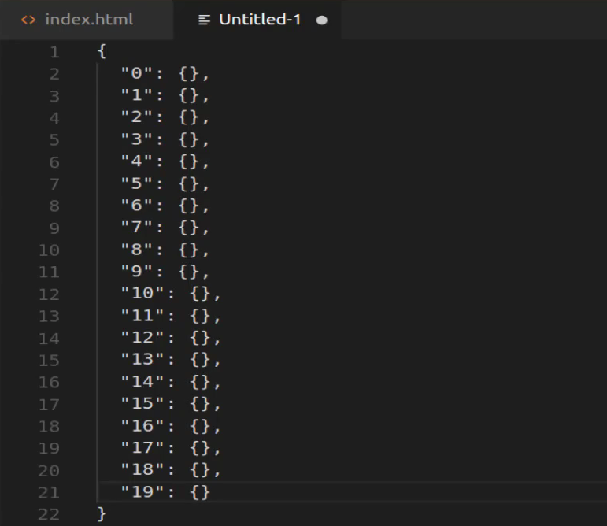
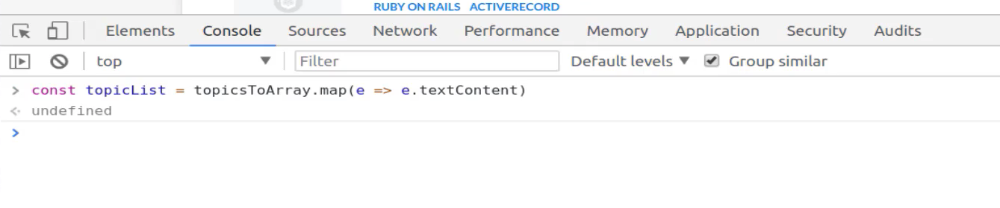

# Module 06 - 129:    Dev Tools

## Console's COPY function -> Easy Scrape

***

1. The `copy()` Function in DevTools
2. Selecting DOM Elements
3. Converting NodeLists to Arrays
4. Extracting and Formatting Data
5. Practical Scraping Example

***

## 1.    The `copy()` Function in DevTools

The `copy()` function in browser DevTools allows you to copy any JavaScript object or value to your clipboard. This is **especially useful for scraping data** from web pages without manual copying.

```js
const element = document.querySelector('.example');

```


***

## 2.    Selecting DOM Elements

To scrape data, first select the target elements using DOM methods:

```js
// Select all elements with class 'topics'
const allTopics = document.querySelectorAll('.topics');
```

\
&#xNAN;_&#x4E;ote: `querySelectorAll` returns a NodeList, not a plain array._

***

## 3.    Converting NodeLists to Arrays

NodeLists lack array methods like `map()`. Convert them first:

```js
// Convert NodeList to array
const topicsArray = Array.from(allTopics);

```


***

## 4.    Extracting and Formatting Data

Use array methods to extract specific data (e.g., text content):

```js
// Extract text from each element
const topicList = topicsArray.map(topic => topic.textContent.trim());
copy(topicList); // Copies the array of text to clipboard
```


***

## 5.    Practical Scraping Example

### Full Workflow:

1.  **Select Elements**:

    ```js
    const items = document.querySelectorAll('.item-class');
    ```

*

    2. **Convert to Array**:

    ```js
    const itemsArray = Array.from(items);
    ```
*

    3. **Extract Data**:

    ```js
    const data = itemsArray.map(item => ({
     
        text: item.textContent,    
        href: item.href // For links

    }));
    ```
*

    4. **Copy Results**:

    ```js
    copy(data);
    ```

***

## Tips - Best Practices

*   **Deep Copying**: For nested data, use `JSON.stringify()`:

    javascript
* copy(JSON.stringify(data, null, 2)); // Pretty-printed JSON
* **Filtering**: Combine with `filter()` to exclude unwanted elements.
* **XPath**: For complex selections, use `document.evaluate()`.

## Common Pitfalls

* **CORS Restrictions**: Scraping cross-origin data may require browser extensions.
* **Dynamic Content**: For SPAs, wait for elements to load using `MutationObserver`.

## References

* [clipboard - Mozilla | MDN](https://developer.mozilla.org/en-US/docs/Mozilla/Add-ons/WebExtensions/API/clipboard)
* [Document: querySelectorAll() method - Web APIs | MDN](https://developer.mozilla.org/en-US/docs/Web/API/Document/querySelectorAll)

***

## Video Lesson Speech

We're going to walk through a fun tool in this guide and it's going to be the copy tool that's available in the browser.

***

Now if you're following along in Chrome then you should be able to run all of these commands exactly the same as I'm doing now. If you're on Firefox they may have a few differences but for the most part, I'm going to be writing pure vanilla javascript. So it should work for you as well.


I'm on the Daily Smarty page here when I'm on my feed page but this would work on a number of different pages on the site. As you can see I have a set of topic links. Now imagine a scenario where you're asked to grab all of these links. Now this would not be a fun thing to do something like this or you go to the browser and you highlight each one of these you copy it and then switch to some kind of a text editor and then pasted in. That is definitely not a fun way to live.

So what we're going to do is we're going to see how we can use javascript data selectors and the copy functionality inside of the browser to automate this task for us. And so I'm going to start off by creating a variable here that's going to be a selector. So we're going to just grab all of the topics on the page then I want to grab all of the items that have a topic class.


Now I skipped one step. Obviously you'd need to select the element to see exactly what its class was. But since I wrote Daily Smarty, I know that each one of these items has an ID or a class of topics. And so now if I do that I have this available to me and if I call it just to make sure that it's selected properly you can see that it returns a node list.


So now let's copy that. So I'm going to use this copy function and copy all topics `copy(allTopics)`. I'm going to give you a little spoiler alert. This is not going to do exactly what we think it is. If I run that and now if I paste this in, it pastes something in. But not exactly what I was looking for.



It passes in an object and this object has 19 key-value pairs but it doesn't really give us a lot of information. And that's because we're working with the node list. We have to perform a few computational things on it. Now if you're doing this on another site you'll go through a very similar process but it might be slightly different if you're not selecting an element directly. So if you're selecting some kind of wrapper element then you're going to have to go through and pick out the elements inside of it that you'll need. Right now I'm grabbing a just kind of a pure item so you can even see if we select this and you can see what Topics has inside of it just some links so that is a pretty basic kind of look up.

So now that we know we have all topics and it gives us this node list will now we actually have to have something that we do with it. So I'm going to use the array prototype that is provided by javascript so what I can say is `const` and then here I'll just say `topicsToArray` and now I can use `Array.prototype.slice` which this is going to give us a copy of this and then `call(allTopics)`.


Now if you've never seen code quite like this what we're doing is we're using an array prototype which is provided in JavaScript. It's just the array class essentials it is array module that allows us to call slice and then we're going to call this so this entire process is going to call the object of all topics and then it's going to convert that to a Javascript array for us. So if I run this now and let's copy this `copy(topicsTo Array)`. Let's see what we have now ket;s see if we are getting closer.


Not really you may think except that there's one key difference notice here. We're not getting a node list object anymore. Now we're getting an array of objects so the copy does not perform deep nesting which means that it only copies whatever we tell it to but it doesn't go through all of the child elements or else you'd end up with thousands of lines of code right here. So it's just going to copy the high-level element we've passed into it. And in this case, that's an array and it may not look like much but we're actually much closer to where we want to be and we can even test this out. If I say `topicsToArray` and if I grab the first element here you can see that now we have our actual topic so I can click on this and you can see this gives us Ruby on Rails and then active record.


So we're much closer to where we want to be. And so now let's grab the actual text. So if I say `.textContent`. Now we have **Ruby on Rails** and **active record** now it merges these together that's fine for the sake of what we're trying to do we're just trying to grab all of the text so that we have it in here. So if you're building this for some kind of web scraper or something like that then you'd be able to pull it in and then you would know what kind of content was on that page. So now that we have that we have one more step. So we need to actually convert this array grab all of that text content and then store that in another data structure. So let's say that we create one more variable here called `topicList` and I'm going to set this equal to I believe let me see what did we call that one `topicsToArray` I believe yes topics to the array and then we can use `.map`. Now, this is one of the key reasons why he converted that node list into an array prototype. It's because with JavaScript you can't call .**map** in these kinds of functional methods on just any object or any collection it needs to be something that can actually listen and receive the **.map** message. And so an array is one of the objects that can do that. So I'm going to say `topicsToArray.map` and then from here, I can say `e` pass in an arrow function `e.textContent` and then this should store all of the text content inside of a new array.



So if I run that we can test this out by saying \`copy(topicList) run that, paste it in, and there we go.


We have successfully scraped that entire site grabbed all of the topics stored it in an array and obviously if you want you can also make this even a little bit more advanced if you wanted all the items separated out. You could go in instead of grabbing the wrapper. You could go and just bind each one of the elements so in your selector, you change it to the class and then the `a`element and grab all of those and then you'd have them all nice and separated but the main point I wanted to show you was how to use the copy function. But even beyond that how you can combine all kinds of cool JavaScript type of functionality with the copy function to be able to perform tasks such as web scraping or working with the dom in any way or any situation that you want to extract information out to use for other programs.

## Sample Commands

```javascript
const allTopics = document.querySelectorAll('.topics')

allTopics

copy(allTopics)

const arrtopicssample = Array.prototype.slice.call(allTopics);

arrtopicssample

arrtopicssample[0]

arrtopicssample[0].textContent

const sampleTopicList = arrtopicssample.map(e => e.textContent)

copy(sampleTopicList)

/*
[
  "RUBY ON RAILS",
  "VIM",
  "VIM",
  "VIM",
  "VIMCTAGS",
  "VIMTUTORIAL",
  "LINUXZSHELL",
  "VIMWINDOWS",
  "TMUXVIMPATHOGEN",
  "LINUXUNIX",
  "RUBY ON RAILSAWS",
  "CODINGRUBY ON RAILSTUTORIALJQUERYJAVASCRIPT",
  "RUBY ON RAILSROUTING",
  "MACHINE LEARNING",
  "RUBY ON RAILS",
  "RUBY ON RAILSBOOTSTRAPBUG FIXES",
  "TUTORIALMACHINE LEARNING",
  "AWSTUTORIALLEXCHAT BOTMACHINE LEARNING",
  "RUBY ON RAILSACTIONCABLE",
  "JWTRUBY ON RAILS"
]
*/
```
