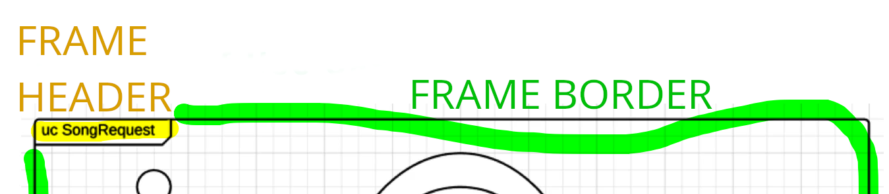

# Module 06 - 153:     UML Components

## FRAMES

---


1. **Introduction to Frames**
   1.1    What are Frames?
   1.2    Purpose and Benefits

2. **Frame Components and Structure**
   2.1   Frame Header Elements
   2.2   Encapsulation Boundaries

3. **Standardized Naming Conventions**
   3.1   Official UML Frame Mappings
   3.2   Diagram Type Identifiers

4. **Implementation in Different Diagram Types**
   4.1   Use Case Diagram Frames
   4.2   Class Diagram Frames
   4.3   Activity Diagram Frames
   4.4   Sequence Diagram Frames

5. **Practical Application**
   5.1   Large System Management
   5.2   Team Collaboration Benefits

6. **Frame Design Guidelines**

7. **Tips for Implementation**

---

## 1.     Introduction to Frames

### What are Frames?

Frames in UML are **encapsulation containers** that provide contextual boundaries around diagram elements. 


They **serve as visual organizers** that wrap entire diagrams or significant portions of diagrams within a **defined boundary**, complete **with descriptive headers** that immediately communicate the diagram's purpose, type, and scope.

Frames as **labeled containers** that hold your UML diagrams, similar to how you might label file folders in a filing cabinet. 

Just as a labeled folder helps **you quickly identify its contents without opening it**, frames help you instantly understand what type of diagram you're looking at and what system or module it represents.

### Purpose


#### Primary Functions

- **Instant Recognition**: Quickly identify diagram types without detailed analysis
- **Context Provision**: Understand which system or module the diagram represents
- **Professional Organization**: Maintain consistent documentation standards
- **Team Communication**: Facilitate clear understanding among team members

#### Benefits

1. **Reduced Cognitive Load**: No need to analyze diagram content to understand its type
2. **Improved Navigation**: Easy to locate specific diagrams in large documentation sets
3. **Standardization**: Consistent approach across all project documentation
4. **Professional Presentation**: Clean, organized appearance for stakeholder presentations

---

## 2.     Frame Components and Structure

### *Frame Header Elements*

Every UML frame consists of **TWO** essential components:


#### Frame Border

- A rectangular boundary that encapsulates the entire diagram
- Clearly delineates what belongs to this specific model
- Provides visual separation from other documentation elements

#### Frame Header (Nameplate)

Located in the **top-left corner**, the header contains:

- **Diagram Type Abbreviation**: Standardized code identifying the UML diagram type
- **Diagram Name/Title**: Descriptive name indicating the specific system or module
- **Optional Additional Information**: Version numbers, dates, or other metadata

### Frame Header Format

```plantuml
[DiagramType] DiagramName [OptionalInfo]
```

**Example:**

```plantuml
UC SongRequest v1.2
```

- `UC` = Use Case Diagram
- `SongRequest` = Module/System Name
- `v1.2` = Version (optional)

---

## 3.      Standardized Naming Conventions

### *Official UML Frame Mappings*

The UML specification provides standardized abbreviations for frame headers:

| Diagram Type             | Abbreviation | Full Name                    |
| ------------------------ | ------------ | ---------------------------- |
| **Activity**             | `act`        | Activity Diagram             |
| **Class**                | `class`      | Class Diagram                |
| **Communication**        | `comm`       | Communication Diagram        |
| **Component**            | `comp`       | Component Diagram            |
| **Deployment**           | `depl`       | Deployment Diagram           |
| **Interaction Overview** | `io`         | Interaction Overview Diagram |
| **Object**               | `obj`        | Object Diagram               |
| **Package**              | `pkg`        | Package Diagram              |
| **Profile**              | `profile`    | Profile Diagram              |
| **Sequence**             | `seq`        | Sequence Diagram             |
| **State Machine**        | `stm`        | State Machine Diagram        |
| **Timing**               | `tim`        | Timing Diagram               |
| **Use Case**             | `uc`         | Use Case Diagram             |

### *Naming Best Practices*

#### For System Names

- Use **PascalCase** for multi-word names: `UserManagement`, `PaymentProcessor`
- Keep names **concise but descriptive**: `OrderSystem` rather than `OnlineOrderManagementSystem`
- Use **consistent terminology** across all diagrams

#### Complete Examples

```
uc UserAuthentication
class PaymentProcessor  
act OrderFulfillment
seq DatabaseConnection
stm ShoppingCart
depl ProductionEnvironment
```

---

## 4.     Implementation in Different Diagram Types

### *Use Case Diagram Frames*

**Purpose** 
Identify actors and their interactions with system functionality

**Frame Example**

```
┌─[uc SongRequest]─────────────────────┐
│                                      │
│  [Actor: User] ──→ (Request Song)    │
│                                      │
│  [Actor: DJ] ──→ (Approve Request)   │
│                                      │
└──────────────────────────────────────┘
```

**When to Use**

- Planning user interaction requirements
- Documenting system boundaries and external actors
- Communicating functionality to non-technical stakeholders

### Class Diagram Frames

**Purpose**: Document object structure and relationships

**Frame Example:**

```
┌─[class UserManagement]───────────────┐
│                                      │
│  ┌─────────────┐    ┌─────────────┐  │
│  │    User     │────│   Profile   │  │
│  │- username   │    │- email      │  │
│  │- password   │    │- firstName  │  │
│  └─────────────┘    └─────────────┘  │
│                                      │
└──────────────────────────────────────┘
```

**When to Use**

- Database design and modeling
- Object-oriented system architecture
- Code generation planning

---
### *Activity Diagram Frames*

**Purpose**  
Map business processes and workflow logic

**Frame Example**

```
┌─[act OrderProcessing]────────────────┐
│                                      │
│  (Start) → [Validate Order] →        │
│           [Process Payment] →        │
│           [Ship Product] → (End)     │
│                                      │
└──────────────────────────────────────┘
```

**When to Use**

- Business process documentation
- Workflow optimization
- System behavior modeling

---
### *Sequence Diagram Frames*

**Purpose**  
Document message flow between system components

**Frame Example**

```
┌─[seq LoginProcess]───────────────────┐
│                                      │
│  User → WebApp: login(credentials)   │
│  WebApp → Database: validateUser()   │
│  Database → WebApp: userValid        │
│  WebApp → User: loginSuccess         │
│                                      │
└──────────────────────────────────────┘
```

**When to Use**

- API design and documentation
- System integration planning
- Debugging complex interactions

---

## 5.     Practical Application
---
### *Large System Management*

#### Challenge:         Documentation Overload

In enterprise systems, you might have **50+ UML diagrams** across multiple modules.  
Without frames, finding the right diagram becomes a time-consuming hunt.

#### Solution:            Systematic Frame Usage

```
uc CustomerPortal_Authentication
uc CustomerPortal_Dashboard  
uc CustomerPortal_Billing

class CustomerPortal_UserModel
class CustomerPortal_PaymentModel
class CustomerPortal_ReportModel

seq CustomerPortal_LoginFlow
seq CustomerPortal_PaymentFlow
seq CustomerPortal_ReportGeneration
```

**Result** -> Instant recognition and logical grouping of related diagrams.

---
### *Team Collaboration Benefits*

#### Scenario:    New Team Member Onboarding

When a new developer joins your team:

**Without Frames**

- Must analyse each diagram to understand its purpose
- Confusion about which diagrams relate to which modules
- Time wasted on clarification meetings

**With Frames**

- Immediate understanding of diagram types and scope
- Clear module boundaries and relationships
- Self-documenting system architecture

#### Cross-Team Communication

* **Business Analysts** can quickly identify use case diagrams (`uc`).

* **Database Architects** can focus on class diagrams (`class`).

* **System Administrators** can locate deployment diagrams (`depl`)

---

## 6.     Frame Design Guidelines

---
### *Visual Design Principles*

* ####  Frame Sizing

	- **Minimum Padding**: Leave at least 10-15 pixels between frame border and diagram content
	- **Proportional Scaling**: Frame should scale with diagram complexity
	- **Consistent Margins**: Maintain uniform spacing across all diagrams

* #### Header Placement
	- **Always Top-Left**: Standard UML convention
	- **Clear Font**: Use readable typeface, typically same as diagram text
	- **Appropriate Size**: Header should be prominent but not overwhelming


* ### Content Organization
#### What Goes Inside Frames

✅ **Include**

- All primary diagram elements
- Related annotations and notes
- Legend or key information specific to this diagram

❌ **Exclude**

- General project information (use separate title blocks)
- Unrelated diagram elements
- Excessive white space

#### Frame Boundaries

- **One Purpose per Frame**: Each frame should represent a single logical unit
- **Clear Scope**: Everything inside the frame should relate to the named system/module
- **No Overlapping**: Frames should not contain elements from other logical units

---

## 7.     Tips for Implementation

---
### *Implementation Checklist*

**Before Creating Diagrams:**

- [ ] Establish naming conventions for your project
- [ ] Create frame header templates
- [ ] Define standard frame sizes for different diagram types

**During Diagram Creation:**

- [ ] Add frame immediately after creating new diagram
- [ ] Use appropriate diagram type abbreviation
- [ ] Include descriptive but concise system/module name
- [ ] Ensure all relevant content fits within frame boundaries

**Quality Assurance:**

- [ ] Verify frame headers match diagram content
- [ ] Check consistency across all project diagrams
- [ ] Review frame naming with team members
- [ ] Update frames when diagram scope changes

---
### Professional Standards

1. **Consistency is King**: Use the same frame style throughout all project documentation
2. **Meaningful Names**: Frame titles should immediately convey the diagram's purpose
3. **Version Control**: Include version information in frames when documenting evolving systems
4. **Regular Updates**: Keep frame information current as systems change

### Common Mistakes to Avoid

❌ **Inconsistent Abbreviations**: Mixing `UC` and `UseCase` in different diagrams  
❌ **Overly Long Names**: `uc CompleteUserAuthenticationAndAuthorizationSystem`  
❌ **Missing Frames**: Having some diagrams with frames and others without  
❌ **Wrong Diagram Types**: Using `class` abbreviation for an activity diagram

### More Tips

💡 **Frame Templates**: Create reusable frame templates in your UML tool  
💡 **Color Coding**: Use subtle background colors to distinguish diagram types  
💡 **Nested Systems**: For complex systems, use hierarchical naming like `CustomerPortal_Auth_LoginFlow`  
💡 **Documentation Integration**: Ensure frame names match corresponding technical documentation sections

---

## References

### UML Standards

- **Object Management Group (OMG)**. *UML 2.5.1 Specification*, Section 7.3: "Frames"
- **ISO/IEC 19501:2005** - UML Notation Standards

### Best Practices

- **Fowler, M.** (2003). *UML Distilled* - Chapter 3: "Diagram Organization"
- **Arlow, J., & Neustadt, I.** (2005). *UML 2 and the Unified Process* - Frame Usage Guidelines
- [ UML Element Frame - UML-diagrams.org](https://www.uml-diagrams.org/frame.html)
- [UML Frames: Diagramming Style Guidelines](https://agilemodeling.com/style/frame.htm)


---

## Video Lesson Speech

Starting off our list of common UML components is the concept of frames.

---

## Frames

We're going to talk about what frames are how they can be implemented and why they're important. First and foremost, frames help you encapsulate your view components. I know those are some large words and they don't mean much until you actually use them and see how they are beneficial as you design your system. Essentially, what frames do is provide context. If you are looking at 10 different models, it can be a bit challenging to see what one model represents compared to another, especially if you're working on a system that has some similar naming conventions. You want to instantly be able to look at a model and know what it's supposed to do.

You want to know a couple of things:

- You want to know exactly what type of system it represents. 
- You want to know what type of diagram it is 

As you start to get into more advanced UML diagrams there are some subtle differences and it's nice when you can have a mapping of how you can understand what one is just by looking at it. How we implement that is by having some headings and then we have descriptive notation on what the model is, we'll go into a direct mapping and a common naming convention that you can use. Once again, the most important reason why you want to implement frames is because when you are working on large systems, you and the developers that are working with the system, want to instantly understand the context and what you're talking about.


The next thing we're to talk about is the diagram mapping for frames. I talked about how you need to have a standardized naming convention, this is the one that is recommended by UML. 


The example we have right here is for a Use Case Diagram.


The important part to look at is in the top left-hand side, you see where it says UC SongRequest and then it's wrapping the entire thing in a box. What this allows me as a developer to see is if someone else's software engineer brings me this diagram I can instantly tell that this is a use case diagram because of the little UC in the top left-hand side. I know that it is a use case diagram for the SongRequest module so I'm going to know exactly where this needs to be implemented in the application. I also will know how to interpret the diagram.

This is how you can build a frame in UML. 
