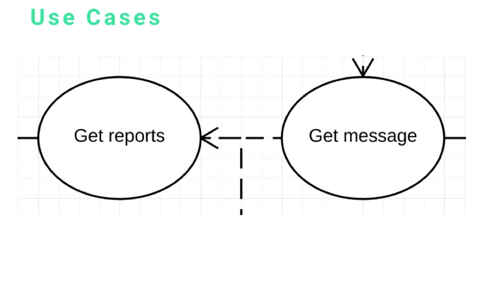

# MODULE 07 - 172: UML - UseCase

## Use Case Diagram Elements

***

1. What UML UseCase Diagrams are
2. Core Elements Overview
3. Use Cases
4. Actors
5. Subsystems (System Boundaries)
6. Relationships
7. Key Design Principles

***

## 1. What UML Class Diagrams aew

Use Case Diagrams are **behavioral UML diagrams designed to model system functionality from a user's (actors') perspective**.

Their primary purpose is to establish **authorization rules** and **illustrate what features different types of users or clients can access within a system**.

**Primary Objectives**

* Define **access permissions and authorization** boundaries
* Visualise system functionality available to different user types
* Provide developers with clear requirements for building authorization engines
* Document feature accessibility across different user roles

***

## 2. Core Elements

Use Case Diagrams consist of FOUR fundamental elements that work together to represent system access and functionality:

1. **Use Cases**: Specific actions or functionalities available in the system
2. **Actors**: Users, systems, or clients that interact with the system
3. **Subsystems**: Organizational boundaries that group related use cases
4. **Relationships**: Connections between actors and use cases

***

## 3. Use Cases

**Visual Representation**: Ovals or elliptical shapes containing action descriptions

**Characteristics**

* Represent specific actions or functionalities within the system
* Should be **action-oriented** using verb-noun format
* Focus on what users can do, not how the system implements it
* Abstract away implementation details and data attributes

**Examples**



* "Get Reports"
* "Get Messages"
* "Manage Contacts"
* "Visit Resources"

**Design Principle**\
Use cases should clearly communicate available features to developers, enabling them to understand authorization requirements without getting bogged down in technical implementation details.

**What Use Cases DON'T Include**

* Data attributes or database schema details
* Specific methods or function implementations
* Technical implementation specifics
* Internal system processes invisible to users

***

## 4. Actors

**Visual Representation**: Stick figures or actor symbols positioned outside the system boundary

**Definition**: Any entity that interacts with the system from the outside, including both human users and non-human systems.


### Human Actors

* **Admin**: System administrators with elevated privileges
* **Customer**: End users or clients using the system
* **Manager**: Users with specific role-based permissions

### Non-Human Actors

* **API Clients**: External applications that consume system APIs
* **Mobile Applications**: iOS/Android apps accessing backend services
* **Third-Party Systems**: External websites or services that integrate with the system
* **Automated Services**: Scheduled processes or monitoring systems

**Important Consideration**\
In API-driven architectures, you may never have direct human users. Instead, various software clients (mobile apps, web applications, other APIs) act as the primary actors accessing system functionality.

**Example Scenario**: An API that provides blog posts or user data to mobile applications, where the mobile app itself is the actor, not the individual users of that mobile app.

***

## 5. Subsystems (System Boundaries)

**Visual Representation**: Large rectangular boxes that contain related use cases and other elements

**Purpose**: Organize and group related functionality within logical system boundaries

**Characteristics**

* Help organize complex systems into manageable sections
* Clearly delineate what functionality belongs to which part of the system
* Provide visual separation between different system components or modules

**Example Structure**


```
Web Dashboard (Subsystem)
|
├── Get Reports
├── Get Messages  
├── Manage Contacts
├── Visit Resources
└── Forms

External to Web Dashboard:
|
├── Manage Journeys and Shapes
├── Trigger Journey Events
└── Get Notifications Regarding Journeys
```

**Organizational Benefits:**

* **Clear Scope Definition**: Shows exactly which features belong to each system component
* **Development Planning**: Helps teams understand which features to implement in which modules
* **System Architecture Visualization**: Provides high-level view of system organization

***

## 6. Relationships

**Visual Representation**: Lines connecting actors to use cases, typically with arrows indicating direction of interaction


\*\*Types of Relationship Lines:

* **Solid Lines**: Direct associations between actors and use cases
* **Dotted Lines with Open Arrows**: Show relationships and connections between different use cases

**Purpose**: Establish clear connections between who can access what functionality in the system

**Relationship Functions:**

* Connect actors directly to the use cases they can access
* Show which system elements each actor type can interact with
* Visualize permission and access patterns
* Document authorization rules in visual format

**Authorization Mapping**: Relationships serve as the visual representation of an authorization matrix, showing developers exactly which actors should have access to which system features.

***

## 7. Key Design Principles

### Action-Oriented Focus

Use cases should emphasise **what** users can do rather than **how** the system accomplishes those tasks. This keeps diagrams focused on functionality rather than implementation.

### Authorisation-Centric Design

The primary goal is to create a clear authorization framework that developers can use to implement proper access controls and permission systems.

### Abstraction Level

Use case diagrams operate at a high level of abstraction, focusing on user-visible functionality while hiding internal system complexity.

### Actor Diversity Recognition

Modern systems often have diverse actor types, including automated systems, APIs, and various client applications, not just human users.

### Organizational Clarity

Subsystems help manage complexity in large systems by providing logical groupings of related functionality, making the overall system easier to understand and implement.

***

## Video Lesson Speech

## In this section, we're going to dive into how we can build Use Case Diagrams in UML. We're going to review the various elements that make up a use case diagram.

One of the reasons you build this type of diagram is to set up the authorization rules and to illustrate what types of features certain individuals or an API client is going to have access to.

#### The four main elements

* **Use Cases**
* **Actors**
* **Subsystems**
* **Relationships.**


Use Cases are represented by a circle and typically have some type of action. This is something that is very important when it comes to building these types of diagrams, we're trying to illustrate what types of actions and functionalities that an actor has access to. Right here we have a couple of examples, one is "get reports" the other is "get messages." We like to have very action-oriented types of elements because it makes it much easier to see the types of features that a user has access to.

Notice we don't care about things like the data attributes or direct methods, the goal is to give these to developers and have them know how to build an entire authorization engine. They can see what types of features one type of user has access to versus another type of user.


The next element is the actor. One thing I want to point out, an actor can be a human (Admin or Customer) but it can also be a non-human like an API Client.

Imagine a scenario where you're building an API. That API is not going to have any kind of users accessing it, you may have a mobile application like an iOS app or a front end app that accesses it but you're never technically going to have a user. With that in mind, it's important to think of actors as also being different types of software clients.

An example of that would be if you're building an API and you give the ability for other API/websites/mobile apps to query your API and pull in a list of blog posts or users. You'd build a use case diagram and say that this API client has access to be able to perform the following tasks. I wanted to make that clear, I have taught UML through the years and I typically see actors always being listed as humans, however, they're any types of actors that have access into the system.


The next element is the subsystem. Focus on the large rectangular box that says "web dashboard," this is a subsystem. Subsystems in a use case diagram are represented by large rectangular boxes that have use cases and different elements inside of them. You may notice that we have items such as:

* get reports
* get message
* manage contacts
* visit resources
* forms

all inside of this web dashboard element.

The items that are outside are::

* managed journeys and shapes
* trigger journey's events
* get notifications regarding journeys

Those items are all outside of the web dashboard/subsystem. Subsystems (also called system boundaries) are different elements that you can place inside of a use case diagram to help you organize and see where these types of use cases are actually going to occur.


Lastly, use case diagram relationships. Relationships are represented by dotted lines with open arrows. This shows how you can go from one use case to another use case. This gives you the ability to connect your actors directly to the use cases and to the elements and actions that they have access to in the system.
