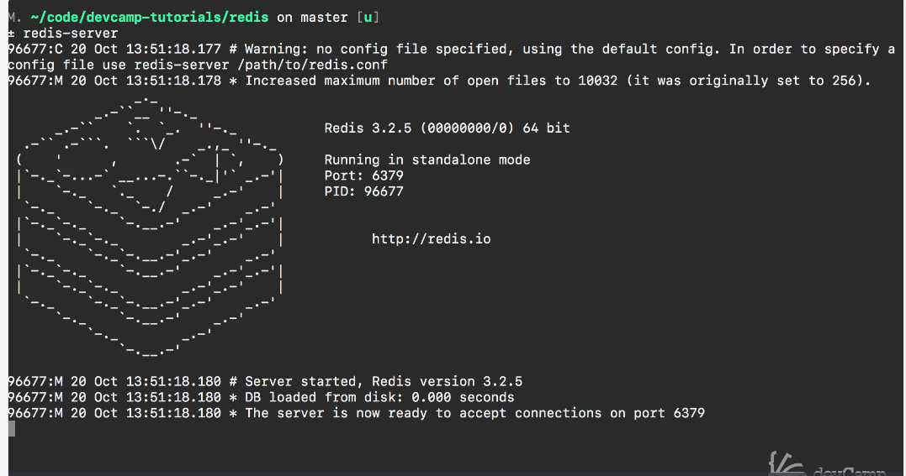

# 11-600 REDIS 01 How to Install REDIS on MAC (and LINUX)

[Guide](https://devcamp.com/pt-full-stack-development-javascript-python-react/guide/how-to-install-redis-run-redis-cli-mac)

## Video Lesson Speech

In this guide, we're going to talk about how we can install Redis on a Mac and how we can also get it up and running.

***

If you do not already have homebrew installed then you can go to [brew.sh](../../../../../inProgress/Basque-DevCamp/Full_Stack_2025/MODULE_11/11-02_REDIS-Course/brew.sh) and simply get this line of code right here and then open up your terminal and then paste it in.


I'm going to switch to the terminal. You would paste it in the terminal, and it would install the homebrew dependency management system.

Once that is done you can run

```terminal
brew install redis
```

and that will install `Redis` and homebrew will take care of managing the installation, the dependencies, and everything like that.

That may take a few minutes depending on your internet connection. I already have it installed so I don't need to run it on mine but you can run it on yours. And after that's done then quit the `terminal`, get back into the `terminal` and you can open up a new tab in your `terminal` and simply type

```terminal
redis-server
```

and then you should see something similar to this.



and what that means is that `redis` is up and running. You can tell at the bottom where it says the server is now ready to accept connections on port 6379. And if you hit `command t` this will open up a new tab in your `terminal`.

Now we can get started in actually writing `redis` code. So I can say

```terminal
redis-cli
```

And then it's going to open up a Redis session for me.

And now we can run all of our code. If you see these numbers this IP address, followed by the port 6379


What this is doing, is it's telling us that we have the local connection up and running and the port that the same one that was mentioned earlier. This is now where it's running so everything is working. Now, if you are following along and that all worked, you are ready to get started with the course.

## Resources

* [Homebrew](https://brew.sh/)
