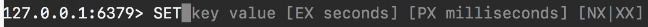

# 11-602 REDIS 02 SET - GET commands

[Guide](https://devcamp.com/pt-full-stack-development-javascript-python-react/guide/set-and-get-commands-in-redis)

## Video Lesson Speech

In this section of the course, we're going to walk through some of the most common types of `redis` commands that are available.

***

In this guide specifically, we are going to go through two of the most introductory and common types of commands that you're going to run into when using `redis` and that is `set` and `get`. And so the way that we can do this is we use the word set. And as you may notice that is going to give you a set of items that are going to give you a key value, then you also have a few other optional values but we are not going to get into those right now.



They deal with expiring when you would want this key to expire if you're using this for say caching or something like that. For right now we're simply going to use the key and value. The way that you can tell if it is required or if it's optional is if it's in brackets. That means that these are optional and you can see that you also have the ability to combine them with a pipe.

But for right now we're just worried about the key and value. Say that we're storing a set of page names. I can say page\_name and then a value and I'll say "about us".

```redis
Set page_name 'About us'
```

If I hit return it returns OK. And what that means is that everything worked. If it threw out an error that means that something occurred and you'd need to fix it on the system but assuming that says OK that means it's all working.

Now that's the `set` part.

Now to go into the `get` part we can say get and you can see there's only one item that we have to pass to the key and that is whatever we're looking for. Now if I say get wrong\_key you can see it doesn't throw an error. It just returns nil.

```redis
GET wrong_key
nil
```

And this is something that's very important when it comes to understanding how Redis works is Redis is incredibly fast. It doesn't care as much about giving you these descriptive error messages or anything like that. It assumes that if you are passing in a key that you know what you're doing. So it's going to either return the value or it's just going to say it couldn't find anything.

It's going to say things like that key doesn't exist or anything like that. Now if we want to get the real value and say page\_name you can see it returns a string.

```redis
Get page_name
"About us"
```

That is an introduction to using set and get in `redis`.

## Code

```
127.0.0.1:6379> SET page_name 'About us'
OK
127.0.0.1:6379> GET wrong_key
(nil)
127.0.0.1:6379> GET page_name
"About us"
127.0.0.1:6379> 
```
