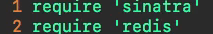
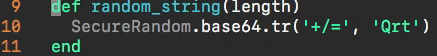
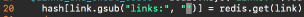
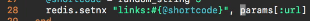
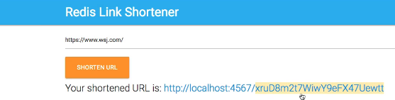
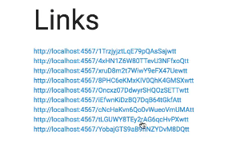

# 11-613    REDIS 13    REDIS Project -> Guided Solution

[Guide](https://devcamp.com/pt-full-stack-development-javascript-python-react/guide/project-solution)

## Video Lesson Speech

Nice work going through that project! In this solution video, it's going to be much different than I typically do a solution video. 

---
Usually, I will show how I built the system but in the case of this all of the code for using redis in order to build a system out is all right here in this one file and so we're simply going to walk through that and see which items are specific to redis. 

Like I mentioned in the requirements video because this course does not reference any kind of programming language I'm going to simply talk about the redis portion and then go into how that can be connected to whatever language you are working with and that's part of the reason why I really like Sinatra for this implementation because it has a very nice clean interface where I can just write the code by itself and I don't really have to worry about a ton about heavy frameworks I'd get out of rails or Django or any frameworks like that. 

The very first thing right here on line 4 is connecting to redis.

It brought in the redis gem and then the Sinatra gem. 

Then it connects and creates this redis instance. Now from there it built out this helper method and in this helper method we have a random string, 

that is how the system is getting those shortened URL's how it's getting those mix of random numbers and characters to be able to create a custom version of that URL so this is just generating a random string.

There is no redis there and I'm not going to talk about how Sinatra works in detail so we're not going to worry about some of these commands like get, this is just creating the pages it's a syntax that Sinatra uses for that. 

This is where we started to get into the good stuff. Right here we're going to take our redis instance this is the same instance from line 4. And then if you recognize the keys command we are going to iterate over the keys so we're calling redis and we're passing in a query. If you remember when we went through our keys video if you remember we can pass a keys pattern. So right here what I chose to do is I said redis.keys and then I passed it this argument of the links:

What that is going to do if you remember back when we could call it keys and then whatever we passed we passed a pattern and then ended it with an asterisk(*). What this means is that I can query all the keys in my redis database and only have the ones returned to me that start with links followed by a colon. If I ran a query on all of the keys like a key star command then what would happen is if I ever create a key that is not matching up with this pattern then the program would throw an error because it would expect to have all the keys matching this pattern. 

Instead I'm sending it this part of it and now by saying `Links:*` it's only going to bring me the keys with links starting off and then this part is ruby where I'm just iterating over it and I'm creating a hash inside of the program and then from there I am going and I'm substituting where it says links. So right here I'm taking out where it says links inside of the query or inside of the value. And I'm just replacing it with an empty string. 

What that is doing, and we'll get down to how the entire system is being set,  is that is just removing one of the items that I'm adding into the object that's being saved inside of redis. I'm taking out the word Links: so I'm going to be left just with the URL by itself. I'm taking that and I am saying that this is the key. And then the value here is redis.get(link) which is the value. 

That means that's just URL all by itself then I'm just rendering it out. This is how I'm able to build out the feature where it shows all of the links. That's what this one URL 

is doing so when you go to slash links. And I'm just iterating over all of the keys that start with links and then I'm creating my own hash. In this case in Ruby and then I can pass that directly to the view. So I created this variable called @links_and_short_codes. I'm saving that in this instance variable and then I can pass it to the view and then it can just render it out on the page, that is how we get that link index page. 

Now the home page, this is where the magic happens in terms of being actually able to create that shortcode. Right here it checks to see and make sure that the param has a URL and that it's not empty. Then what it's going to do is it's going to generate this shortcode,

If you remember back to our `random_string` up in line number 9 this is going to pass that value and it wants a string of length 5, this is where we get back to redis. We now talk to redis again. We call `redis.setnx` and setnx is another command in redis. You can research that one. What setnx does is it sets it, if the value was not already set. If you're familiar with other languages and frameworks of command such as find or create by that is kind of similar to how this works. What I'm doing is I'm saying redis.setnx and then notice I'm making this string unique so I'm taking this Links: I'm adding this into the key. So the key is going to have the word links in it. Remember when I talk about the query that we're doing up here I need to make sure that links with a colon is always going to be the start of my key pattern. From there I do a little bit of string interpellation so it's going to be links followed by whatever the shortcode is and then the value is the URL.

The value is what was being passed into the form when you hit submit on the form it gets passed into the params hash. Now I do apologize, there is no way of explaining how this all would work in every single framework that is out there. So if you're working in Rails this is going to work very similarly to what I have. If you're working in C# or in Django it's going to look very different. The concepts are going to be the same, you're submitting a form, you're grabbing the parameters and then, you're storing it inside of redis and the entire point is understanding how you can create that process. 

But the syntax is going to be slightly different. If you look on line 28, and if you think back to when we're just going line by line inside of the cli. This is very similar to just doing SET and then passing in a key of links followed by whatever the shortcode is we generated. Remember that's what we built on line 27 it's just a random set of strings. And then the value is whatever URL got passed in if the value that got passed in was Google then Google would be this value right here.

Then we'd be able to reference it with that key where it's `links:#{@shortcode}` that we created and then we just render it.

The last item is the shortcode itself this is a way of setting up a pattern and this is how we are able to get that behavior where if you click on a link that says `localhost:4567` followed by the random string. This is how we can do that and redirect the user to whatever site that they saved. So here I created an instance variable called URL and now we're using redis.get. So remember one of the most common commands in redis is GET and all we have to do is pass in that key. So we're able to call links with the colon followed by whatever that shortcode is so we're passing that into the URL. We're able to grab that and then we just run a database query right through redis store it in the URL and then we pass that URL right into the view and they can access it. 

Once again I'm not going to go into what the view pages look like because yours are going to look much different than mine so there's not really a huge need to compare those but to reference once again what the final solution looks like is something like this having this type of behavior where we can simply paste this in hit shorten URL and then it generates it. 

This is that shortcode that just got generated. 

And then if we click on all links this is where we ran this query. 

Now, this is something that I really wanted to emphasize I've seen a number of tutorials out there that give you about half of this solution and the one thing that they all seem to be missing is how to run an index kind of query like we're doing in between lines 18 and 23.

This part is probably the most complicated part of the entire system which is probably part of the reason why a lot of the tutorials don't do that. And so that's why I wanted to build this so you could see how that would work in a real-life scenario because this is a very common pattern that you're going to follow where you query the keys and then you pass in whatever your indicator is, whatever that flag is. In this case, it's links: and then you can iterate over that entire collection very quickly pull out what you want to, create your own object just like we did and then you can pass it into the view. This is how you can use redis in a very practical sense to build an entire application.

## Resources

- [Source Code](https://github.com/jordanhudgens/redis-sinatra-link-shortener)
