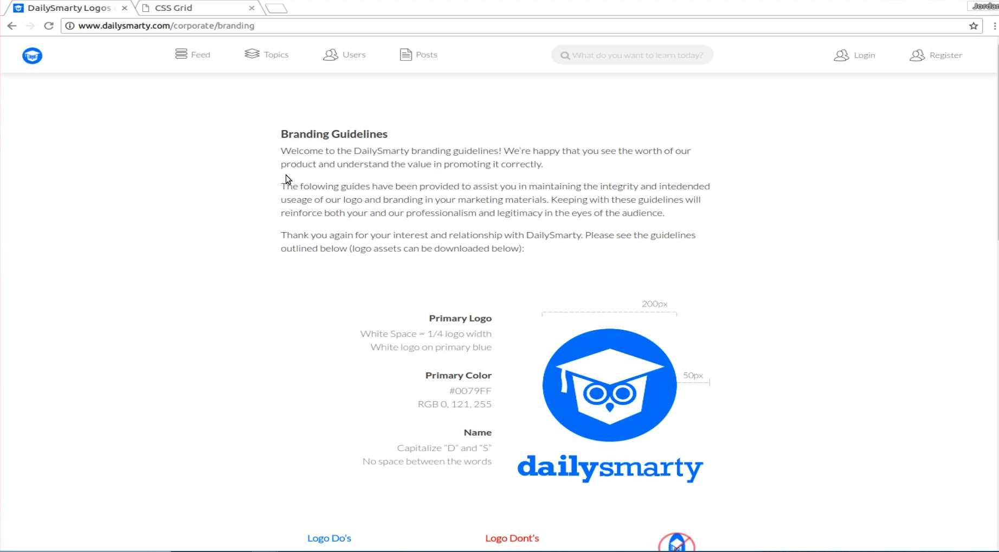
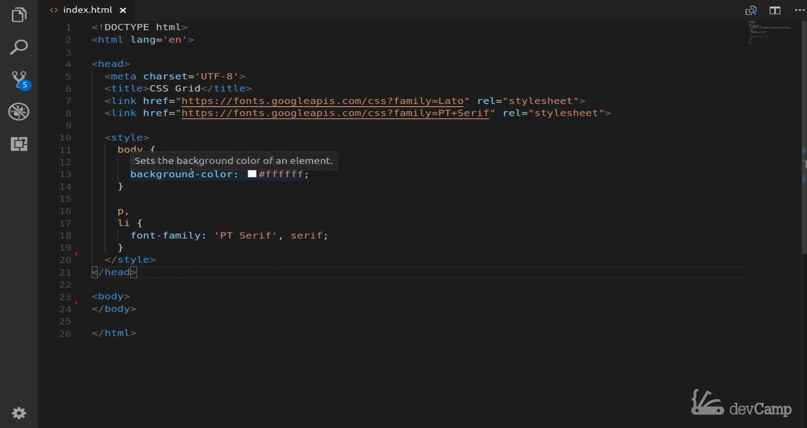
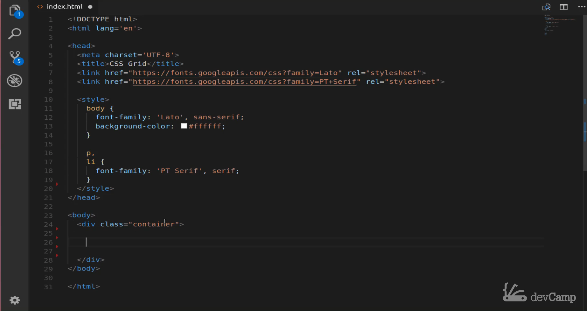
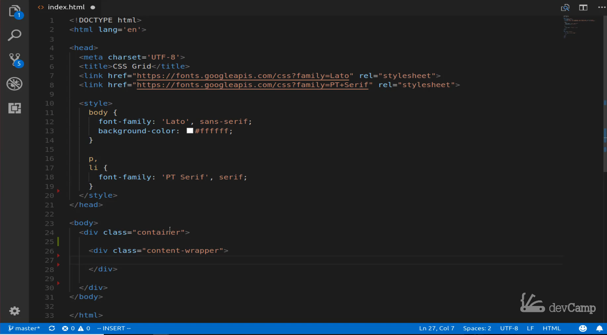
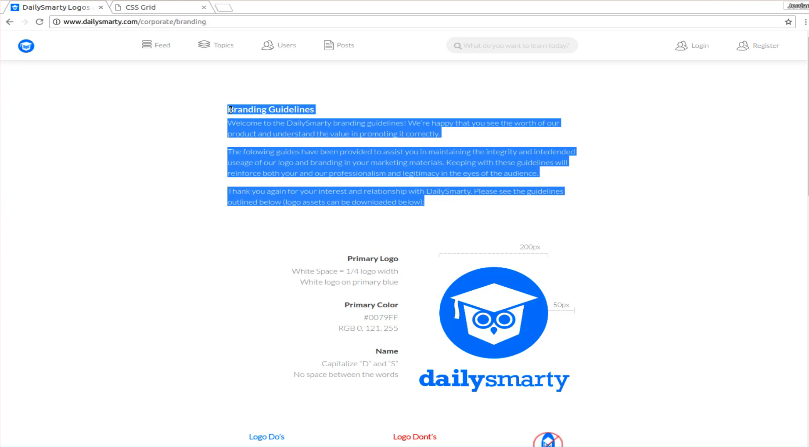
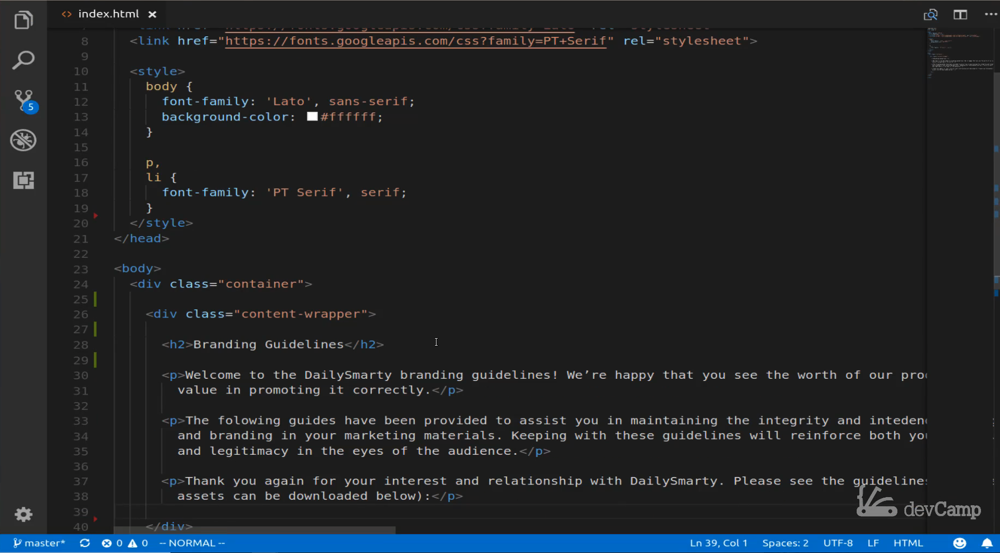
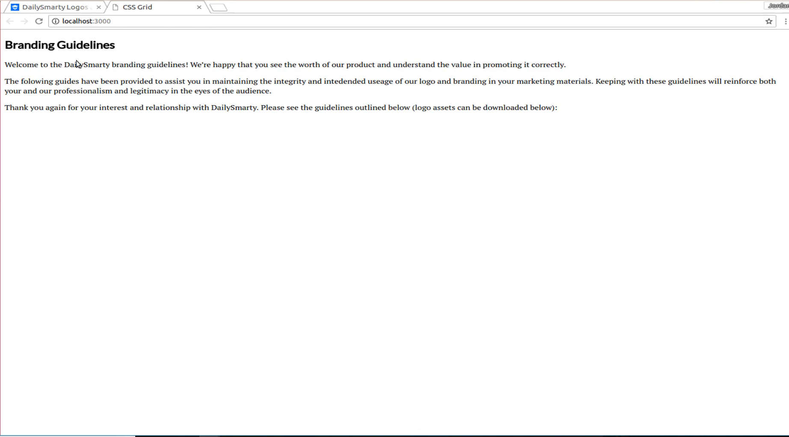
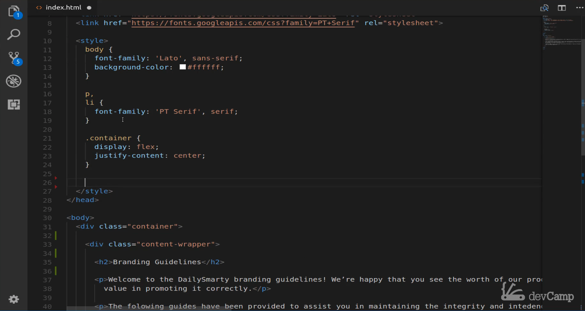
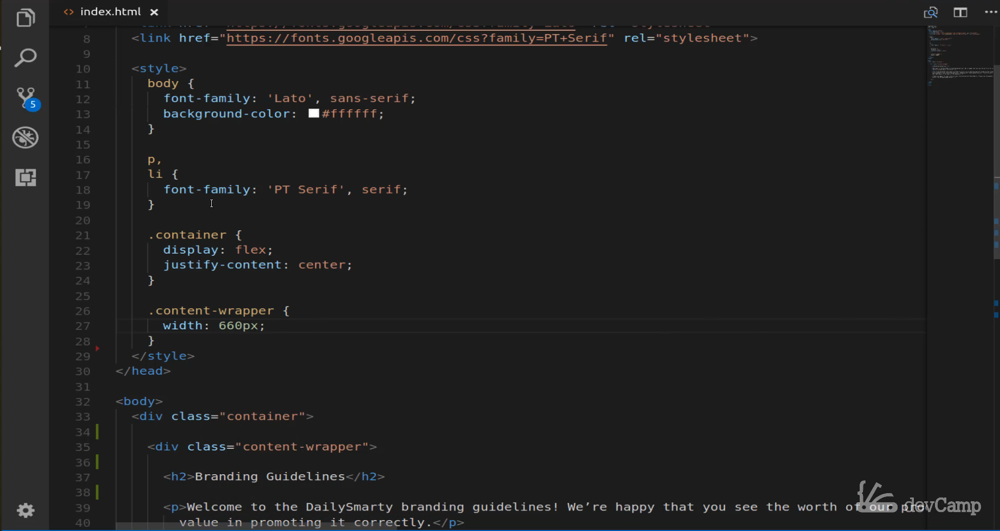
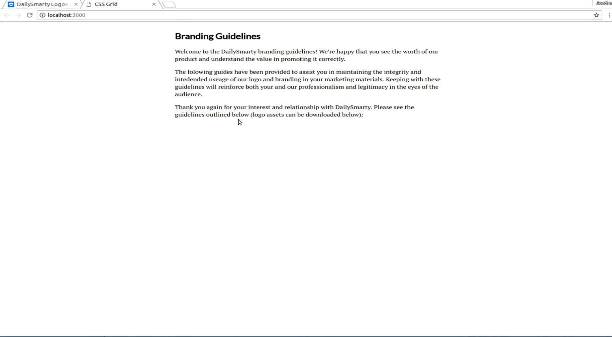

# 01-022:   Branding Page Layout and Flexbox Integration


```html
<link href="https://fonts.googleapis.com/css?family=Lato|PT+Serif" rel="stylesheet">

<style>
    body {
        font-family: 'Lato', sans-serif;
        background-color: white;
    }

    p, li {
        font-family: 'PT Serif', serif;
    }
</style>
```

Link to copy-paste material
http://www.dailysmarty.com/corporate/branding

In this guide, we're going to get started on building out this page, and we're going to be using a number of different technologies in order to do it. 



Now we're going to ignore the navigation bar in a later project we're going to see how we can build out a navbar. Right now in this basic introduction, I want to focus on some of the basic principles around CSS grid and how we can use it. Now if we look, we can see that starting here at "Branding guidelines", and it's going all the way down to that page you can see that the content is in a container. So there is a CSS container that covers a bit of the page. I would say that's probably going to be one of the first things we need to do to build that out. 

Now I'm going to do something that may seem a little bit odd for a CSS grid course. That is I'm going to show you how you can use CSS grid and flexbox at the same time. That may seem a little counterintuitive but the reason why I'm doing that is because I have seen so many different questions especially from students and developers who are just learning it. They think that it is CSS grid versus tools like flexbox and that's just not the case. Whenever I get a question from a student or a dev saying should I use CSS grid or should I use flexbox? My question is if you're making a sandwich or are you going to use peanut butter or are you going to use jelly? Why can't you just have both of them combined together? In this application that's what we're going to do we're actually going to combine using flexbox and certain spots and then CSS grid in others. 

The very first thing I'm going to do is I'm going to show you how to wrap this entire container in flexbox and then, later on, we're going to walk through and see how we can place CSS grid components inside of that. Now in future projects, I'm going to show you obviously how you can use CSS grid to wrap up an entire page and lay and the more you go back and forth and use both tools. You're going to see when you're going to want to use one versus the other. So let's get started on that in the last guide in the show notes you should have gotten the starter code here. 



This is pretty basic and in this guide, I'm going to keep all of our styles here embedded. In later projects, I'm going to move them to an external stylesheet but right now we can have all these right in front of us. I'm bringing in a couple of fonts so I'm bringing in the lotto or lotto font and the PT Serif font. Those are two that are going to use here and then I'll set up how we're going to use those fonts. You can start off with this starter code and now we can actually get into building in the code we're going to use for our content. 

We are going to be starting off in the body. Right here in the body, I'm going to create a container class, and inside of that container class that's where all of the content for this application is going to go. 



I'm going to give some space just to make sure we don't run into any issues with not wrapping our divs or anything like that. Now inside of here, I'm also going to create a nested div. I am going to create what is called a content wrapper div and everything's going to go inside of here as well. 



Now the reason why I'm doing this is because I want to be able to have a container that's going to use flexbox. Then it is going to be able to center this content wrapper on the page. Right now we don't have any content for it so let's go and let's grab some of that we have our branding guidelines and all of this content here.



 I can just copy all of this switch back and let's paste this directly in. Next, let's wrap these up so inside of branding guidelines let's make this H2 tag.



 Next, each one of these items is just going to be wrapped in paragraph tags. I'm going to do a paragraph tag here and then at the very end of the line, we'll end that paragraph tag. Then we'll do the same thing for each of these other paragraph tags here. Then just one more paragraph tag and then let's close it off. OK. That's going to give us our initial content.



Let's go and see what that's looking like. Yes, so we have what we're looking for here. We also even have our custom fonts that are brought in. Now let's build in some styles to our container and then our content wrapper. I'm going to come up here and this container is going to be where we're implementing flexbox. So we'll say display flex and it's going to be very basic it is simply going to justify-content center. 



Now inside of this content wrapper what I'm wanting to do is this is what's going to define the width. This is also going to be a pretty basic one. So here I'm going to say the width is going to be 660 pixels which is what we have a daily smartie.



 Now if I hit save now and come back. You can see that that has wrapped everything up properly so looking at the final version versus this you can see that it's coming along nicely.



So that's everything we're going to do in this video. This one is really just about creating the layout and also giving you a very important piece of information which is that you do not need to choose between using like flexbox or CSS grid but they can be used interchangeably. They can each have their strengths and as we go through these projects you're going to see where CSS grid is very good at certain things and flex boxes great at other things. That's going to allow you to pick the right tool for the right job in the next guy we're going to start building out our very first grid container. 
