# 01-023:   Building Your First CSS Grid Container

 The first one is going to be this text and this logo right here. So if I scroll down, what you can see here, is we have two columns and on the left-hand side we have all of these style details. And on the right-hand side we have this image. Now you have access to this image in the resources repo.

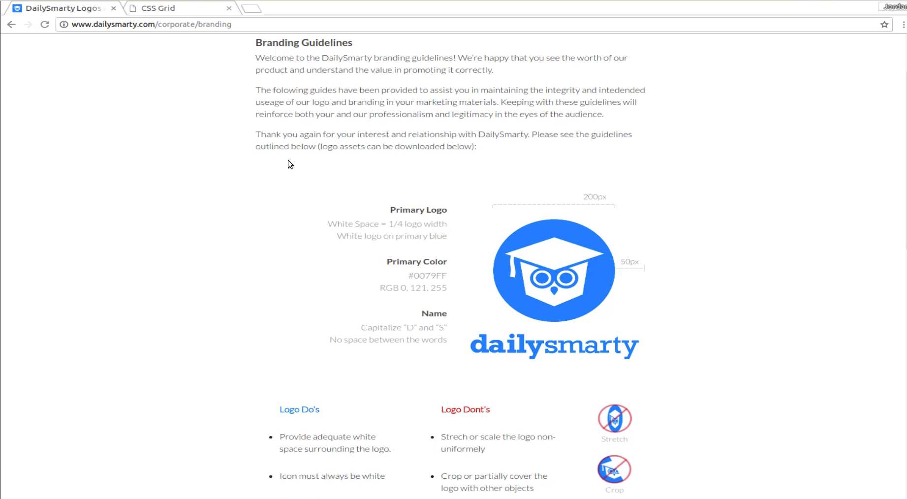

That's why I'm going to be using it. And so one of the top questions that you should ask yourself whenever you're building out the layout is if you should be using flexbox or if you're going to be using CSS grid. What my personal rule of thumb is that when I think about my components in regards to columns and rows then usually that means that I want to use grid. And that's exactly what we have here. 

So we have this text and then we have this image and these are into columns if you want and you can draw lines right here and you can see there is a definite break between these two and they're going to be sitting side by side. So I think this is going to be a perfect example for our basic CSS grid and for our first one. Let's switch over here and let's switch into the code and we'll start building this out.

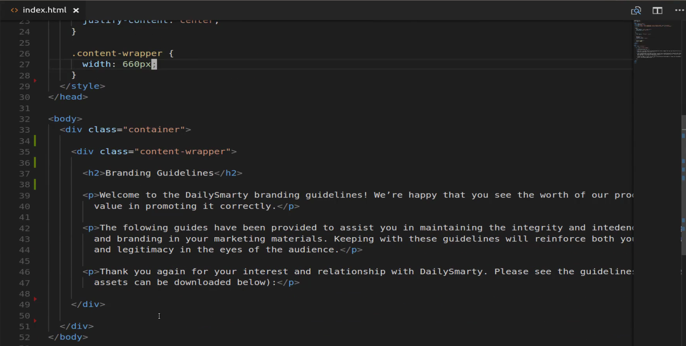

So when I'm first going to do is right below `content-wrapper` I'm going to add some more **div's**. The very first one is going to be a **div** and I'm going to call a class on it called `style-details`. Then inside of here, this is where everything's going to live. You know create the left column which I'm going to call `style-details-text`. And then that's going to be where all the text goes. And then right below that, that's where I'm going to place the other column. So for this one, we can say `style-details-logo`. And that's where we'll place the image.

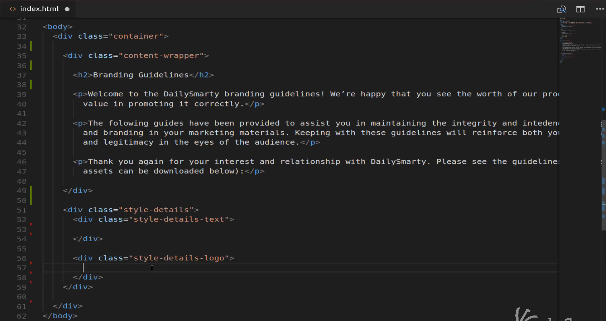

Now I can switch back over here and go to the final version of the app and we can copy all of this content and switch back and inside of the text. You can just paste that right in. 

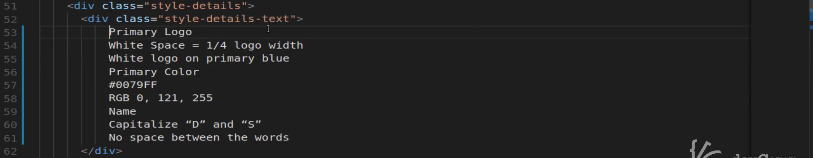

And each one of these is going to be its own heading and then its own **div**. So here all say this is going to be an **h3** tag and then each one of these is going to have a closing **h3**. So that's going to be the case for a primary logo. And each one of these subheadings. We have primary logo, primary color, and name. So let me just separate these out so we don't have any kind of confusion.

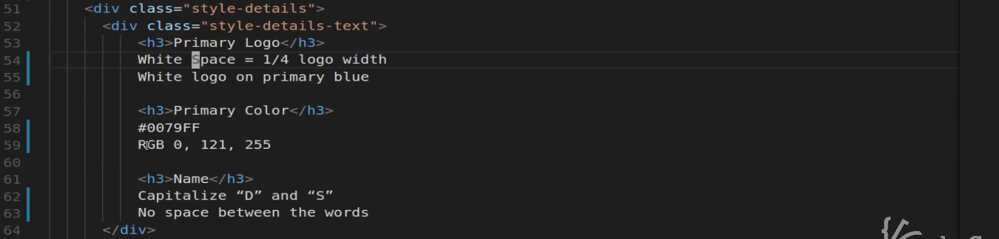

Now for each one of these, I want these to actually be **div's** so don't make these paragraph tags or anything like that. I'm just going to do both of these at the same time. Ok, so sorry that took a little while but whenever you're typing out like that sometimes they do. 

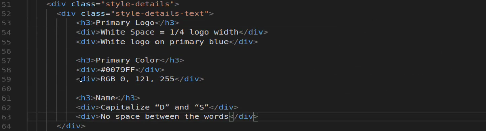

So now you can see that this is definitely not what we are looking for. And that's perfectly fine. We have to add any kind styles or anything like that to yet. But you can see that it is picking up the heading. And each one of the divs is on its own line below it.

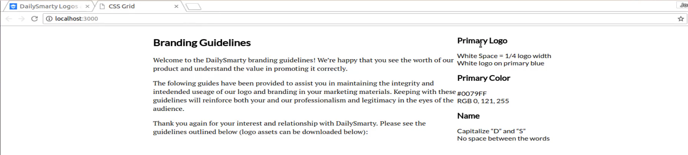

Now let's also add the image here so that we know what that is going to look like. So here I'm going to pull out the image and then the source on this is going to be inside the images directory. And I want to get that logo with margin ones so if you pulled that down you should have access to that as well.

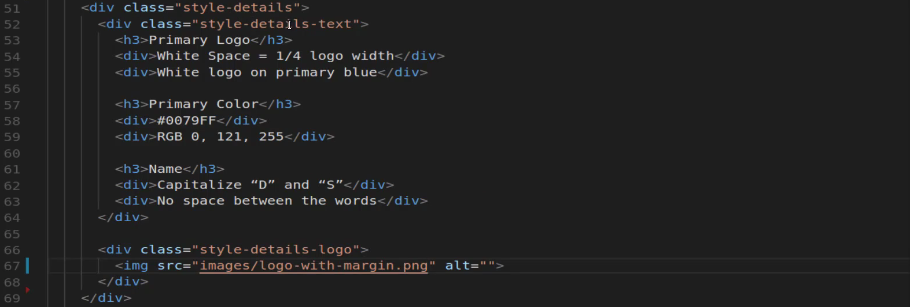

If we switch back now you can see that this is right here. So this is good but obviously this is looking much different than the final version. So let's get started on actually building that out.

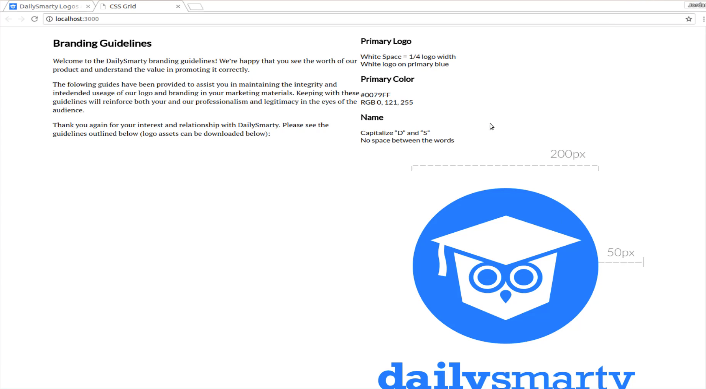

So we have our `style-details` here. That's going to be our wrapper. Then we have style `style-details-text` and `style-details-logo`. Let's get started and let's start building those out inside of our CSS. Now I'll start off with `.style-details` and this is going to be our grid wrapper or grid container. The way that you can call this is to say `display: grid;`. So it's very similar to when you are creating a flexbox container. So as you notice they are on line 22 when we wanted to create a flexbox container you'd say, `display: flex;`. Whenever you want a grid container you say `display: grid;`. 

Now we want our grid container to have two columns. And so the way you can set that up is by saying `grid-template-columns`. You can see we have a few different options here. We're going to go with columns, and then I want to go with two columns, and then you have to define the width of those columns. So I'm gonna say **1fr** and then **1fr**. Now if you've never **fr's** before. What they are is it stands for a fraction or a fractional unit. So what this means is that by saying **1fr**, we mean that we want to on both of these for them to take up the exact same amount of room.

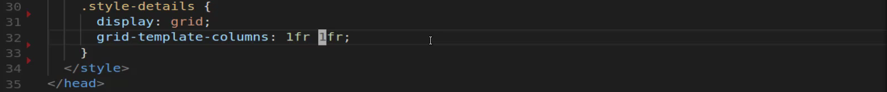

Now when we move down to later on in the project what we're going to be able to do and let's go look at what we have here. We're going to use in the next component, we're gonna use CSS grid here as well. But we're going and we're gonna have three columns. But the first two are going to be quite a bit larger than the last one. And so I thought it'd be helpful to have both of these so you can see them right next to each other and that you'd be able to tell the difference.

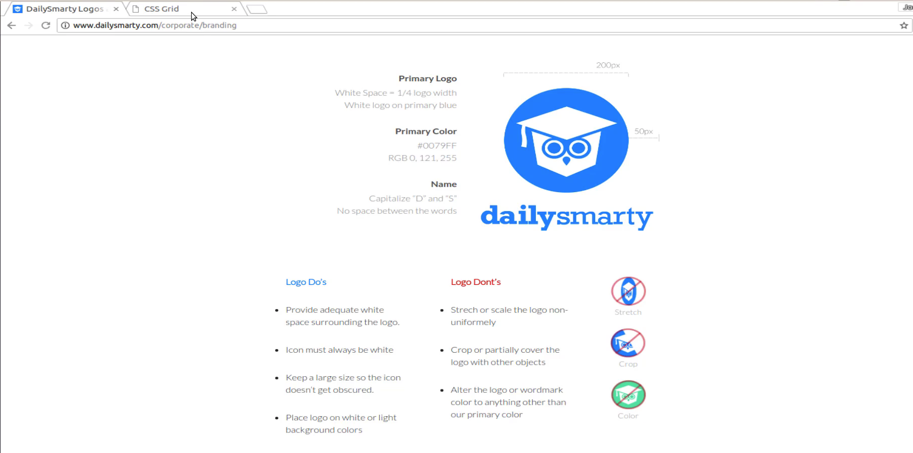

So now that we have that we are making a little bit of progress still quite a bit of work to do but at least you can see that now the primary logo, color, name, all of these text details. It's now sitting right next to that image. So so far I am happy with that. Now let's come over here and let's add a few more styles and then we'll take a break and we'll keep on working on it. But the next thing that I want to do is I want to style that image. So I'm gonna say `.style-details-logo`, and then inside of that is the image. I just want to say width of 100 percent.

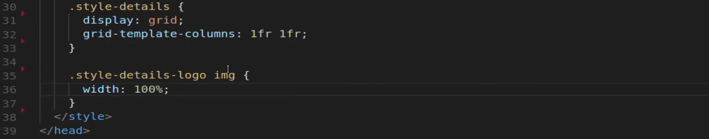

Now if I save and come back you can see that shrunk the image. 

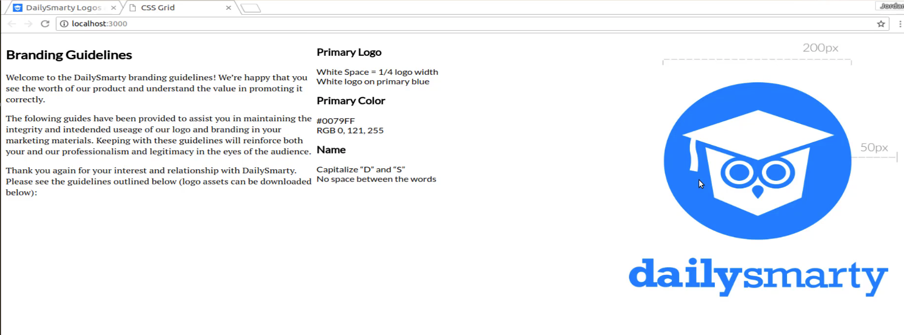

You may think that this is curious, you may have thought that the image we had before is already at 100 percent but by default what HTML does, is if you don't pass in any kind of image value, it's simply going to show the image at its full size. So if you put in a giant image it's going to show up in that giant spot it's going to overrun on the grid container. But what I've done is I've shrunk it so I've said how big that grid column is. I simply want you to fill up that one column and that is it. So now we have the size it's a little bit closer. We still have some more work to do.

We need to be able to shrink all of this so that it sits down right below our branding guidelines and it follows a path of all of the other content like we're going to have right here. I think this is a good spot to stop because we now have at least the basic way that the basic setup for using CSS grid and in the next guide we're going to start cleaning this up. 
