# 01-024:   Nesting a CSS Grid Container in a Parent Div and Grid Gap Introduction

So if you come back here you may notice that what is containing and wrapping all of the content or should be. Is this `content-wrapper` that has a width of **660px** our grid container was made outside of that. So what we need to do is to take everything inside of this style detail's class here and we simply need to move it inside of that container and then you can indent it if you have prettify or anything like that and it should happen automatically. 

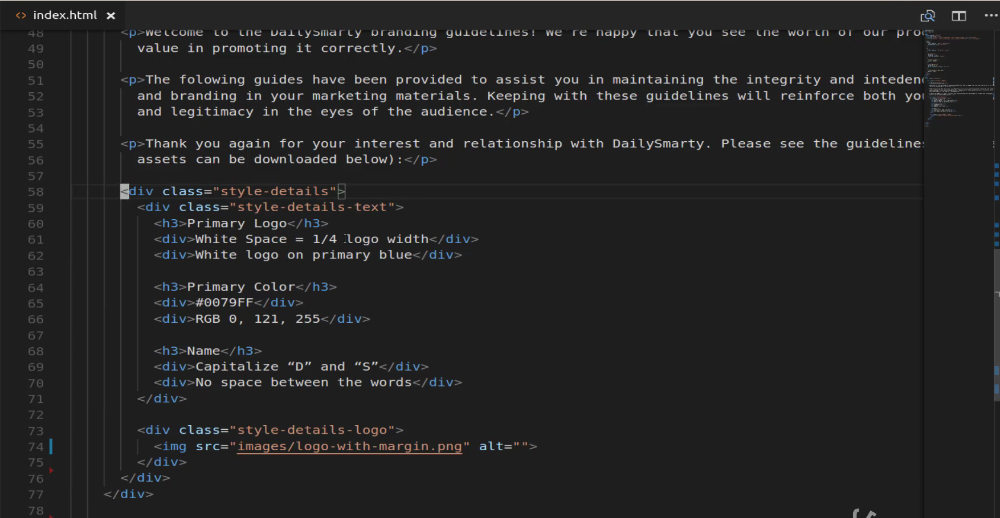

And if I do that and hit save you can see that it's already looking much better.

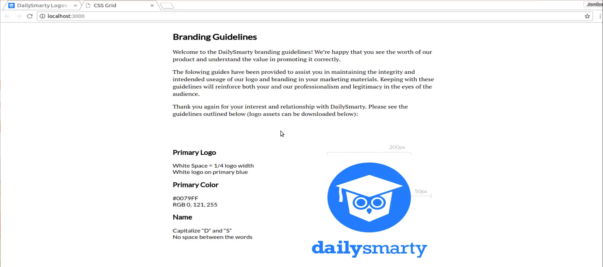

So now that we have that in place we can also set up some of the other styles that we need. So switching back to what we're building out you may notice that we have some different coloring here going on for this content and then it's also moved to the right. So there are a number of different styles we need implemented in order to clean this up so now that we have our layout fixed.

Now lets come up here and start building out those additional style details. We have style details and then we have a class called `style-details-text here`. So let's first attack our `style-details`. We created our grid container here, but we have some other things that need to be added. I'm going to add a `margin-top: 75px;`, we're also going to do the same thing for the bottom.

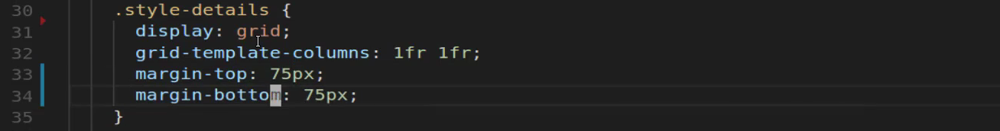

Not sure if you noticed when we had our production app there is a really nice and pretty big amount of space right here above and below that container. So I'm going to add those in and save and you can see that that gives us much better space right there. Now we already have our grid. And then we have our grid template columns so everything is good on that side. Now we're also going to have one other CSS grid element here and that's going to be called `grid-gap`.

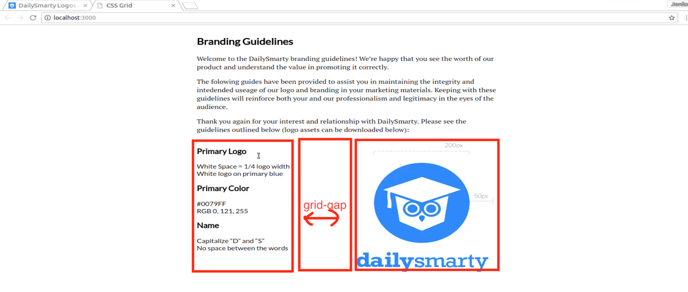

So when you have columns and so you visualized 2 columns right here. There is a gap that separates these two. And so we want to have a little bit of that here so I'm going to say that I want `grid-gap: 20px;` in this case and we can play with it later if we need to switch it up and there's not a big noticeable effect here. As soon as we move all of this content and we align it to the right that's where you're going to notice much more of the difference there.

So that's everything we need to add to **style-details** so now let's go and let's work with **style-details-text** and here it's going to be pretty basic. I simply want to align all the text to the right. Hitting save now and you can see this is looking much better.

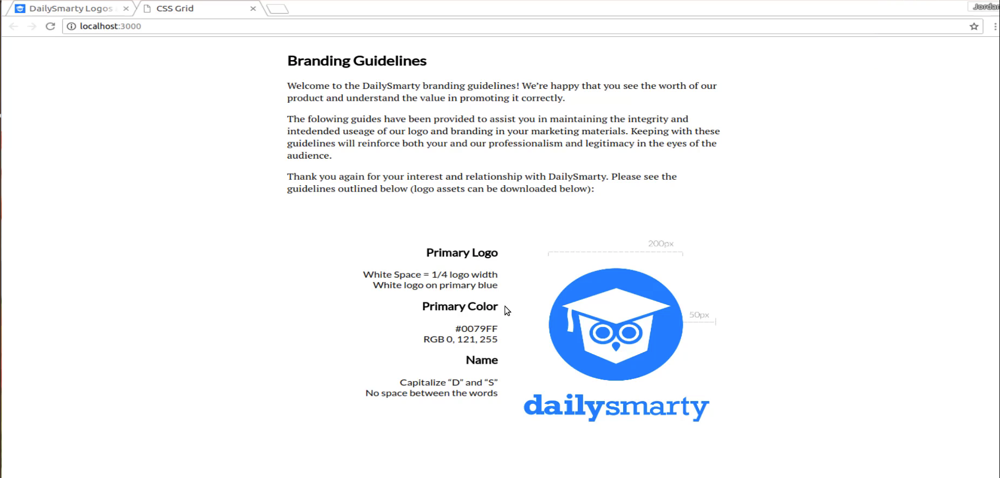

And so now we have our heading, and we have all of these elements and then it is butting up right next to the logo. Now if I inspect this here you can see that if you're using a tool such as the browser developer tools with Chrome and Firefox. Anytime they use grid you're going to notice something pretty cool that they've added recently. You'll notice those purple little lines whenever you hover over it. As you can see those purple dotted lines those represent our grid columns and so because the front end development community has really been embracing tools like flexbox and grid.

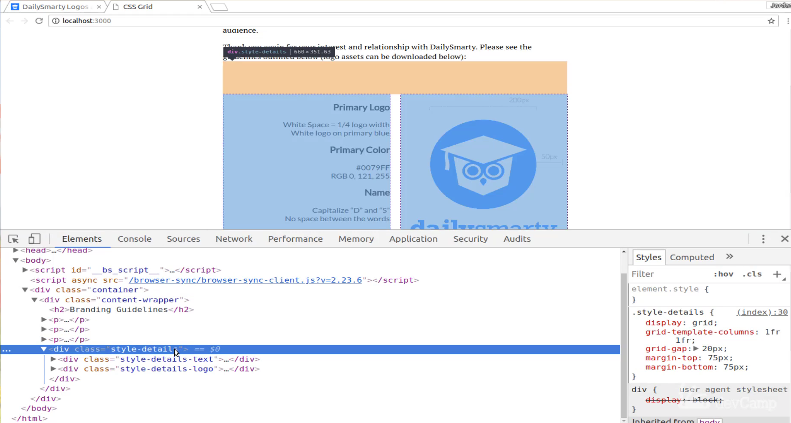

Lately, they're adding these into the browser development tools. This gives you a really clear visual on where the columns are and how we've set up our container. Notice that white space right in the middle between the primary logo color and name and then the actual image that white space between the purple lines. That is our `grid-gap`. So when we created that `grid-gap` that is what we had. And we can test this out because if I come over here and I remove it you can tell that something changed there.

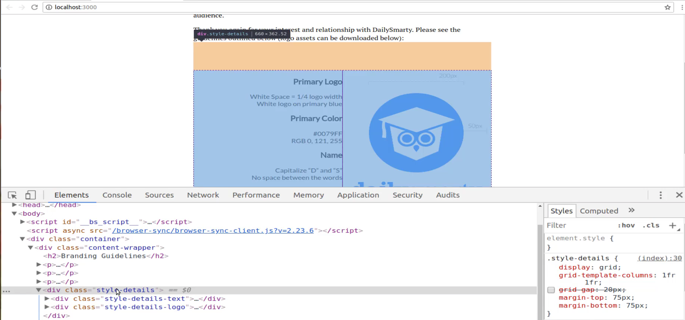

They both grew closer together. But also if you come in hover over again now you can see that there is no gap there. So that's a really nice visual way of being able to see what grid-gap does. So that is looking really nice I'm happy with how that's looking. So now what we need to do is to change the color of this content. Because as you can see we have a much lighter color here. And if I inspect this, this is going to tell me the actual color that we want. 

So this **#808080** and then the font-weight here is normal. So what we want to do is to add those styles down here. So let me just paste this in just so I have it and now I'm going to add in that color we want. Then I want the font-weight to just be normal.

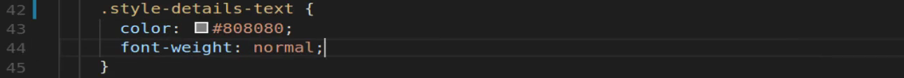

Now if I hit save and come back you can see that that's looking a little bit better. But notice that we also changed the heading color and that's not really what we're looking for. And it's because I actually forgot something I want here. I don't want to change all of the colors I just want to change the **div** colors. So save now and there we go. That is looking much better right there. And as good as this is looking we still have a few more things.

Let's go back and look at the final version you can see here that we have some more space between the heading and whatever content is below it or above it. And so that's what I'm going to add is I'm going to select this item here. And I'm going to add some top margin to give us some nice spacing. So let's come down here. I'm going to select it and this time I'll remember to actually come and add to in the full selectors. So instead of a **div**, I'm looking for the H3.

Then I'll just say margin-top and then we can go with something pretty simple like 30 pixels.

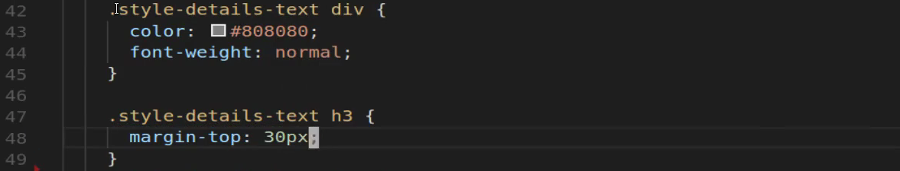

So now if I hit save you can see. Let's see. So that got us a little bit better. And so it's up to you if you want to change that. And if you want any more than that I think that that's looking pretty good. And in fact, if I use the browser tools here you can select it and then change this to be whatever it is that you're looking for. So I have my primary logo. Notice that it has by default some margin on the bottom. That's why we have this space here. And then we added margin to the top.

So if you wanted to play with it you could say `margin-bottom: 0px;` and that brings them closer together. I think I like something like that a little bit more. I think that looks good. And for the margin-top you can even play with this a little bit if you want that to be 40 then I think that might be a little bit better fit. 

So 40 and then 10 and I think that looks nice. So here let's come back and change this so I'm gonna go 40 for **margin-top** and then **margin-bottom** is just going to be 10.

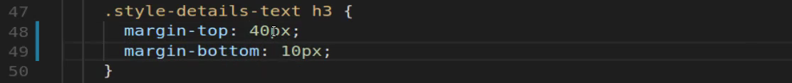

I'll save that, and now you can see that we have much better-looking component here and we are able to use **CSS grid, grid-gap and columns** in order to build out this entire component. 

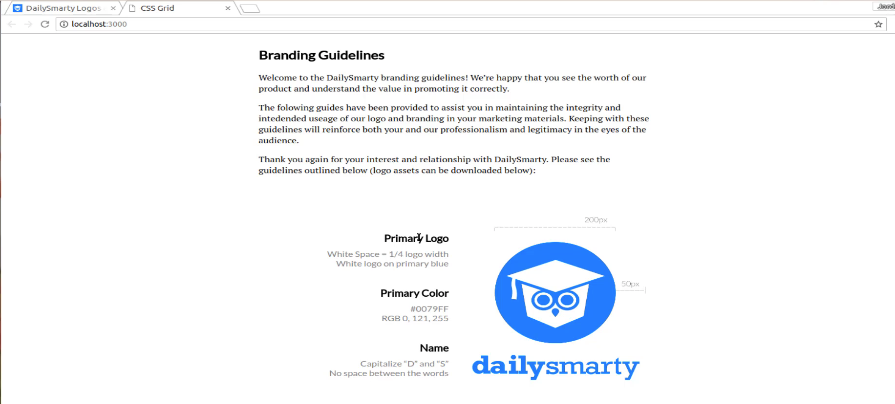

Now in the next guide, we're going to walk through how we can move down the page and we're going to build out another grid container here. But this is going to be one with three columns and they're going to be of different sizes so we'll see you then.
