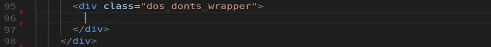
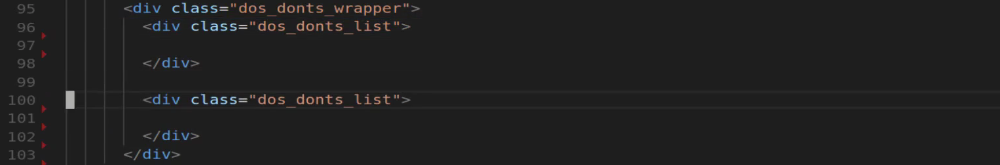
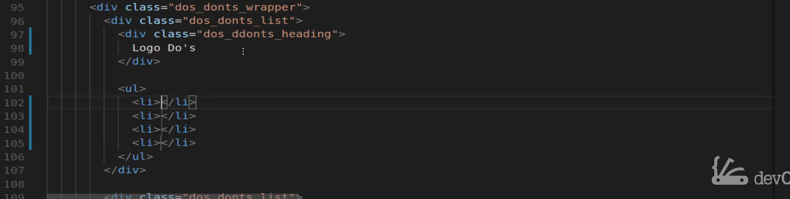
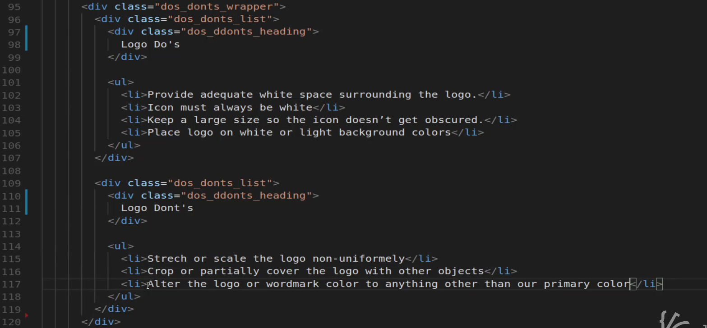
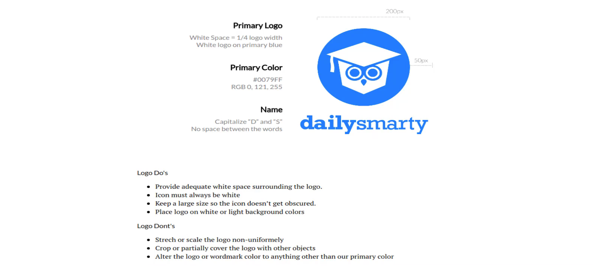
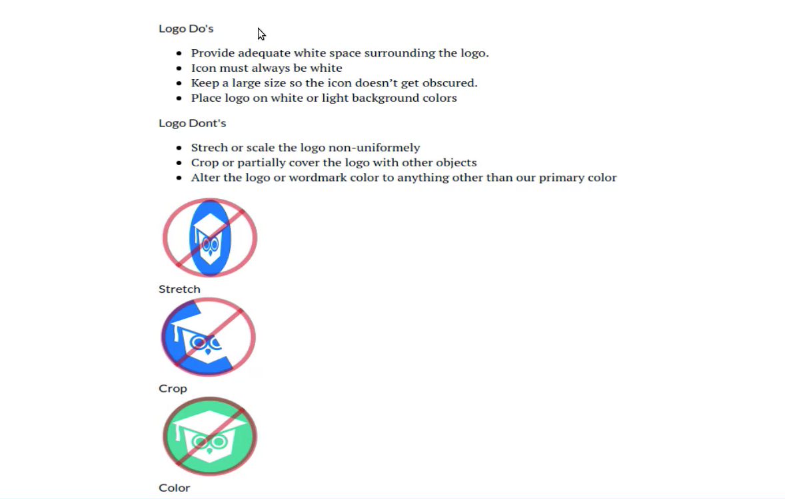
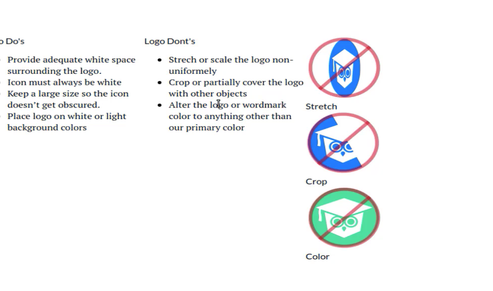
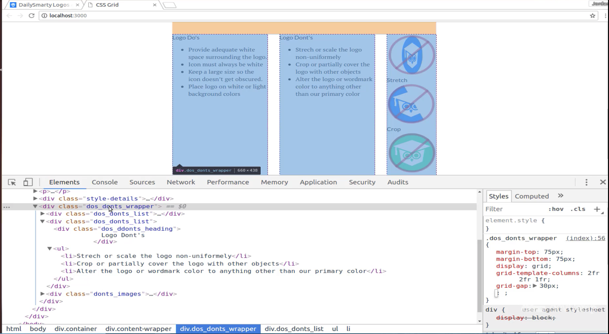
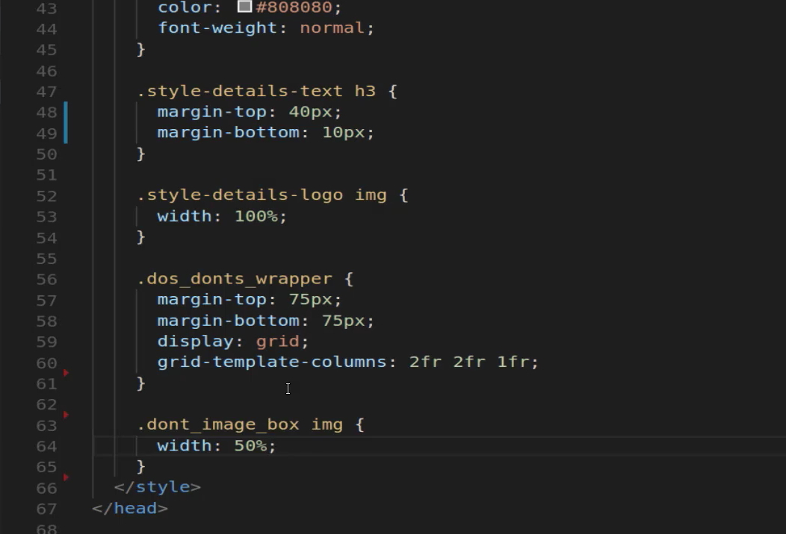

# 01-025:   How to Create CSS Grid Columns with Different Widths

This is going to be a very common type of use case, where you need to have a situation where you have content on the left-hand side, content on the right-hand side and you want both of their sizes to be the same. That is what we implemented. So this is something that you're going to be able to use on projects for years which is nice and helpful. If we switch here now you can see what the next grid we're going to create is a set of do's and don'ts and then also images.

So we're going to extend our knowledge though this time instead of simply having two columns. We're going to create a new grid container. It's going to contain three columns one with a list of do's. Another with a list of don'ts and then images. Now the key differences here is its not just having three columns but we're also going to dictate a different size for one of the columns. 

This column of images so let's get started on that. I'm gonna come over here and let's see what we need to add in. If we come down to the bottom and make sure that you are now going to place all of this inside of that **content-wrapper**. So you can follow that indentation down right here. And let's get started.

So I'm going to create a class here. I'm going to call it **dos_donts_wrapper** and everything's going to be able to be placed inside of here. 

Now we have a couple of different components, so we have a list of do's and we list have a list of don'ts. So let's decide how we want to actually list those out. I'm going to first start off by saying I want to have a **dos_donts_list** class and a div. So the lists are the first list is going to be contained inside of here. But then I'm also going to be able to reuse this class so I'm going to be able to have the exact same type of behavior right here.

And the reason why I'm doing this is because if you look at the end goal we're looking for we have do's and don'ts and they're pretty much identical. The content is going to be different but they're going to be the exact same size. They're going to contain the same types of elements and we can treat them the same way. So there's no reason to create a different class for this left element and then a different one for the right.

So with that in mind, we can keep just do's and don'ts list and keep them exactly the same. Now inside of here, we are going to have a heading. So we're going to say **dos_donts_heading** and then inside of it let's just place in what we want. So I'm going to just say "Logo Do's". Then we can copy this and this one's going to say "Logo Don'ts". Now underneath that we want to have a `<ul>` and then inside of that `<ul>` tag, we want to have 4 `<li>` tags.

And if you have **Emmet** on your system you can type it out (`ul>li*4`) just like that and it's going to create all of that content for you. Now I'm just going to copy these. One at a time. And then you can just paste each one of these in. And that's going to allow you to make this a little bit more efficiently than trying to type all of it out by hand. Also, get in the habit of using tools like Emmet because if you're building out big front end applications you don't want to spend all your time writing and remembering boilerplate code. It's a lot better to get right into being able to build your systems out.

So here we have a `<ul>` with three `<li>` tags, and let's just go and copy each one of these. 

Let's save this and let's take a look and see what it looks like. OK. So so far so good. Now notice that these are simply stacking on top of each other. That's because we have not created any kind of columns or any type of grid component yet.

And before we get into doing all of that let's add in these images here. So you can come back and if you open up your images directory you should have a list of `don't`. So we have **dont_color.png**, **dont_crop** and **dont_stretch**. So let's come down below this div right here. We're going to add one new one. Right here I'm going to create a wrapper div for those images so I'll say `.donts_images` and then inside of here what we're going to be able to do is add each one of those images. I'm going to create what I call an image box because if you notice not only do we have an image but we also have text right underneath that. So I want to create another wrapper here. And just a little side note if you think that I'm using a lot of divs there is a good reason for that. I once had a person that I learned a lot of my front end development skills from telling me that he has never run into a situation where he had put too many divs into a program whenever he was running into bugs or when something wasn't looking right on the page. It almost was always because he wasn't using enough divs enough wrappers and enough kinds of containers. So I took that knowledge and so I am always trying to apply that. So any time that you have a situation where a component is not working the way you want it to it's not lining up right. Usually what it means is that you need to look at your architecture and how you have your **divs** and your **span** and all your **components** structured to see are they nested properly are they you know do you have the child and the parent divs in the right spot. Those kinds of things so I like to take an approach where I have as many divs as possible because then I always have something that I can select in that I can work with. 

So inside of these dont_images, I'm going to create a class called `dont_image_box` and inside of here, I'm going to have an image. And so let's go into the images directory and I believe that first one if I remember correct was `stretch` and then right below that I want to have another div here and it can just be a plain one no class or anything needed and we'll say `stretch`. Let's come here and create just a few more of these for each one of these images. So the next one, if I remember right, is `crop`. So we are gonna say `dont_crop`. Yes, that's correct and change this content to `Crop`and lastly is `color`. So the next one is going to be `dont_color` save this and let's come back and see what this is looking like. 

Okay, so this is bringing everything in properly. And this is once again the default behavior. So whenever you're bringing in divs the default HTML behavior is that it is simply going to place them right on top of each other like we have right here. 

So let's now implement our grid so that we can get this kind of setup. Switching back if you come to the very top you see that we have this do's and don'ts wrapper. We're going to copy that and coming down here at the very bottom I'm going to start creating our grid container. So first give us some margin so we'll say margin-top go at that same 75 pixels and then margin-bottom will also be 75 pixels. That's just going to give us some separation between the other containers. Now next let's get into implementing grids so I'll say `display: grid;` and then here this is what's going to be a little bit different. I am gonna say `grid-template: columns;` and instead of just passing in 2 now we're going to pass in 3 and I'm gonna change the sizes. So if I wanted them all the same size I can say `1fr 1fr 1fr` and save this and then as you can see this gives us kind of what we're looking for if you notice it's starting to resemble this layout a little bit but definitely has some room to improve. So let's come back here in the way that you can change a column is simply by changing this fractional size. So if I want the columns 1 and 2 to be twice as large though twice as wide as column 3 I can change these fractions. So this one says 2 and this one says 2. And now if I hit save and come back here you can see that that has shrunk that size. Now we still have to do some work on the image but as you can see our columns now have the right kinds of with.  

Let's now also inspect this and see what kind of grid-gap that we want to implement. So let's select our `dos_donts_wrapper` and you can see that right now there is no gap. We can come down here and test it out to see what kind of size that we think would work. So I will say `grid-gap` start off with 10 pixels. It gives us a little but it's not really what I'm looking for. So let's increase that by quite a bit and let's go with that 30. I think that's going to be a lot better. So now you highlight it you can see that we have much better space in between each one of those. And now you can also see the difference in the size of those two columns on the left have they are double the size of the column all the way to the right. So that's how you can create a container that has columns and they are all different sizes and you can change which one is bigger and which one is smaller. 

So let me close this off and lastly before we take a break we're going to do is update these images and these sizes here. So I am going to come over here and let's define this class will say `dont_image_box`and we also want to select the image and we'll say width and make this 50 percent and hit save. 

Now you can see that that's much better. Now we're going to align this better and we'll make some changes right now and this is still very raw. But as you can see by just adding a few lines of CSS grid code we were able to go from some very ugly looking bullet points and images all stacked on top of each other and were able to define a grid and we are able to define one that is much more advanced than what you would usually be able to do if you tried to create float's or add floats and then define the width of each one of those manually. Here we are able to just say you know what CSS grid I want you to give me three columns and I want the first two to be twice as big as that last one. And that's one of the reasons why I absolutely love CSS grid because it allows me to very quickly and easily set up the layout on the page and as we get into more and more advanced projects you'll see that that same syntax that we use is going to be reused over and over again.  
