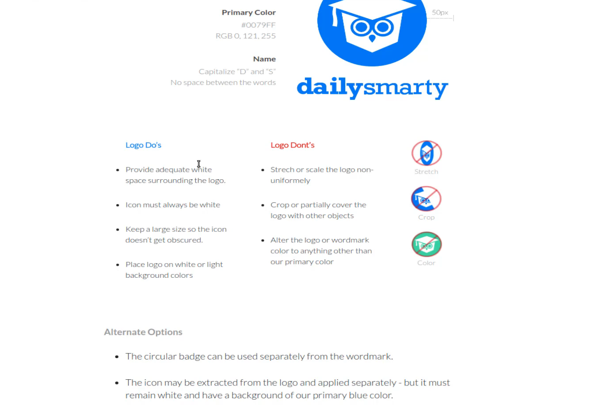
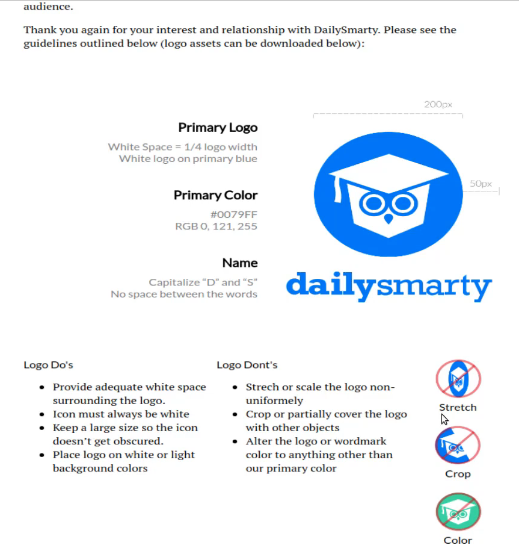
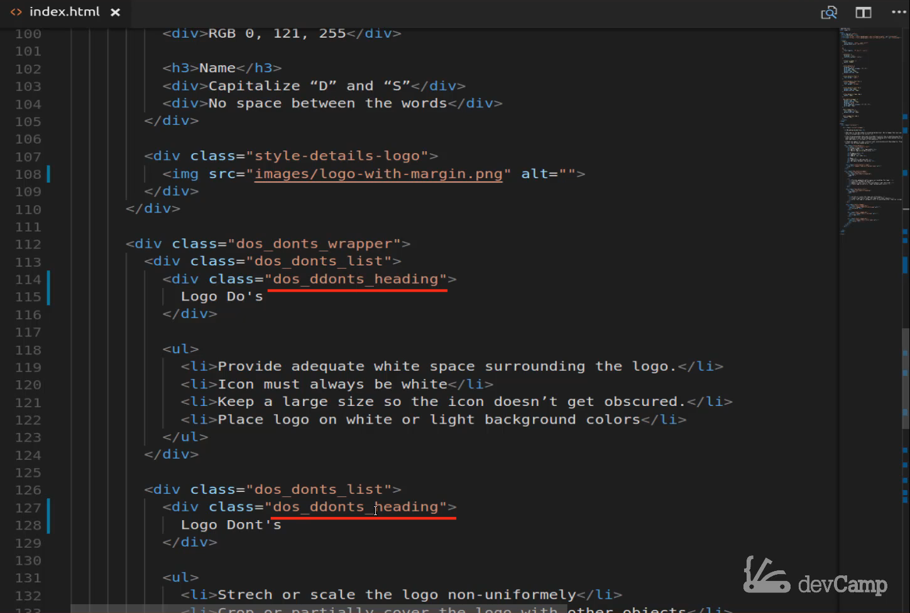
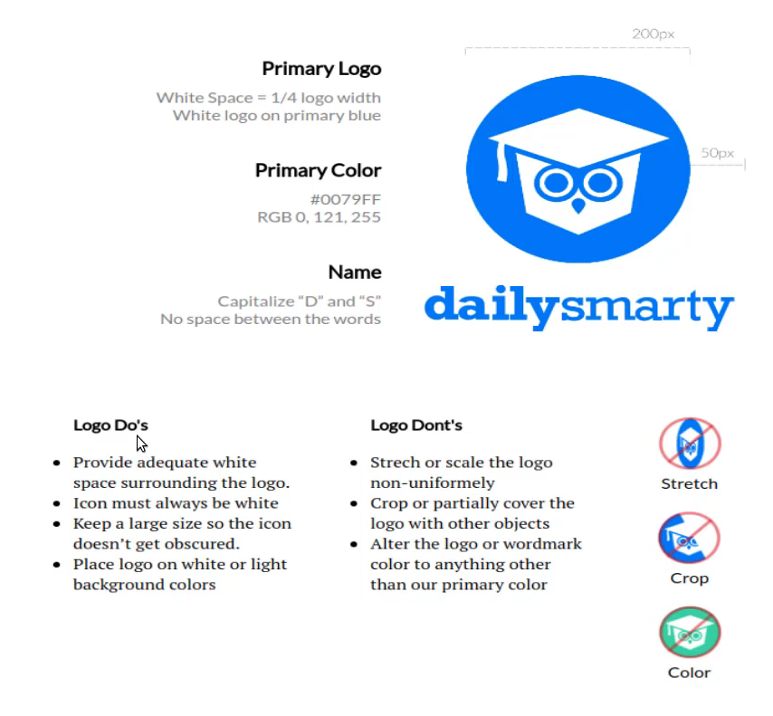
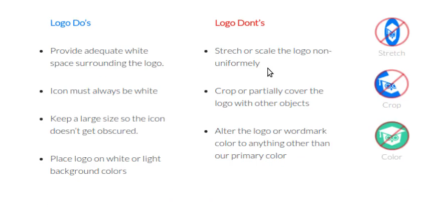
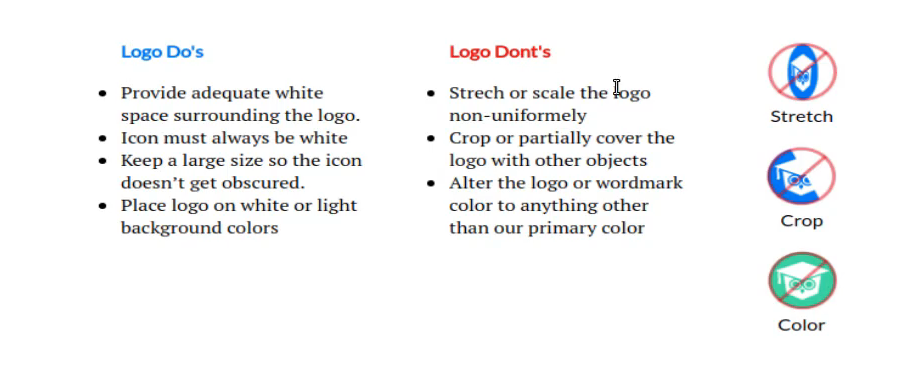
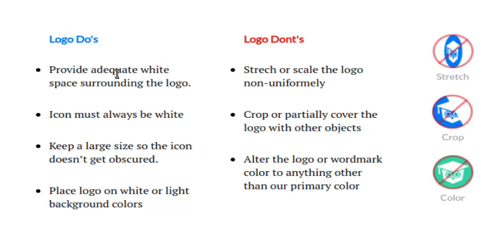

# 01-026:   Adding Custom Heading and Bullet Point Styles in Grid Columns

So technically what we're going to be doing in this guide and maybe even the next couple guides don't really have a lot to do specifically with CSS grid but it does have to do with CSS and implementing and working with programs that use CSS grid. And that is critical and that's part of the reason why I designed this course the way I did was because in real day to day development you're not going to have a tutorial to follow and you're not going to be able to say OK have this type of layout and I need to go and I need implement just CSS grid. 

But instead what you're going to have to do is you're going to have all of these components that you're going to have to add to the page and some of them are going to use grid, others of them are not they're going to just use other CSS style definitions. And because of that, you need to switch and to be able to move interchangeably between those. And so that's a reason why working on real projects is how I opted to go with this specific course because I think this is going to give you much more of a real-life use case of how you're going to do this in your own projects. 

So with all of that being said let's look at the goal. The goal is to get our new grid container to look something like this.



So we kind of have that but there's still a lot of work that we need to do. So first let's attack these images and this text I want to get everything moved over. But I don't want to use tools like margin-left on these you have to use margin-left on these headings because we want this text to line up with the bullet points. 

But here what we're going to be able to use is just some pretty basic Centering techniques. So let's switch back to the code and you can see that we have our `.dont_image_box` right here. Well what we can do here is I can come to the `.dont_image_box` and instead of selecting the image, I'm going to select the wrapper its part of the reason why I love working with wrappers as much as possible because it gives me a lot of control. 

So I'm going to start off by saying text-align center and then I'm just going to add some margin on the bottom. So we can say 20 pixels and see what that looks like, save it and now you can see that this looks so much better already. 



So now we have all of our images are moved in the center. We have text that's in the center if we inspect this now as well. And if we take a look at the way the grid is working you can see that that is definitely looking much better. Now one thing it looks like I forgot to do in the last guide we played around with the developer tools but I didn't actually add that great gap in yet.

So let's come up here so in `.dos_donts_wrapper` I can say grid-gap and let's give it that 30 pixels we talked about in the last video switch back and there we go we have a lot better spacing. And also if you look at our images there on the right-hand side you see how even though we just did text a line that took the image and the text and it moved into the center so we didn't even have to implement flexbox or anything like that. We simply were able to pass in that style definition and the grid element was able to handle the rest. So that is looking really good from a layout perspective I'm happy with that. 

So now let's get into what we need to do with these headings. So let's switch back here to our index.html go down to our HTML code you can see that we have a do's and don'ts heading inside of the list container. 



It looks like a spelling mistake here let's fix that and because I copied it I have it on both of these `"dos_donts_heading"` there you go. OK so now let's take this and copy it. Move back up and let's define what that heading should look like. So we'll say .dos_donts_heading and inside of here I want to give a little bit of a different font-weight so for this font-weight we'll say 900 so this is going to make it bold and then I want to add some margin to the bottom so this will give it some space between the bullet points and heading. And for that, I'm just going to do a little bit because I'm going to put a margin around the bullet points shortly and then I want to move it to the left and for that, we're going to need about 40 pixels of space. 

#### index.html

```html
.dos_donts_heading {
	font-weight: 900;
	margin-bottom: 20px;
	margin-left: 40px;
}
```

And you can see that that's looking much better. 



So you can see that this looks much more like the mocks than what we had before. Now one thing you may notice though is we have color here we have this blue here and then we have red for the don'ts. 



So what we can do is we can just create a class and add a different class to one than the other. But one thing that you may have been tempted to do if you tried to do this by yourself is you may have created something like a dos heading or something like that and then copied all of this code and then created a don'ts heading and copied all of that code and then the only difference would have been that you added a class of red to one and blue to the other. 

But a better approach is to create a wrapper like we did here and then what you can do is create another separate class. So here I can create one and this will just be called blue text and then I'll carry another one here and this will be called red text. And now these can contain those text color guidelines and we don't have to duplicate any of the code here. So now I'm going to just create those we'll say `.blue_text` and then this will be color of something that we will figure out shortly and then `.red_text` and then this will also be of a color we will figure out shortly.

#### index.html

```html
.blue_text {
	color: ;
}

.red_text {
	color: ;
}
```

And the way we're going to figure it out is by just highlighting this so I'm just going to click on inspect and it looks like we have this hex color for the blue `#0079ff`. So if I come up here and paste that in and then for the red one I inspect that we have this hex color `#dc0004` copy that and paste it in. And this is something if you have not used the browser inspect tools a lot they will become one of your best friends as a front-end developer. As you can see right there I didn't have to have the color in any of my notes or anything like that. I was simply able to come and inspect the element on another page and then I was able to grab that color and you can use this obviously for everything else in the page. 

When I'm building out applications for clients or for devcamp or anything like that and I'm focusing on the front end components I typically have the browser developer tools open at all times because I'm constantly opening them up looking at the elements making changes here to test them out and then switching back and updating the code itself. So that is going to be something that's very helpful for you. 

If I come back here you can see we now have our blue and our red. 



So this is starting to look so much better. So we really only have a few more things to update. So let's come back, we have our blue text and our red text and the next thing that we're going to want to do is grab these elements these list elements these li tags and then we're going to add some margin and also update their font size. 

So the way we can do that is let me copy that element so we have our do's and don'ts list I can just grab that. Apparently, I was already in insert mode and I will grab that come back up here, and then I'm going to select do's don'ts list and the li elements inside of it. And here we're going to add some margin to the top make that 30 pixels and then let's do the same for the bottom. And then I also want to shrink that font size so we'll update the font size to use 16 pixels 

#### index.html

```html
.dos_donts_list li {
	margin-top: 30px;
	margin-bottom: 30px;
	font-size: 16px;
}
```

hit save and there we go, this is looking much better it's looking as you can see here much more similar to what we have going on this site. Now you may notice that there are some slight differences and some of them may come across a little bit differently if you're watching on the video and you can see on the screen. And part of that is just because we're using a slightly different font for our project than dailysmarty does. 

And so I wasn't able to access that font directly for this project but lottos is very similar so the differences aren't really with our CSS as much as they just start with the fonts. So that is all we need to do on the bullet points. 

The last item that I want to address is we need to shrink and then update the color on these elements. So if you look over here you can see that these work more like just a little light subtitles under each one of these. And so what we can do is we can select those divs and then simply change the color and then also the size. 

so let's switch back and we have that `.dont_image_box` and so instead of just grabbing the image what we want to do here is to grab the div inside of it because if you remember we just put a very basic div inside of that image box so coming all the way down you can see we have that `dont_image_box` wrapper and then we have a div inside of it that has the text. 

So we can just select that div and that should give us what we're looking for. So coming here select the div and now let's update what we're looking for. And so I know the font size for this is going to be 14 pixels and then we'll use the browser inspect tools for that color. So let's highlight this inspect it. And so yeah so 14 pixels we already added and then this set of nines for the hex color come back and then with color paste it then and now we're good. 

#### index.html

```html
.dont_image_box div {
	font-size: 14px;
	color: #999999;
}
```

You can see that that has updated the color. 



And so hopefully you are seeing the process and this is very similar to whenever I'm tasked with building out my own projects and I'm using grid and flexbox this is following the same pattern that I follow when I build those out.  

So for example when I built out this design, the same things that we're doing are exactly what I did for the actual dailysmarty site where I went through I analyzed which elements needed to be grid containers which ones were a better fit for flexbox updated the colors check the design that I was shooting for and I kept on just switching back and forth like that. 

And so that's my personal process that works very well for me and has worked well for me throughout the years so hopefully, that's also helping you because this is the same process I do when I'm building out real-life applications like you're going to be building, so hopefully, you're enjoying that. 

In the next guide we are going to keep on moving down the line and we're going to be building out the very last grid container and that is going to contain bullet points with their own unique styles, different heading elements, and then we're going to test out and see how we can work with a repeating grid container like we have right here. So I'll see you then.
