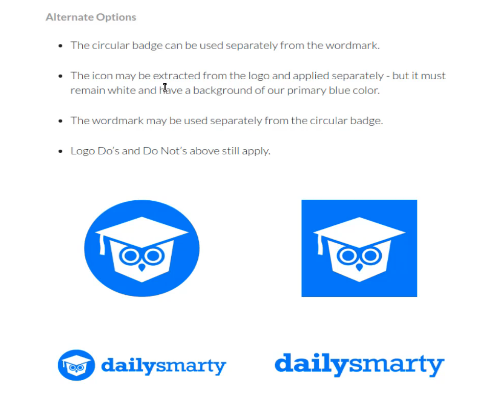
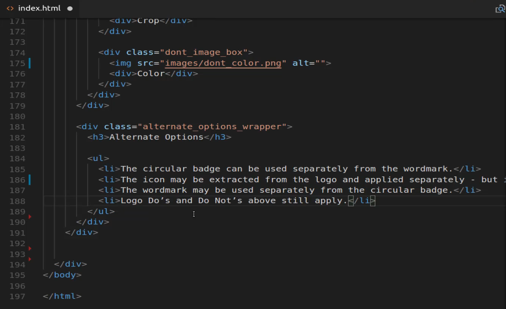
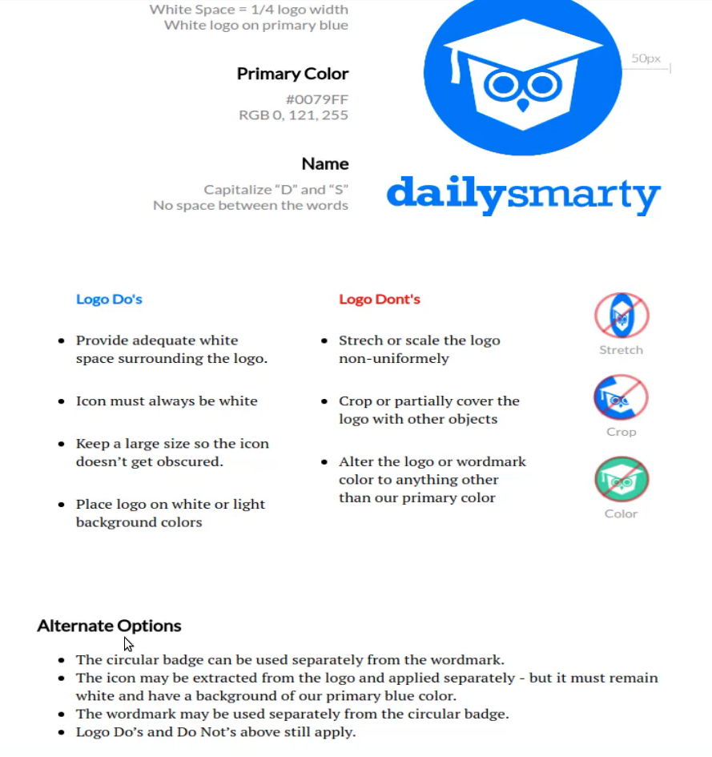
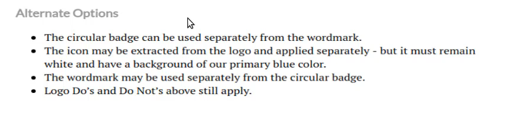
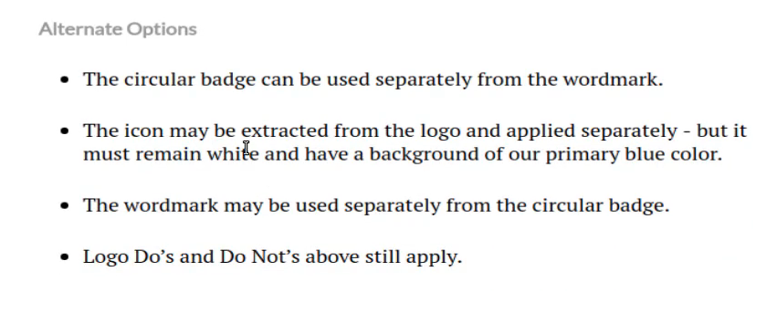
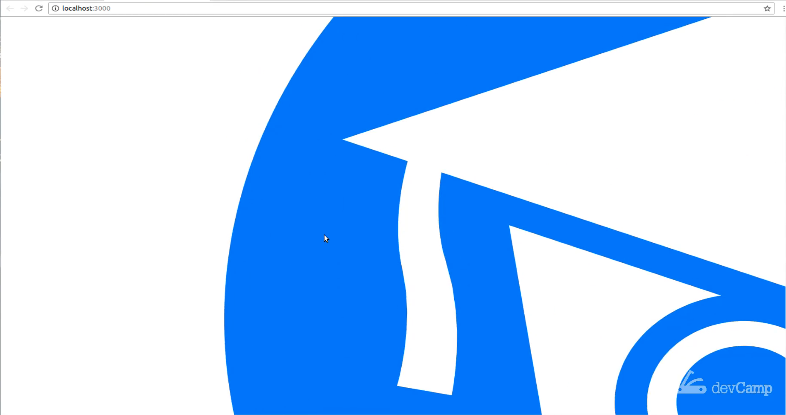
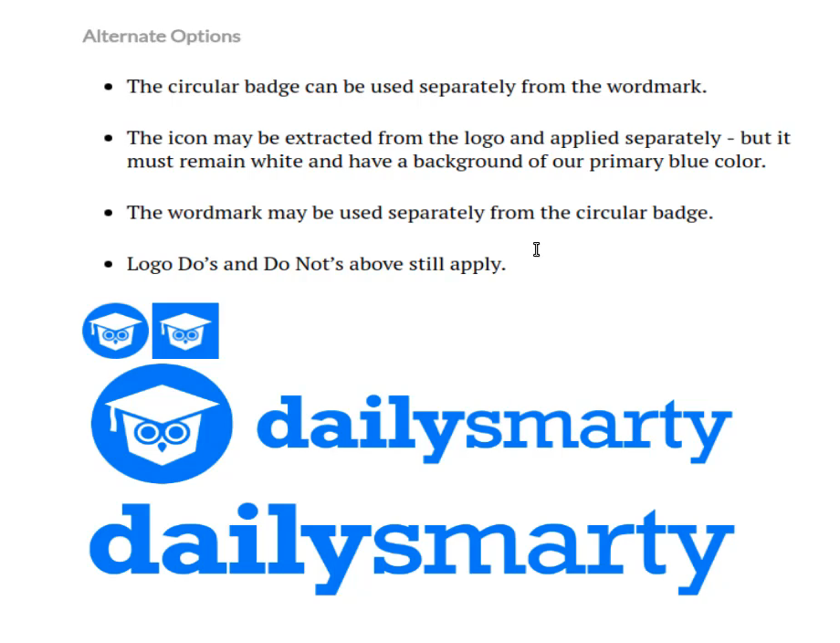
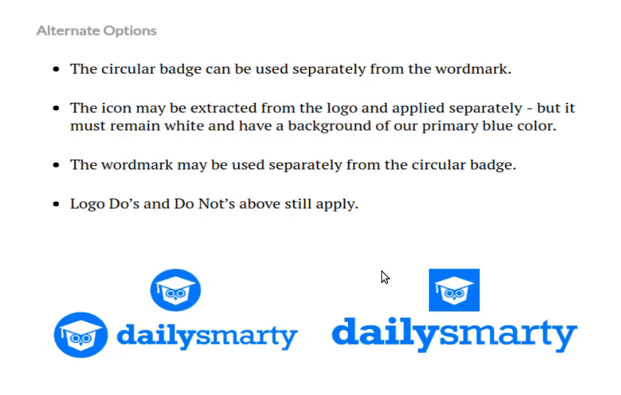
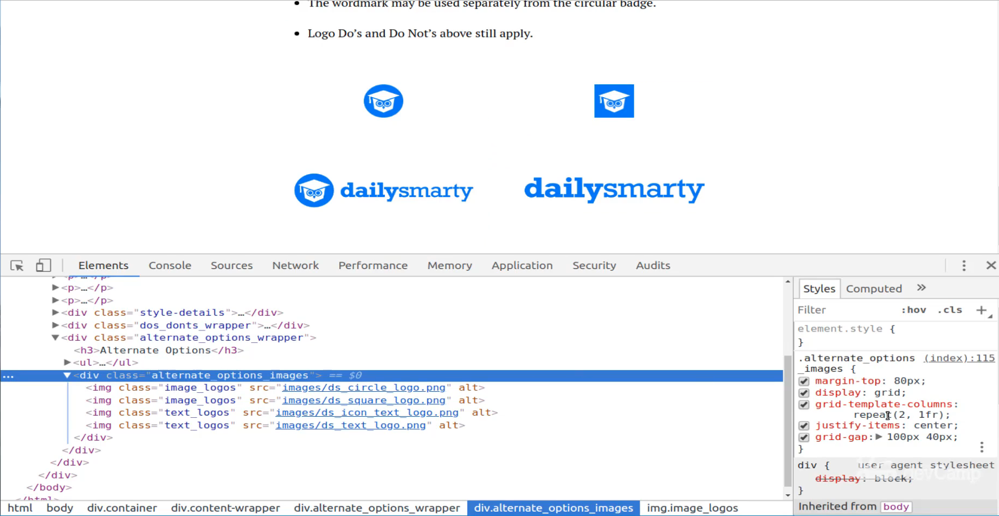
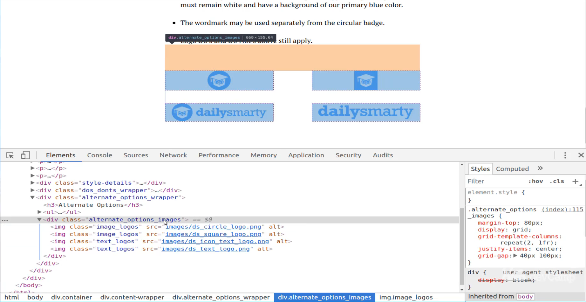

# 01-027:   Guide to the CSS Grid Repeat Function to Render a Dynamic Number of Rows

So this is going to be all our alternate options components going to contain a heading. It is going to have some large bullet points, notice these are larger than what we have right here. Then it's going to contain a nested grid container. So that's what we're going to have right here and we're going to see how we can use a different kind of container.

So up to this point, we've hardcoded in all of our elements so each time that we had a set of columns such as what we have here with our Logo Do's and Logo Dont's, we said we wanted three columns and then we dictated the size. And then when we wanted two columns we said we wanted two columns that were the same size. Well in a number of scenarios you may not know how many columns you have or I should say you may not know how many rows you're going to have. 

So we may want to for sure have two columns but we may have two images we may have six images and so we just want to make sure that we have two columns no matter what. And so that's what we're going to do and this is part of the reason why I wanted to use this as the introductory project that we're going to go through because even though this is a relatively small page we have three different CSS grid containers inside of here and they each have different behaviors.

We have a basic 2 column layout a custom 3 column layout and now we're going to have what's called a repeating layout here. And so that's what we're going to start building out. Let's switch to the code now, coming all the way down past our do's and don'ts. Let's make sure that we're going inside of the correct container. So yes we're going to be right here and now let's start writing out our HTML so I know that I want to have a div that wraps all of this up and I'm going to call this the alternate_options_wrapper it's just going to be a basic div and then it technically is not going to be a grid container and the reason for that is because I don't really need to have this heading and these bullet points inside of a grid container 



they can use the basic default HTML basics where they are stacked on top of each other just like this. We don't need the CSS grid behavior until we come down here. So I'm not going to make our alternate_options_wrapper a CSS grid container instead I'm just going to treat it like a normal div. And inside of it, we're going to have a few things we're going to have a heading component and we'll just call these alternate options. 

And then below that, we're going to have a bullet point list and this is going to have four bullet points I believe we can just multiply them out like that. And now we can copy those in so we are going to have the circular badge text and then we're going to have this one and then the third one and if you're curious on why I'm wanting to use real content where it is really easy to just use lorem ipsum. 

The main reason is because if you're going through this and you're wanting to build out portfolio items at showcase how well you understand how to work with grid. This looks a lot better in your portfolio than if you simply have a bunch of lorem ipsum text because this is a real-life project. So that's that sort of reason why I'm wanting to do that. OK, let me just paste that in. OK, so we are good. 



Let's see what this looks like inside of our actual project. Scrolling down you can see we have alternate options. 



Looks like we have a good margin here and are heading also looks good. So first let's style that and let's also add in some of those custom styles that you saw here where we have much larger spacing and larger font for those bullet points. So we have `alternate_options_wrapper` and so I'm going to copy that and come down here. So first we're going to simply add any custom styles that we want right here it's going to be pretty basic. I'm just going to go with our same margin-top and bottom of 75 pixels. 

**index.html**

```html
.alternate_options_wrapper {
	margin-top: 75px;
	margin-bottom: 75px;
}
```

So this is exactly what we've used on each one of the other ones. Now if you're building this out in a production application then I would probably do something like build out a mixin that had these and include that mixin if you're using a tool like sass but for right now I'm just writing all this in pure CSS. 

So that's going to give us the spacing that we're looking for it also gives us a little bit better spacing there at the bottom. And now with that in place, we can grab the custom styles for that h3 so let me grab all of this and we don't need any of the margin and I also want to select the H3 tag. Okay so I'm gonna select the h3 and inside of here, I'm going to add a color of font size and a font-weight. 

Now I know that color is the same one that we grabbed before so we don't even need to go look at it, its that #999999 so it's kind of grayish or dark charcoal color. And then I know for the font size we're going to want to go with 18 pixels and then we want this to be bold so font weight should be 900.

**index.html**

```html
.alternate_options_wrapper h3 {
	color: #999999;
	font-size: 18px;
	font-weight: 900;
}
```

Hit save and there we go. 



So that alternate options is now looking much more like the actual production app that we're trying to have. So now that we can do that we can come and style the hl tags copy those and then instead of grabbing the H3 we want the li and with that li if you remember I want to add margin to the top and bottom. And then I also want to update the font size. I'm going to grab both of these copy them. You don't want 75 but we want 30 for each of these and then here I want the font size to be 19 pixels 

**index.html**

```html
.alternate_options_wrapper li {
	color: #999999;
	font-size: 18px;
	font-weight: 900;
}
```

Hit save come back and there we go, these bullet points are looking much better and they are matching what we have here with the mock. 



So we are on to the fun stuff which is actually building out our repeating grid container. So it's come down here and see what we need to do for this. So we need to make sure this stays inside the alternate options wrapper. So I'm going to come up right under that UL tag and now we're going to start building out the grid container itself. So I'm going to just call this alternate options images and so inside of here I'm just going to have four images. This is going to be image go to images and then I want this to be ds let's go with the circle logo first and then next is going to be the square logo and then next is going to be that DS icon text logo and last but definitely not least is the ds text logo. 

**index.html**

```html
<div class="alternate_options_images">
	
	
	
	
</div>
```

Now if I hit save and come back you can see. Oh my goodness. Yes. Like I said before when you bring in the image and you don't give it any kind of styles or anything like that or any sizing, then it's just going to go with whatever the default size is. And as you can see in this case that size is pretty large.  



Before you do anything else let's come and let's add some class values so I'm going to add a class to each one of these. So say class and these are going to be different. But for right now all name them all the same. So I'll say image underscore logos and the first two are going to be image logos and then these two are going to be text logos. 

**index.html**

```html
<div class="alternate_options_images">
	
	
	
	
</div>
```

And obviously we haven't created this class yet so this is just something I'm creating as a placeholder here. And what we can do now is come up and we'll start building out our actual grid container. So coming down below our other styles I'm going to create our alternate logo images class definition and we're going to start with a margin on the top and this is going to be pretty big we want a lot of space so I'll go with 80 pixels. 

This is going to be a grid container so I'll say display grid and then this is where it's gonna get a little different. We're going to go with our same grid template columns but instead of hard coding in the value, I'm going to use a function called repeat. So I'm going to say repeat (2, 1fr). 

**index.html**

```html
grid-template-columns: repeat(2, 1fr);
```

And so what this does is we're telling grid that we want 2 columns and we want this to be repeated so in other words if we have 20 images then that should give us 10 rows because it's just going to keep on repeating over and over again. So the 2 means that that's how many columns we want and then it'll repeat over how many ever rows there are. And the one fr are means that each column should be exactly the same size. So with that in place now let's save it and let's see what it looks like. 

Now because we haven't updated the styles it's not any different. So let's update those really quick. So I'm going to go `.image_logos` and we added the class directly to the image so we don't have to select the image. And so let's go with a width of 60 pixels and then for the text logos. It's technically still an image so I apologize if the naming is confusing but that's kind of the way I think of them. So I'm going to go with 90 percent here.

**index.html**

```html
.image_logos {
	width: 60px;
}

.text_logos {
	width: 90px;
}
```

And there we go are starting to get something that looks a little bit more like what we had in mind. 



So that is definitely progress, at least we can see all the images on the screen now. So the next thing I want to do is I want to justify the items so I'm going to say justify items. And so if you're familiar with flexbox then you know that you have justify-content. Well with CSS grid we can do something very similar and so here I can say justify items center and that is going to center these items and because of the size they are right now you can't really tell but for now, just trust me that the whole element is centered and then now this is going to be what gets us I believe where we need to go I'm going to use grid-gap but we're going to extend how we use them.

So grid-gap gives you the ability to have multiple arguments so I'm going to say 100 pixels and then 40 pixels hit save and oops we may have something wrong with the selector because that should have given us something more along the lines of what we're looking for. So maybe I am spelling that incorrectly, let's go and check. So alternate options wrapper alternate options images I believe that is the correct name for it but let's just check and see. Yep, that's the issue. So it's alternate option images. So it's come back and let's fix that. So coming all the way down options images and we'll copy that. Replace it up here and then we should get the behavior that we're looking for. So coming here paste that in and just get rid of that.

**index.html**

```html
.alternate_options_images {
	margin-top: 80px;
	display: grid;
	grid-template-columns: repeat(2, 1fr);
	justify-items: center;
}
```

Now let's come back and there we go, this is looking a lot better. 



So now that we have that I had undone the grid-gap just to make sure that I hadn't misspelled something so let's say grid-gap and place and what we had before 100 pixels and 40 pixels and then we'll walk through what that represents. 

**index.html**

```html
.alternate_options_images {
	margin-top: 80px;
	display: grid;
	grid-template-columns: repeat(2, 1fr);
	justify-items: center;
	grid-gap: 100px 40px;
}
```

So I've saved that and now you can see this is starting to look better it's not perfect yet we still have a ways to go but it is starting to get there, we're getting the same type of behavior that we had over here where you have four items and then you have two columns and then if you had more of these they just keep on moving down. So that's the really cool thing about using that repeat function.

Now let's inspect this and see what we're kind of dealing with here. So if I take alternate options images you can see that we have this grid has the margin has display grid as repeat 2 and then one fraction justify items in the center. 



That's how all of this is being centered and then the grid-gap is 100 pixels by 400 pixels. So what does that mean exactly? That's really important to understand this part because this is going to help you as you are laying out your own types of applications well what the 100 pixels represents is the space between the rows. So in between each one of those rows, the top, and bottom, you can see that there is quite a bit of space, in between the columns there is not near as much space. 

And that's because the column is that second argument. So if we were to switch this, so if I were to come here to grid-gap and say I want the first argument to be 40 and then the next one to be 100 then that would change the entire layout. Notice how now the columns are separated much more than the rows are. 



So if I select it you can see that that column has changed. So let me close out of that hit refresh get us back to where we were before and I think that's really coming along. We didn't get quite as far in this guide as I was wanting to but we're already around the 15-minute mark.

So go ahead have a break and then when we come back we're going to finish optimizing this specific grid layout and then we're going to add in the final components and then later on I have a little special treat for us. I am going to also walk through how we can make this entire layout responsive. So you're going to learn about how you can use media queries with CSS grid and how you can combine those in order to make this work perfectly and look great on smartphones.
