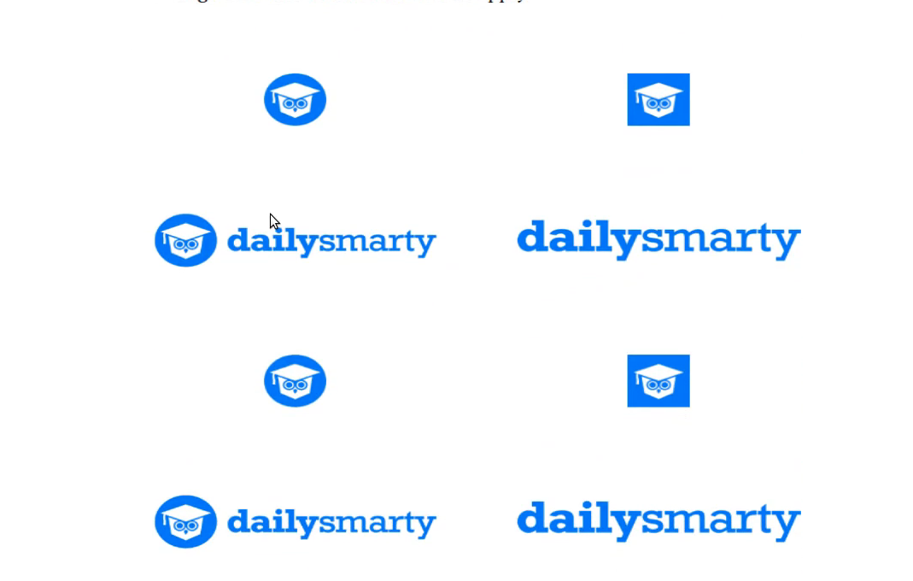
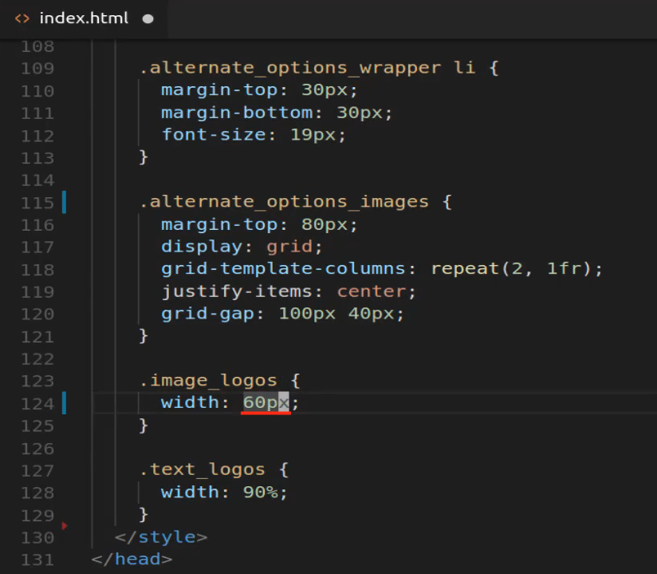
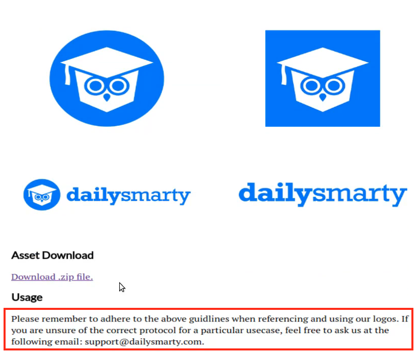
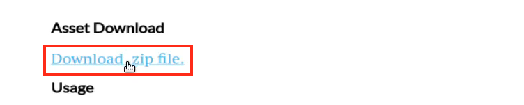
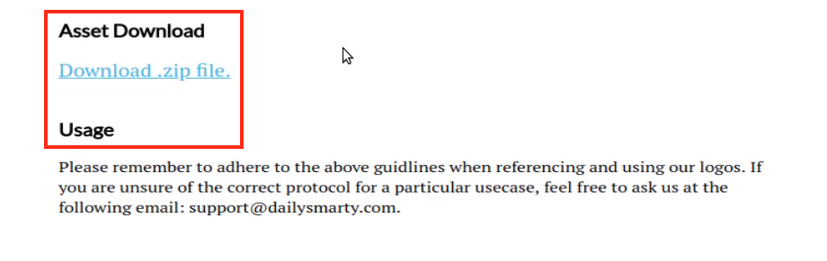
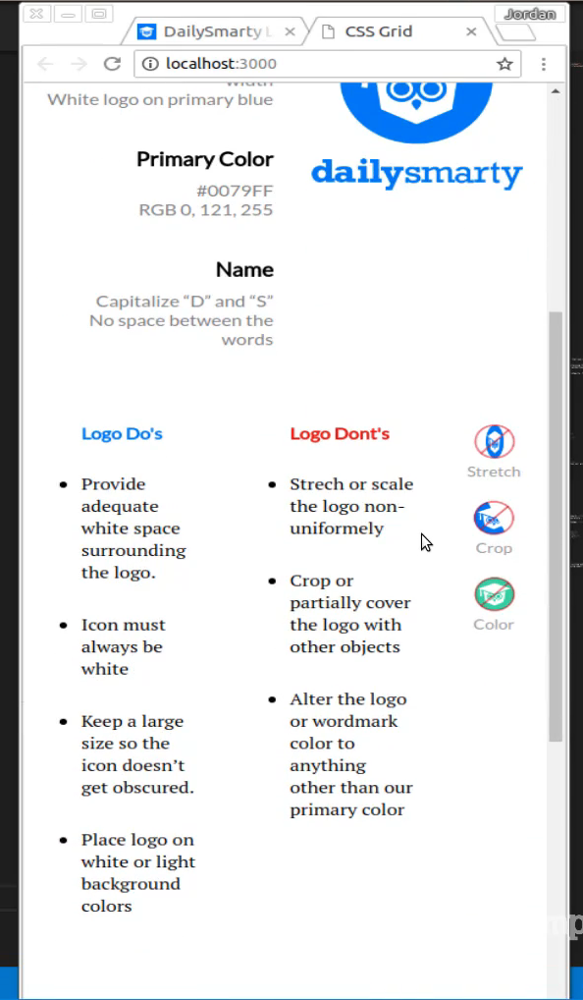
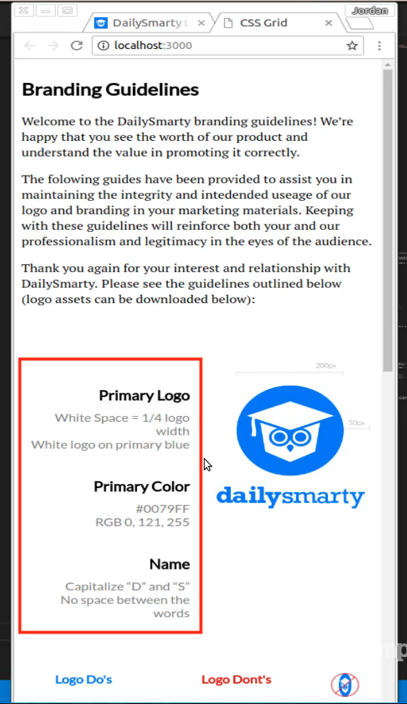

# 01-028:   Implementing Final Page Styles and Review of CSS Grid's Repeat Function

The reason is because this is going to be something that you're going to have to do for many different applications. So right now we're dealing with hardcoded data. So all of our data right now is just being what we type into the code so right here if you come all the way down you can see all of these images are inside of our project directory and we know that inside of this wrapper we're going to have four images. 

But in a normal situation, you're usually going to be building this in something like react or view or rails, and when that is the case you're not going to know how many items are going to be coming in. And so because of that, you need to be able to have some type of dynamic behavior and that is what repeat gets us. So imagine that you're building out an e-commerce site and an e-commerce site is actually one of the projects that will build out in this course as well. 

You may have a few products coming in and some pages may have two and other pages may have 40. You may know how many columns that you're going to have but you don't know how many rows because that's going to be based on the dynamic number of products. And so that's what I really wanted to stress is the importance of understanding what we're doing with Repeat is we are giving the ability for our program to be dynamic and you can test this out just by coming down here. 

Let's come down to the very bottom and come and say that you know what. We don't have four images we actually have eight images if you come back now and scroll down you can see is that that behavior continues. 



We still have that nice little gap in between our rows, we have our columns, and all of this is working no matter how many elements we have. So when it comes to remembering things I always want to point out when we're working on something that is very important to understand and using the repeat function is definitely on that list. 

Now with all that being said let's finish this project out so I'm gonna come down here and the reason why and in between videos I saw what the problem was I had accidentally typed pixels here instead of percent. 



And that also brings up another good point and that is that you may notice that we have these grid elements with these logos that are text and image-based. And notice that we are able to use pixels in one of them for sizing and percent's for the other and so that's one of the nice things about grid is it's really flexible with the types of styles that you want to add inside of your columns. So let's just fix this by changing it to percent I'm going to save it and coming back you can see that our grid now looks fantastic. I think that is exactly what we're going for right there. So we are very close.  


We just need to add those two elements down below. So scroll down we have asset downloads and then we have a usage and I think it makes sense, in this case, to give them their own wrapper because we have a few custom styles that we're going to add in. So I'm going to create another div called `.additional_branding_details`. And then inside of here we're going to have an h3 of Asset Download and then we're gonna have a usage one as well and then between this we're going to have a link underneath of this and then we're going to have a paragraph underneath usage. 

But I'm going to put both inside of a paragraph tag and so I'm going to say paragraph href we're not going to actually point to any link and then the text should say download zip file. That's what is inside of our actual program. And then if I come down under usage I want a paragraph tag here as well and inside of your we're just going to put the content itself. So let's scroll down in the production app to get that copy it paste it in. And then we will be good to go. 

**index.html**

```html
<div class="alternate_options_images">
	<h3>Asset Download</h3>
	<p>
		<a href="#">Download .zip file.</a>
	</p>

	<h3>Usage</h3>

	<p>
		Please remember to adhere to the above guidelines when referencing and using our logos. If you are unsure of the correct protocol for a particular use case, feel free to ask us at the following email:support@dailysmarty.com.
	</p>
</div>
```

Okay, so this should be everything that we need from an HTML perspective. And if I scroll down you can see that it's looking very close. 



Now we just need to polish it up a little bit so we're going to add some custom styles to the heading to the link and that really should be it, that and the little bit of margin and we should be good.  

So let's come back over here and go up to our style definitions one more time. So right under text logos, this is where we're going to start adding everything. So we'll say `.additional_branding_details`, add our margin-top of 75 pixels and do the same thing for margin-bottom and that's all we need to do here, this isn't going to use grid or anything like that. 

And next, we want to update the size and the color for that link. So `.additional_branding_details a` to select the link and we'll add in a color, this one I do not have on the top of my head so let's come here and inspect the element that uses that light blue. Let's inspect it and you can copy that color and paste that in, and now let's also update that font size, font size should be 19 pixels. 

**index.html**

```html
.additional branding details a {
	color: #4fb8e8;
	font-size: 19px;
}
```

And there you go that is looking really nice. I think that's really all we need to do on that one. 



So the next thing we need to do is to work with the paragraph tag. So I want to add on the paragraph, so this even though it's a link it's inside of a paragraph tag and so is this I want to add some margin to give us some spacing right there. So let's come down here we'll grab all of this and then change the a tag to a paragraph tag. And then from there, we have to do is say margin-bottom and let's go with the best number out there 42. 

**index.html**

```html
.additional_branding_details p {
	margin-bottom: 42px;
}
```

And so 42 pixels and there we go that is looking much better.



So if we scroll all the way up to the top let's make sure everything's still working. So we are Branding Guidelines and we have multiple grid containers, everything here looks beautiful. I am liking it. So in the next guide, it's all a special bonus guide, because one of the things that you're going to hear quite a bit whenever you're working with tools such as grid or flexbox is that you should use those tools in order to be able to create responsive components. 

And so when I say responsive I mean that this entire page should look good on smartphones. But let's see what happens let's test it out right now. So if I shrink this down and move it to about the size of what a smartphone would be. So there you go. That's all it's allowing me to shrink it to go. Let me test that out. OK. It's being a little picky but either way, this is what it is looking like on a smartphone. 



It's kind of a wide smartphone. But still, this gives you a good idea of it. So as you can see it looks ok but it's not perfect. It still has some work that could be done on it. So a great example would be I don't like how the grid stays intact right here when we're on a smartphone type device. 



I think what the ideal scenario would be will be that this content here would take up 100 percent of the width and then this image would come down right below it and it would take up 100 percent and then the same thing. So each one of these columns would then get stacked on top of each other and then this actually kind of like how the four images are laid out, I kind of like the way that works. 

But for the most part, it's close but it still has some work to do in order for it to be truly responsive. So in the next guide that's what we're going to do we're going to see how we can leverage tools such as media queries in order to take this entire page and make it look great on mobile devices.
