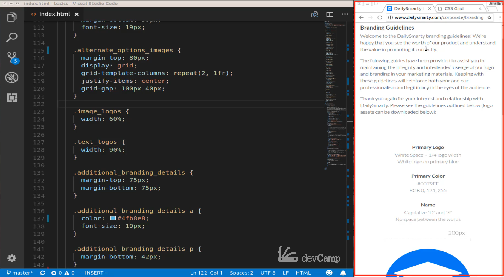
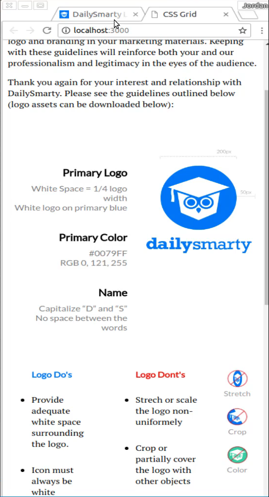
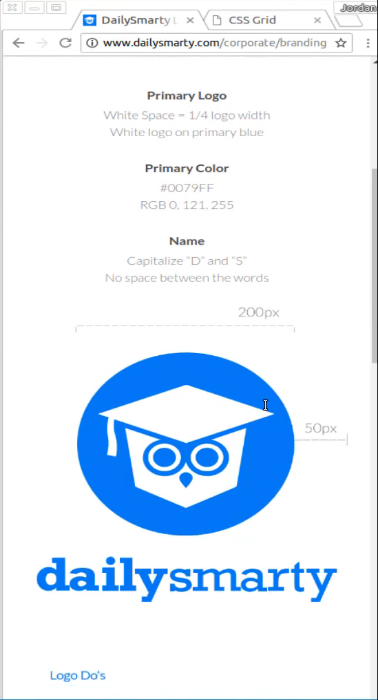
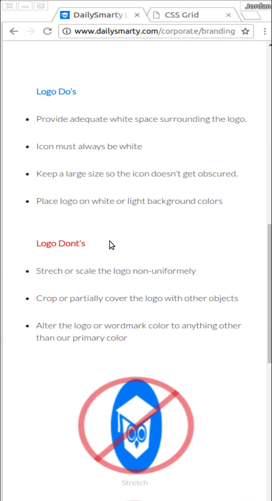
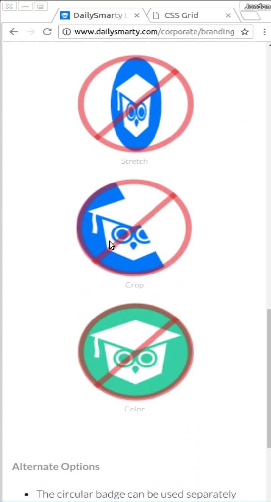
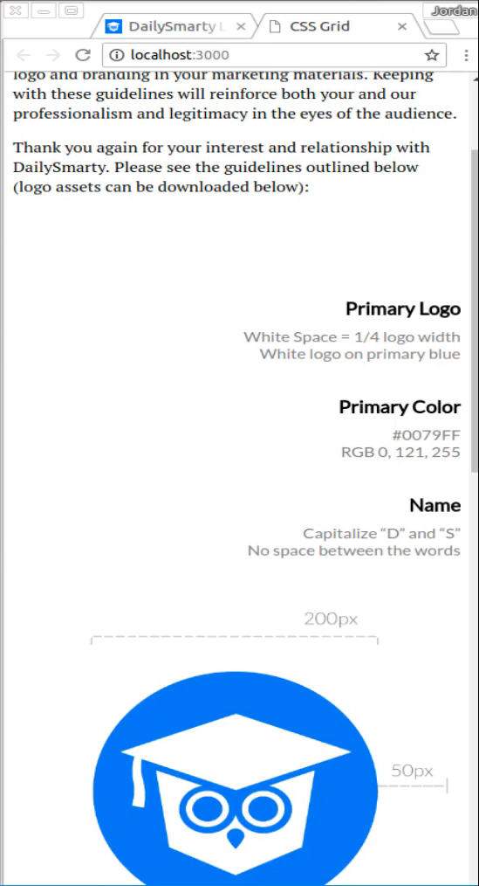
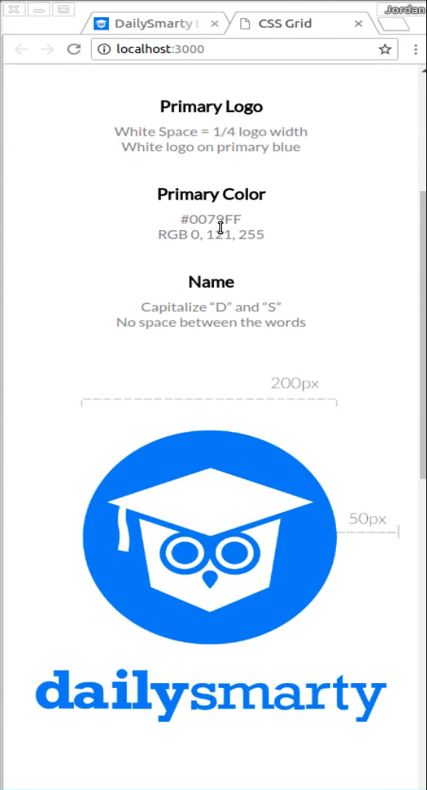
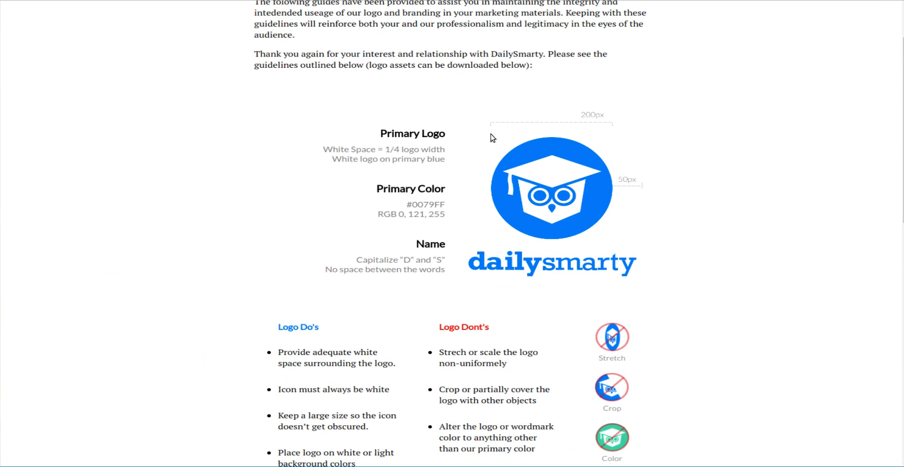
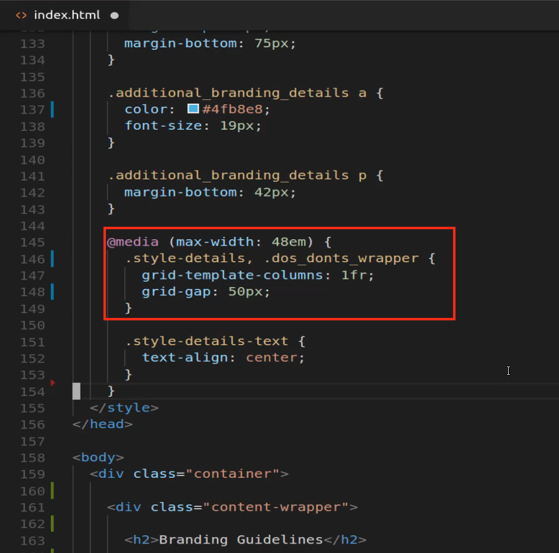
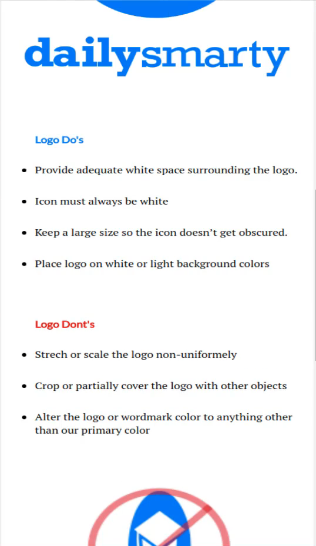

# 01-029:   Combining CSS Grid with Media Queries to Implement a Responsive Layout

Right here you can see I'm on the actual dailysmarty page. 



This is what we're going to be implementing, where we have our content, and then as you can see what we have on our page right now is we have our regular style. So even though this is shrunk down on a mobile device we still have everything aligned to the right and we have the image right next to it. 



What I want to do is actually change it so that all of that content is aligned in the center and then right here we have the image below that, I think that is a lot easier for people to see. 



Moving down we have our bullet points that are no longer side by side so they're not in their own columns. 



And the same thing for the images 



feel free to play with the image sizes however you want. What I'm going to show you is going to allow you to customize this however you personally want. This is how we did it with dailysmarty but I think this looks good. Let's get to actually building this out, and I think you're going to be shocked at how easy it is when you're using CSS grid to build in mobile-responsive components. 

So let's come down here, this is the very bottom of our embedded styles. I'm going to say media so we're going to set up a media query and then say Max width and for this, I'm going to go with 48 M. So we're only going to have our max-width and our responsiveness for smartphone type of devices. So everything that goes inside of here if your media queries are a little bit rusty anything that we add in here is only going to apply when the screen is around the size it is right now when it's around the same size as a smartphone. So the first thing that I want to do is I want to grab those style details. 

So if you remember style details is our grid container right here. Right now we're using two columns but what I want to do is say style details and change grid template columns to just 1fr and then I want to add some grid-gap and let's say 50 pixels. 

**index.html**

```html
@media (max-width: 48em) {
  .style-details {
    grid-template-columns: 1fr;
    grid-gap: 50px;
  }
}
```

So save this and you can see that looks already a lot better. 



Now I do not like this where the logo and color and name is pulled to the right, this is ugly, we need to center it. But notice how we're able to say that now we only want one column. When you only pass in one element here to grid-template-columns, it is only going to create one column, and because we said 1fr that means essentially 100 percent of that column is going to be taken up that one fractional unit, so that is pretty cool. 

Let's come down here and let's center that text so we can do that by saying style dash details dash text and then text-align center save that.

**index.html**

```html
.style-detail-text {
  text-align: center;
}
```

And now we're really looking good. 



So our responsive component is now updating. So whenever we're on a small screen than it is now centered and it's looking more like what you'd expect on a smartphone. If I double click this and extend it out you can see that it now changes and we're looking at the desktop view now which is what we're looking for when someone is accessing this on a tablet or on a desktop than we want it to look like this. 



But whenever it's shrunk down then we want it to look a little bit more of a kind of a mobile-friendly look to it. So let's keep going down and the next one we're going to tackle and we actually only have three more lines of code to write or really two if you don't count the definition. 

Next, we're going to take the do's and don'ts wrapper and then from there we are going to say that we want to be grid template columns to be 1fr. So really the same thing that we just did with style details 

**index.html**

```html
.dos_donts_wrapper {
  grid-template-columns: 1fr;
}
```

Hit save there and you can see that that did the exact same thing for us. And in fact, if we want to stick with 50 pixels we could make this even more efficient here and we can say that we want to put the do's and don'ts wrapper and have that all there and we can even get rid of this because the great template columns are the same. Now if I save you can see we still get the same exact behavior.





So we have the same kind of responsiveness and we did it in just a few lines of code. That's how much easier it is to build out this type of responsive behavior by leveraging tools such as CSS grid. I can tell you from experience when I've had to build out that kind of functionality it has required much more than just the five or so lines of code that we wrote right there.

I had to do all kinds of things like changing up float values changing the width of items and there is just a lot of work that had to go into it. Then you had to go test it on all kinds of devices because sometimes if you hardcoded things like your widths or anything like that then it would work on a few smartphones but not all of them. But by leveraging CSS grid we are able to take all of that out of the equation and just update how many columns that we wanted to work with and then it did all of the hard work for us. 

So congratulations if you went through that you've now finished project 1 you know how to implement the basic type of CSS grid type implementation along with making the entire page responsive.

-If media query does not work add the below line of code to the head tag in the index.html file
       ``` <meta name="viewport" content="width=device-width, initial-scale=1, minimum-scale=1" />```

## Resources

- [Final Project Source Code](https://github.com/bottega-code-school/css-grid/blob/master/basics/index.html)
