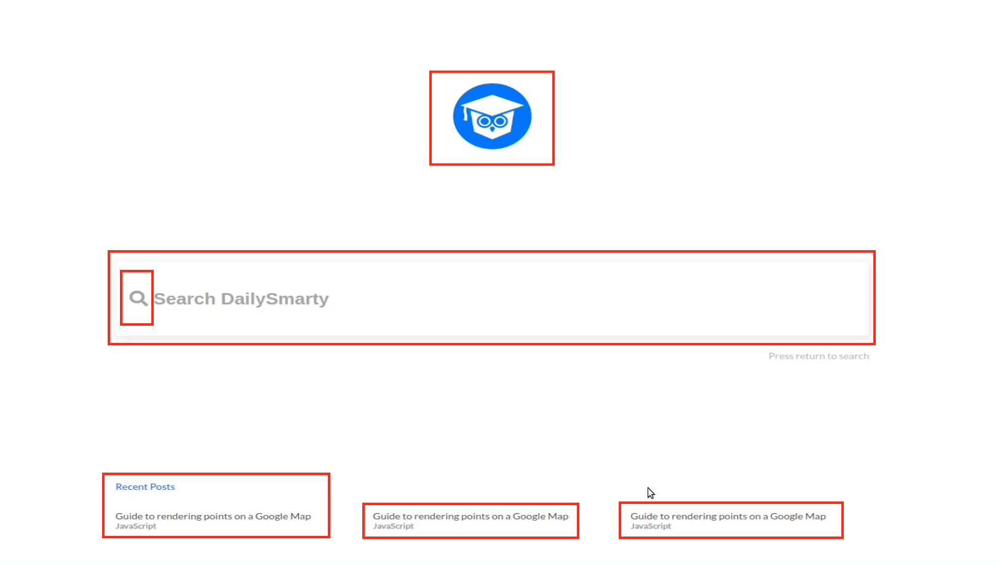
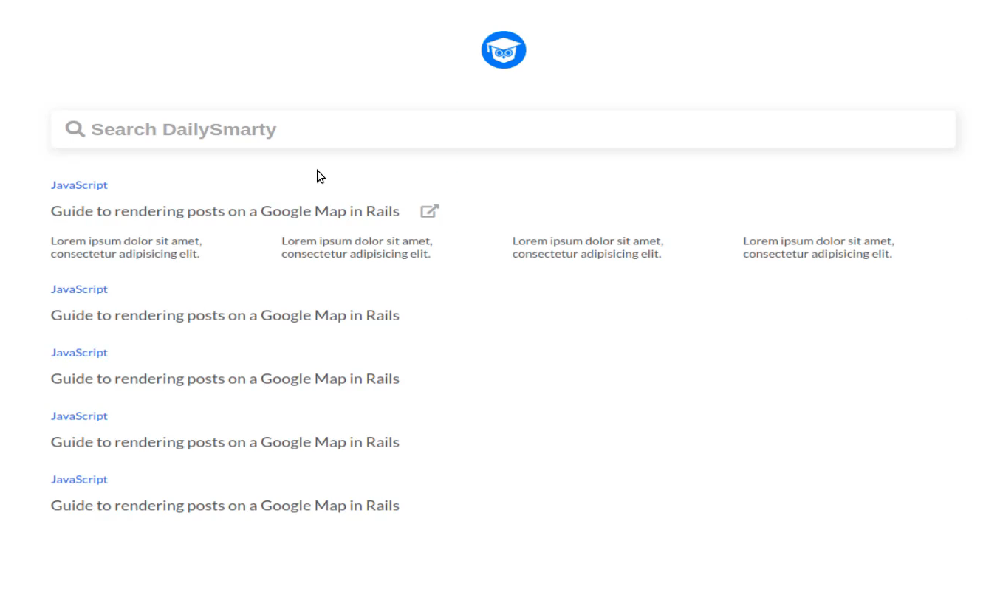
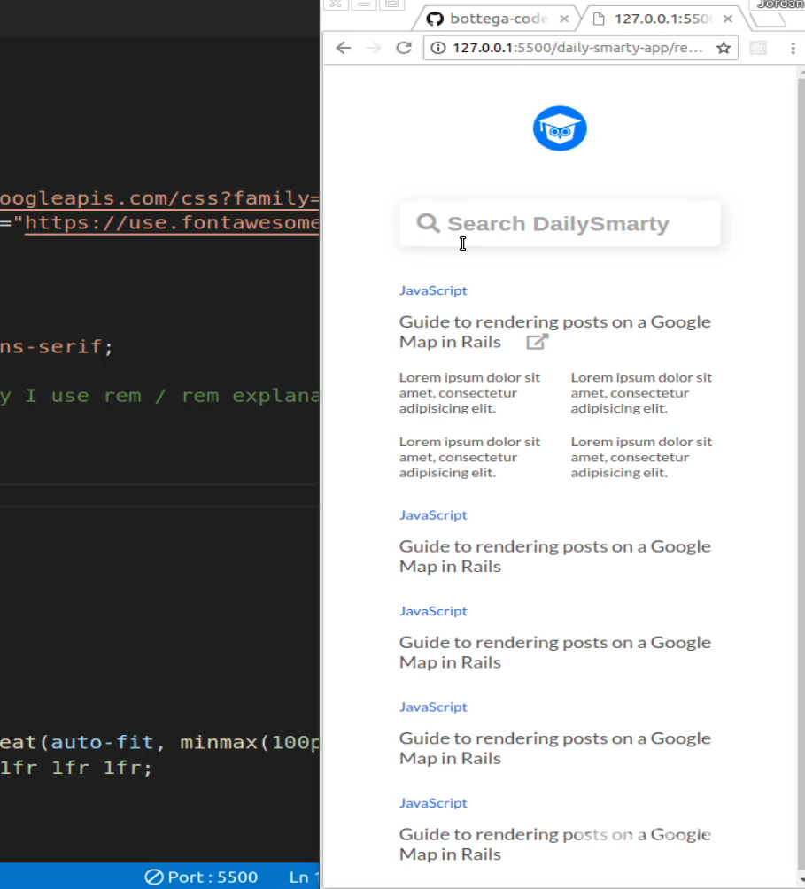

# 01-030:   Search Engine Front End Implementation Project Requirements

For right now what I want to build out is the static version of this application. So this is going to have everything from a logo, to this large search bar, the search bar is going to have an icon inside of it, and then we're going to have these elements under here. 

Now we also are going to have to create a second page here, so I'll show you what that will look like here, and so this is going to be the search results page. 

As you can see the logo slides up to the top and is much smaller, the search bar is still there and it still has that kind of behavior. Do you notice when I click on this, it adds a little bit of a shadow here and it still has the icon. 

And once you start typing so once you say some query like this then that all goes away. Underneath that is our list of search results, this has the category, it has a link, all of these obviously are going to be hardcoded because this is just going to be a static app and then it has a few links underneath it. 

Later on you're going to see how you can actually build this in a javascript framework and how it will be functional and actually connect to an API. But for right now what we want to do is we want to just build it and have the look and feel that we're going for. 

Now in addition to what we see right now, I also want this to be completely mobile responsive. So if you shrink it down like this like it would be on a smartphone, you can see that everything shrinks down in proportion. 

As you can see right here everything is still on the page, but now it looks much better. It looks like how you would see it on a smartphone or a mobile device so make sure that you're doing that. 

Now a few hints I'll give you for this specific project. You do not even need to use media queries in order to build this out. You simply need to use a combination of regular HTML and CSS with CSS grid and then flex box. 

So if you take in all of those technologies you can build everything that I am showing you right here, so good luck with this project and I will see you later in the solution.
