# 01-031:   Adding HTML Elements to the Index Page

So now that you've gone through that I want to walk through, in the next few videos, how I personally built this out. And I'm also going to give credit to Max one of the other instructors here at Bottega because he looked at the initial implementation that I did and he had some great recommendations and I'm going to include those in the solution as well. 

And that's one thing before we even continue on I want to just kind of give some personal advice on, it doesn't matter how long you've been doing this, I've been building Web sites and applications for over 15 years now and there is never a time where I feel like I know it all. 

I always take my projects I share them with others, I get their opinions on how they would personally implement a certain feature or a certain design. And it never ceases to amaze me how I can always learn something new from someone else and it doesn't even always have to be someone who has been doing it longer even has more experience. 

There are plenty of times where I'll learn about a new method or a new process from a student just because they learned about it before I did, and so make sure you're always keeping an open mind whenever you are learning anything whether it's related to computer science and development or really anything at all, that's something I personally try to do. 

So now with all that being said, let's actually start building out this solution. We're going to start building the regular index page and then later on we'll take care of the result page. What I start out with whenever I'm building out any kind of implementation like this. 

So this originally started with a design that was sent to me from one of the Bottega designers. I asked him for a search engine frontend page and they gave me this. And so I had the finished design sent to me and I had to then go and build it. 

And so the very first thing that I'll do is I don't care about making it look pretty whatsoever. I just care about getting all of the elements on the page, that is my very first step. So I know I have a logo here, I have this input, I have this little press return to search link here, and then I have these other elements here at the bottom that really are they could be links. But for right now we're just hard-coding all this and so it really doesn't matter they're just some titles with some other styling. 

So there's not a ton on this page so it shouldn't take a ton of work to get all of this built out. 

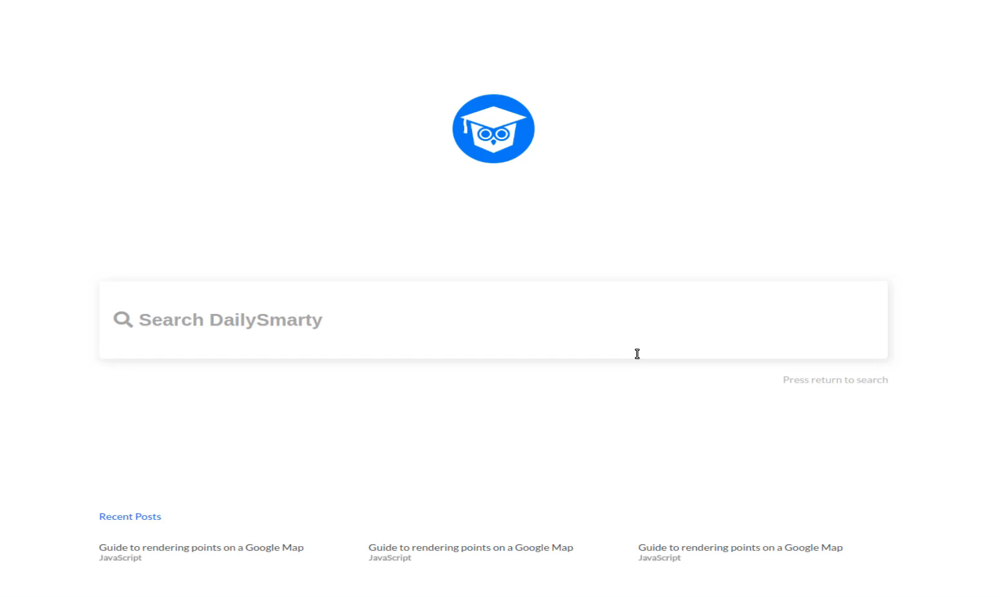

So let's start by going to Visual Studio code and I'm going to be starting completely from scratch we're not going to be using any frameworks like bootstrap or materialize or anything like that. We can build all of this without having to do that. 

Now also one other thing to note, at the end of each one of these videos. I'm going to push up a commit to this github repo so you'll be able to access all the source code for this product, and so you can reference that later on if you ever want to. 

I'm keeping open the finished version of it right here and then we can reference this whenever we're building out our own styles. But we're going to start completely from scratch and I'm going to create an `index.html` file here and then I want to start with the boilerplate HTML and that's going to give me all of the basics. 

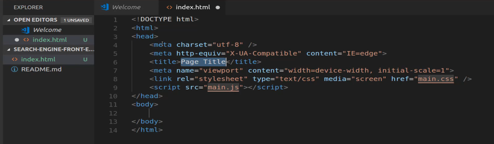

Now I don't need some of these items so I'm not going to pull in the javascript file or anything like that but we can give this a title, so we'll call this our `Front End Search Implementation`. 

And then you may also see here that by default this is giving us a link to a stylesheet which we currently do not have, but we are going to create that. So I'm going to save this and let's just create the stylesheet just as kind of a placeholder, so let's see, this was called `main.css`. 

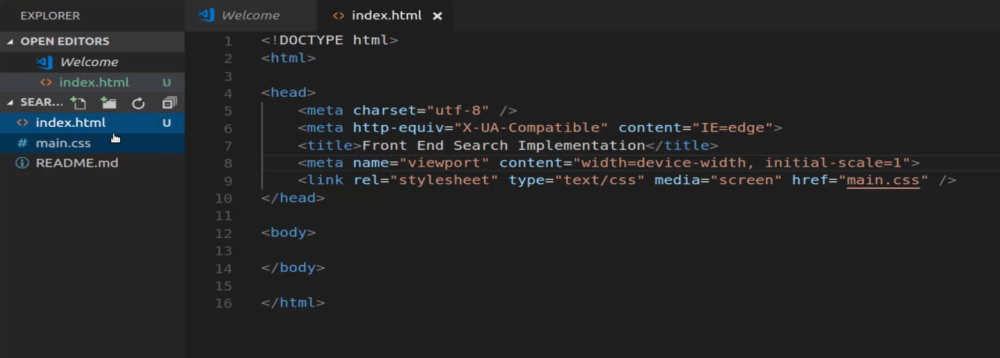

Inside of here I'm just going to add a comment and I'll say styles go here and let's save this. Now we have our basic HTML and then we have a placeholder where we're eventually going to place our styles. 

So let's start off by listing off everything that we're going to need. Now this is something that I do just out of habit. So you don't have to follow this exact process but this is what I personally like doing.

So it kind of helps me to wrap my mind around everything that I want to include. So I know that I'm going to need a logo, so I'm going to say logo here. I also know that I'm going to need a search bar, so I'm gonna say I need a search box that goes here right below that I know that I'm going to need that little kind of link thing, this press return to search and I'll just copy that so that I have access to it. 

So I'll say press return to search, and so I know that goes right below the search box. And then from there we're going to have our recent posts and I'm not going to list all of those out because I just need to have one place in my mind where I know I'm going to put this so I'll say recent posts will go there. 

So really because this is such a basic page, this is all that I need to do. 

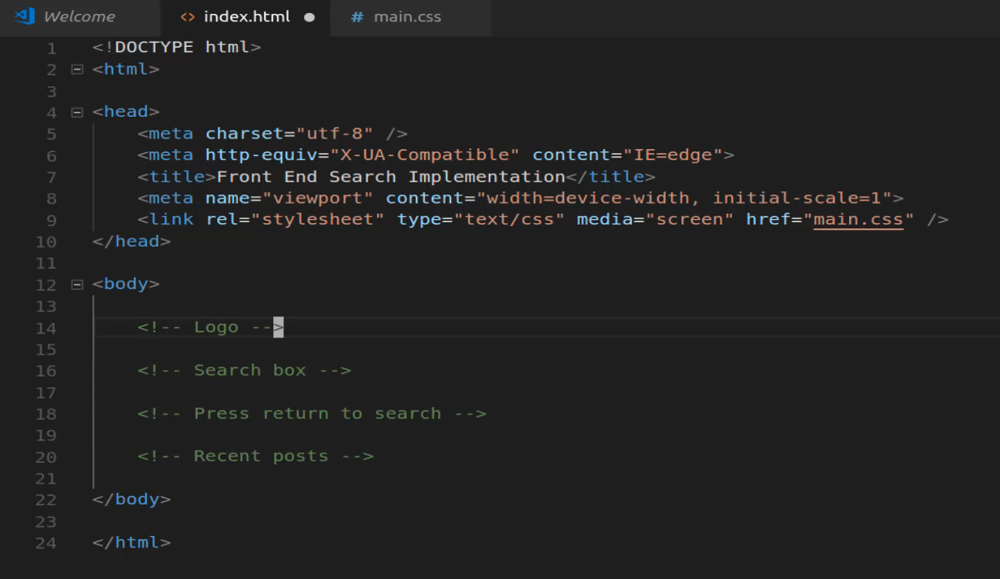

I know that I need a logo, a search box below it, a little press return to search right below that, and then our list of recent posts, so that is going to be this 1 index page. So let's start by getting that logo, you can simply save image here. 

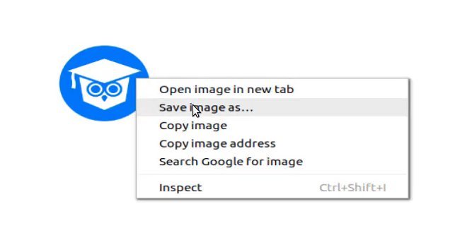

and then I'm going to place this inside of the projects and to go to a search engine for an end implementation. And for right now, and if you're on Linux like I am you can just do create folder and you can call this images.

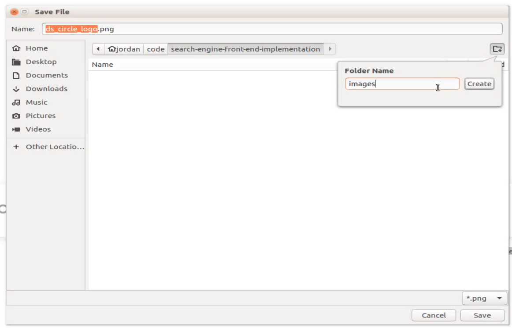

If you're on Mac or PC, then you can create an image just by right clicking here in the file and it gives you the ability to create that directory.

So we're just going to call this by its default name `ds_circle_logo.png` and we'll save it. So now we'll have access to it if we switch back to Visual Studio code you can see we now have images here. 

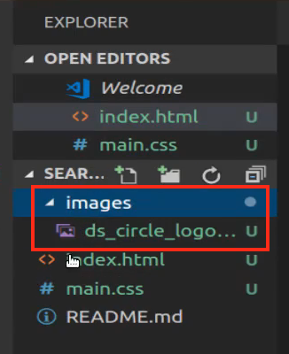

And so now we can call it, so I'm going to come here give it an image tag the path to this is `images/ds_circle_logo.png` and hit save. Now let's open up this file, now there are a number of ways you can open this file up and view it. So I technically could just say `control + o` here and then navigate to the projects like `code/search-engine` here click on index and then that would open it up, and that's what I have the finished product open up as right now. 

But if your on vs code there's even a better way of doing this. If you go down into your extensions here and search for live server. 

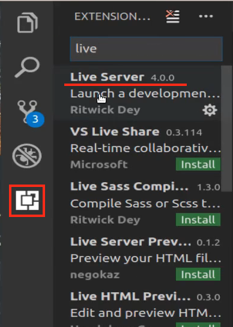

I already have it installed but if you do not have it installed then you're going to have a little Install button. Click to install it, and then after it installs reload the entire program. And what that's going to allow you to do is now I can right click here click on open with live server and that's actually going to generate a little live server for us. 

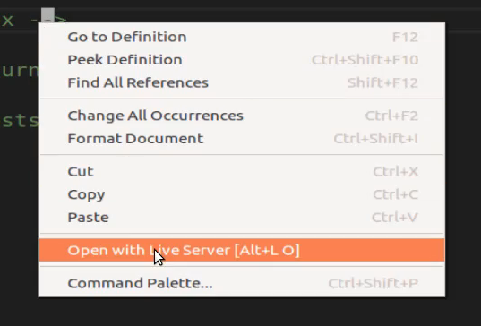

So this is the project this is our page you can see it's at index.html, and the other cool thing about this is this updates on a live real time basis. So if I wanted to put something right above here just as a test. 

So I'll say H1 testing and save come back and notice I didn't have to hit refresh or anything that simply allowed me to update automatically and then see the results there in the browser. 

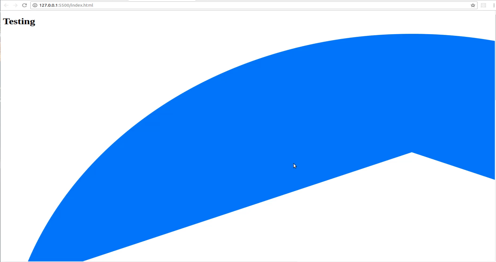

So I definitely recommend if you're using visual studio code to install that extension and it just makes your life a little bit easier. And then once again all you have to do is right click on the file that you want to start it out and then click on open with live server and then you'll be able to watch that. 

Okay, so we're only to go for a few more minutes and then we're going to take a break and continue the implementation. So we have our logo, now we know that we need a search box so I'm going to create a div to put this inside. So, I'm going to say div and then inside of here there's going to be an input, it's going to be of type text. 

Let's add a little placeholder here so we'll say placeholder Search DailySmarty, like this. 

**index.html**

```html
<div>
  <input type="text" placeholder="Search DailySmarty">
</div>
```

And then we also know we need this press return to search so let's actually move that inside of this div and now inside of here I'm going to just create a paragraph tag and say press return to search, and then down below here we know we have our recent post, let's save this and see where we're at. 

**index.html**

```html
<div>
  <input type="text" placeholder="Search DailySmarty">

  <p>Press return to search</p>
</div>
```

Obviously this gigantic logo's going to have to be redone but we'll take care of that later. So you can see down here on the bottom we have our search bar and Search DailySmarty is a placeholder and our press return to search, so all of that's looking good.

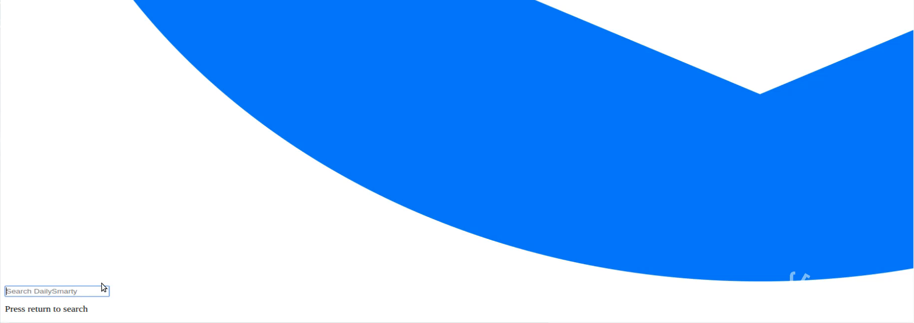

Now let's build out our recent post or at least place our placeholders there. So I'm going to just create another div and then inside of here I'm going to create a nested div, this is where it's going to say recent posts just like that. 

And then from there we're going to create a div that's going to contain all of those recent posts or the three of them. So we're going to have a wrapper div and notice I'm not adding any ids or classes right now, for right now we just want to get all the content on the page. 

So I'm going to have this wrapper div and we can copy this you can copy this or you can just put placeholder text it really does not matter. And so I'm going to copy that and paste it in and then let's just create three of these and later on we're going to add additional divs and wrap them up a little bit better. 

But for right now this gets everything that we need, one thing you may have noticed here if you're using prettify like I am in my visual studio code when you hit save it readjusts everything but it also moved this javascript up here and that's not really what I'm wanting. So let's just move this into its own div even right now just so that we don't run into an issue where we forget about it. 

So now we have that JavaScript there we'll pull that out from each one of the copied ones, and then we will be done with our content for this page.  

**index.html**

```html
<div>
  <div>
    Recent Posts
  </div>

  <div>
    <div>
      Guide to rendering points on a Google Map
      <div>
        JavaScript
      </div>
    </div>
    <div>
      Guide to rendering points on a Google Map
      <div>
        JavaScript
      </div>
    </div>
    <div>
      Guide to rendering points on a Google Map
      <div>
        JavaScript
      </div>
    </div>
  </div>
</div>
```

So that's finished, let's hit save. And now if we come down to the very bottom you can see we have all of our text there. 

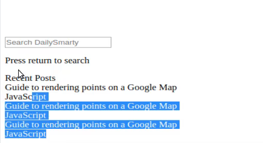

So this is a good stopping point, as you can tell it's still very ugly but whenever I am tasked with implementing a front end this is actually how I start. 

I just start by getting all of the content that I want on the page so that after I have that I know I have all the elements I need, and then I can start adding the CSS styles and add my own custom classes and then I can rearrange that content however it's supposed to be.


## Resources

- [Source Code](https://github.com/jordanhudgens/search-engine-front-end-implementation/tree/18dd3d5ae7439620f7d1b05a9eef0a683dc5b7e1)
