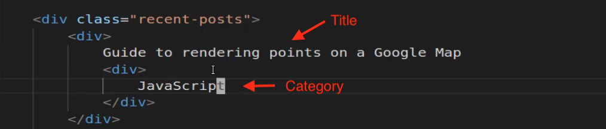
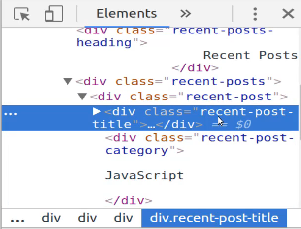
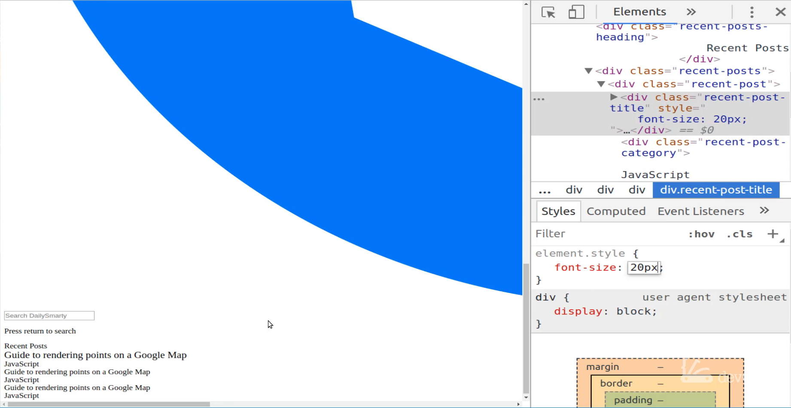

# 01-032:   Implementing the HTML Structure and Custom Class Names for the Index Page

So what that means, is that each one of these tags like this image tag or this text input tag, they are good by themselves, but if you don't organize them properly then it's going to be very difficult to move them onto the page the way that we want. 

So the very first thing we're going to do, is we're going to create a div here that is going to wrap up all of the content. So this is going to be right below the body tag and I'm going to call this div a div with a class of container. 

So this is going to wrap up everything so you can come down to the very bottom here and that is going to be our container class and that's also going to be our very first grid container as well. 

**index.html**

```html
<div class="container">

	<!-- Logo -->
	

	<!-- Search box -->
	<div>
		<input type="text" placeholder="Search DailySmarty">
		<!-- Press return to search -->

		<p>Press return to search</p>
	</div>

	<!-- Recent posts -->
	<div>
		<div>
			Recent Posts
		</div>

			<div>
				<div>
					Guide to rendering points on a Google Map
					<div>
						JavaScript
					</div>
				</div>
				<div>
					Guide to rendering points on a Google Map
					<div>
						JavaScript
					</div>
				</div>
				<div>
					Guide to rendering points on a Google Map
					<div>
						JavaScript
					</div>
				</div>
			</div>
		</div>
	</div>
</div>
```

So that is going to wrap up all the content as you'll see this makes no difference whatsoever right now because until you've actually given some styles to those classes they don't really do anything. 

The next thing we want to do is I want to create a wrapper for this logo, so I'm going to get rid of this logo comment since it's not really needed anymore and I'm gonna say div class and then we'll say, let's actually call it `homepage-logo` because this logo is going to be different than the logo on the result page so I want to make sure that that is clear.

And so now that is going to have a home page logo and it looks like it may have a little bug. Oh, I didn't close off that div tag. There you go, now it should be good. 

**index.html**

```html
<div class="homepage-logo">
	
</div>
```

So now our logo is wrapped up properly, and if we come down here into our search box. Now we already have a wrapper div so I simply need to apply a class to this and I'm going to call this class equals and then we can call it `homepage-search-bar` and then inside of here that is going to have the input. 

We don't need to do anything with this because we're going to be able to select it whenever we go and we find and select `homepage-search-bar` that's only going to have one input inside of it so we can find it and change the search bar to have that cool really large styling like we're going to need to do. 

Now the next thing we need to do is to update the press return to search I'm just going to remove that comment. And the same rule kind of applies, you could apply a class here so I could say something like class and then you know some kind of return to search text. 

**index.html**

```html
<div class="homepage-search-bar">
	<input type="text" placeholder="Search DailySmarty">
	<p>Press return to search</p>
</div>
```

But the reason why I don't need to do that is because the same reason as with the input if you have a wrapper div and it's a very basic div like we have here, that only has two elements, and the elements are unique such as having an input and a paragraph.

What I'm going to be able to do is create a selector and then I'm going to be able say find the class home page search bar and then find the input and then apply some styles to it and then I'll create another style definition that'll say find homepage-search-bar and then find the paragraph tag inside of there. 

If we had multiple paragraph tags then I would have to apply some type of custom class to it, but because it's all by itself we do not need to do that. So now that we have that, let's come into this wrapper div and I'm going to give this a class and this one is going to just be `recent-posts-wrapper` and then inside of here we have recent posts and then all we need to do is give a class to it. 

So here we'll say `class="recent-posts-heading"` and obviously hopefully it makes sense, you can call these anything you want. I like to be very descriptive with them and so I think this does a good job of explaining exactly what this recent posts text represents. 

**index.html**

```html
<div class="recent-posts-wrapper">
	<div class="recent-posts-heading">
		Recent Posts
	</div>
</div>
```

It is the heading for the recent post so you can definitely feel free to name them whatever you want but it is a best practice to make sure they're descriptive enough so that someone else when they're reading that code, or you later on, will be able to look at the style definition in the CSS file and then be able to know what that style is changing. 

So now that we have that, we have our recent-posts-wrapper, we have our recent-post-heading, and now I can just add a class to this wrapper div. And this is going to just be `recent-posts` and each one of these is going to be that recent posts that we see on the page. 

Just for your reference, we can see that this is referencing this entire Recent Posts element here and now we're just drilling down, we're getting more and more specific, so now we're referencing all three of these. And now let's see what every one of the elements needs to look like. 

So we have our recent posts, this is also a wrapper, this is where the naming becomes very important. So we have a recent posts wrapper here and then we have a recent posts so make sure that that part of it doesn't get confusing. 

And now inside of here, we are going to have a title like you can see right here, and then we have a div underneath with the category. 



I think that it makes sense to add a class here and I'm going to use the singular so this is going to be `recent-post` just like that, and then inside of here we're going to add a another div. And if you ever think I'm using to many div's or you think that it looks just kind of weird that we have so many of these. 

I was once told and this is a lesson that has stood by me for years and years that as a front end implementation developer you can never have too many divs. Every time you have a div you have the ability to grab that element and to do whatever you need with it.

So the only time that I've ever run into front end implementation bugs is where I didn't have enough divs and I was trying to stretch my selectors and that was the only time that it really becomes troublesome. But if you have each one of your key elements wrapped up properly then it makes it much more straightforward to be able to select them and then to apply your styles. 

So now that we have that let's call this a class of recent and let's just call it `recent-post-title` because that's what it is. And then our last one is going to be recent post category, so class of `recent-post-category`. 

Now because I have this I don't think it makes very much sense to go and manually add that here for these other placeholders. I'm just going to get rid of them and now let's just create two more of these, so I'm just going to copy that and paste it so now we have three of them. 

**index.html**

```html
<div class="recent-post">
	<div class="recent-post-title">
		Guide to rendering points on a Google Map
	</div>
	<div class="recent-post-category">
		JavaScript
	</div>
</div>
```

So let's go back and look at our current implementation. 


As you can see nothing's changed and for good reason we haven't applied any styles yet. But now if you inspect one of these elements here, now you're going to see that it has for this specific one, now it has a class of recent post title. 



And so if you want to do something like if you want to say OK I want to change the font size for this and I want to make it 20 pixels. You can see that that has changed so we have the ability to select it and then change its properties. 



So I'm happy with it right there, we're going to pause the video now. And in the next guide we're going to start building out our first CSS grid element for this page.  


## Resources

- [Source Code](https://github.com/jordanhudgens/search-engine-front-end-implementation/tree/76364a922a6aa71d53115e35b7e8aa8c0b26772d)
