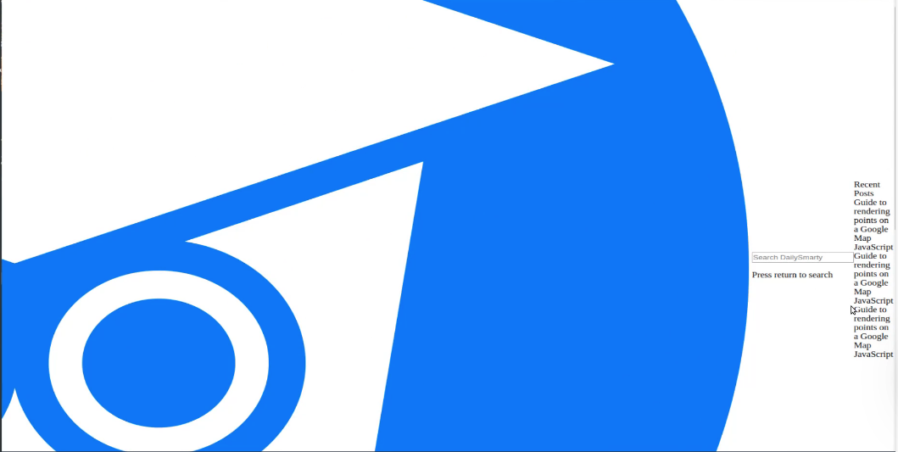
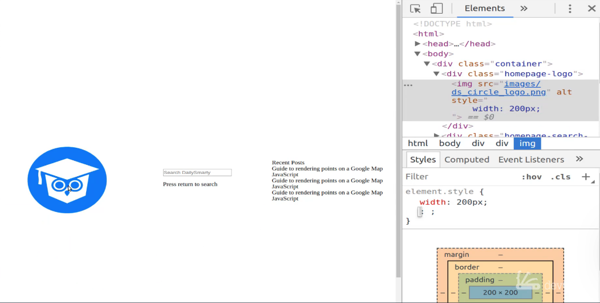
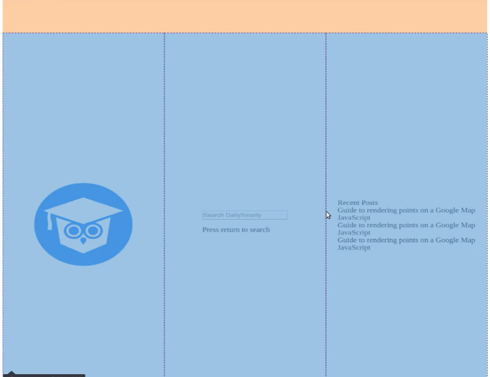

# 01-033:   Integrating CSS Grid into the Container Class on the Index Page

Now, I'm going to open up this `main.css` file and let's start by building this out. I'm going to start by working with the container, and I may or may not need to make a few changes to the HTML, such as integrating custom fonts and some things like that, but right now I'm not going to worry about that. 

I'm first just going to try to get things to line up a little bit better on the page so I'm going to grab that container class and use the grid display. So this is going to be a grid container. I want to use the grid template rows and columns and so I'm going to show you exactly how that works. 

**main.css**

```css
.container {
    display: grid;

    grid-template-rows: repeat(auto-fit, minmax(100px, 1fr));
    grid-template-columns: 1fr 1fr 1fr;
}
```

`1fr` stands for one fractional unit. Don't worry we're going to walk through all of this shortly, for right now, I'm just going to type it all out, and then we'll circle back and see what all of these represent. 

**main.css**

```css
.container {
    display: grid;

    grid-template-rows: repeat(auto-fit, minmax(100px, 1fr));
    grid-template-columns: 1fr 1fr 1fr;

    margin-top: 5em;
    justify-items: center;
    align-items: center;

    height: 100vh;
}
```

Let's save that and nothing changed as far as the image is concerned but you can see that those elements that we had previously on the bottom, left-hand side of the page are no longer there. And you may wonder where they're at. And you can see that they're over here on the right-hand side. 



We are moving items along. We still have a long way to go obviously, but let's really quick, just for the sake of making our image so it's easier for us to see. In our browser's element inspector, we can change the image width to 200px.



That's much better right there. You can now easily see that we have a grid implemented. We have the logo on the left, we have the search bar in the middle, and then we have the recent posts on the right. 

Now they're not sitting on top of each other like we want them to but that's something that we're going to implement shortly. But for right now we know that all of this is working. I should say at least we are being able to effectively move elements on the page.

Now if I click on the inspect button and hover over our page, you can see these little purple dotted lines. Those represent the columns.



We'll be playing around with our rows and columns a bit as we move along, and we're getting a little bit closer to where we want to be. In the next guide, we're going to keep on moving down the line and we're going to start with adding custom styles to the logo.

## Resources

- [Source Code](https://github.com/jordanhudgens/search-engine-front-end-implementation/tree/164fcc165c2d33dfaa79487a9d6d568ac357a3c1)
