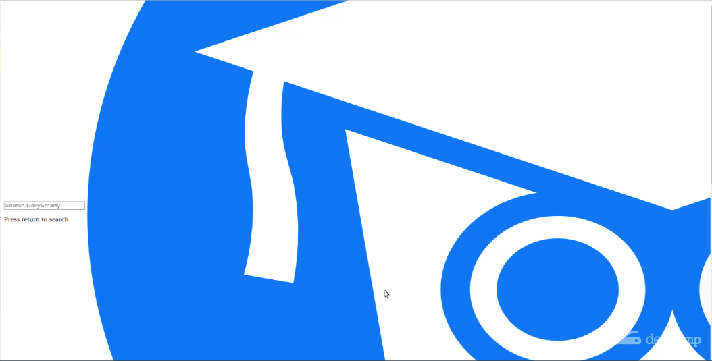
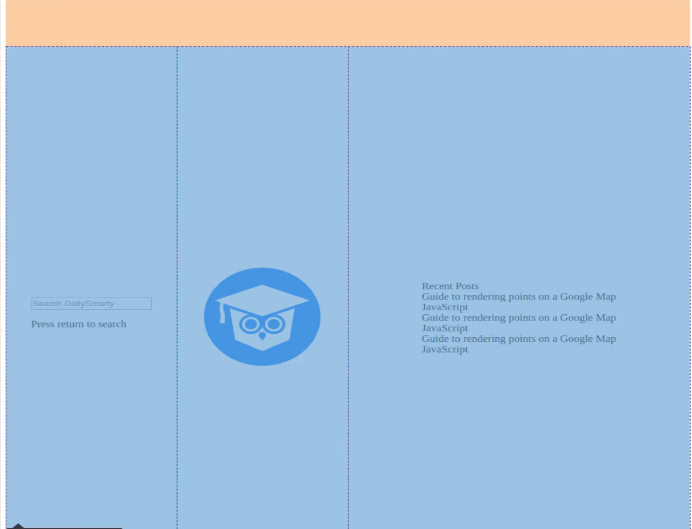

# 01-034:   Integrating the CSS Styles for the Homepage Logo with CSS Grid

I'm going to switch into `main.css` and here I am going to apply two different style definitions. The first is going to be for the logo itself, and I believe I called this homepage logo, and this is not going to actually deal with the image. Remember that we created a div and then we nested the image inside of it. This means we're going to have to have two style definitions.

The div is going to be a CSS grid element. Remember the container is the grid container and then inside of a container you have elements. This is going to be the first element that we update. So I'm going to add two different rules here. 

**main.css**

```css
.homepage-logo {
    grid-column: 2;
    grid-row: 1;
}
```

If we look at the browser, nothing's really changed except for this is now placed in the center of the page. 



We have rearranged the order and that's where the grid column and grid row does. But now let's finally shrink that image. 

**main.css**

```css
.homepage-logo {
    grid-column: 2;
    grid-row: 1;
}

.homepage-logo img {
    width: 10.5rem;
}

```

I believe that should be all we need to do, so hit save and come back and there we go. 



So this is looking much better already. If I click inspect here then and hover over the container. You can see that this is looking much better. Obviously we are going to move the logo to the very top. Then we'll have the search bar and put recent posts underneath it. This is coming along nicely.  

One of my biggest goals in showing you this is to have you walk through the process of seen how CSS grid and tools like flex box and these kinds of skills can be implemented and also so you can see a practical way on how I personally do that because I have gotten to the point that I love grid and flex box in these tools so much that I don't even use any frameworks anymore. 

So I don't use bootstrap or any of those just because as you can see right here within just a few lines of code we've been able to rearrange all of the elements on the page and the more that you do this the faster you'll also get at it and the more intuitive it'll be and then you'll get to a point where you'll just be able to build your front ends from scratch like we're doing right here. 

So great job if you went through that. In the next guide we will continue with adding additional CSS grid containers and elements.

## Resources

- [Source Code](https://github.com/jordanhudgens/search-engine-front-end-implementation/tree/3fe37e63bcff57ce1fb6288a28a6ec387d2be6ac)
