# 01-036:   Installing Font Awesome into the Daily Smarty Search Engine

And the way we can do that is with the font awesome library so you can just go to [fontawesome.com](https://fontawesome.com), and this is going to give you everything you need in order to get started. In order to import this into your project, we have a few different options, you could download it. 

But in cases like this where we simply want to be able to call an icon and have it render on the page as long as you know you're always going to have internet which all of these applications are web applications so they need internet in order to show anything. Then what you can do is click on get started here and then access the CDN. 

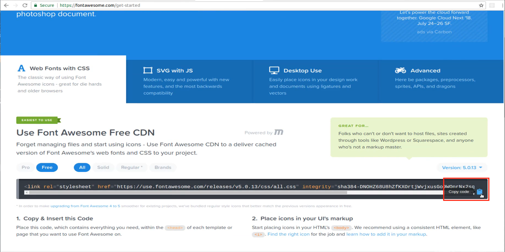

So you can come here click on this clipboard icon, switch back and now in the index.html file right above the stylesheet and it's important that you do it right above the stylesheet and not below it just paste that in and hit save and now we're going to have access to all of those icons. 

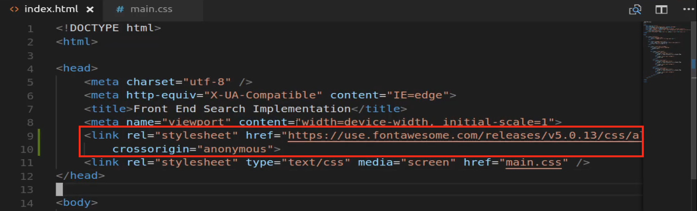

Now if I come back here and scroll up you can access the full library by just typing a query right here into their search engine and they'll bring it up. I want to pull in the little search icon so I'm going to type in search click on that and this is going to give me all the options that I need. 

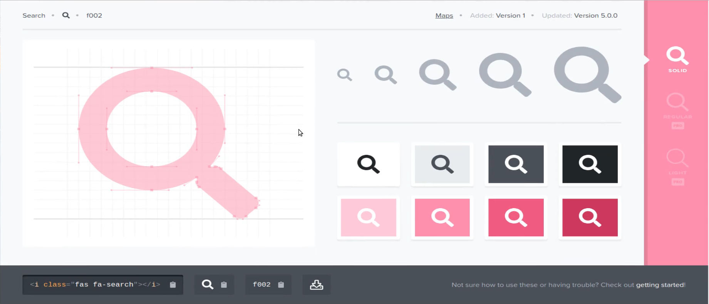

Now, I'm going to test this out first and then I'm going to remove the test and then add in our implementation. But to test this just to make sure that font awesome has been imported properly, I'm going to click on copy code down here at the bottom. 

And then it doesn't really matter where this is going to go I'll just put it right below the logo. And we'll just paste in this icon hit save and if we go back to our site you can see these little icons. 

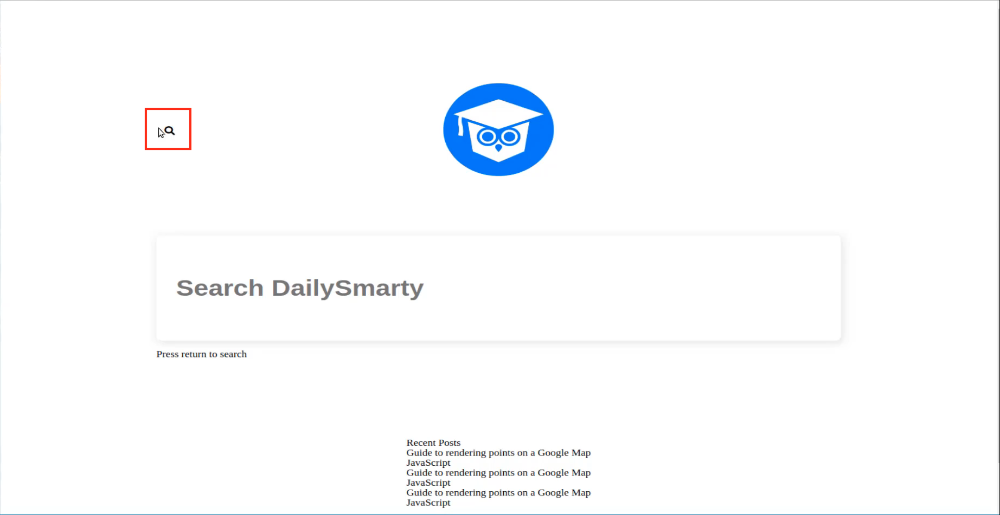

That means that it has been imported properly. 

Let's remove that icon and come down to the placeholder here, so this is where we want to add this icon. Now you may think that you would just paste in that little icon tab but you can't really do that with a placeholder. 

Instead what you can do is use a Unicode code. So when you're looking at the library so when you're looking at font awesome you can see they give you a few different options. Right here, this is where they give you an entire icon HTML element. 

Then right next to it they give you a glyph which will work for certain circumstances but I don't like it for everything. But one thing I do like to use for placeholders is the Unicode. 

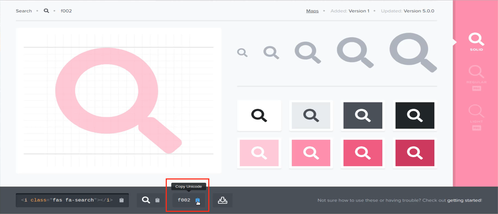

So if you click on copy here that's going to copy this little f002 code and then inside of that placeholder you can paste that in. 

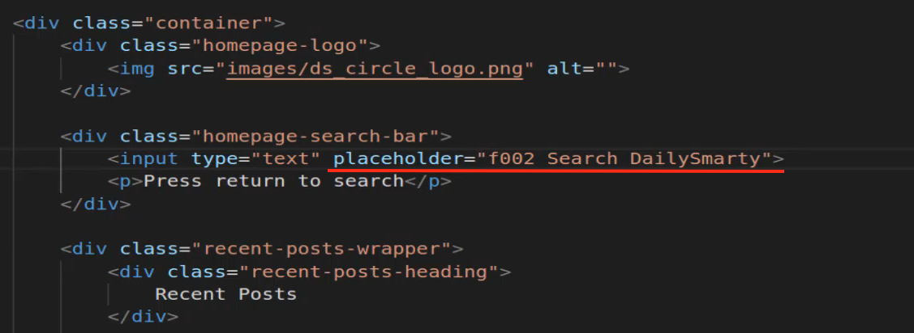

Now, this is not all you need to do because if you hit save here and go back and look at what we have you can see it just prints out f002.

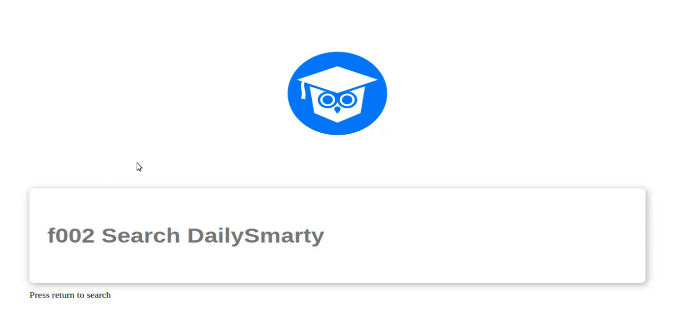

Not exactly what we're looking for and it's because HTML needs to be told when we're going to use Unicode characters. So what we can do is add a Ampersand(&) right in front of it, followed by the hash mark followed by an X and then at the very end here and a semicolon. 

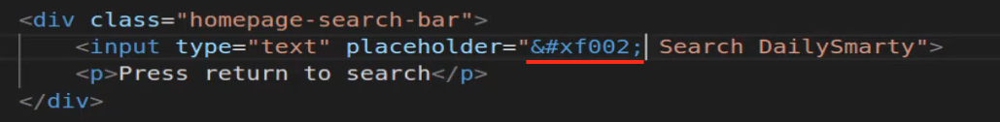

Now if you hit save, this is going to now be viewed as Unicode. If you switch back you can see that it's showing up as fl. 

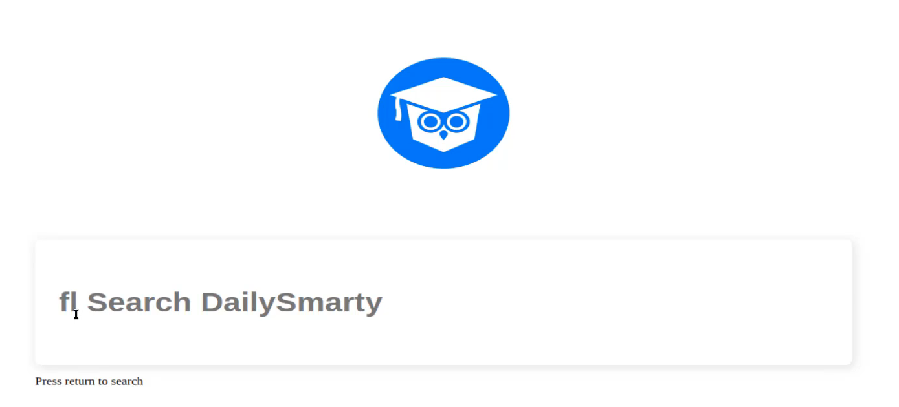

Now, you may think that this means it's not working but actually FL is a Unicode rendered component, if you click on inspect you can see right here. 

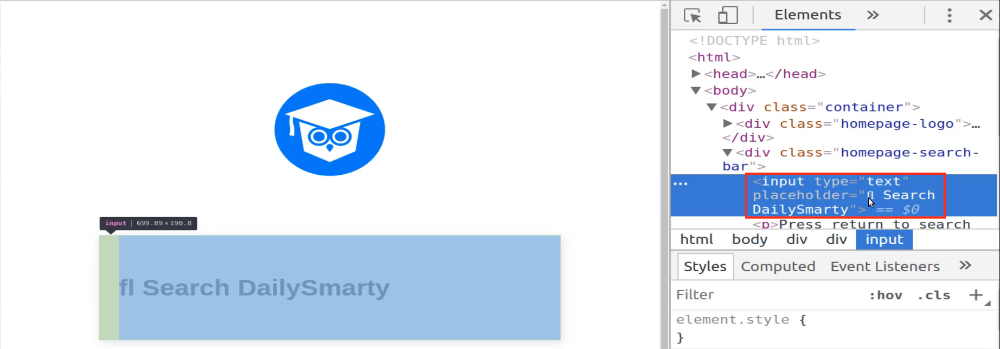

This is not regular text so this is not like it's using the regular F and L from your keyboard, this is something provided by HTML. So what we now need to do is we need to override this and we can do that in the CSS file. 

If you remember back to when I called this font family and said we still had a little more work to do. Well now it's time to get that done, so I'm going to add a new item right here, make sure you put a comma right at the end of it as well. Because this is going to be the first item in the list and I'll font awesome, and then do a slash like this. 

This is an escape character because we want to have a space at the very end of awesome so we're going to say font awesome 5 space free just like this and this is what you need to do in order to have font awesome be called and be registered inside of a style definition like we have right here. 

**main.css**

```css
font-family: 'Font Awesome\ 5 free', Arial, Helvetica, sans-serif;
```

So I'm gonna save that, and now let's add one more style for our placeholder. So what we had before this style the text but what we want to do is style our placeholder. So I'm gonna come to the very end here and add two colon's followed by placeholder and we don't need this font size, font family is going to remain the same. 

And now let's add a font-weight of 600 and then a `color of #A4A4A4`. Which is going to give us a light gray.

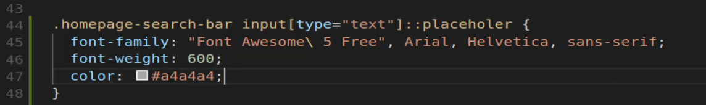

Now, hit save and if we come back there we go, that is working. 

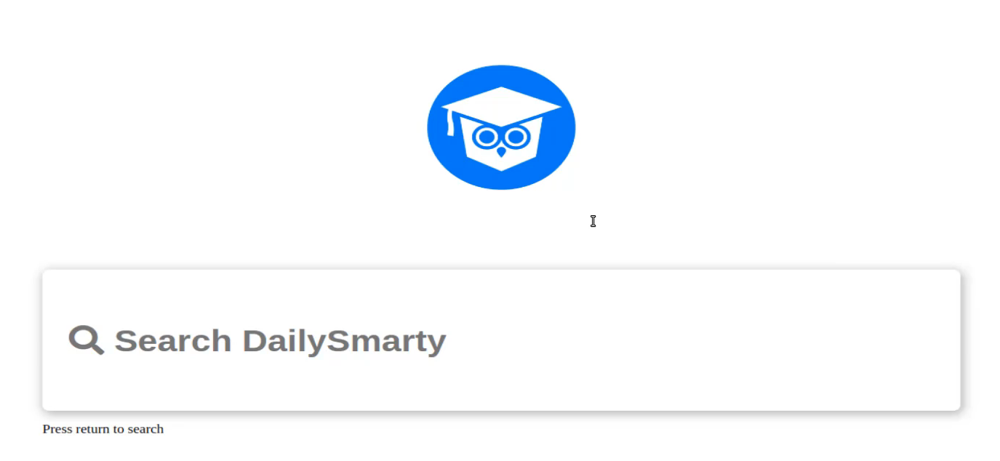

Now let's also test out the behavior on it so if I type in some query you'll see how that icon gets removed. 

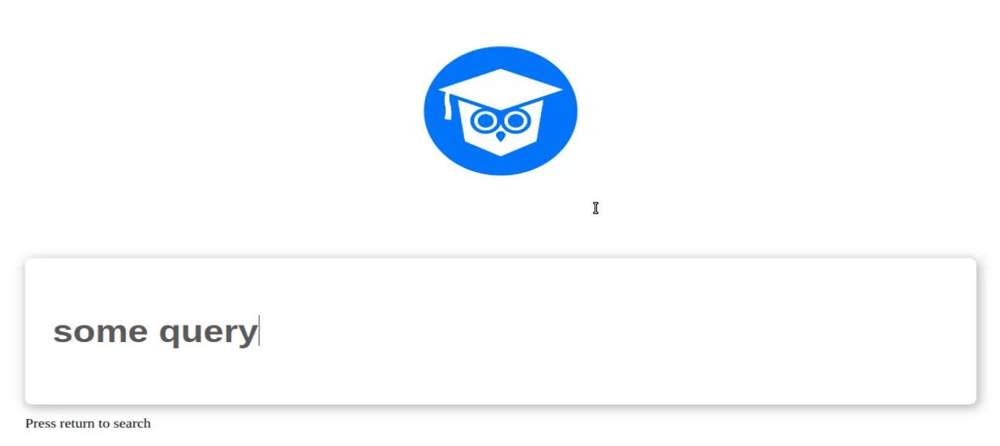

So this is something that's really important because I've seen a few tutorials where they tried to use an image inside of the input box and then that created some really weird looking behavior whenever someone started typing. 

But because we're using Unicode and were placing that directly in the placeholder this icon can be treated exactly like the rest of the text here, which I think is very helpful. So that is how you can integrate for awesome and the icons from font awesome directly into an input tag in HTML.


## Resources

- [Source Code](https://github.com/jordanhudgens/search-engine-front-end-implementation/tree/067904f7a4be2b4b2a619205eb73454d7393075b)
