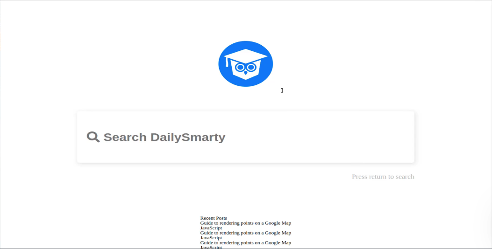
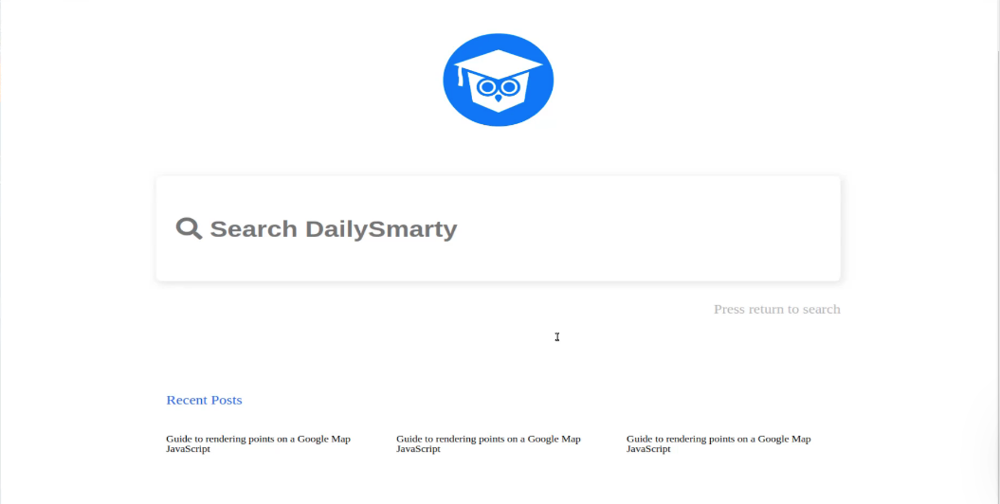
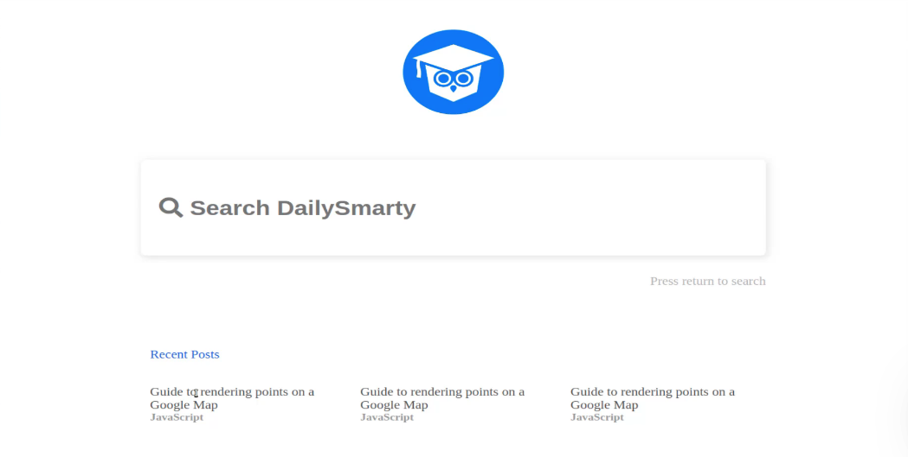

# 01-037:   Building a CSS Grid Container to Lay Out Recent Posts

We'll see if we can get this all in a single guide. I'm going to switch back here and let's take a look at what we have to work with. So we have the home page search bar and then inside of it we have that input and then our paragraph tag. 

So let's open up our `main.css` and let's grab that `home-page-search-bar` and we'll paste it in. But instead of having inputs and everything there I just want to grab the paragraph tags so that's going to be all that we're working on here. 

**main.css**

```css
.homepage-search-bar p {
    color: #b3b3b3;
    font-size: 1.4rem;
    line-height: 1.7rem;
    margin-top: 2.3rem;
    text-align: right;
}
```

Okay, let's see if that gives us what we're looking for. 



And yes that looks much better. Now the reason why this looks so much different than what we have in our design here is really just because we need to integrate some fonts and then we're going to add some base sizing that the entire project is going to follow. 

But for right now everything is aligned properly it has the right color, so I am happy with that. So now let's tackle these recent posts. I think that we should be able to knock these out pretty quickly.

So we have our recent post wrapper, and that is our grid element and that is perfectly fine. We're going to be able to leave that exactly how it is. Next, we'll work on the heading.

**main.css**

```css
.recent-posts-heading {
    color: #2660f3;
}
```

If you're wondering about the color codes, these were all given to me by the Bottega designer, and on the side of my screen I have some notes with my hex colors and some of those sizing elements, so do not think that I have those memorized or that you have to have them memorized. That's going to usually be something that you either come up with yourself or if you're working on a little bit of a larger team that the designers are going to give you. 

**main.css**

```css
.recent-posts-heading {
    color: #2660f3;
    margin-bottom: 3rem;
    font-size: 1.4rem;
}
```

Now that we have that. Now let's talk about the actual recent posts element that contains each one of the posts themselves. so we have a recent post here and this is going to contain three elements inside of it. So let's start with recent posts.

**main.css**

```css
.recent-posts {
    display: grid;
    width: 66vw;
    grid-template-columns: repeat(auto-fit, minmax(100px, 1fr));
    grid-gap: 2.5rem;
}
```

Let's look at that.



That is looking much better. So we're getting actually very close to having this entire page done. So let's see how much further we can go on this. We have the recent post and we have its wrapper, so let's work on those.

**main.css**

```css
.recent-post-title {
    color: #535353;
    font-size: 1.4rem;
}

.recent-post-category {
  color: #999999;
  font-size: 1.2rem;
  font-weight: 600;
}
```

Let's check that out. 



That is looking really nice. We have our recent post here that is sitting above the grid container and now we're using another grid container right here that has those three elements. If I double click this you can see that this shrinks down and notice how we didn't even have to use any media queries even though we have a grid container.

Because we put that repeat and the MinMax in our styles, this is where the magic happens. This allows you to have this kind of dynamic behavior on a desktop. It knows that it can go all the way across and be 100 pixels wide. But if it shrinks down then and needs to be its minimum size, then it will just automatically shrink. 

I think that looks really good. I'm very happy with the way that that is behaving. So I'm going to stop the video here. 

As you may have noticed our layout is right, but this doesn't quite look as good as what we have in our design and that's really because we have some custom fonts that we need to add in along with some sizing. And so that's what we're going to do in the next guide. 

Then we should be able to have this entire first page finished off.

## Resources

- [Source Code](https://github.com/jordanhudgens/search-engine-front-end-implementation/tree/ab659c8c3cc238462d7d1302f6345ef6a883fa1a)
