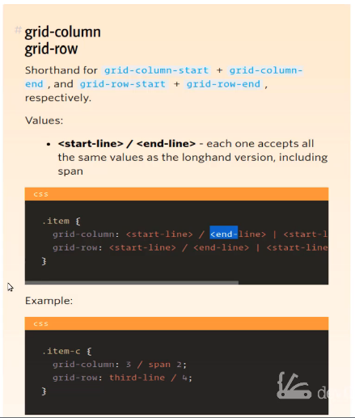
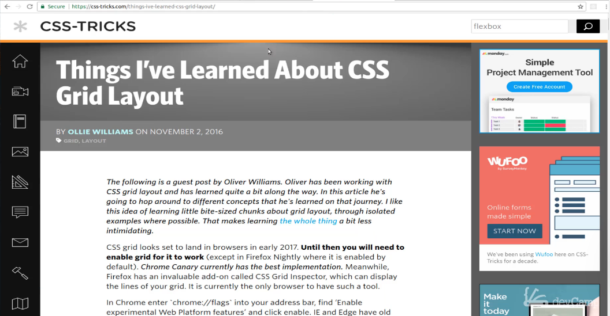
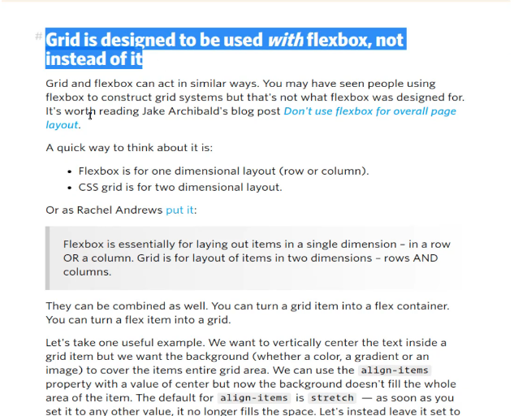

# 01-038:   Deep Dive: CSS grid-column and grid-row

I love using this grid, but this is one of the things that if you were to just see this in a tutorial or a stack overflow post, it may not be the most intuitive or helpful way to learn how to use it. So I want to hopefully give a little bit clarification on what this does and how it works. 

In order to do that I'm going to show you a few documents and I'm going to share these links in the show notes with you as well. So what we have with grid-column and grid-row is these as you can see right here this is shorthand for a few other commands. So we have these commands like grid columns start grid-column and grid rows start and then grid row end. 

Essentially, what we're doing right here is we're saying that for this grid column for recent posts, we want it to take up and start at 1 and then we when you ever anytime you see a negative one what that means is you want it to go to the very end. That's really all it means so hopefully, that part of it is not quite as confusing.
  
Here they have this item class and the very first element is the start line and the next one after the slash is the end line. 

In their example of this,  you could say `grid-column: 3 / span 2;`, which means this is a start line and then you want it to span two columns whenever we say that we want it to be negative 1 that means we actually want it to go to the very end and take up all that space. 

Now any time you see some kind of documentation that says that one kind of method or process is shorthand for something else, the very best thing to do is to go and to look at what it was actually shorthand for. So views rule up here you can see we have `grid-column-start` all the way through `grid-row-end`. 

The potential values that you have are lines, numbers with spans, spans with a name which we are not going to get into because I do not like using these, and then Auto which is some of the default behavior. So this gives you some good examples and I'll definitely include this in the show notes.  

Now, this post was the one that really explained this for me when I was teaching myself CSS grid.

When you scroll down, there are all sorts of helpful explanations here, such as this one about flex-box and CSS grid 

"Grid is designed to be used with flexbox not instead of it." You'll see throughout pretty much all of my courses now that that is how I use it and I'll bring in both flexbox and grid in order to work with them and build out a layout. 

I'll come right to this page and to this heading so "Using negative line numbers can be really helpful".  Now, he gives a scenario where you imagine a current CSS grid framework with the 12 column grid and you're taking into account media queries, things like the spans in his example. 

Well, that is fine and you can definitely write your code out like this. This is kind of like how we wrote the code out in Project 1 where we had the grid columns and we had spans and then we had all of these media queries, but if you scroll down here you can see is that if you use the negative one in your grid, this will allow your spans to go all the way to the end. 

And he gives some really nice examples of exactly how to do that. And so this is really one of my favorite paragraphs from the entire article. He says: "There's nothing wrong with this approach. However, with CSS grid, it's just as easy to redefine the number of columns. By using -1, you can be sure that your content will always reach the end." 

This little sentence fragment is the most important part of everything that I want you to remember from here. Anytime you see a negative one what that means is that it makes sure that the values are going all the way to the end. 

Let's just take a look at our recent post wrapper or any of these other elements that we're using negative one for. 

Notice that we do not do it with the logo. So this home page logo we just used `grid-column: 2;` and then `grid-row: 1` so it's not necessary. If you wanna play around with it, and I definitely recommend that you do, feel free to try out these different styles. 

What I would recommend is for you to feel free to dive into the code go through the documentation that I just walked through. So both the comprehensive docs and then also the blog post and feel free to change up each one of those elements and see exactly how it alters the page. So that is our deep dive into working with elements such as grid-column and grid-row in CSS grid.

## Resources

- [CSS Grid Guide](https://css-tricks.com/snippets/css/complete-guide-grid/)
- [Using negative line numbers can be really helpful](https://css-tricks.com/things-ive-learned-css-grid-layout/#article-header-id-2)
