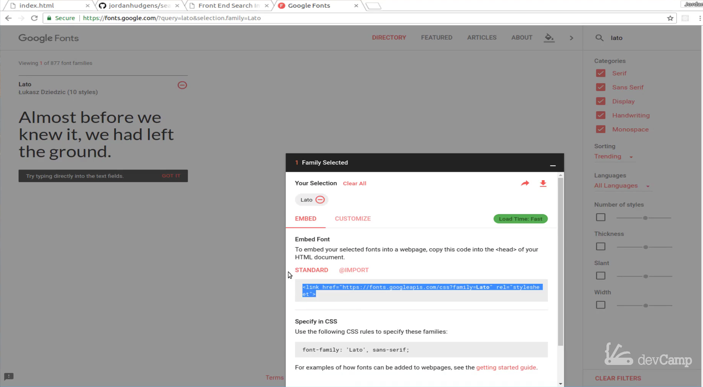
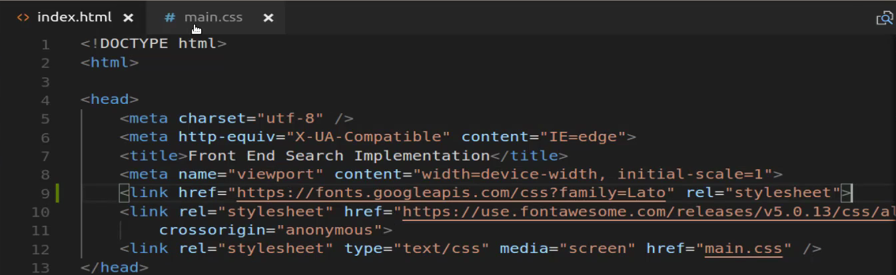
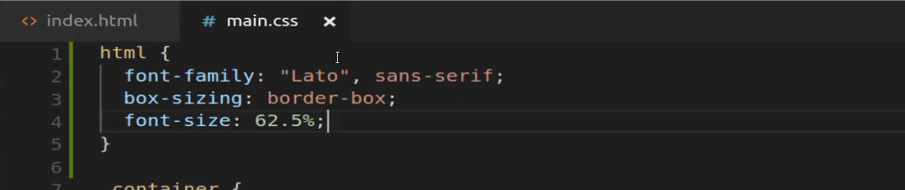
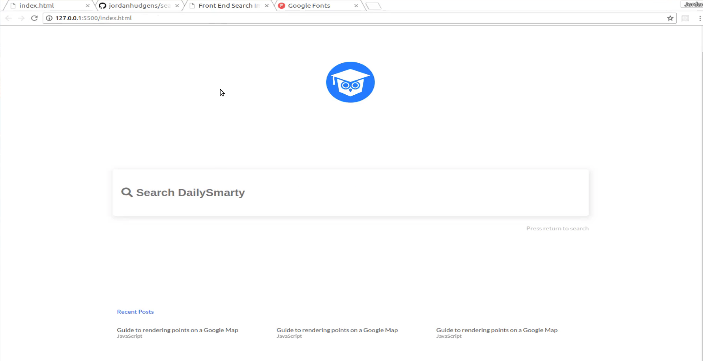
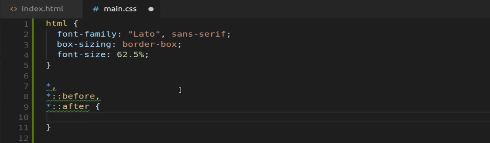
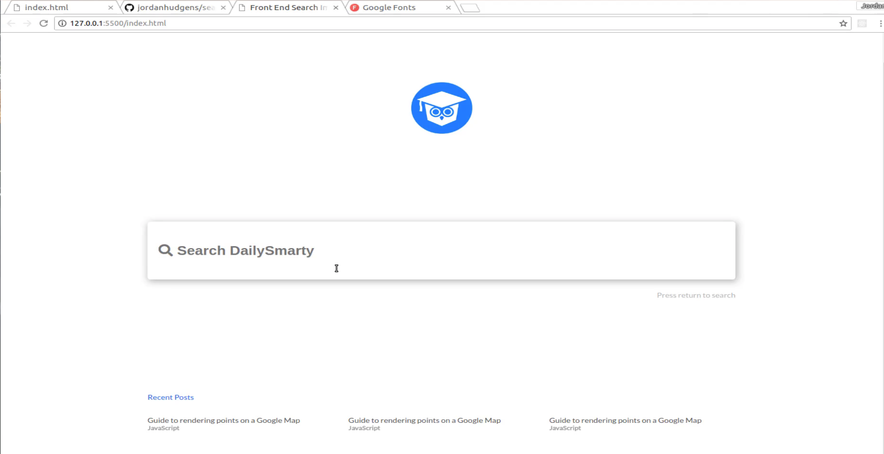
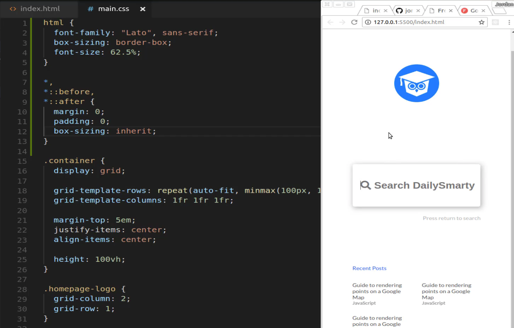

# 01-039:   Integrating Custom Fonts and Implementing Final Homepage Styles Changes

In this guide, we're going to finish off the home page and we're also going to update these fonts. And so I think this is going to be a very good guide where we can get everything cleaned up. Now I'm going to open up [Google Fonts](https://fonts.google.com) and the font I'm going to go with here is the **Lato** font. And so I can just click here to add it. Now, this is going to give me the family selected. It's going to give a link that we can use to import it and it also gives some helpful instructions. I was going to copy those and because this is going to be placed inside of our CSS file we need to make sure that it gets placed and the import gets placed above the stylesheet.

So I'm going to put it right here (**index.html**) and now we can import it directly into this **main.css** file. 

Scroll all the way up to the very top even above `.container` because I'm going to put some new universal rules here. I'm going to say that for the entire HTML document I want the font family to be **Lato**. Then the back up to be **sans-serif**. Then I'm also going to add a few other elements here such as `box-sizing`. This is going to use border-box and then the font size so I'm going to give a predefined font size so this font size is going to be **62.5%**.

Remember when I referenced how we use **rem**? So this HTML is going to cause all the font sizes to start with a root font size of sixty two point five. So every time we call font size and we say font-size say `5.rem`, then it's going to be starting off with the knowledge that it is starting at 62 point five. So this is going to help shrink all of those font sizes. So let's test this out and see if it's working. And there we go this is already looking much better. 

You can see how much closer this is looking to the end result. So we just have a few more elements to add and we're going to be all done. All done with this page at least. So now I'm going to go right below here and I'm going to add some more wildcard rules so I'm going to say asterisk equals, and then I'm going to put this down on the line below. I'm going to use a few more pseudo selectors saying `*::before` and then `*::after`. All this is going to do is it's going to make sure if anything loads or anything like that later on that this makes sure that before and after that a few rules are going to be put in place. 

So we're going to say that our margin is going to start off with zero because by default an HTML document actually has some built-in margin and padding but we don't want any of that. And then we also want the box-sizing to inherit. Hit save, and it was kind of hard to see because it's pretty subtle. But now if you come over here you can see we're pretty much matching nearly identically with the design. 

So I'm definitely very happy with this and if we shrink this you can see that this is fully responsive. So our recent posts are responsive the search bar right here is we have this cool little hover effect instead of that ugly outline. 

So I am happy with how this is looking and I think we're done with this page and we're ready to move on to the results page.

## Resources

- [Source Code](https://github.com/jordanhudgens/search-engine-front-end-implementation/tree/6d49c89b9827aef846cda0f36faa261d65979632)
