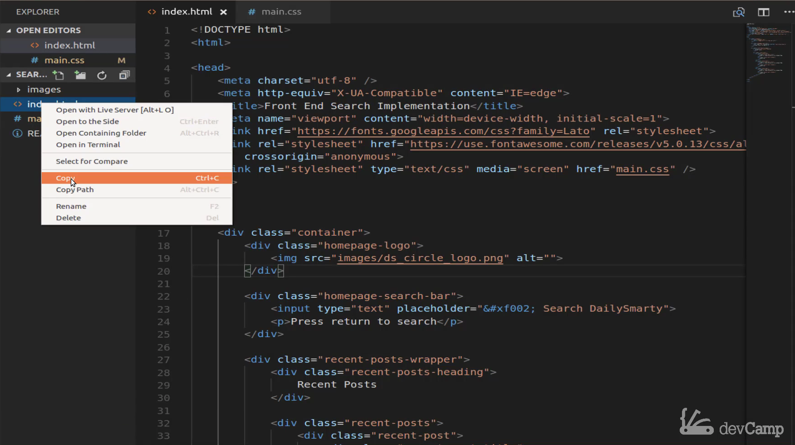
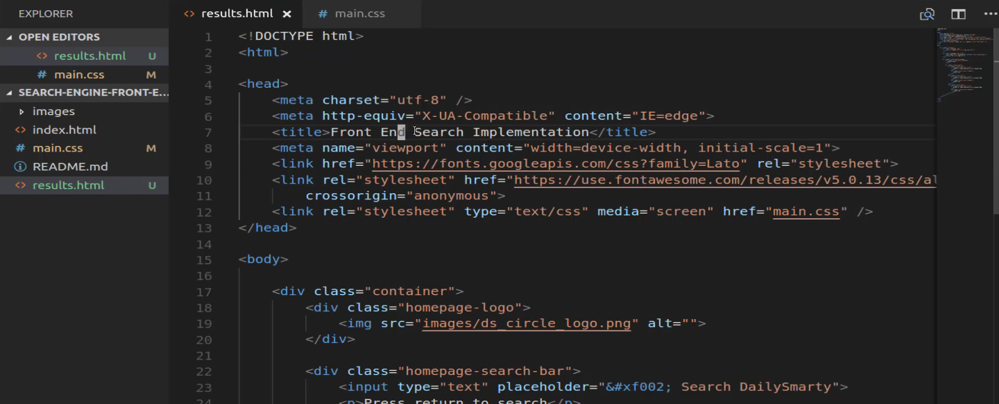
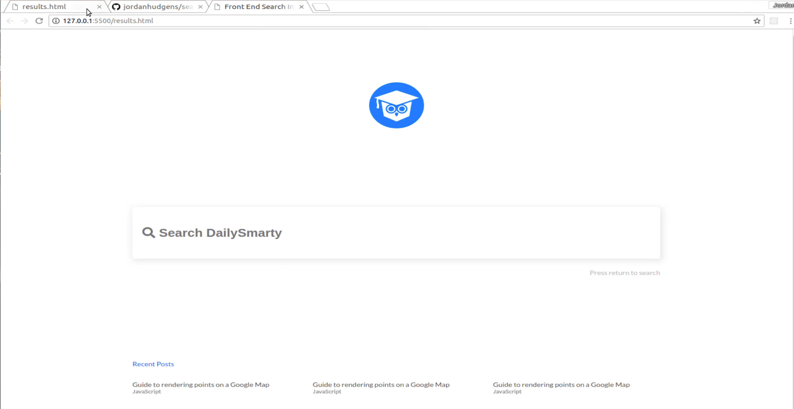
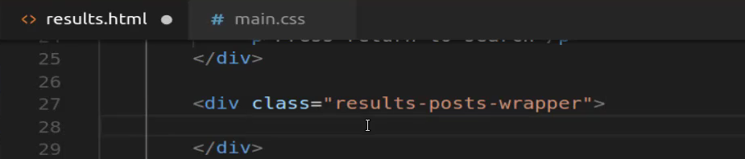
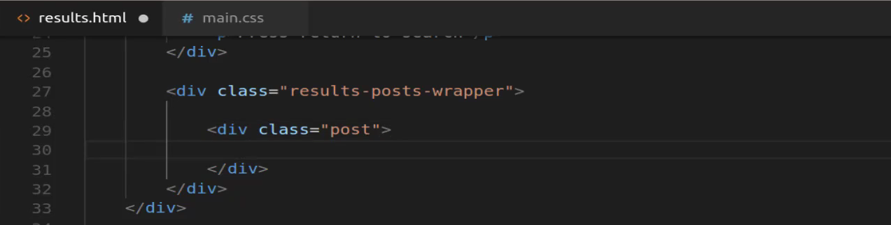
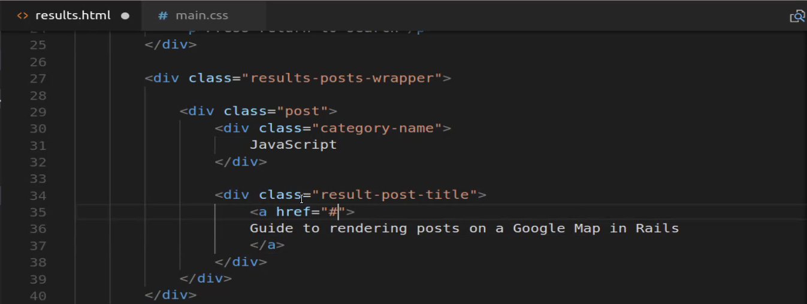
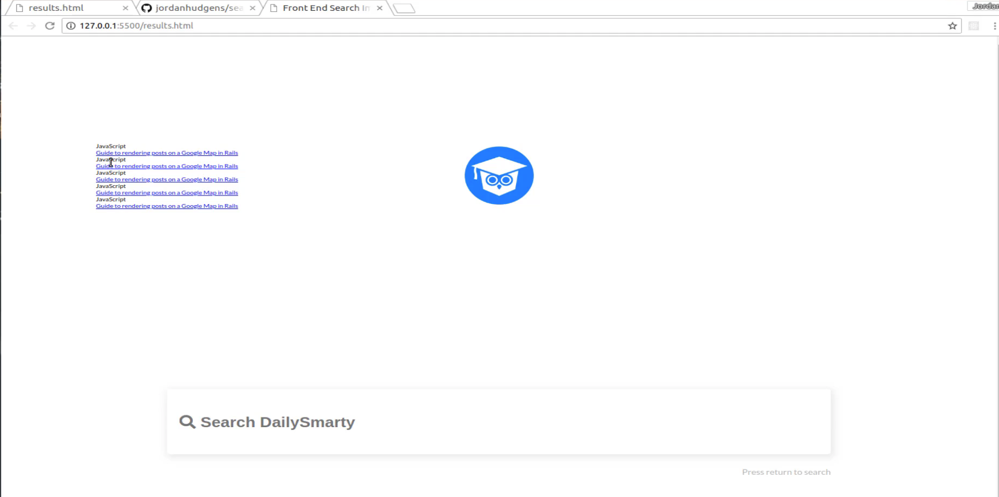
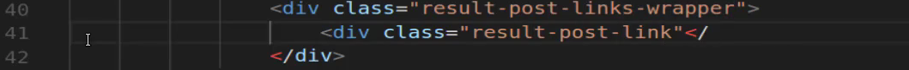
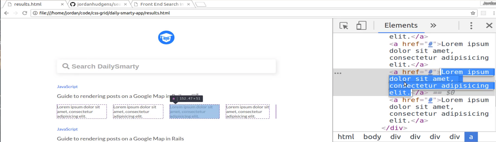
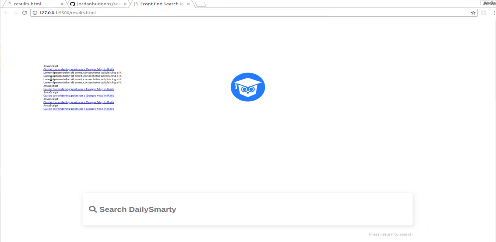

# 01-040:   Adding Initial HTML to the Results Page

But one thing that I've discovered through the years is the first page or the kind a master page for a project always is going to take the longest because that is where you set up all your boilerplate code so any standard styles any of your key imports anything like that. Those are going to take place in the very beginning. So I find that the first page of an app that I'm designing and building now usually takes a very long list out of all of them. 

So this next page should go much faster. So let's start off by doing exactly what we did before. We're going to create the HTML page and then from there we're just going to add each one of the elements in. But what I want to do now is I'm actually going to borrow from quite a bit of the code that we already wrote so that we can reuse as much of it as possible. So let's go and let's create that. I'm actually going to just copy this file.

So instead of **index** let's just say copy and then we can paste it right in here instead of having **index 1**. Since I don't think that's a very helpful name we're going to rename this and it's just going to be called **results.html** and that's what we will have open. 

I'm also going to say (for the title), "**Front End Search Implementation Result Page**" just so it's very clear what we're looking at. Now if you right click on this and say open with live server. Now it's going to open that page up for us. Now obviously this looks exactly like the homepage because we just copied and pasted all of that code and that's completely fine. If you look at the difference you can see we have a logo here. So far we don't have to bring that over, were just gonna have to style it a little differently. 

So we know that we're going to need a search bar just to shrink it up and use it and then the next thing is we have these elements. So these are similar to our recent posts you can see quite a bit the content is the same but it is still different. So most likely we're just going to get rid of all of the recent posts that we have and because we're not going to reuse any of that I'm just going to create a result wrapper. 

So let's get started on that. I'm not going to worry about changing these two yet. We're going to get to that when we jump into the style. For right now I just want to be concerned with the HTML. So instead of recent posts here it's come down. I want to get rid of everything inside of here. So instead of `recent-post-wrapper` its now going to be `results-posts-wrapper`. 

Now what does this look like? So we have a category and that's always going to be the same for all of these. Then we have a title that's going to be the same for all of them as well. And then for the first one because this what this is just to give you a little bit of a heads up this is the way that **DailySmarty** works. If you ever have worked with the API, if you search for something it brings back the results to you. You can have just a regular title and then you could click on it and go to the **DailySmarty** post. 

But it also sends any reference links inside of it. So in this case what we're just imagining is that if you hover over, what we'd want to do is have these four items just appear and slide down. We're not going to use JavaScript, you're not going to implement that right now. We'll do that later on in the actual application course. But right now let's just kind of mock out what this looks like. So we know we have a category name. It's not a link. We have the link that gets pointed to the site. And then you have it for the first case, you have this grid which is going to be a perfect situation for us to use grids and columns. 

Then right here you just have some hard coded values in there just, to show what the results page would look like. So let's go and get started on building that. So I'm going to create a single one, so we have `results-post-wrapper` where we'll just create something like "post".  I guess that would be one way of doing it so you can say this is going to be a single post. 

We know this is going to have a category name. And for right now we will just call this JavaScript. Then it's going to have a post title. So here it's going to be `result-post-title`. Let's just copy one of these because they're all the same and copy and paste it in. So that is going to be our title which will also actually be a link. Let's just make it's a link right now. I think that makes logical sense. There you go. Then for the **href** you can just put a hash symbol so it doesn't get pointed out or directed anywhere. 

Then let's add these four in right now and actually, nevermind. Let's just duplicate this five times and then I'll go up to the top and add those four in. So that is all we need for a single post. And now let's just make five total of these. Let's see what we have to work with here and okay with that that works. It's hideous and ugly but it works. 

So we have the category. The link and everything else there is working. Now let's create these four elements, and as you can see, these are links as well.  So I think it makes sense to put these in a wrapper you know come up to the top and right underneath this title, I'm going to say `results-post-links-wrapper` and then we'll just make a singular version of this. So now let's create a div for each one of these. Now I'm just going to change this to say `result-post-link` because this is going to be a singular one.

Close out the div. There we go. And let me just copy one of these items just so we have access to it. And if you ever have an issue copying any of these elements you can just come here right in the HTML and just copy it right from the inspect tool. 

There we go. Okay now let's make four of those, hit save and there we go. We have all of our content. 

So if we reference this one more time we have a logo. We have the search bar then we have this first one with all the details and then we have all of these duplicated. So I think we're good. We have all HTML on the page we need and I even think that we have the structure we need as well. So in the next guide we're going to start by adding the custom styles there specific to this page.

## Resources

- [Source Code](https://github.com/jordanhudgens/search-engine-front-end-implementation/tree/7fd91f153aa68d03cbb94e4a77df73dea802e9c2)
