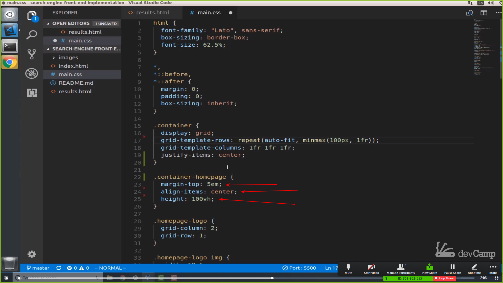
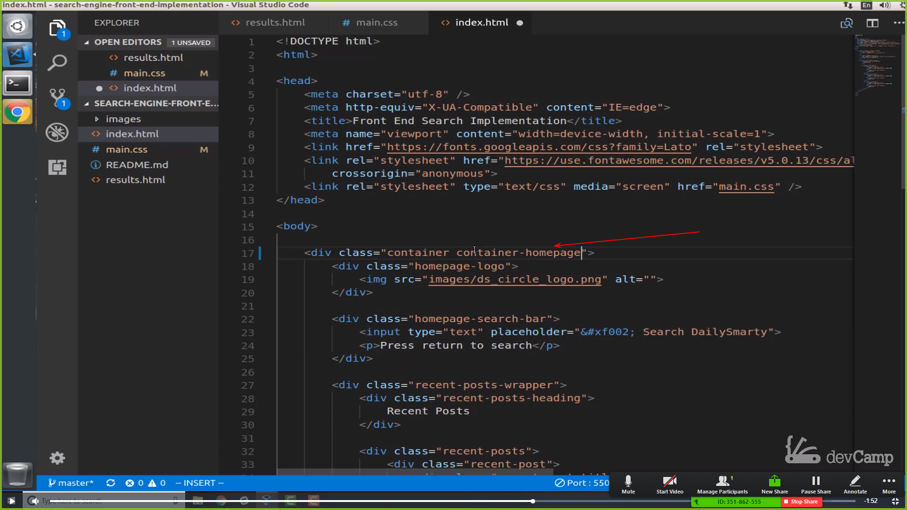
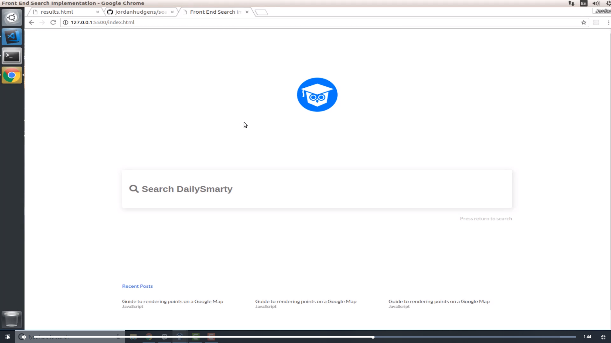
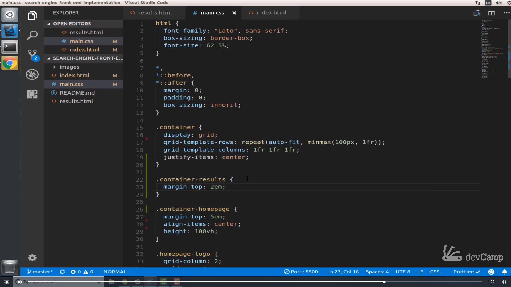
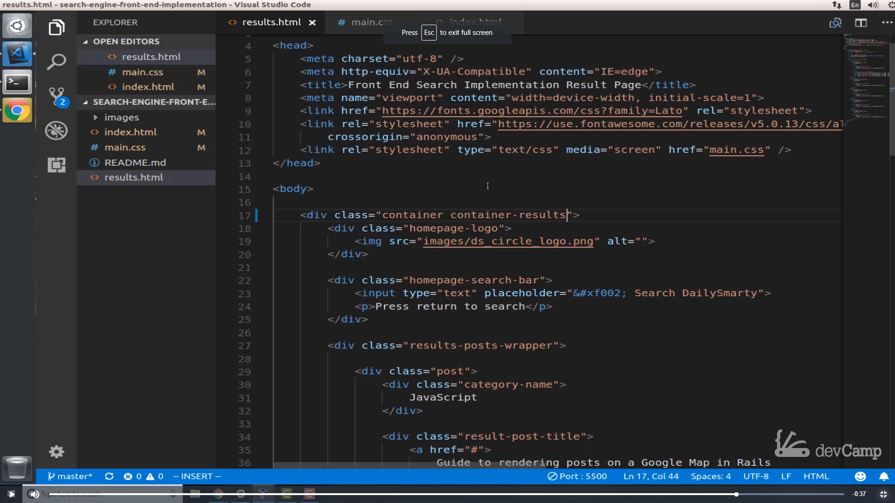

# 01-041:   How to Create an Abstract Container Class that can be Shared Across Pages

Now that we have all of the HTML structure we're going to need, let's start working on the actual styles. Now as you can see right here, this is our goal. We have a number of different things that we have to implement. One thing that we need to be cognizant of too, is that if we change any of the preexisting styles, then they could negatively affect the layout of the home page. So we need to make sure that we're careful with that. 

Let's run a little test. One thing you may have noticed between the difference between the **home page** and the **results page** is the margin here at the top. One thing that we're going to have to change is if you go into the main CSS file here(`main.css`), you may notice that we have a margin on the top at `5 em`. 

So we're going to have to remove that out and there are a couple of other elements that we're going to have to place inside of another class. So the best way of doing this is I don't want to just create two containers. So I think it'd be a bad practice to do something like saying home page container because then there are times when you're going to do that for example our search bar we did a home page search bar because that search bar is going to be quite a bit different. But whenever you have a container. It's good and it's definitely good practice to make this as generic as possible. 

So your goal should be if you're building out some kind of container class you should be able to call this on the majority of the pages of your Web site assuming you have a pretty standard looking Web site and then it should have the same behavior on each of those pages and then you can add customization's on top of it. 

So I'm going to keep this container but then I'm going to add a custom element. So from here, I'm going to say ``.container-homepage`` and then any of the elements that I feel should be related only to the home page. I'm going to put it over there. So this ``height: 100vh;`` is one of those. And then ``align-items: center;``. That's another one. And let's see what else the ``margin-top: 53em;``. So these are all specific to the home page. So it's clear up this space seems so that's nice and clear.

And now what I'm going to do is add ``container-homepage`` to the actual ``homepage`` list so instead of just saying container now I'm going to say ``container container-homepage``

 

just like this. Now if I save this let's go back and make sure that nothing is broken. And as you can see, this is all still working. 

 

So, that's good! That means that we've extended the styles and that we've split them up and we can still use our ``root container class`` for our results page. So, let's go and do that. Let's go back to results.html and now we're going to go in and create a results container. 

And so if I come down here we have our container which is never going to say ``.container-results``
And now what we're going to place inside of here again is going to be a little bit different, so we are going to say ``margin-top: 2em;``and that's really the only difference that I want for the container itself.

 
                
Now we don't have any changes yet because we need to add this to the list. So if I go to ``results.html`` here, lets go up top to where we called container and now I'm just going to add this right to the right of it. So I'm going to say 
``container container-results``

Now hit save, and now we have that little bit of margin there at the top. Now we still obviously have quite a few other things to change here such as moving these all the way down, and we'll create a custom class for that. We will change the input styles here but we're on our way. With this guide the inherit goal that I wanted to have on it was to be able to see how we could effectively split our styles out from different pages while still being able to have maintainable and reusable components like our container class and I think we are able to do that. 

## Resources

- [Source Code](https://github.com/jordanhudgens/search-engine-front-end-implementation/tree/ab37ffdcf1c0380dc9719378f1897927cbb16e8a)
