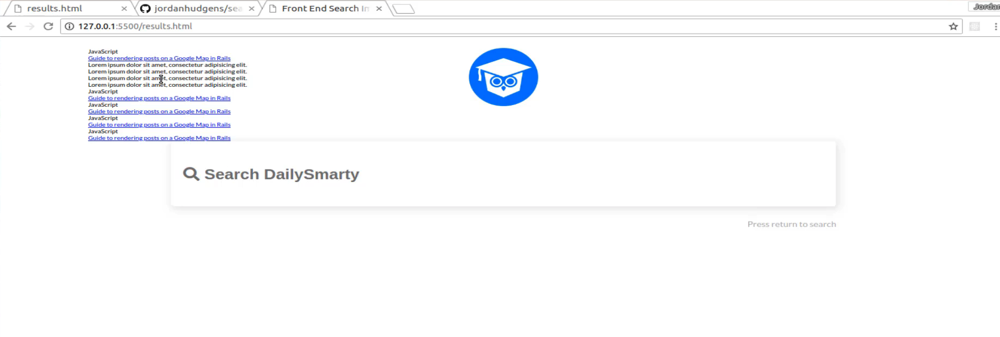
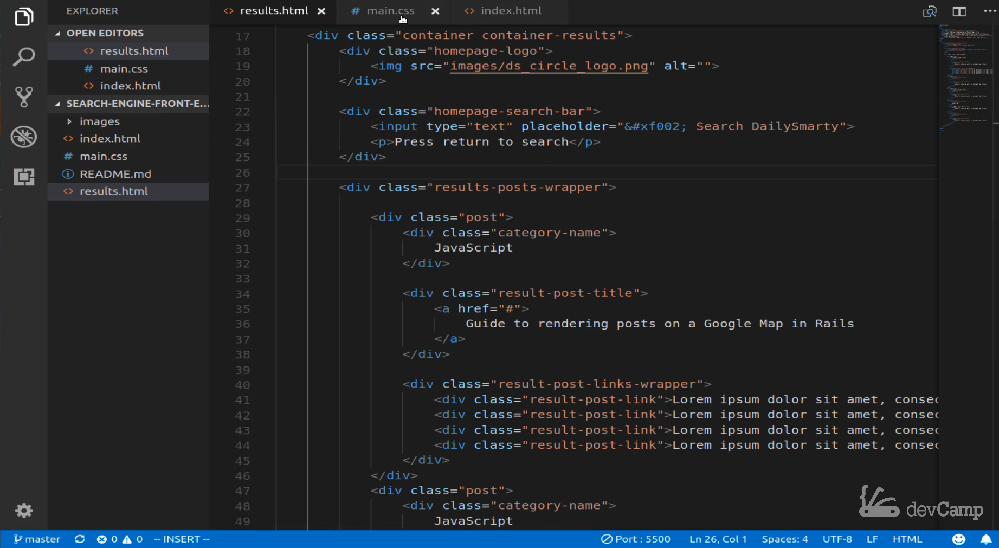
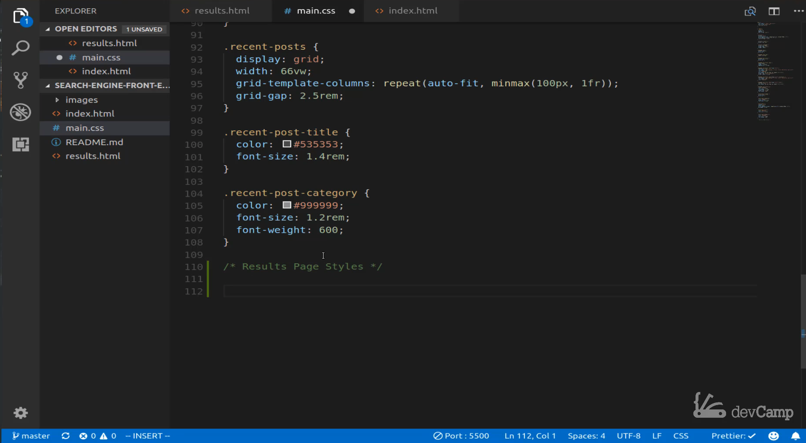
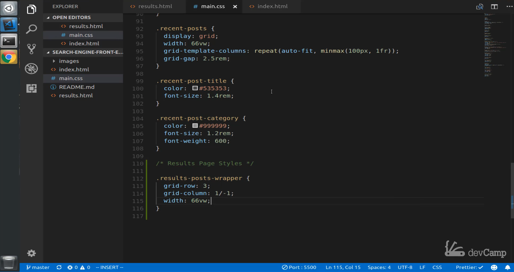
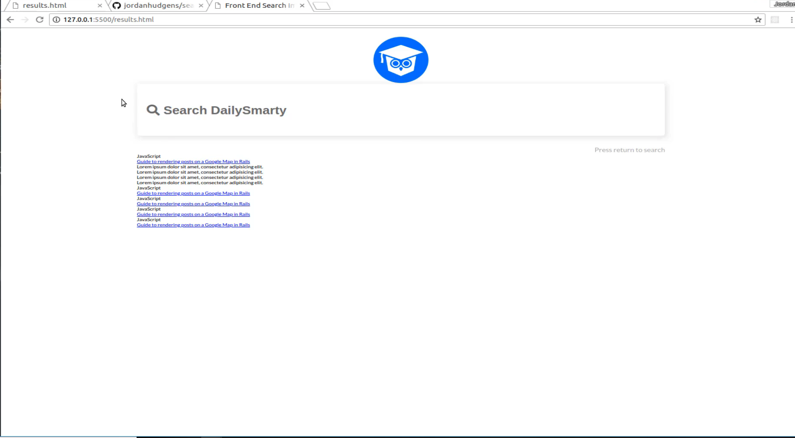
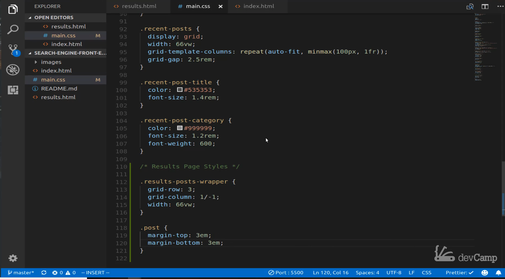
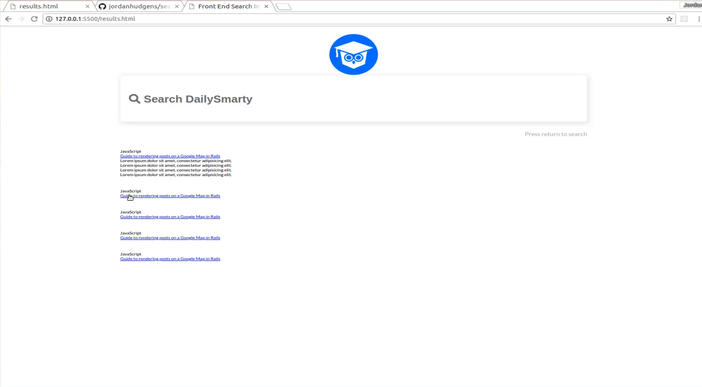
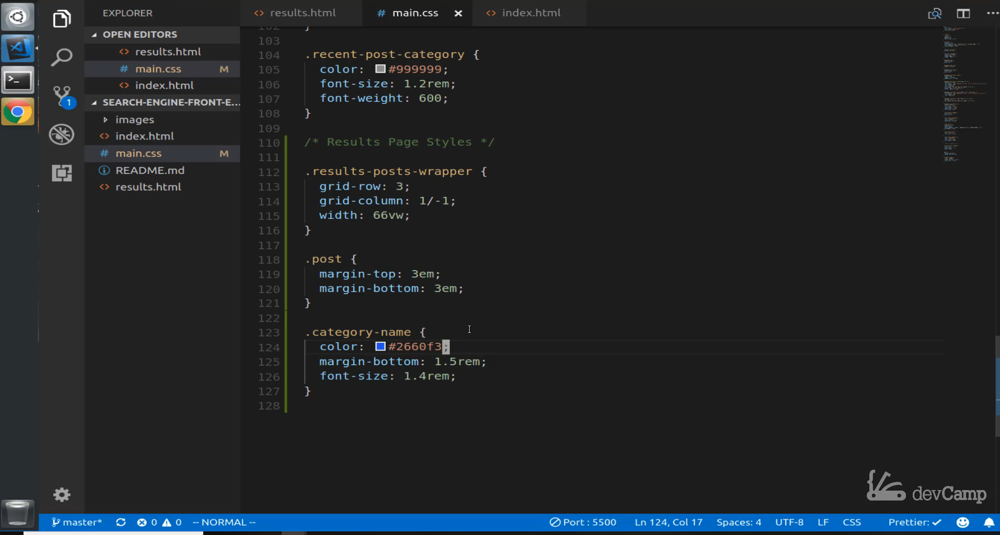
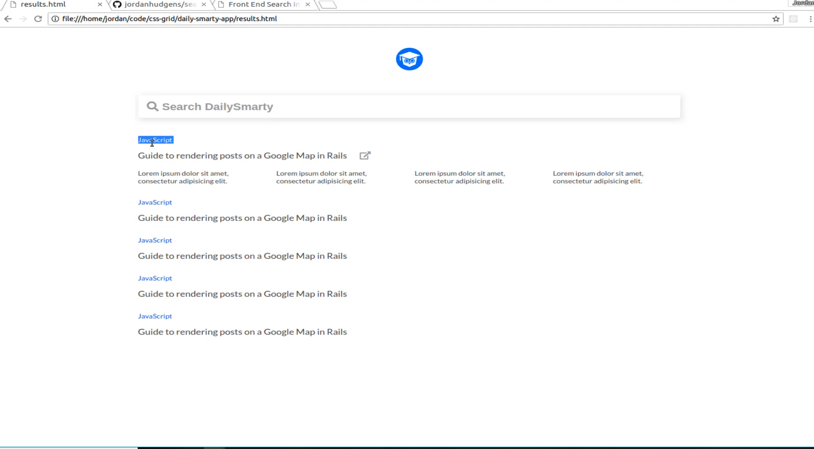
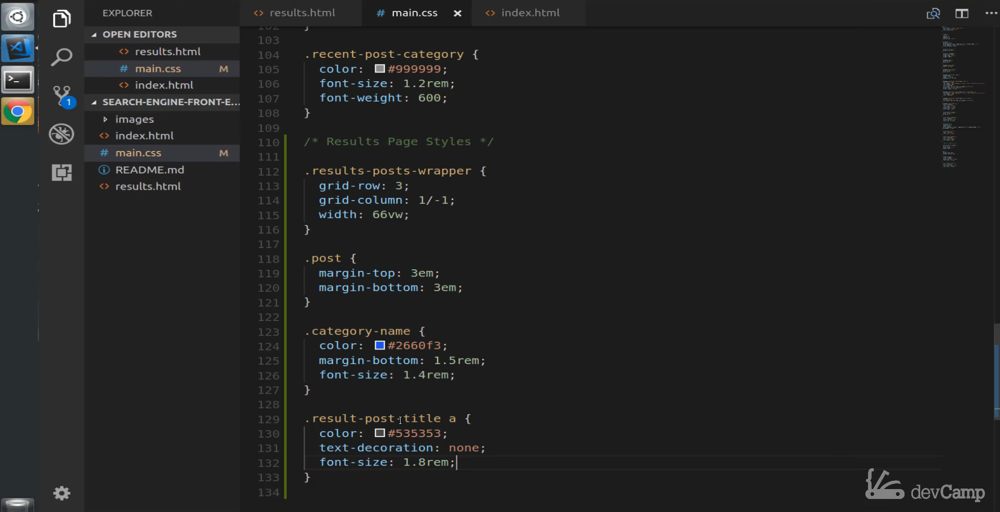

# 01-042:   Initial Styles for the Result Links

These are going to be the result links which typically are going to be one of the main focal points of the entire page. We'll worry about shrinking the logo and the search bar later on. I think before we do that the next best step would be to focus on the data that everyone cares about which are those search results. 

Let's come over here you can see we have a class of `results post wrapper` and then `post` and then inside of each one of the posts; We have a "category- name" and "result-post-title" and then we have for the first one, those links. 

Let's come over to `main.css`. I'm going to come all the way down to the bottom and let's add a comment here because these are going to be styles that are related to the results page. That comment will say "results page styles" just so it's nice and organized. 

Now let's grab each one of those elements. We know that that first one is going to be called `results-posts-wrapper`.  That's going to be the first class, and then it inside of here what we want to put is a basic grid row element, and a grid column one very similar to what we did earlier. Then we want a width along with it. 

Let's say we want the grid row to be three `grid-row:3` then we want the grid column to be one slash negative 1 `grid-column: 1/-1;` which you may recognize from earlier. That just means we want the column to go from the beginning all the way through the end. Then I want the width to be that same 66 view width `width: 66vw;`  

Let's save this. Now you can see that that has been rendered on the page exactly where we want it. 

We still have a lot of work to do regarding styling it, but it is no longer on the left-hand side. It's now below the search bar, and below the logo, that is looking good. Now let's work on that single post-class this one's going to be very basic we're just going to add a margin on the top of 3em `margin-top:3em` and then we're going to do the same thing on the bottom `margin-bottom: 3em`.Now we are going to save that.

 See what it looks like and you can see that space them out nicely. 

Each one of these elements now looks like it's a real post and that is any time that you can use spacing to segment and organize a code, It definitely looks nice. Now that we have that let's see what we call that category name. We have category name, and that's pretty intuitive. Let's come down to the bottom of `main.css` and we're just going to say `category-name`. This is going to have a color, and I believe I'm going to pick the right one from the list 2 6 6 0 F 3. `color: #2660F3;` Then we want no text decoration on this just in case you made the category name a link or anything. I want this to be none. `text-decoration: none;`. 

Then let's see if there anything else that we need to add to this? We need a font size. So at one point four REM `font-size: 1.4rem;` and we see one other. In a very early version of this in my notes, I made a category and named a link. But that's really not necessary so we can get rid of that text-decoration. (Delete text-decoration). Now the only thing we need now is just a margin on the bottom, and for this let's go with one point rem, `font-size: 1.4rem;` and that should be good. REM this is going to increase the font size from the root, and then it's also going to give us a little bit of margin, and it's going to color blue. 

You can see that's perfect, that's looking good. If you want to check over here, that's pretty much pixel perfect with what we want to go with.

Now that we have that now let's tackle the link, So the link is going to have a class with the name of  `result-post-title`, If we come down here on the main.css file and type `result-post-title`. We also need to grab the link, and we need more than just the class name. `result-post-title a` This is going to have a color that is #535353 `color: #535353` we've used before for this one. This is one where we want text-decoration none because this one actually is still a link. `text-decoration: none` This is what would be redirected for the user. Then for this let's add a little bit of larger font size, I'm going to go with one point eight rem. `font-size:1.8rem;` Now save this. 

You can see those links are looking much better and when you hover over each one of these they do not have that underlined. That is looking better. You can see that's pretty much exactly what we're looking to implement, that's perfect. We are going to take a break now, and in the next guide we were going to and CSS as grid element here for each one of these nested links.
