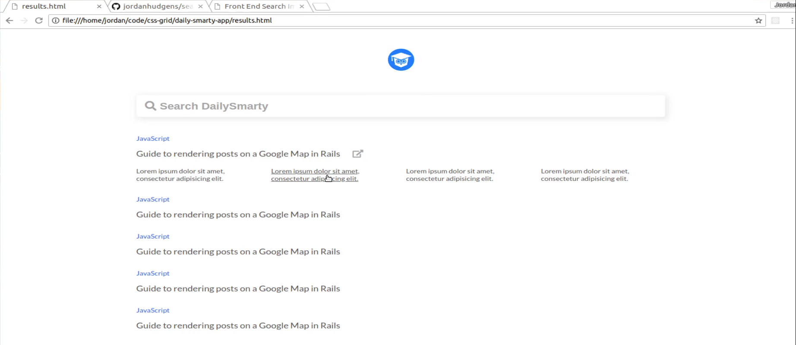
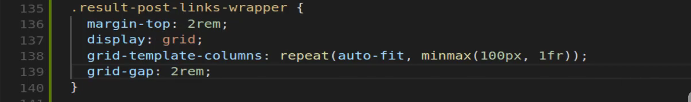
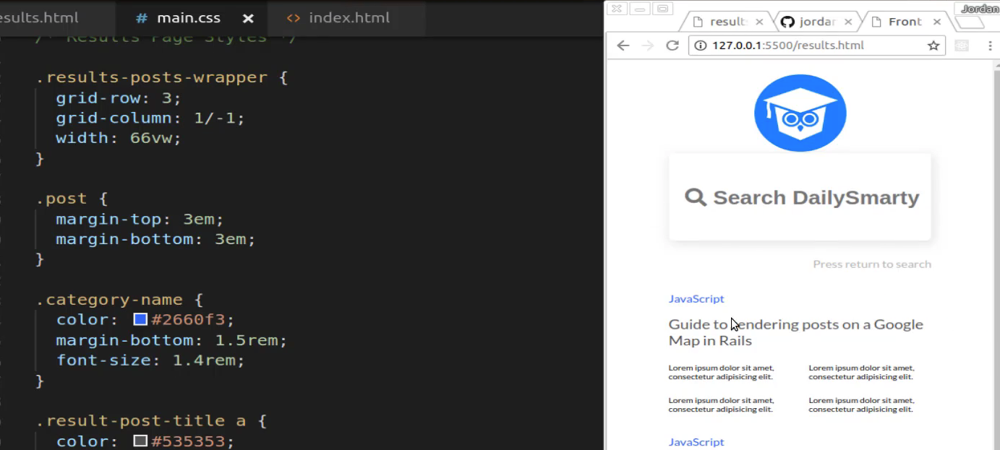
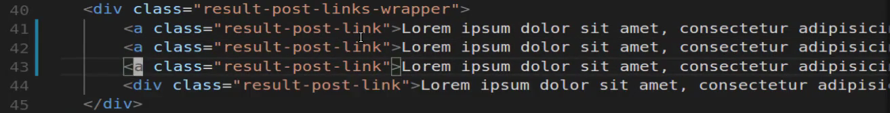
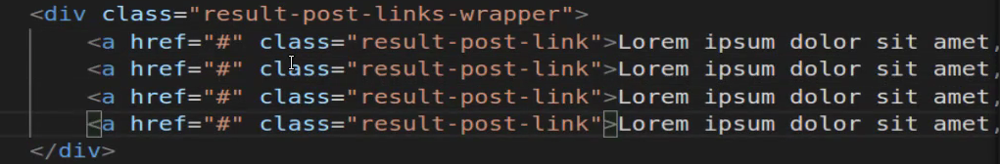
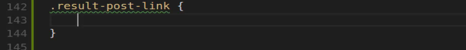
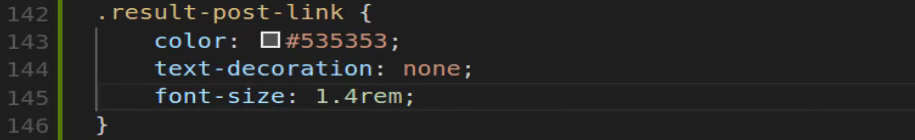
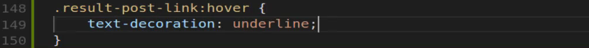
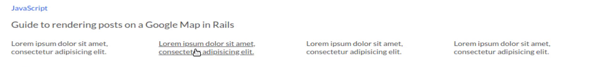

# 01-044:   Integrating a Nested CSS Grid Container for Search Result Reference Links

So now that our results look good now it's time to customize the styles for these links and this is a perfect use case for being able to use CSS grid. So what we want to implement is exactly what we have here, where we have four columns.

By now you probably already know how to do this. This is the solution that I personally would implement. So I'm going to start by first making sure I had the right name for the class. So I have `results-posts-links-wrapper`, and I'm going to copy all of this. Make sure I don't have any typos or anything with my class selector. And then from there, I'm going to create my CSS grid container.

I'll make sure that I have some margin on the top with 2rem and then display grid and then let's go with grid template columns and I want these to be on repeat. The first argument with auto fit and then for responsive purposes, I want to use MinMax with 100 pixels and then 1 fractional unit. Let's save this. Oh and also I need to make sure I am adding grid-gap.

Now if I come here you can see that this is now working. This looks much better and it still needs to update the styles for each individual element. But now I can see how they're lined up perfectly right next to each other. They're taking up the right amount of space. Also if I shrink this down you can see this is already fully responsive. So that is looking perfect. 

Now that we have that let's come down here and let's see what else we need. So let's see what the elements inside here are called. So I have this `result-post-link-wrapper` and then I have each one of these links. Now one thing that needs to be fixed here is these are links right now I have them listed as divs. So let's actually switch each one of these elements there is no reason that they actually need to be a div. They really can just all be `<a>` tags. 

So those are going to be all `<a>` tags and now let's go and let's close them all off. Nothing's really going to change there. But now we need to do is now I need to add a link to them. And then just get rid of all these because until we have it completely done there's no reason to keep it. Then I can just duplicate it later. So here we have a href and now we have these and they are actual links.

So if you come back you can see that now these are links now and can style them accordingly. We have this class of result-post-link, so I can select that, come down here. Paste that in and now we can style it. Now you may notice because I added that class directly to the link I don't have to say, `result-post-link a` because I've already selected it. The only way to do that is if I had result post link in a div and then I put the `<a>` link inside of it.

So now that we have that, we can actually just style this. Let's add a custom colors so we're not using that ugly default blue. It should be the `#535353` one and then from there, I don't want any text decoration. Then the font size should be `1.4rem;`, hit save and there we go. 

And that's looking really good. Now if you do want to add anything like underlines when you hover over it it's completely up to you. If you do want to do it you could do something like this where you go and you grab a pseudo selector. So we know that we have access to the link here so I can just say `:hover` and then I can change the text-decoration and just change it to underline.

Now you can see if you hover over that now, it's very clear that these are links you could also do that with each one of these as well. I will leave that up to your discretion. 

But now we're at a really good stopping point as you can see we're getting very close to the final version of the search engine result page. All we really need to do is we need to update some of the margin styles for our logo and then the sizing for our search bar and we will be good to go. So I'll see you in the next guide.

## Resources

- [Source Code](https://github.com/jordanhudgens/search-engine-front-end-implementation/tree/a6905157dcd2e744a906acaaa88bc1cc21f9044d)
